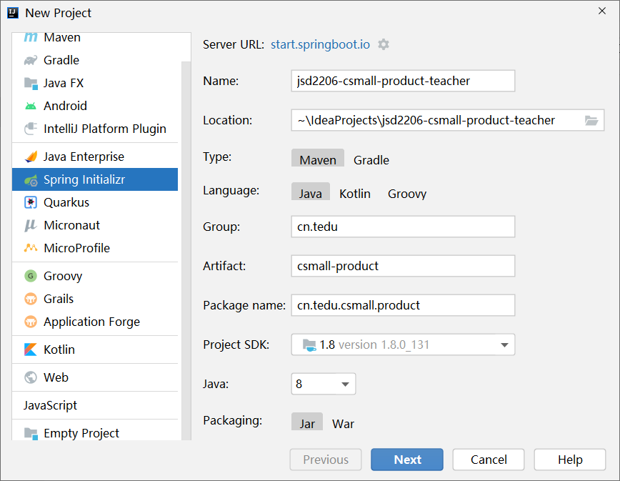
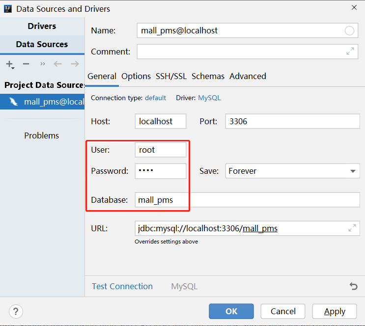
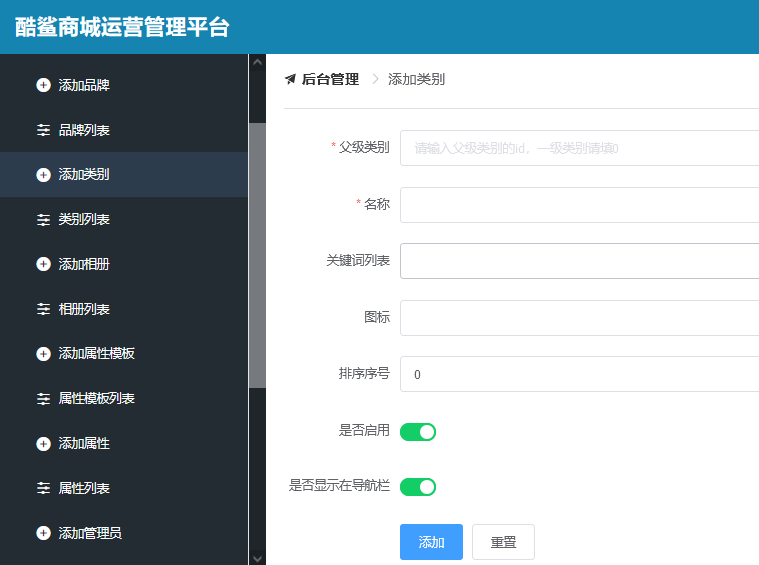
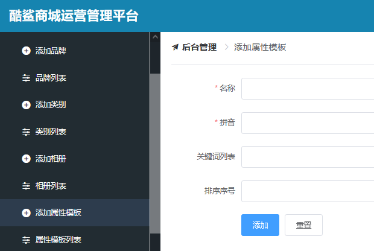

# 1. 创建项目

创建项目的参数如下：



提示：如果创建项目时的URL不可用，可以尝试在 https://start.spring.io 和 https://start.springboot.io 之间切换。

创建过程中，可以不勾选任何依赖项（后续添加的效果也是相同的）。

# 2. 创建数据库与数据表

创建`mall_pms`数据库：

```mysql
create database mall_pms;
```

在IntelliJ IDEA中，展开右侧的`Database`面板，选择`New` > `Data Source` > `MySQL` / `MariaDB`，并在弹出的窗口中配置：



然后，将`mall_pms_jsd2206.sql`的代码全部复制到Console中，并全选、执行，即可创建数据表。

# 3. 调整`pom.xml`

建议将父级项目（`spring-boot-starter-parent`）的版本调整为`2.5.9`或其它`2.5.x`系列的版本号。

# 4. 关于数据库编程

Java语言是通过JDBC技术实现数据库编程的，但是，JDBC技术的应用相对比较繁琐，且编码步骤相对固定，所以，通常使用框架技术来实现，这些框架技术大多可以简化JDBC编程，使得实现数据库编程的代码更加简洁。

常见的数据库编程框架有：Mybatis（主流）、Spring Data JPA、Hibernate等。

# 5. 使用Mybatis框架

使用Mybatis框架之前，需要添加相关依赖项：

```xml
<!-- Mybatis整合Spring Boot的依赖项 -->
<dependency>
    <groupId>org.mybatis.spring.boot</groupId>
    <artifactId>mybatis-spring-boot-starter</artifactId>
    <version>2.2.2</version>
</dependency>
<!-- MySQL的依赖项 -->
<dependency>
    <groupId>mysql</groupId>
    <artifactId>mysql-connector-java</artifactId>
    <scope>runtime</scope>
</dependency>
```

在Spring Boot项目中，当添加了数据库编程的依赖项后，启动项目时，会自动读取连接数据库的配置参数值，如果没有配置，则会启动失败，例如：

```
***************************
APPLICATION FAILED TO START
***************************

Description:

Failed to configure a DataSource: 'url' attribute is not specified and no embedded datasource could be configured.

Reason: Failed to determine a suitable driver class
```

在Spring Boot项目中，在`src/main/resources`下默认已经存在`application.properties`配置文件，Spring Boot项目在启动时会自动读取此文件中的配置信息，如果配置信息中的属性名是特定的，Spring Boot还会自动应用这些属性值。

则在`application.properties`中添加配置

```properties
# 连接数据库的配置
spring.datasource.url=jdbc:mysql://localhost:3306/mall_pms?useUnicode=true&characterEncoding=utf-8&serverTimezone=Asia/Shanghai
spring.datasource.username=root
spring.datasource.password=root
```

找到项目中默认已经创建出来的测试类，在其中添加测试连接数据库的方法，并执行：

```java
package cn.tedu.csmall.product;

import org.junit.jupiter.api.Test;
import org.springframework.beans.factory.annotation.Autowired;
import org.springframework.boot.test.context.SpringBootTest;

import javax.sql.DataSource;

@SpringBootTest
class CsmallProductApplicationTests {

    @Test
    void contextLoads() {
    }

    @Autowired
    DataSource dataSource;

    @Test
    void testConnection() throws Throwable {
        dataSource.getConnection();
        System.out.println("连接数据库成功！");
    }

}
```

# 6. 关于SQL语句

以`pms_album`（相册）表为例。

插入数据的SQL语句大致是：

```mysql
INSERT INTO pms_album (
    name, description, sort, gmt_create, gmt_modified
) VALUES (
    '华为Mate50的相册', '暂无简介', 200, null, null
);
```

批量插入数据的SQL语句大致是：

```mysql
INSERT INTO pms_album 
(name, description, sort, gmt_create, gmt_modified) 
VALUES 
('华为Mate50的相册', '暂无简介', 200, null, null),
('华为Mate40的相册', '暂无简介', 200, null, null),
('华为Mate30的相册', '暂无简介', 200, null, null);
```

删除数据的SQL语句大致是：

```mysql
DELETE FROM pms_album WHERE id=1;
```

批量删除数据的SQL语句大致是：

```mysql
DELETE FROM pms_album WHERE id=1 OR id=3 OR id=5;
```

```mysql
DELETE FROM pms_album WHERE id IN (1,3,5);
```

更新数据的SQL语句大致是：

```mysql
UPDATE pms_album SET name='新的名称', description='新的简介' WHERE id=1;
```

统计查询的SQL语句大致是（例如：查询表中的数据的数量）：

```mysql
SELECT count(*) FROM pms_album;
```

根据id查询数据详情的SQL语句大致是：

```mysql
SELECT id, name, description, sort, gmt_craete, gmt_modified 
FROM pms_album 
WHERE id=1;
```

查询（所有）数据的列表的SQL语句大致是：

```mysql
SELECT id, name, description, sort, gmt_craete, gmt_modified
FROM pms_album
ORDER BY id;
```

# 作业：

完成以下界面的设计：



