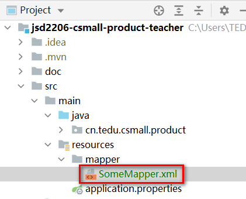

# 1. 关于实体类

实体类是POJO的其中一种。

POJO：Plain Ordinary Java Object，简单的Java对象。

在项目中，如果某个类的作用就是声明若干个属性，并且添加Setter & Getter方法等，并不编写其它的功能性代码，这样的类都称之POJO，用于表示项目中需要处理的数据。

以`pms_album`为例，这张数据表应该有与之对应的实体类，在数据表中的字段类型与Java中的属性的数据类型的对应关系是：

| MySQL中的数据类型               | Java中的数据类型 |
| ------------------------------- | ---------------- |
| `tinyint / smallint` / `int`    | `Integer`        |
| `bigint`                        | `Long`           |
| `char` / `varchar` / `text`系列 | `String`         |
| `datetime`                      | `LocalDateTime`  |
| `decimal`                       | `BigDecimal`     |

关于POJO类，其编写规范是：

- 所有属性都应该是私有的
- 所有属性都应该有对应的、规范名称的Setter、Getter方法
- 必须重写`equals()`和`hashCode()`，并保证：
  - 如果两个对象的各属性值完全相同，则`equals()`对比结果为`true`，且`hashCode()`值相同
  - 如果两个对象存在属性值不同的，则`equals()`对比结果为`false`，且`hashCode()`值不同
  - 如果两个对象的`hashCode()`相同，则`equals()`对比结果必须为`true`
  - 如果两个对象的`hashCode()`不同，则`equals()`对比结果必须为`false`
- 必须实现`Serializable`接口
- 建议重写`toString()`方法，输出各属性的值

在项目中使用Lombok框架，可以实现：添加注解，即可使得Lombok在项目的编译期自动生成一些代码（例如Setter & Getter）。

关于Lombok框架的依赖项：

```xml
<!-- Lombok的依赖项，主要用于简化POJO类的编写 -->
<dependency>
    <groupId>org.projectlombok</groupId>
    <artifactId>lombok</artifactId>
    <version>1.18.20</version>
    <scope>provided</scope>
</dependency>
```

在POJO类上添加Lombok框架的`@Data`注解，可以在编译期生成：

- 规范的Setter & Getter
- 规范的`hashCode()`与`equals()`
- 包含各属性与值的`toString()`

则在项目的根包下创建`pojo.entity.Album`类为：

```java
package cn.tedu.csmall.product.pojo.entity;

import lombok.Data;

import java.io.Serializable;
import java.time.LocalDateTime;

/**
 * 相册
 *
 * @author java@tedu.cn
 * @version 0.0.1
 */
@Data
public class Album implements Serializable {

    /**
     * 记录id
     */
    private Long id;

    /**
     * 相册名称
     */
    private String name;

    /**
     * 相册简介
     */
    private String description;

    /**
     * 自定义排序序号
     */
    private Integer sort;

    /**
     * 数据创建时间
     */
    private LocalDateTime gmtCreate;

    /**
     * 数据最后修改时间
     */
    private LocalDateTime gmtModified;

}
```

**注意：当使用了Lombok后，由于源代码中并没有Setter & Getter方法，所以，当编写代码时，IntelliJ IDEA不会提示相关方法，并且，即使强行输入调用这些方法的代码，还会报错，但是，并不影响项目的运行！为了解决此问题，强烈推荐安装Lombok插件！**

# 2. 通过Mybatis实现数据库编程

## 2.1. 关于Mybatis框架

Mybatis是目前主流的解决数据库编程相关问题的框架，主要是简化了数据库编程。

Mybatis框架的基础依赖项的`artifactId`是：`mybatis`。

Mybatis框架虽然可以不依赖于Spring等其它框架，但是，直接使用比较麻烦，需要自行编写大量的配置，所以，通常结合Spring一起使用，需要添加的依赖项的`artifactId`是：`mybatis-spring`。

在Spring Boot项目中，直接添加`mybatis-spring-boot-starter`将包含以上依赖项，和其它必要的、常用的依赖项。

Mybatis框架简化数据库编程的表现为：你只需要定义访问数据的抽象方法，并配置此抽象方法映射的SQL语句即可！

## 2.2. 关于抽象方法

使用Mybatis框架时，访问数据的抽象方法必须定义在接口中！因为Mybatis框架是通过“接口代理”的设计模式，生成了接口的实现对象！

关于Mybatis的抽象方法所在的接口，通常使用`Mapper`作为名称的最后一个单词！

则可以在项目的根包下创建`mapper.AlbumMapper`接口，例如：

```java
public interface AlbumMapper {
}
```

关于抽象方法：

- 返回值类型：如果要执行的SQL操作是增、删、改类型的，使用`int`作为返回值类型，表示“受影响的行数”，不建议使用`void`，如果要执行的SQL操作是查询类型的，只需要保证返回值类型可以封装必要的结果即可，如果查询结果可能超过1条，必须使用`List`类型
- 方法名称：自定义的，但推荐遵循规范，不要使用重载
- 参数列表：取决于需要执行的SQL语句需要哪些参数，在抽象方法中，可以将这些参数一一列举出来，也可以将这些参数封装到自定义类中，使用自定义类作为抽象方法的参数
- 抛出异常：无

关于抽象方法命名参考（来自《阿里巴巴Java开发手册》）：

- 获取单个对象的方法用 get 做前缀
- 获取多个对象的方法用 list 做前缀
- 获取统计值的方法用 count 做前缀
- 插入的方法用 save / insert 做前缀
- 删除的方法用 remove / delete 做前缀
- 修改的方法用 update 做前缀。

例如：插入相册的抽象方法可以设计为：

```java
int insert(Album album);
```

另外，还需要使得Mybatis框架能明确这个接口是数据访问接口，可以采取的做法有：

1. 【不推荐】在接口上添加`@Mapper`注解
   - 每个数据访问接口上都需要此注解
2. 【推荐】在配置类上添加`@MapperScan`注解，并配置数据访问接口所在的包
   - 在根包（含子孙包）下的任何添加了`@Configuration`注解的类都是配置类
   - 只需要一次配置，各数据访问接口不必添加`@Mapper`注解

则在根包下创建`config.MybatisConfiguration`类，配置`@MapperScan`：

```java
package cn.tedu.csmall.product.config;

import org.mybatis.spring.annotation.MapperScan;
import org.springframework.context.annotation.Configuration;

/**
 * Mybatis的配置类
 *
 * @author java@tedu.cn
 * @version 0.0.1
 */
@Configuration
@MapperScan("cn.tedu.csmall.product.mapper")
public class MybatisConfiguration {

    public MybatisConfiguration() {
        System.out.println("创建配置类：MybatisConfiguration");
    }

}
```

## 2.3. 关于配置SQL语句

在Spring Boot中，整合了Mybatis框架后，可以在数据访问接口的抽象方法上使用`@Insert`等注解来配置SQL语句，这种做法是不推荐的！

> 提示：在不是Spring Boot项目中，需要额外的配置，否则，将不识别抽象方法上的`@Insert`注解。

不推荐使用`@Insert`等注解配置SQL语句的主要原因有：

- 长篇的SQL语句不易于阅读
- 不便于实现特殊的配置
- 部分配置不易于复用
- 不便于实现与DBA（Database Administrator）协作

建议使用XML文件来配置SQL语句，这类XML文件需要有固定的、特殊的声明部分，推荐通过复制粘贴得到此文件，或从 http://doc.canglaoshi.org/config/Mapper.xml.zip 下载得到。

在`src/main/resources`下创建`mapper`文件夹，并将以上压缩包中的`SomeMapper.xml`复制到此`mapper`文件夹中：



关于XML文件的配置：

- 根标签必须是`<mapper>`
- 在`<mapper>`标签上必须配置`namespace`属性，此属性的值是接口的**全限定名（包名与类名）**
- 在`<mapper>`标签内部，使用`<insert>` / `<delete>` / `<update>` / `<select>`标签来配置增 / 删 / 改 / 查的SQL语句
- 各配置SQL语句的标签必须配置`id`属性，取值为对应的抽象方法的名称
- 各配置SQL语句的标签内部是配置SQL语句的
  - SQL语句不需要使用分号表示结束
  - 不可以随意添加注释
- 在配置`<select>`标签时，必须配置`resultType`或`resultMap`这2个属性中的其中1个

例如：配置为：

```xml
<?xml version="1.0" encoding="UTF-8" ?>
<!DOCTYPE mapper PUBLIC "-//mybatis.org//DTD Mapper 3.0//EN" "http://mybatis.org/dtd/mybatis-3-mapper.dtd">

<mapper namespace="cn.tedu.csmall.product.mapper.AlbumMapper">

    <!-- int insert(Album album); -->
    <insert id="insert">
        INSERT INTO pms_album (
            name, description, sort
        ) VALUES (
            #{name}, #{description}, #{sort}
        )
    </insert>

</mapper>
```

另外，还需要在`application.properties`中配置XML文件所在的位置：

```properties
# 配置Mybatis的XML文件的位置
mybatis.mapper-locations=classpath:mapper/*.xml
```

至此，关于“插入相册数据”的功能已经开发完成！

## 2.4. 测试

在Spring Boot项目中，当需要编写测试时，可以在`src/test/java`下的根包下创建测试类，并在类中编写测试方法。

则在测试的根包下创建`mapper.AlbumMapperTests`测试类：

```java
package cn.tedu.csmall.product.mapper;

import cn.tedu.csmall.product.pojo.entity.Album;
import org.junit.jupiter.api.Test;
import org.springframework.beans.factory.annotation.Autowired;
import org.springframework.boot.test.context.SpringBootTest;

@SpringBootTest
public class AlbumMapperTests {

    @Autowired
    AlbumMapper mapper;

    @Test
    void testInsert() {
        Album album = new Album();
        album.setName("测试相册001");
        album.setDescription("测试简介001");
        album.setSort(99); // 注意：取值必须是 [0, 255]

        int rows = mapper.insert(album);
        System.out.println("插入数据完成，受影响的行数=" + rows);
    }

}
```

如果此前没有正确的配置`@MapperScan`，在执行测试时，将出现以下错误：

```
Caused by: org.springframework.beans.factory.NoSuchBeanDefinitionException: No qualifying bean of type 'cn.tedu.csmall.product.mapper.AlbumMapper' available: expected at least 1 bean which qualifies as autowire candidate. Dependency annotations: {@org.springframework.beans.factory.annotation.Autowired(required=true)}
```

如果出现以下原因的操作错误：

- 在XML文件中，根标签`<mapper>`的`namespace`属性值配置有误
- 在XML文件中，配置SQL语句的`<insert>`或类似标签的`id`属性值配置有误
- 在`application.properties`配置文件中，没有正确的配置XML文件的位置

将出现以下错误：

```
org.apache.ibatis.binding.BindingException: Invalid bound statement (not found): cn.tedu.csmall.product.mapper.AlbumMapper.insert
```

## 2.5. 练习：插入属性模板数据

属性模板表：`pms_attribute_template`

首先，在根包下的`pojo.entity`包中创建`AttributeTemplate`实体类：

```java
package cn.tedu.csmall.product.pojo.entity;

import lombok.Data;

import java.io.Serializable;
import java.time.LocalDateTime;

/**
 * 属性模板
 *
 * @author java@tedu.cn
 * @version 0.0.1
 */
@Data
public class AttributeTemplate implements Serializable {

    /**
     * 记录id
     */
    private Long id;

    /**
     * 属性模板名称
     */
    private String name;

    /**
     * 属性模板名称的拼音
     */
    private String pinyin;

    /**
     * 关键词列表，各关键词使用英文的逗号分隔
     */
    private String keywords;

    /**
     * 自定义排序序号
     */
    private Integer sort;

    /**
     * 数据创建时间
     */
    private LocalDateTime gmtCreate;

    /**
     * 数据最后修改时间
     */
    private LocalDateTime gmtModified;

}
```

然后，在根包下的`mapper`包中创建`AttributeTemplateMapper`接口，并在接口中添加抽象方法：

```java
package cn.tedu.csmall.product.mapper;

import cn.tedu.csmall.product.pojo.entity.AttributeTemplate;
import org.springframework.stereotype.Repository;

/**
 * 处理属性模板数据的Mapper接口
 *
 * @author java@tedu.cn
 * @version 0.0.1
 */
@Repository
public interface AttributeTemplateMapper {

    /**
     * 插入属性模板数据
     *
     * @param attributeTemplate 属性模板数据
     * @return 受影响的行数
     */
    int insert(AttributeTemplate attributeTemplate);

}
```

然后，在`src/main/resources/mapper`通过粘贴得到`AttributeTemplateMapper.xml`文件，在此文件中配置以上抽象方法映射的SQL语句：

```xml
<?xml version="1.0" encoding="UTF-8" ?>
<!DOCTYPE mapper PUBLIC "-//mybatis.org//DTD Mapper 3.0//EN" "http://mybatis.org/dtd/mybatis-3-mapper.dtd">

<mapper namespace="cn.tedu.csmall.product.mapper.AttributeTemplateMapper">

    <!-- int insert(AttributeTemplate attributeTemplate); -->
    <insert id="insert">
        INSERT INTO pms_attribute_template (
            name, pinyin, keywords, sort
        ) VALUES (
            #{name}, #{pinyin}, #{keywords}, #{sort}
        )
    </insert>

</mapper>
```

最后，在`src/test/java`的根包下创建`mapper.AttributeTemplateMapperTests`测试类，编写并执行测试方法：

```java
package cn.tedu.csmall.product.mapper;

import cn.tedu.csmall.product.pojo.entity.Album;
import cn.tedu.csmall.product.pojo.entity.AttributeTemplate;
import org.junit.jupiter.api.Test;
import org.springframework.beans.factory.annotation.Autowired;
import org.springframework.boot.test.context.SpringBootTest;

@SpringBootTest
public class AttributeTemplateMapperTests {

    @Autowired
    AttributeTemplateMapper mapper;

    @Test
    void testInsert() {
        AttributeTemplate attributeTemplate = new AttributeTemplate();
        attributeTemplate.setName("测试数据002");
        attributeTemplate.setPinyin("ceshishuju002");
        attributeTemplate.setKeywords("测试关键词列表002");
        attributeTemplate.setSort(99); // 注意：取值必须是 [0, 255]

        int rows = mapper.insert(attributeTemplate);
        System.out.println("插入数据完成，受影响的行数=" + rows);
    }

}
```

## 2.6. 插入数据时获取自动编号的id值

在XML文件中，在`<insert>`标签上配置`useGeneratedKeys="true"`和`keyProperty="属性名"`这2个属性，就可获取插入的新数据的自动编号的主键值！例如：

```xml
<!-- int insert(Album album); -->
<insert id="insert" useGeneratedKeys="true" keyProperty="id">
    INSERT INTO pms_album (
        name, description, sort
    ) VALUES (
        #{name}, #{description}, #{sort}
    )
</insert>
```

当成功插入数据后，Mybatis会自动获取自动编号的主键值，并封装到参数对象`album`的`id`属性（由`keyProperty`指定）中，例如：

```java
@Test
void testInsert() {
    Album album = new Album();
    album.setName("测试相册005");
    album.setDescription("测试简介005");
    album.setSort(99); // 注意：取值必须是 [0, 255]

    System.out.println("插入数据之前，参数=" + album);
    int rows = mapper.insert(album);
    System.out.println("插入数据完成，受影响的行数=" + rows);
    System.out.println("插入数据之后，参数=" + album);
}
```

以上的执行结果大概是：

```
插入数据之前，参数=Album(id=null, name=测试相册005, description=测试简介005, sort=99, gmtCreate=null, gmtModified=null)
插入数据完成，受影响的行数=1
插入数据之后，参数=Album(id=8, name=测试相册005, description=测试简介005, sort=99, gmtCreate=null, gmtModified=null)
```

## 2.7. 根据id删除相册数据

需要执行的SQL语句大致是：

```mysql
DELETE FROM pms_album WHERE id=?
```

在`AlbumMapper`接口中添加抽象方法：

```java
/**
 * 根据id删除相册数据
 * @param id 相册id
 * @return 受影响的行数
 */
int deleteById(Long id);
```

在`AlbumMapper.xml`中配置以上抽象方法映射的SQL语句：

```xml
<!-- int deleteById(Long id); -->
<delete id="deleteById">
    DELETE FROM pms_album WHERE id=#{id}
</delete>
```

完成后，`AlbumMapperTests`测试类中编写并执行测试方法：

```java
@Test
void testDeleteById() {
    Long id = 1L;
    int rows = mapper.deleteById(id);
    System.out.println("删除数据完成，受影响的行数=" + rows);
}
```

## 2.8. 练习：根据id删除属性模板数据

## 2.9. 统计相册表中数据的数量

需要执行的SQL语句大致是：

```mysql
SELECT count(*) FROM pms_album
```

在`AlbumMapper`接口中添加抽象方法：

```java
int count();
```

在`AlbumMapper.xml`中配置以上抽象方法映射的SQL语句：

```xml
<select id="count" resultType="int">
    SELECT count(*) FROM pms_album
</select>
```

完成后，`AlbumMapperTests`测试类中编写并执行测试方法：

```java
@Test
void testCount() {
    int count = mapper.count();
    System.out.println("统计数据完成，数量=" + count);
}
```

## 2.10. 统计属性模板表中数据的数量

## 2.11. 根据id查询相册详情

需要执行的SQL语句大致是：

```mysql
SELECT id, name, description, sort FROM pms_album WHERE id=?
```

通常，并不使用实体类来封装查询结果，因为可能存在问题：

- 由于查询时，并不会查询全部字段的值，所以，实体类中的某些属性值会是`null`，当方法的调用者得到结果对象，对于为`null`的值，无法区分到底是“没有查询此字段的值”还是“查询了此字段，但是确实没有值”
- 在关联查询时，没有任何实体类可以封装多表查询结果

所以，会另外创建POJO类来封装查询结果！

关于POJO类的名称参考建议（来自《阿里巴巴Java开发手册》）：

- 数据对象：xxxDO，xxx 即为数据表名
- 数据传输对象：xxxDTO，xxx 为业务领域相关的名称
- 展示对象：xxxVO，xxx 一般为网页名称
- POJO 是 DO/DTO/BO/VO 的统称，禁止命名成 xxxPOJO

关于常见后缀：

- DO：Data Object，即“数据对象”
- DTO：Data Transfer Object，即“数据传输对象”
- VO：View Object，即“视图对象”，或：Value Object，即“值对象”

在此项目中，使用`VO`作为查询结果类型的名称后缀！

则在项目的根包下创建`pojo.vo.AlbumStandardVO`类：

```java

```

在`AlbumMapper`接口中添加抽象方法：

```java
AlbumStandardVO getById(Long id);
```

在`AlbumMapper.xml`中配置以上抽象方法映射的SQL语句：

```xml

```

完成后，`AlbumMapperTests`测试类中编写并执行测试方法：

```java

```


# 作业

补全所有数据表的：

- 插入数据功能，要求完成测试
  - 注意：`pms_spu`、`pms_sku`这2张表的`id`不是自动编号的，所以，在插入数据时，必须提供`id`字段的值，并且，在配置XML中的`<insert>`时，不需要配置`useGeneratedKeys`和`keyProperty`属性
- 根据id删除数据