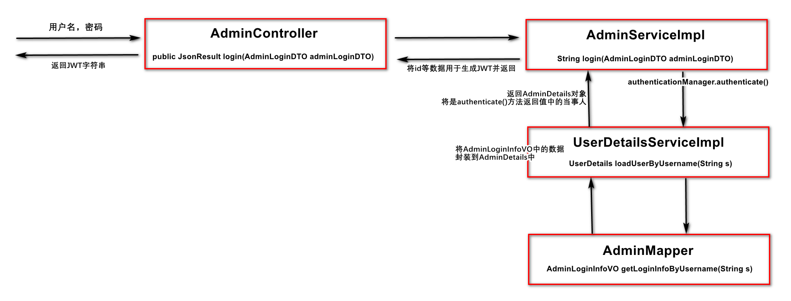

# 54. 关于SecurityContext中的认证信息

Spring Security框架是根据`SecurityContext`中是否存在认证信息来判断用户是否已经登录。

关于`SecurityContext`，是通过`ThreadLocal`进行处理的，所以，是线程安全的，每个客户端对应的`SecurityContext`中的信息是互不干扰的。

另外，`SecurityContext`中的认证信息是通过Session存储的，所以，一旦向`SecurityContext`中存入了认证信息，在后续一段时间（Session的有效时间）的访问中，即使不携带JWT，也是允许访问的，会被视为“已登录”。如果认为这样的表现是不安全的，可以在JWT过滤器中，在刚刚接收到请求时，就直接清除`SecurityContext`中的信息（主要是认证信息）：

```java
// 清除SecurityContext中原有的数据（认证信息）
SecurityContextHolder.clearContext();
```

# 53. 自定义配置

在处理JWT时，无论是生成JWT，还是解析JWT，都需要使用同一个secretKey，则应该将此secretKey定义在某个类中作为静态常量，或定义在配置文件（`application.yml`或等效的配置文件）中，由于此值是允许被软件的使用者（甲方）自行定义的，所以，更推荐定义在配置文件中。

则在`application-dev.yml`中添加自定义配置：

```yaml
# 自定义配置
csmall:
  jwt:
    secret-key: kns439a}fdLK34jsmfd{MF5-8DJSsLKhJNFDSjn
```

>  提示：在配置文件中的自定义属性，应该在属性名称上添加统一的、自定义的前缀，例如以上使用到的`csmall`，以便于与其它的属性区分开来。

接下来，可以在需要使用以上配置值的类中，通过`@Value`注解将以上配置值注入到某个全局属性中，例如：

```java
@Value("${csmall.jwt.secret-key}")
String secretKey;
```

> 提示：以上使用的`@Value`注解可以读取**当前项目中的全部环境变量**，将包括：操作系统的环境变量、JVM的环境变量、各配置文件中的配置。并且，`@Value`注解可以添加在全局属性上，也可以添加在被Spring自动调用的方法的参数上。

# 54. 处理解析JWT时的异常

在JWT过滤器中，解析JWT时可能会出现异常，异常的类型主要有：

- `SignatureException`
- `MalformedJwtException`
- `ExpiredJwtException`

由于解析JWT是发生成过滤器中的，而过滤器是整个Java EE体系中最早接收到请求的组件（此时，控制器等其它组件均未开始执行），所以，此时出现的异常不可以使用Spring MVC的全局异常处理器进行处理。

> 提示：Spring MVC的全局异常处理器在控制器（Controller）抛出异常之后执行。

只能通过最原始的`try...catch...`语法捕获并处理异常，处理时，需要使用到过滤器方法的第2个参数`HttpServletResponse response`来向客户端响应错误信息。

为了便于封装错误信息，应该使用`JsonResult`来封装相关信息，由于需要自行将`JsonResult`格式的对象转换成JSON格式的数据，所以，需要在`pom.xml`添加能够实现对象与JSON格式字符串相互转换的依赖，例如可以添加`fastjson`依赖：

```xml
<!-- fastjson：实现对象与JSON的相互转换 -->
<dependency>
    <groupId>com.alibaba</groupId>
    <artifactId>fastjson</artifactId>
    <version>1.2.75</version>
</dependency>
```

然后，在`ServiceCode`中添加一些新的业务状态码：

```java
public enum ServiceCode {

    // 前序代码
    
    ERR_JWT_SIGNATURE(60000),
    ERR_JWT_MALFORMED(60000),
    ERR_JWT_EXPIRED(60002),
    ERR_UNKNOWN(99999);
    
    // 后续代码
    
}
```

再开始处理异常，例如：

```java
// 尝试解析JWT
log.debug("将尝试解析JWT……");
Claims claims = null;
try {
    claims = Jwts.parser().setSigningKey(secretKey).parseClaimsJws(jwt).getBody();
} catch (SignatureException e) {
    String message = "非法访问！";
    JsonResult jsonResult = JsonResult.fail(ServiceCode.ERR_JWT_SIGNATURE, message);
    String jsonResultString = JSON.toJSONString(jsonResult);
    PrintWriter writer = response.getWriter();
    writer.println(jsonResultString);
    writer.close();
    return;
} catch (MalformedJwtException e) {
    String message = "非法访问！";
    JsonResult jsonResult = JsonResult.fail(ServiceCode.ERR_JWT_MALFORMED, message);
    String jsonResultString = JSON.toJSONString(jsonResult);
    PrintWriter writer = response.getWriter();
    writer.println(jsonResultString);
    writer.close();
    return;
} catch (ExpiredJwtException e) {
    String message = "登录已过期，请重新登录！";
    JsonResult jsonResult = JsonResult.fail(ServiceCode.ERR_JWT_EXPIRED, message);
    String jsonResultString = JSON.toJSONString(jsonResult);
    PrintWriter writer = response.getWriter();
    writer.println(jsonResultString);
    writer.close();
    return;
} catch (Throwable e) {
    e.printStackTrace(); // 重要
    String message = "服务器忙，请稍后再次尝试！";
    JsonResult jsonResult = JsonResult.fail(ServiceCode.ERR_UNKNOWN, message);
    String jsonResultString = JSON.toJSONString(jsonResult);
    PrintWriter writer = response.getWriter();
    writer.println(jsonResultString);
    writer.close();
    return;
}
```

**注意：强烈推荐在最后补充处理`Throwable`异常，以避免某些异常未被考虑到，并且，在处理`Throwable`时，应该执行`e.printStackTrace()`，则出现未预测的异常时，可以通过控制台看到相关信息，并在后续补充对这些异常的精准处理！**

# 55. 处理授权

首先，需要调整现有的`AdminMapper`接口中的`AdminLoginInfoVO getLoginInfoByUsername(String username)`方法，此方法应该返回参数用户名匹配的管理员信息，信息中应该包含权限！

则需要执行的SQL语句大致是：

```mysql
SELECT
    ams_admin.id,
    ams_admin.username,
    ams_admin.password,
    ams_admin.enable,
    ams_permission.value
FROM
    ams_admin
LEFT JOIN ams_admin_role ON ams_admin.id=ams_admin_role.admin_id
LEFT JOIN ams_role_permission ON ams_admin_role.role_id=ams_role_permission.role_id
LEFT JOIN ams_permission ON ams_role_permission.permission_id=ams_permission.id
WHERE
    username='root';
```

则需要调整`AdminLoginInfoVO`类，添加新的属性，用于封装查询到的权限信息：

```java
private List<String> permissions;
```

然后调整`AdminMapper.xml`中的相关配置：

```xml
<!-- AdminLoginInfoVO getLoginInfoByUsername(String username); -->
<select id="getLoginInfoByUsername" resultMap="LoginResultMap">
    SELECT
        <include refid="LoginQueryFields"/>
    FROM
        ams_admin
    LEFT JOIN ams_admin_role ON ams_admin.id=ams_admin_role.admin_id
    LEFT JOIN ams_role_permission ON ams_admin_role.role_id=ams_role_permission.role_id
    LEFT JOIN ams_permission ON ams_role_permission.permission_id=ams_permission.id
    WHERE
        username=#{username}
</select>

<sql id="LoginQueryFields">
    <if test="true">
        ams_admin.id,
        ams_admin.username,
        ams_admin.password,
        ams_admin.enable,
        ams_permission.value
    </if>
</sql>

<!-- 当涉及1个多查询时，需要使用collection标签配置List集合类型的属性 -->
<!-- collection标签的property属性：类中List集合的属性的名称 -->
<!-- collection标签的ofType属性：类中List集合的元素类型的全限定名 -->
<!-- collection标签的子级：需要配置如何创建出一个个元素对象 -->
<!-- constructor标签：将通过构造方法来创建对象 -->
<!-- constructor标签子级的arg标签：配置构造方法的参数 -->
<resultMap id="LoginResultMap" type="cn.tedu.csmall.passport.pojo.vo.AdminLoginInfoVO">
    <id column="id" property="id"/>
    <result column="username" property="username"/>
    <result column="password" property="password"/>
    <result column="enable" property="enable"/>
    <collection property="permissions" ofType="java.lang.String">
        <constructor>
            <arg column="value"/>
        </constructor>
    </collection>
</resultMap>
```

完成后，可以通过`AdminMapperTests`中原有的测试方法直接测试，测试结果例如：

```
根据username=fanchuanqi查询登录信息完成，结果=AdminLoginInfoVO(id=5, username=fanchuanqi, password=$2a$10$N.ZOn9G6/YLFixAOPMg/h.z7pCu6v2XyFDtC4q.jeeGm/TEZyj15C, enable=0, permissions=[/pms/picture/read, /pms/picture/add-new, /pms/picture/delete, /pms/picture/update, /pms/album/read, /pms/album/add-new, /pms/album/delete, /pms/album/update])
```

接下来，在`UserDetailsServiceImpl`中，向返回的`AdminDetails`中封装真实的权限数据：

```java
@Override
public UserDetails loadUserByUsername(String s) throws UsernameNotFoundException {
    log.debug("Spring Security调用了loadUserByUsername()方法，参数：{}", s);
    AdminLoginInfoVO loginInfo = adminMapper.getLoginInfoByUsername(s);
    log.debug("从数据库查询与用户名【{}】匹配的管理员信息：{}", s, loginInfo);

    if (loginInfo == null) {
        log.debug("此用户名【{}】不存在，即将抛出异常");
        String message = "登录失败，用户名不存在！";
        throw new BadCredentialsException(message);
    }

    // ===== 以下是此次调整的内容 =====
    List<GrantedAuthority> authorities = new ArrayList<>();
    for (String permission : loginInfo.getPermissions()) {
        GrantedAuthority authority = new SimpleGrantedAuthority(permission);
        authorities.add(authority);
    }

    AdminDetails adminDetails = new AdminDetails(
            loginInfo.getUsername(), loginInfo.getPassword(),
            loginInfo.getEnable() == 1, authorities);
    adminDetails.setId(loginInfo.getId());
}
```

经过以上调整后，在`AdminServiceImpl`处理登录的`login()`方法中，认证返回的结果的当事人（Principal）中就包含管理员的权限信息了！



在`AdminServiceImpl`类中的`login()`方法中，当认证成功后，得到的认证信息中的当事人信息就包含以上返回的`AdminDetails`，也就包含了管理员的权限信息，需要将此权限信息转换为JSON字符串（如果不转换，则后续解析时不便于还原出原始数据）并用于生成JWT数据：

```java
log.debug("准备生成JWT数据");
Map<String, Object> claims = new HashMap<>();
claims.put("id", adminDetails.getId()); // 向JWT中封装id
claims.put("username", adminDetails.getUsername()); // 向JWT中封装username
// ===== 以下这1条语句是新增的 =====
claims.put("authorities", JSON.toJSONString(adminDetails.getAuthorities())); // 向JWT中封装权限
```

在JWT过滤器中，在解析JWT时，可以从JWT中得到权限的JSON字符串，应该将其转换成`List<SimpleGrantedAuthority>`并存入到认证信息中：

```java
// 从JWT中获取用户的相关数据，例如id、username等
Long id = claims.get("id", Long.class);
String username = claims.get("username", String.class);
String authoritiesJsonString = claims.get("authorities", String.class); // 【调整】
log.debug("从JWT中解析得到数据：id={}", id);
log.debug("从JWT中解析得到数据：username={}", username);
log.debug("从JWT中解析得到数据：authoritiesJsonString={}", authoritiesJsonString);

// 准备用于创建认证信息的权限数据
List<SimpleGrantedAuthority> authorities
        = JSON.parseArray(authoritiesJsonString, SimpleGrantedAuthority.class); // 【调整】

// 准备用于创建认证信息的当事人数据
LoginPrincipal loginPrincipal = new LoginPrincipal();
loginPrincipal.setId(id);
loginPrincipal.setUsername(username);

// 创建认证信息
Authentication authentication = new UsernamePasswordAuthenticationToken(
        loginPrincipal, null, authorities);

// 将认证信息存储到SecurityContext中
log.debug("即将向SecurityContext中存入认证信息：{}", authentication);
SecurityContextHolder.getContext().setAuthentication(authentication);
```

至此，关于登录相关的处理已经全部结束！

接下来，就可以配置各请求所需的权限，以实现对管理员权限的控制！

需要先在配置类上添加`@EnableGlobalMethodSecurity(prePostEnabled = true)`开启在方法上使用注解配置权限的功能，则在`SecurityConfiguration`类中添加此注解配置：

```java
@Slf4j
@Configuration
@EnableGlobalMethodSecurity(prePostEnabled = true) // 新增
public class SecurityConfiguration extends WebSecurityConfigurerAdapter {
    // 暂不关心类中的代码
}
```

然后，在任何处理请求的方法上，通过`@PreAuthorize`注解来配置对应请求所需的权限，例如：

```java
@ApiOperation("查询管理员列表")
@ApiOperationSupport(order = 420)
@GetMapping("")
@PreAuthorize("hasAuthority('/ams/admin/read')") // 【新增】
public JsonResult<List<AdminListItemVO>> list() {
    log.debug("开始处理【查询管理员列表】的请求");
    List<AdminListItemVO> list = adminService.list();
    return JsonResult.ok(list);
}
```

经过以上配置，则“查询管理员列表”功能是只有具备`/ams/admin/read`权限的管理员才允许访问的，如果当前JWT对应的管理员不具备此权限，则会出现`AccessDeniedException`，例如：

```
org.springframework.security.access.AccessDeniedException: 不允许访问
```


