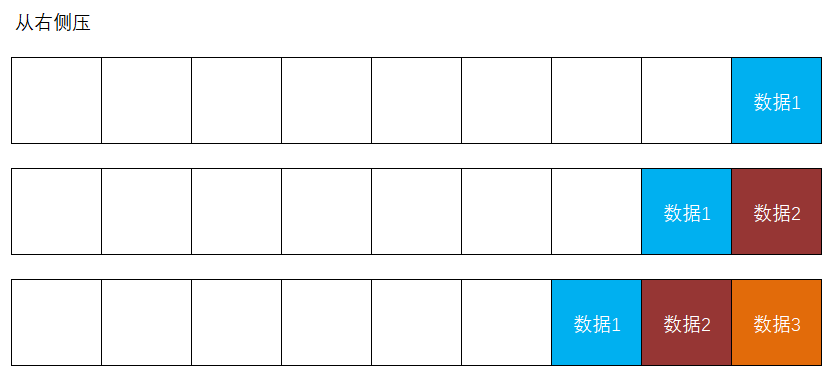

# 56. 单点登录（SSO）

SSO：Single Sign On，即：单点登录

单点登录表现为：在集群或分布式系统中，客户端在其中的某1个服务器登录，后续的请求被分配到其它服务器处理时，其它服务器也能识别用户的身份。

单点登录的实现方案有：

- 共享Session
  - 把所有客户端的Session数据存储到专门的服务器上，其它任何服务器需要识别客户端身份时，都从这个专门的服务器上去查找、读取Session数据
  - 缺点：Session的有效期不宜过长
  - 优点：编码简单，读取Session数据基本上没有额外牺牲性能
- Token
  - 当某客户端登录成功，服务器端将响应Token到客户端，在后续的访问中，客户端自行携带Token数据来访问任何服务器，且任何服务器都具备解析此Token的功能，即可识别客户端的身份
  - JWT（JSON Web Token）也是Token的一种
  - 缺点：编写代码略难，需要频繁解析JWT，需要牺牲一部分性能来进行解析
  - 优点：可以长时间有效

# 57. 实现SSO

目前，在`csmall-passport`项目中已经现实了认证与授权，只要客户端能携带有效的JWT，则服务器端可以识别客户端的身份！

在`csmall-product`项目中，只需要添加Spring Security框架的依赖项，并添加认证相关代码，就可以实现“客户端在`csmall-passport`登录后，在`csmall-product`上也可以识别用户的身份”！

需要从`csmall-passport`中复制到`csmall-product`中的代码有：

- 复制相关依赖项
  - `spring-boot-starter-security`
  - `jjwt`
  - `fastjson`
- 复制`application-dev.yml`中关于JWT的自定义配置
- `LoginPrincipal`
- `ServiceCode`（更新文件，在`passport`中添加了一些新的业务状态码，在`product`中也将需要使用到）
- `JwtAuthorizationFilter`
- `SecurityConfiguration`
  - 删除`PasswordEncoder`的`@Bean`方法
  - 删除`AuthenticationManager`的`@Bean`方法
  - 删除`configurer()`方法中“白名单”中的 `"/admins/login"` 路径
- `GlobalExceptionHandler`（更新文件，处理“无操作权限”相关异常）

在前端项目中，保证除了登录的每个请求都添加了请求头中的JWT即可。

本项目基于Spring Security和JWT实现了SSO（单点登录）。

# 58. 关于Redis

Redis是一款使用K-V结构的基于内存的NoSQL非关系型数据库。

> 内存是计算机的硬件系统中，除了CPU/GPU内置的缓存以外，存取效率最高的存储设备。

# 59. 关于Redis的基本使用

当安装并启动了Redis服务后，在操作系统的终端中，通过`redis-cli`命令可以登录Redis客户端，当登录成功后，操作提示符将变为 `127.0.0.1:6379>`。

当已经登录Redis客户端后，可以通过 `exit` 命令退出，则会回到操作系统的终端。

当已经登录Redis客户端后，可以通过 `ping` 命令检查Redis服务是否仍处于可用状态。

当已经登录Redis客户端后，可以通过 `shutdown` 命令停止Redis服务。

在操作系统的终端中，可以通过 `redis-server` 启动Redis服务。

当已经登录Redis客户端后，可以通过 `set key value` 命令向Redis中存入数据，例如：

```
set name liucangsong
```

当已经登录Redis客户端后，可以通过 `get key` 命令从Redis中取出曾经存入的数据，例如：

```
get name
```

与Java语言中的`Map`相同，在Redis中的Key也是唯一的，所以，当通过 `set key value` 存入数据时，如果Key不存在，则是新增数据的操作，如果Key已经存在，则是修改数据的操作。

当已经登录Redis客户端后，可以通过 `keys Key的名称或带通配符的模式` 命令查询Redis中的相关Key的列表，例如：

```
keys email
```

```
keys *
```

关于更多Redis的命令操作，可查阅资料，例如：

- Redis 常用操作命令，非常详细！ - 知乎 (zhihu.com) (https://zhuanlan.zhihu.com/p/47692277)

# 60. 关于Redis编程

在Spring Boot项目中，要实现Redis编程，应该添加相关的依赖：

```xml
<!-- Spring Data Redis，用于实现Redis编程 -->
<dependency>
    <groupId>org.springframework.boot</groupId>
    <artifactId>spring-boot-starter-data-redis</artifactId>
</dependency>
```

Redis编程主要通过`RedisTemplate`工具来实现，应该通过配置类的`@Bean`方法返回此类型的对象，并在需要使用Redis编程时自动装配此对象！

则在根包下创建`config.RedisConfiguration`配置类：

```java
package cn.tedu.csmall.product.config;

import lombok.extern.slf4j.Slf4j;
import org.springframework.context.annotation.Bean;
import org.springframework.context.annotation.Configuration;
import org.springframework.data.redis.connection.RedisConnectionFactory;
import org.springframework.data.redis.core.RedisTemplate;
import org.springframework.data.redis.serializer.RedisSerializer;

import java.io.Serializable;

/**
 * Redis的配置类
 *
 * @author java@tedu.cn
 * @version 0.0.1
 */
@Slf4j
@Configuration
public class RedisConfiguration {

    public RedisConfiguration() {
        log.debug("创建配置类对象：RedisConfiguration");
    }


    @Bean
    public RedisTemplate<String, Serializable> redisTemplate(
            RedisConnectionFactory redisConnectionFactory) {
        log.debug("创建@Bean方法定义的对象：RedisTemplate");
        RedisTemplate<String, Serializable> redisTemplate = new RedisTemplate<>();
        redisTemplate.setConnectionFactory(redisConnectionFactory);
        redisTemplate.setKeySerializer(RedisSerializer.string());
        redisTemplate.setValueSerializer(RedisSerializer.json());
        return redisTemplate;
    }

}
```

关于`RedisTemplate`的基本使用，可以在`src/test/java`的根包下创建`RedisTests`测试类，在此类中自动装配`RedisTemplate`并测试使用：

```java
package cn.tedu.csmall.product;

import cn.tedu.csmall.product.pojo.entity.Brand;
import lombok.extern.slf4j.Slf4j;
import org.junit.jupiter.api.Test;
import org.springframework.beans.factory.annotation.Autowired;
import org.springframework.boot.test.context.SpringBootTest;
import org.springframework.data.redis.core.ListOperations;
import org.springframework.data.redis.core.RedisTemplate;
import org.springframework.data.redis.core.ValueOperations;

import java.io.Serializable;
import java.util.ArrayList;
import java.util.List;
import java.util.Set;

@Slf4j
@SpringBootTest
public class RedisTests {

    @Autowired
    RedisTemplate<String, Serializable> redisTemplate;

    @Test
    void setValue() {
        String key = "name";
        String value = "国斌老师";

        ValueOperations<String, Serializable> ops
                = redisTemplate.opsForValue(); // 只要是对字符串类型的Value进行操作，必须调用opsForValue()方法得到相应的操作器
        ops.set(key, value);
        log.debug("已经向Redis中写入Key为【{}】的数据：{}", key, value);
    }

    @Test
    void getValue() {
        String key = "name";

        ValueOperations<String, Serializable> ops = redisTemplate.opsForValue();
        Serializable value = ops.get(key);
        log.debug("已经从Redis中取出Key为【{}】的数据：{}", key, value);
    }

    @Test
    void setObjectValue() {
        String key = "brand1";
        Brand brand = new Brand();
        brand.setId(1L);
        brand.setName("测试品牌");

        ValueOperations<String, Serializable> ops = redisTemplate.opsForValue();
        ops.set(key, brand);
        log.debug("已经向Redis中写入Key为【{}】的数据：{}", key, brand);
    }

    @Test
    void getObjectValue() {
        String key = "brand1";

        ValueOperations<String, Serializable> ops = redisTemplate.opsForValue();
        Serializable value = ops.get(key);
        log.debug("已经从Redis中取出Key为【{}】的数据：{}", key, value);
        log.debug("取出的数据的类型是：{}", value.getClass().getName());
    }

    @Test
    void getNull() {
        String key = "hahahaha";

        ValueOperations<String, Serializable> ops = redisTemplate.opsForValue();
        Serializable value = ops.get(key);
        log.debug("已经从Redis中取出Key为【{}】的数据：{}", key, value);
    }

    @Test
    void keys() {
        String keyPattern = "*";
        Set<String> keys = redisTemplate.keys(keyPattern);
        log.debug("查询当前Redis中所有的Key，Key的数量：{}", keys.size());
        for (String key : keys) {
            log.debug("key = {}", key);
        }
    }

    @Test
    void delete() {
        String key = "name";
        Boolean result = redisTemplate.delete(key);
        log.debug("删除Key为【{}】的数据，结果：{}", key, result);
    }

    @Test
    void deleteX() {
        String keyPattern = "*";
        Set<String> keys = redisTemplate.keys(keyPattern);
        Long count = redisTemplate.delete(keys);
        log.debug("删除多条数据【Keys={}】完成，删除的数据的数量：{}", keys, count);
    }

    @Test
    void setList() {
        List<Brand> brands = new ArrayList<>();
        for (int i = 1; i <= 8; i++) {
            Brand brand = new Brand();
            brand.setId(i + 0L);
            brand.setName("测试品牌" + i);
            brands.add(brand);
        }

        String key = "brands";
        ListOperations<String, Serializable> ops = redisTemplate.opsForList(); // 得到List集合的操作器
        for (Brand brand : brands) {
            ops.rightPush(key, brand);
        }
        log.debug("向Redis中写入列表数据完成，Key为【{}】，写入的列表为：{}", key, brands);
    }

    @Test
    void listSize() {
        String key = "brands";
        ListOperations<String, Serializable> ops = redisTemplate.opsForList();
        Long size = ops.size(key);
        log.debug("在Redis中Key为【{}】的列表的长度为：{}", key, size);
    }

    @Test
    void listRange() {
        String key = "brands";
        long start = 0;
        long end = -1;
        ListOperations<String, Serializable> ops = redisTemplate.opsForList();
        List<Serializable> list = ops.range(key, start, end);
        log.debug("从Redis中读取Key为【{}】的列表，start={}，end={}，获取到的列表长度为：{}",
                key, start, end, list.size());
        for (Serializable item : list) {
            log.debug("{}", item);
        }
    }

}
```

关于存取字符串类型的数据，直接存、取即可。

关于存取对象型的数据，由于已经将值的序列化器配置为JSON（`redisTemplate.setValueSerilizer(RedisSerializer.json())`），在处理过程中，框架会自动将对象序列化成JSON字符串、将JSON字符串反序列化成对象，所以，对于Redis而言，操作的仍是字符串，所以，在存取对象型数据时，使用的API与存取字符串完全相同。

关于列表（List）类型的数据，首先，需要理解Redis中列表的数据结构，是一个先进后出、后进先出的栈结构：


并且，在Redis的List中，允许从左右两端操作列表（请将栈想像为横着的）：




在读取List中的数据时，相关的API需要指定`start`和`end`，也就是读取整个列表中的某个区间的数据，无论是`start`还是`end`，都表示需要读取的数据的位置下标，例如传入的是`5`和`10`，就表示从下标为`5`的位置开始读取，直至下标为`10`的数据。在整个List中，第1个数据的下标为`0`，并且，Redis中的List元素都有正向的和反向的下标，正向的是从0开始递增的，反向下标是以最后一个元素作为`-1`，并且向前递减的：


所以，如果需要读取如以上图例的列表的全部数据，`start`值可以为`0`或`-8`，`end`值可以为`7`或`-1`，通常，读取全部数据推荐使用`start`为`0`，且`end`为`-1`。

