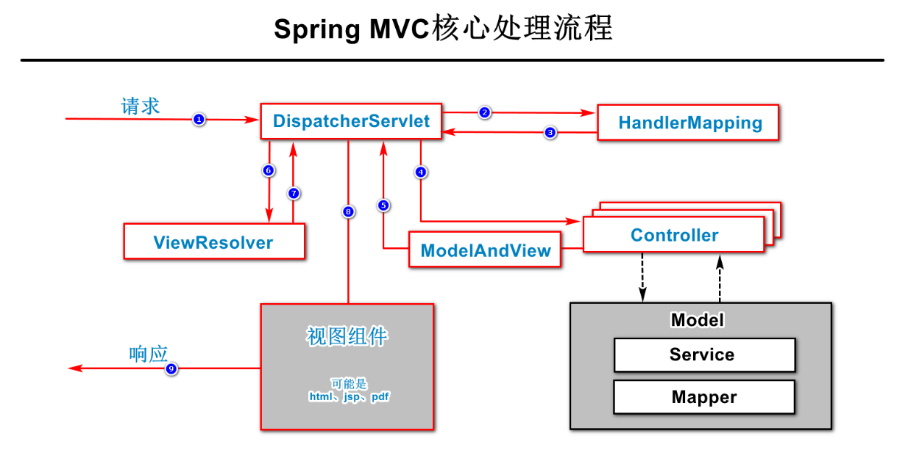

# 计划任务

在Spring Boot项目中，在任何组件类中，自定义方法，并在方法上添加`@Scheduled`注解，并通过此注解配置计划任务的执行周期或执行时间，则此方法就是一个计划任务方法。

在Spring Boot项目，计划任务默认是禁用的，需要在配置类上添加`@EnableScheduling`注解以开启项目中的计划任务。

则在根包下创建`config.ScheduleConfiguration`类：

```java
package cn.tedu.csmall.product.config;

import lombok.extern.slf4j.Slf4j;
import org.springframework.context.annotation.Configuration;
import org.springframework.scheduling.annotation.EnableScheduling;

/**
 * 计划任务配置类
 *
 * @author java@tedu.cn
 * @version 0.0.1
 */
@Slf4j
@Configuration
@EnableScheduling
public class ScheduleConfiguration {

    public ScheduleConfiguration() {
        log.debug("创建配置类对象：ScheduleConfiguration");
    }
    
}
```

另外，在根包下创建`schedule.CacheSchedule`类，作为处理缓存的计划任务类：

```java
package cn.tedu.csmall.product.schedule;

import cn.tedu.csmall.product.service.IBrandService;
import lombok.extern.slf4j.Slf4j;
import org.springframework.beans.factory.annotation.Autowired;
import org.springframework.scheduling.annotation.Scheduled;
import org.springframework.stereotype.Component;

/**
 * 处理缓存的计划任务类
 *
 * @author java@tedu.cn
 * @version 0.0.1
 */
@Slf4j
@Component
public class CacheSchedule {

    @Autowired
    IBrandService brandService;

    public CacheSchedule() {
        log.debug("创建计划任务类对象：CacheSchedule");
    }

    // 关于@Scheduled注解的属性配置：
    // fixedRate：每间隔多少毫秒执行一次
    // fixedDelay：上次执行结束后，过多少毫秒执行一次
    // cron：使用一个字符串，其中包含6~7个值，每个值之间使用1个空格进行分隔
    // >> 在cron的字符串的各值分别表示：秒 分 时 日 月 周（星期） [年]
    // >> 例如：cron = "56 34 12 2 1 ? 2035"，则表示2035年1月2日12:34:56将执行此计划任务，无论这一天是星期几
    // >> 以上各值都可以使用通配符，使用星号（*）则表示任意值，使用问号（?）表示不关心具体值，并且，问号只能用于“周（星期）”和“日”这2个位置
    // >> 以上各值，可以使用“x/x”格式的值，例如，分钟对应的值使用“1/5”，则表示当分钟值为1的那一刻开始执行，往后每间隔5分钟执行一次
    @Scheduled(fixedRate = 5 * 60 * 1000)
    public void rebuildCache() {
        log.debug("开始执行处理缓存的计划任务……");
        brandService.rebuildCache();
        log.debug("处理缓存的计划任务执行完成！");
    }

}
```

以上代码需要在`IBrandService`中添加“重建缓存”的方法：

```java
/**
 * 重建品牌数据缓存
 */
void rebuildCache();
```

并在`BrandServiceImpl`中实现：

```java
@Override
public void rebuildCache() {
    log.debug("删除Redis中原有的品牌数据");
    brandRedisRepository.deleteAll();

    log.debug("从MySQL中读取品牌列表");
    List<BrandListItemVO> brands = brandMapper.list();

    log.debug("将品牌列表写入到Redis");
    brandRedisRepository.save(brands);

    log.debug("逐一根据id从MySQL中读取品牌详情，并写入到Redis");
    for (BrandListItemVO item : brands) {
        BrandStandardVO brand = brandMapper.getStandardById(item.getId());
        brandRedisRepository.save(brand);
    }
}
```

需要注意，对于周期性的计划任务，首次执行是在项目即将完成启动时，所以，也可以实现类似`ApplicationRunner`的效果，所以，使用周期性的计划任务也可以实现缓存预热，并且保持周期性的更新缓存！

由于计划任务是在专门的线程中处理的，与普通的处理请求、处理数据的线程是并行的，所以需要关注线程安全问题。

# 使用Mybatis拦截器处理`gmt_create`和`gmt_modified`字段的值

在每张数据表中，都有`gmt_create`、`gmt_modified`这2个字段（是在阿里的开发规范上明确要求的），这2个字段的值是有固定规则的，例如`gmt_create`的值就是`INSERT`这条数据时的时间，而`gmt_modified`的值就是每次执行`UPDATE`时更新的时间，由于这是固定的做法，可以使用Mybatis拦截器进行处理，即每次执行SQL语句之前，先判断是否为`INSERT` / `UPDATE`类型的SQL语句，如果是，再判断SQL语句是否处理了相关时间，如果没有，则修改原SQL语句，得到处理了相关时间的新SQL语句，并放行，使之最终执行的是修改后的SQL语句。

关于此拦截器的示例：

```java
package cn.tedu.csmall.product.interceptor.mybatis;

import lombok.extern.slf4j.Slf4j;
import org.apache.ibatis.executor.statement.StatementHandler;
import org.apache.ibatis.mapping.BoundSql;
import org.apache.ibatis.plugin.*;

import java.lang.reflect.Field;
import java.sql.Connection;
import java.time.LocalDateTime;
import java.util.Properties;
import java.util.regex.Matcher;
import java.util.regex.Pattern;

/**
 * <p>基于MyBatis的自动更新"最后修改时间"的拦截器</p>
 *
 * <p>需要SQL语法预编译之前进行拦截，则拦截类型为StatementHandler，拦截方法是prepare</p>
 *
 * <p>具体的拦截处理由内部的intercept()方法实现</p>
 *
 * <p>注意：由于仅适用于当前项目，并不具备范用性，所以：</p>
 *
 * <ul>
 * <li>拦截所有的update方法（根据SQL语句以update前缀进行判定），无法不拦截某些update方法</li>
 * <li>所有数据表中"最后修改时间"的字段名必须一致，由本拦截器的FIELD_MODIFIED属性进行设置</li>
 * </ul>
 *
 * @author java@tedu.cn
 * @version 0.0.1
 */
@Slf4j
@Intercepts({@Signature(
        type = StatementHandler.class,
        method = "prepare",
        args = {Connection.class, Integer.class}
)})
public class InsertUpdateTimeInterceptor implements Interceptor {
    /**
     * 自动添加的创建时间字段
     */
    private static final String FIELD_CREATE = "gmt_create";
    /**
     * 自动更新时间的字段
     */
    private static final String FIELD_MODIFIED = "gmt_modified";
    /**
     * SQL语句类型：其它（暂无实际用途）
     */
    private static final int SQL_TYPE_OTHER = 0;
    /**
     * SQL语句类型：INSERT
     */
    private static final int SQL_TYPE_INSERT = 1;
    /**
     * SQL语句类型：UPDATE
     */
    private static final int SQL_TYPE_UPDATE = 2;
    /**
     * 查找SQL类型的正则表达式：INSERT
     */
    private static final String SQL_TYPE_PATTERN_INSERT = "^insert\\s";
    /**
     * 查找SQL类型的正则表达式：UPDATE
     */
    private static final String SQL_TYPE_PATTERN_UPDATE = "^update\\s";
    /**
     * 查询SQL语句片段的正则表达式：gmt_modified片段
     */
    private static final String SQL_STATEMENT_PATTERN_MODIFIED = ",\\s*" + FIELD_MODIFIED + "\\s*=";
    /**
     * 查询SQL语句片段的正则表达式：gmt_create片段
     */
    private static final String SQL_STATEMENT_PATTERN_CREATE = ",\\s*" + FIELD_CREATE + "\\s*[,)]?";
    /**
     * 查询SQL语句片段的正则表达式：WHERE子句
     */
    private static final String SQL_STATEMENT_PATTERN_WHERE = "\\s+where\\s+";
    /**
     * 查询SQL语句片段的正则表达式：VALUES子句
     */
    private static final String SQL_STATEMENT_PATTERN_VALUES = "\\)\\s*values?\\s*\\(";

    @Override
    public Object intercept(Invocation invocation) throws Throwable {
        // 日志
        log.debug("准备拦截SQL语句……");
        // 获取boundSql，即：封装了即将执行的SQL语句及相关数据的对象
        BoundSql boundSql = getBoundSql(invocation);
        // 从boundSql中获取SQL语句
        String sql = getSql(boundSql);
        // 日志
        log.debug("原SQL语句：{}", sql);
        // 准备新SQL语句
        String newSql = null;
        // 判断原SQL类型
        switch (getOriginalSqlType(sql)) {
            case SQL_TYPE_INSERT:
                // 日志
                log.debug("原SQL语句是【INSERT】语句，准备补充更新时间……");
                // 准备新SQL语句
                newSql = appendCreateTimeField(sql, LocalDateTime.now());
                break;
            case SQL_TYPE_UPDATE:
                // 日志
                log.debug("原SQL语句是【UPDATE】语句，准备补充更新时间……");
                // 准备新SQL语句
                newSql = appendModifiedTimeField(sql, LocalDateTime.now());
                break;
        }
        // 应用新SQL
        if (newSql != null) {
            // 日志
            log.debug("新SQL语句：{}", newSql);
            reflectAttributeValue(boundSql, "sql", newSql);
        }

        // 执行调用，即拦截器放行，执行后续部分
        return invocation.proceed();
    }

    public String appendModifiedTimeField(String sqlStatement, LocalDateTime dateTime) {
        Pattern gmtPattern = Pattern.compile(SQL_STATEMENT_PATTERN_MODIFIED, Pattern.CASE_INSENSITIVE);
        if (gmtPattern.matcher(sqlStatement).find()) {
            log.debug("原SQL语句中已经包含gmt_modified，将不补充添加时间字段");
            return null;
        }
        StringBuilder sql = new StringBuilder(sqlStatement);
        Pattern whereClausePattern = Pattern.compile(SQL_STATEMENT_PATTERN_WHERE, Pattern.CASE_INSENSITIVE);
        Matcher whereClauseMatcher = whereClausePattern.matcher(sql);
        // 查找 where 子句的位置
        if (whereClauseMatcher.find()) {
            int start = whereClauseMatcher.start();
            int end = whereClauseMatcher.end();
            String clause = whereClauseMatcher.group();
            log.debug("在原SQL语句 {} 到 {} 找到 {}", start, end, clause);
            String newSetClause = ", " + FIELD_MODIFIED + "='" + dateTime + "'";
            sql.insert(start, newSetClause);
            log.debug("在原SQL语句 {} 插入 {}", start, newSetClause);
            log.debug("生成SQL: {}", sql);
            return sql.toString();
        }
        return null;
    }

    public String appendCreateTimeField(String sqlStatement, LocalDateTime dateTime) {
        // 如果 SQL 中已经包含 gmt_create 就不在添加这两个字段了
        Pattern gmtPattern = Pattern.compile(SQL_STATEMENT_PATTERN_CREATE, Pattern.CASE_INSENSITIVE);
        if (gmtPattern.matcher(sqlStatement).find()) {
            log.debug("已经包含 gmt_create 不再添加 时间字段");
            return null;
        }
        // INSERT into table (xx, xx, xx ) values (?,?,?)
        // 查找 ) values ( 的位置
        StringBuilder sql = new StringBuilder(sqlStatement);
        Pattern valuesClausePattern = Pattern.compile(SQL_STATEMENT_PATTERN_VALUES, Pattern.CASE_INSENSITIVE);
        Matcher valuesClauseMatcher = valuesClausePattern.matcher(sql);
        // 查找 ") values " 的位置
        if (valuesClauseMatcher.find()) {
            int start = valuesClauseMatcher.start();
            int end = valuesClauseMatcher.end();
            String str = valuesClauseMatcher.group();
            log.debug("找到value字符串：{} 的位置 {}, {}", str, start, end);
            // 插入字段列表
            String fieldNames = ", " + FIELD_CREATE + ", " + FIELD_MODIFIED;
            sql.insert(start, fieldNames);
            log.debug("插入字段列表{}", fieldNames);
            // 定义查找参数值位置的 正则表达 “)”
            Pattern paramPositionPattern = Pattern.compile("\\)");
            Matcher paramPositionMatcher = paramPositionPattern.matcher(sql);
            // 从 ) values ( 的后面位置 end 开始查找 结束括号的位置
            String param = ", '" + dateTime + "', '" + dateTime + "'";
            int position = end + fieldNames.length();
            while (paramPositionMatcher.find(position)) {
                start = paramPositionMatcher.start();
                end = paramPositionMatcher.end();
                str = paramPositionMatcher.group();
                log.debug("找到参数值插入位置 {}, {}, {}", str, start, end);
                sql.insert(start, param);
                log.debug("在 {} 插入参数值 {}", start, param);
                position = end + param.length();
            }
            if (position == end) {
                log.warn("没有找到插入数据的位置！");
                return null;
            }
        } else {
            log.warn("没有找到 ) values (");
            return null;
        }
        log.debug("生成SQL: {}", sql);
        return sql.toString();
    }


    @Override
    public Object plugin(Object target) {
        // 本方法的代码是相对固定的
        if (target instanceof StatementHandler) {
            return Plugin.wrap(target, this);
        } else {
            return target;
        }
    }

    @Override
    public void setProperties(Properties properties) {
        // 无须执行操作
    }

    /**
     * <p>获取BoundSql对象，此部分代码相对固定</p>
     *
     * <p>注意：根据拦截类型不同，获取BoundSql的步骤并不相同，此处并未穷举所有方式！</p>
     *
     * @param invocation 调用对象
     * @return 绑定SQL的对象
     */
    private BoundSql getBoundSql(Invocation invocation) {
        Object invocationTarget = invocation.getTarget();
        if (invocationTarget instanceof StatementHandler) {
            StatementHandler statementHandler = (StatementHandler) invocationTarget;
            return statementHandler.getBoundSql();
        } else {
            throw new RuntimeException("获取StatementHandler失败！请检查拦截器配置！");
        }
    }

    /**
     * 从BoundSql对象中获取SQL语句
     *
     * @param boundSql BoundSql对象
     * @return 将BoundSql对象中封装的SQL语句进行转换小写、去除多余空白后的SQL语句
     */
    private String getSql(BoundSql boundSql) {
        return boundSql.getSql().toLowerCase().replaceAll("\\s+", " ").trim();
    }

    /**
     * <p>通过反射，设置某个对象的某个属性的值</p>
     *
     * @param object         需要设置值的对象
     * @param attributeName  需要设置值的属性名称
     * @param attributeValue 新的值
     * @throws NoSuchFieldException   无此字段异常
     * @throws IllegalAccessException 非法访问异常
     */
    private void reflectAttributeValue(Object object, String attributeName, String attributeValue) throws NoSuchFieldException, IllegalAccessException {
        Field field = object.getClass().getDeclaredField(attributeName);
        field.setAccessible(true);
        field.set(object, attributeValue);
    }

    /**
     * 获取原SQL语句类型
     *
     * @param sql 原SQL语句
     * @return SQL语句类型
     */
    private int getOriginalSqlType(String sql) {
        Pattern pattern;
        pattern = Pattern.compile(SQL_TYPE_PATTERN_INSERT, Pattern.CASE_INSENSITIVE);
        if (pattern.matcher(sql).find()) {
            return SQL_TYPE_INSERT;
        }
        pattern = Pattern.compile(SQL_TYPE_PATTERN_UPDATE, Pattern.CASE_INSENSITIVE);
        if (pattern.matcher(sql).find()) {
            return SQL_TYPE_UPDATE;
        }
        return SQL_TYPE_OTHER;
    }

}
```

Mybatis拦截器必须注册后才能生效！可以在配置类（或任何组件类）中：

```java
@Autowired
private List<SqlSessionFactory> sqlSessionFactoryList;

@PostConstruct // 使得此方法在调用了构造方法、完成了属性注入之后自动执行
public void addInterceptor() {
    InsertUpdateTimeInterceptor interceptor = new InsertUpdateTimeInterceptor();
    for (SqlSessionFactory sqlSessionFactory : sqlSessionFactoryList) {
        sqlSessionFactory.getConfiguration().addInterceptor(interceptor);
    }
}
```

# 关于Spring MVC框架

Spring MVC框架主要解决了接收请求、响应结果及相关的问题。

> 相关的问题：接收请求参数、转换响应结果、统一处理异常等。

关于Spring MVC框架的核心执行流程，如下图所示：



**注意：以上示例图描述是“非响应正文”的处理流程！**

Spring MVC框架的5个核心组件：

- `DispatcherServlet`：也称之为“前端控制器”，用于在Spring MVC框架接收所有来自客户端的请求，并进行分发、组织整个处理流程，此组件将由配置文件进行处理，在Spring Boot项目中，是自动配置的
- `HandlerMapping`：记录了请求路径与处理请求的控制器（方法）的对应关系，在开发实践时，使用`@RequestMapping`系列注解配置的请求路径，本质就是在向`HandlerMapping`中添加映射关系
- `Controller`：实际处理请求的组件，是由开发人员自行定义的
  - 注意：如果设计的控制器处理请求的方法是响应正文的，当`Controller`组件执行结束后，就会开始向客户端响应数据，不会执行以上示例图中剩余的流程
- `ModelAndView`：是`Controller`处理请求后返回的对象，此对象封装了`Controller`处理请求后的数据和显示这些数据所使用到的视图组件的名称
- `ViewResolver`：也称之为“视图解析器”，可以根据“视图组件的名称”来决定具体使用的视图组件

# Spring AOP

AOP：面向切面的编程，实现了横切关注的相关问题，通常是许多不同的数据处理流程中都需要解决的共同的问题。

目前，项目中处理数据的流程大致是：

```
添加品牌：请求 -----> Filter -----> Controller -----> Service -----> Mapper -----> DB

添加相册：请求 -----> Filter -----> Controller -----> Service -----> Mapper -----> DB

删除类别：请求 -----> Filter -----> Controller -----> Service -----> Mapper -----> DB

编辑商品：请求 -----> Filter -----> Controller -----> Service -----> Mapper -----> DB
```

可能在处理过程中，虽然处理请求不同，但是需要执行一些高度相似甚至完全相同的代码，某些特定的执行时间节点可以通过一些特殊的组件来完成，例如Java EE中的`Filter`、Spring MVC的`Interceptor`、Mybatis的`Interceptor`，但是，这些特殊的组件只能在特定的时间节点执行，例如`Filter`是在服务器接收到请求的第一时间就已经执行，Spring MVC的`Interceprot`是在`Controller`的前后执行，Mybatis的`Intercepror`是在处理SQL语句时执行，如果需要在其它执行时间节点处理相同的任务，这些组件都是不可用的！

使用AOP通常解决以下类型的问题：安全、事务管理、日志等等。

AOP技术本身并不是Spring特有的技术，只是Spring很好的支持了AOP。

假设需要实现：统计每个业务方法的执行耗时。

首先，需要添加依赖项：

```xml
<!-- Spring AOP，用于实现AOP编程 -->
<dependency>
    <groupId>org.springframework.boot</groupId>
    <artifactId>spring-boot-starter-aop</artifactId>
</dependency>
```

然后，创建用于统计业务执行耗时的切面类，这种切面类本身是个组件类，并且需要添加`@Aspect`注解，则在根包下创建`aop.TimerAspect`类：

```java
package cn.tedu.csmall.product.aop;

import lombok.extern.slf4j.Slf4j;
import org.aspectj.lang.ProceedingJoinPoint;
import org.aspectj.lang.annotation.Around;
import org.aspectj.lang.annotation.Aspect;
import org.springframework.stereotype.Component;

/**
 * 统计业务方法执行耗时的切面类
 * 
 * @author java@tedu.cn
 * @version 0.0.1
 */
@Slf4j
@Aspect
@Component
public class TimerAspect {

    // 在AOP中，有多种Advice（通知）
    // @Around：包裹，可以实现在连接点之前和之后均自定义代码
    // @Before：在连接点之前执行
    // @After：在连接点之后执行，无论是正常返回还是抛出异常都会执行
    // @AfterReturning：在连接点返回之后执行
    // @AfterThrowing：在连接点抛出异常之后执行
    // 仅当使用@Around时，方法才可以自行处理ProceedingJoinPointer
    // 各Advice的执行大概是：
    // @Around
    // try {
    //   @Before
    //   连接点方法
    //   @AfterReturning
    // } catch (Throwable e) {
    //   @AfterThrowing
    // } finally {
    //   @After
    // }
    // @Around
    // ---------------------------------------------------
    // 关于ProceedingJoinPoint
    // 必须调用proceed()方法，表示执行表达式匹配到的方法
    // 调用proceed()方法必须获取返回值，且作为当前方法的返回值，表示返回表达式匹配的方法的返回值
    // 调用proceed()方法时的异常必须抛出，不可以使用try...catch进行捕获并处理
    // ---------------------------------------------------
    // 关于execution表达式：用于匹配在何时执行AOP相关代码
    // 表达式中的星号：匹配任意内容，只能匹配1次
    // 表达式中的2个连续的小数点：匹配任意内容，可以匹配0~n次，只能用于包名和参数列表部分
    // 表达式中的包是根包，会自动包含其子孙包中的匹配项
    @Around("execution(* cn.tedu.csmall.product.service.*.*(..))")
    //                 ↑ 无论方法的返回值类型是什么
    //                                                  ↑ 无论是哪个类
    //                                                     ↑ 无论是哪个方法
    //                                                       ↑ 2个小数点表示任何参数列表
    public Object timer(ProceedingJoinPoint pjp) throws Throwable {
        log.debug("执行了TimerAspect中的方法……");

        long start = System.currentTimeMillis();
        Object result = pjp.proceed(); // 执行连接点方法，获取返回结果
        long end = System.currentTimeMillis();

        log.debug("【{}】类型的对象调用了【{}】方法，方法的参数值为【{}】",
                pjp.getTarget().getClass().getName(),
                pjp.getSignature().getName(),
                pjp.getArgs());
        log.debug("执行耗时：{}毫秒", end - start);

        return result; // 返回调用pjp.proceed()时的结果
    }

}
```

切面是无侵入性的，在不修改任何其它类的任何代码的情况下，就可以作用于整个数据处理过程！


