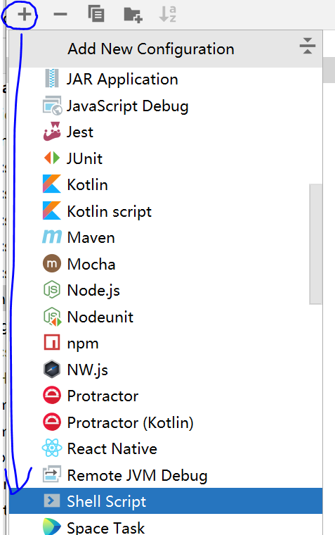
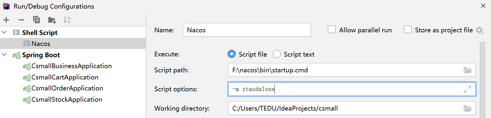

# 创建csmall项目

我们要搭建一个项目,用于学习各种微服务知识

搭建的过程有很多新的标准,需要我们掌握和学习

发给大家的3个csmall的项目

csmall-finish.zip:这个项目是当前学习过程中需要使用的项目,有些配置和固定的代码,可以从中复制

csmall-mobile-repo.zip:酷鲨商城前台前端项目

csmall-jsd2203.zip:酷鲨商城前台后端项目模板

## 业务概述

我们通过学习电商网站添加订单的业务来学习需要使用到的微服务组件

我们模拟用户选中了购物车中的商品后,点击"确认订单"按钮后的业务操作

1.如果库存足够,就减少用户购买的数量(sku表中的库存)

2.从购物车中删除用户勾选的商品

3.生成订单,将订单信息保存到数据库

我们将上面库存,购物车和订单设计为3个模块

* 库存模块:管理库存,减少库存
* 购物车模块:管理购物车,删除购物车信息
* 订单模块:新增订单

除此之外,我们还要创建一个触发新增订单业务的模块

* 业务触发模块

## 创建csmall父项目

创建项目名称csmall

我们微服务开发过程中,一般都会使用一个Idea中包含多个项目的形式

这个形式就是先创建一个"父项目",再向这个父项目中创建多个子项目的操作

我们首先创建一个项目:csmall

注意细节的修改


上面图片next之后直接点击finish即可

首先,将当前csmall项目修剪为父项目的格式

* 删除csmall项目的src文件夹,因为父项目不写代码
* 修改pom文件

最终csmall的pom文件如下

```xml
<?xml version="1.0" encoding="UTF-8"?>
<project xmlns="http://maven.apache.org/POM/4.0.0" xmlns:xsi="http://www.w3.org/2001/XMLSchema-instance"
         xsi:schemaLocation="http://maven.apache.org/POM/4.0.0 https://maven.apache.org/xsd/maven-4.0.0.xsd">
    <modelVersion>4.0.0</modelVersion>
    <parent>
        <groupId>org.springframework.boot</groupId>
        <artifactId>spring-boot-starter-parent</artifactId>
        <!--     ↓↓↓↓↓       -->
        <version>2.5.9</version>
        <relativePath/> <!-- lookup parent from repository -->
    </parent>
    <groupId>cn.tedu</groupId>
    <artifactId>csmall</artifactId>
    <version>0.0.1-SNAPSHOT</version>
    <name>csmall</name>
    <description>Demo project for Spring Boot</description>
    <!--   当前项目会以一个pom文件的形式,被子项目继承使用   -->
    <packaging>pom</packaging>

</project>
```

https://gitee.com/jtzhanghl/csmall-jsd2206.git

## 创建子项目

创建csmall-stock项目


我们每次创建一个子项目之后

都要进行"父子相认"

在父项目的pom文件中,编写子项目的存在

```xml
<!--   当前项目会以一个pom文件的形式,被子项目继承使用   -->
<packaging>pom</packaging>
<!--  当前父项目包含的所有模块,要定义在下面的标签中,module就是模块的意思 -->
<modules>
    <module>csmall-stock</module>
</modules>
```

还需要在子项目的pom文件中对父项目进行继承操作

父项目的第11行到第13行

复制到子项目的第6行到第8行

子项目pom文件修改后

```xml
<?xml version="1.0" encoding="UTF-8"?>
<project xmlns="http://maven.apache.org/POM/4.0.0" xmlns:xsi="http://www.w3.org/2001/XMLSchema-instance"
         xsi:schemaLocation="http://maven.apache.org/POM/4.0.0 https://maven.apache.org/xsd/maven-4.0.0.xsd">
    <modelVersion>4.0.0</modelVersion>
    <parent>
        <groupId>cn.tedu</groupId>
        <artifactId>csmall</artifactId>
        <version>0.0.1-SNAPSHOT</version>
        <relativePath/> <!-- lookup parent from repository -->
    </parent>
    <groupId>cn.tedu</groupId>
    <artifactId>csmall-stock</artifactId>
    <version>0.0.1-SNAPSHOT</version>
    <name>csmall-stock</name>
    <description>Demo project for Spring Boot</description>
    <dependencies>
        <dependency>
            <groupId>org.springframework.boot</groupId>
            <artifactId>spring-boot-starter</artifactId>
        </dependency>
    </dependencies>

</project>
```

父子相认完成

这样当前子项目就可以读取父项目中的pom文件信息了

删除stock模块src\test文件夹

## 父项目管理依赖版本

在我们现在使用maven添加依赖的认知中

有些依赖时必须添加版本号才能执行

有些依赖则不必添加版本号

原因是我们继承的SpringBoot(2.5.9)父项目中,定义了一些常用依赖的版本号

****

如果我们自己编写的父项目想定义我们项目中需要的依赖版本号的话,也是可以实现的

这样做可以统一所有子项目的版本,在更新版本时,只需要修改父项目中定义的版本号即可

父项目的pom文件添加如下内容

```xml
<?xml version="1.0" encoding="UTF-8"?>
<project xmlns="http://maven.apache.org/POM/4.0.0" xmlns:xsi="http://www.w3.org/2001/XMLSchema-instance"
         xsi:schemaLocation="http://maven.apache.org/POM/4.0.0 https://maven.apache.org/xsd/maven-4.0.0.xsd">
    <modelVersion>4.0.0</modelVersion>
    <parent>
        <groupId>org.springframework.boot</groupId>
        <artifactId>spring-boot-starter-parent</artifactId>
        <version>2.5.9</version>
        <relativePath/> <!-- lookup parent from repository -->
    </parent>
    <groupId>cn.tedu</groupId>
    <artifactId>csmall</artifactId>
    <version>0.0.1-SNAPSHOT</version>
    <name>csmall</name>
    <description>Demo project for Spring Boot</description>
    <!--  当前项目会以一个pom文件的形式,被子项目继承使用   -->
    <packaging>pom</packaging>
    <!--  当前父项目包含的所有模块,要定义在下面的标签中,module就是模块的意思 -->
    <modules>
        <module>csmall-stock</module>
    </modules>
    <!--  声明父项目中定义的版本号,(这些内容本质上是变量的声明)  -->
    <properties>
        <java.version>1.8</java.version>
        <!-- 定义mybatis的版本号(标签名称是自定的)  -->
        <mybatis.version>2.2.2</mybatis.version>
    </properties>
    <!--  下面是父项目中来定义子项目指定依赖时选用的版本,也称为"锁版本"  -->
    <!-- dependencyManagement标签中的内容,并不是添加依赖,而是指定依赖的版本 -->
    <dependencyManagement>
        <dependencies>
            <dependency>
                <groupId>org.mybatis.spring.boot</groupId>
                <artifactId>mybatis-spring-boot-starter</artifactId>
                <version>${mybatis.version}</version>
            </dependency>
        </dependencies>
    </dependencyManagement>

</project>
```

子项目中如果需要mybatis的依赖只需要添加如下内容即可,无需再指定版本号

```xml
<dependency>
    <groupId>org.mybatis.spring.boot</groupId>
    <artifactId>mybatis-spring-boot-starter</artifactId>
</dependency>
```

上面的操作也称之为"锁版本"

前端Vant项目git地址

https://gitee.com/jtzhanghl/vant2206.git 

包含今天笔记的csmall项目

https://gitee.com/jtzhanghl/csmall-jsd2206.git

## 加载正式项目pom文件

因为我们学习微服务的过程中需要很多微服务相关的依赖

这些依赖都需要在父项目中进行版本的管理的

所以我们直接使用分享给大家的完整版项目的父项目pom文件即可

父项目完整最终pom文件如下

```xml
<?xml version="1.0" encoding="UTF-8"?>
<project xmlns="http://maven.apache.org/POM/4.0.0" xmlns:xsi="http://www.w3.org/2001/XMLSchema-instance"
         xsi:schemaLocation="http://maven.apache.org/POM/4.0.0 https://maven.apache.org/xsd/maven-4.0.0.xsd">
    <modelVersion>4.0.0</modelVersion>
    <parent>
        <groupId>org.springframework.boot</groupId>
        <artifactId>spring-boot-starter-parent</artifactId>
        <version>2.5.9</version>
        <relativePath/> <!-- lookup parent from repository -->
    </parent>
    <groupId>cn.tedu</groupId>
    <artifactId>csmall</artifactId>
    <version>0.0.1-SNAPSHOT</version>
    <name>csmall</name>
    <description>Demo project for Spring Boot</description>
    <!--  当前项目会以一个pom文件的形式,被子项目继承使用   -->
    <packaging>pom</packaging>
    <!--  当前父项目包含的所有模块,要定义在下面的标签中,module就是模块的意思 -->
    <modules>
        <module>csmall-stock</module>
    </modules>
    <properties>
        <java.version>1.8</java.version>
        <spring-cloud.version>2020.0.3</spring-cloud.version>
        <spring-cloud-alibaba.version>2.2.2.RELEASE</spring-cloud-alibaba.version>
        <spring-boot.version>2.5.4</spring-boot.version>
        <spring-boot-configuration-processor.version>2.3.0.RELEASE</spring-boot-configuration-processor.version>
        <spring-security-jwt.version>1.0.10.RELEASE</spring-security-jwt.version>
        <mybatis-spring-boot.version>2.2.0</mybatis-spring-boot.version>
        <mybaits-plus.version>3.4.1</mybaits-plus.version>
        <pagehelper-spring-boot.version>1.4.0</pagehelper-spring-boot.version>
        <mysql.version>8.0.26</mysql.version>
        <lombok.version>1.18.20</lombok.version>
        <knife4j-spring-boot.version>2.0.9</knife4j-spring-boot.version>
        <spring-rabbit-test.version>2.3.10</spring-rabbit-test.version>
        <spring-security-test.version>5.5.2</spring-security-test.version>
        <fastjson.version>1.2.45</fastjson.version>
        <druid.version>1.1.20</druid.version>
        <jjwt.version>0.9.0</jjwt.version>
        <seata-server.version>1.4.2</seata-server.version>
    </properties>
    <dependencies>
        <dependency>
            <groupId>org.projectlombok</groupId>
            <artifactId>lombok</artifactId>
        </dependency>
    </dependencies>
    <!-- 依赖管理 -->
    <dependencyManagement>
        <dependencies>
            <!--seata-all-->
            <dependency>
                <groupId>io.seata</groupId>
                <artifactId>seata-all</artifactId>
                <version>${seata-server.version}</version>
            </dependency>
            <!-- Lombok -->
            <dependency>
                <groupId>org.projectlombok</groupId>
                <artifactId>lombok</artifactId>
                <version>${lombok.version}</version>
            </dependency>
            <!-- MySQL -->
            <dependency>
                <groupId>mysql</groupId>
                <artifactId>mysql-connector-java</artifactId>
                <version>${mysql.version}</version>
                <scope>runtime</scope>
            </dependency>
            <!-- Alibaba Druid -->
            <dependency>
                <groupId>com.alibaba</groupId>
                <artifactId>druid</artifactId>
                <version>${druid.version}</version>
            </dependency>
            <!-- MyBatis Spring Boot：数据访问层MyBatis编程 -->
            <dependency>
                <groupId>org.mybatis.spring.boot</groupId>
                <artifactId>mybatis-spring-boot-starter</artifactId>
                <version>${mybatis-spring-boot.version}</version>
            </dependency>
            <!-- MyBatis Plus Spring Boot：MyBatis增强 -->
            <dependency>
                <groupId>com.baomidou</groupId>
                <artifactId>mybatis-plus-boot-starter</artifactId>
                <version>${mybaits-plus.version}</version>
            </dependency>
            <!-- MyBatis Plus Generator：代码生成器 -->
            <dependency>
                <groupId>com.baomidou</groupId>
                <artifactId>mybatis-plus-generator</artifactId>
                <version>${mybaits-plus.version}</version>
            </dependency>
            <!-- PageHelper Spring Boot：MyBatis分页 -->
            <dependency>
                <groupId>com.github.pagehelper</groupId>
                <artifactId>pagehelper-spring-boot-starter</artifactId>
                <version>${pagehelper-spring-boot.version}</version>
            </dependency>
            <!-- Spring Boot：基础框架 -->
            <dependency>
                <groupId>org.springframework.boot</groupId>
                <artifactId>spring-boot-starter</artifactId>
                <version>${spring-boot.version}</version>
            </dependency>
            <!-- Spring Boot Web：WEB应用 -->
            <dependency>
                <groupId>org.springframework.boot</groupId>
                <artifactId>spring-boot-starter-web</artifactId>
                <version>${spring-boot.version}</version>
            </dependency>
            <!-- Spring Boot Freemarker：MyBaits Plus Generator的辅助项 -->
            <dependency>
                <groupId>org.springframework.boot</groupId>
                <artifactId>spring-boot-starter-freemarker</artifactId>
                <version>${spring-boot.version}</version>
            </dependency>
            <!-- Spring Boot Validation：验证请求参数 -->
            <dependency>
                <groupId>org.springframework.boot</groupId>
                <artifactId>spring-boot-starter-validation</artifactId>
                <version>${spring-boot.version}</version>
            </dependency>
            <!-- Spring Boot Security：认证授权 -->
            <dependency>
                <groupId>org.springframework.boot</groupId>
                <artifactId>spring-boot-starter-security</artifactId>
                <version>${spring-boot.version}</version>
            </dependency>
            <!-- Spring Boot Oauth2：认证授权 -->
            <dependency>
                <groupId>org.springframework.boot</groupId>
                <artifactId>spring-boot-starter-oauth2-client</artifactId>
                <version>${spring-boot.version}</version>
            </dependency>
            <!-- Spring Boot配置处理器 -->
            <dependency>
                <groupId>org.springframework.boot</groupId>
                <artifactId>spring-boot-configuration-processor</artifactId>
                <version>${spring-boot-configuration-processor.version}</version>
            </dependency>
            <!-- Spring Security JWT -->
            <dependency>
                <groupId>org.springframework.security</groupId>
                <artifactId>spring-security-jwt</artifactId>
                <version>${spring-security-jwt.version}</version>
            </dependency>
            <!-- Knife4j Spring Boot：在线API -->
            <dependency>
                <groupId>com.github.xiaoymin</groupId>
                <artifactId>knife4j-spring-boot-starter</artifactId>
                <version>${knife4j-spring-boot.version}</version>
            </dependency>
            <!-- Spring Boot Data Redis：缓存 -->
            <dependency>
                <groupId>org.springframework.boot</groupId>
                <artifactId>spring-boot-starter-data-redis</artifactId>
                <version>${spring-boot.version}</version>
            </dependency>
            <!-- Spring Boot Data MongoDB：缓存 -->
            <dependency>
                <groupId>org.springframework.boot</groupId>
                <artifactId>spring-boot-starter-data-mongodb</artifactId>
                <version>${spring-boot.version}</version>
            </dependency>
            <!-- Spring Boot Data Elasticsearch：文档搜索 -->
            <dependency>
                <groupId>org.springframework.boot</groupId>
                <artifactId>spring-boot-starter-data-elasticsearch</artifactId>
                <version>${spring-boot.version}</version>
            </dependency>
            <!-- Spring Boot AMQP：消息队列 -->
            <dependency>
                <groupId>org.springframework.boot</groupId>
                <artifactId>spring-boot-starter-amqp</artifactId>
                <version>${spring-boot.version}</version>
            </dependency>
            <!-- Spring Boot Actuator：健康监测 -->
            <dependency>
                <groupId>org.springframework.boot</groupId>
                <artifactId>spring-boot-starter-actuator</artifactId>
                <version>${spring-boot.version}</version>
            </dependency>
            <!-- Spring Cloud家族 -->
            <dependency>
                <groupId>org.springframework.cloud</groupId>
                <artifactId>spring-cloud-dependencies</artifactId>
                <version>${spring-cloud.version}</version>
                <type>pom</type>
                <scope>import</scope>
            </dependency>
            <!-- Spring Cloud Alibaba -->
            <dependency>
                <groupId>com.alibaba.cloud</groupId>
                <artifactId>spring-cloud-alibaba-dependencies</artifactId>
                <version>${spring-cloud-alibaba.version}</version>
                <type>pom</type>
                <scope>import</scope>
            </dependency>
            <!-- Alibaba FastJson -->
            <dependency>
                <groupId>com.alibaba</groupId>
                <artifactId>fastjson</artifactId>
                <version>${fastjson.version}</version>
            </dependency>
            <!-- JJWT -->
            <dependency>
                <groupId>io.jsonwebtoken</groupId>
                <artifactId>jjwt</artifactId>
                <version>${jjwt.version}</version>
            </dependency>
            <!-- Spring Boot Test：测试 -->
            <dependency>
                <groupId>org.springframework.boot</groupId>
                <artifactId>spring-boot-starter-test</artifactId>
                <version>${spring-boot.version}</version>
                <scope>test</scope>
            </dependency>
            <!-- Spring Rabbit Test：消息队列测试 -->
            <dependency>
                <groupId>org.springframework.amqp</groupId>
                <artifactId>spring-rabbit-test</artifactId>
                <version>${spring-rabbit-test.version}</version>
                <scope>test</scope>
            </dependency>
            <!-- Spring Security Test：Security测试 -->
            <dependency>
                <groupId>org.springframework.security</groupId>
                <artifactId>spring-security-test</artifactId>
                <version>${spring-security-test.version}</version>
                <scope>test</scope>
            </dependency>
            <!--seata整合springboot-->
            <dependency>
                <groupId>io.seata</groupId>
                <artifactId>seata-spring-boot-starter</artifactId>
                <version>${seata-server.version}</version>
            </dependency>
        </dependencies>
    </dependencyManagement>
</project>
```

## 创建通用模块(项目)commons

### 创建项目

在实际开发中

经常会出现有些类需要在多个微服务项目中使用的情况

为了减少代码的冗余

我们在父项目中创建一个子项目csmall-commons专门保存编写这样的类

然后哪个微服务需要使用,就添加对commons的依赖即可

我们先来创建csmall-commons这个项目

父子相认

```xml
<modules>
    <module>csmall-stock</module>
    <module>csmall-commons</module>
</modules>
```

子项目pom文件最终如下

```xml
<?xml version="1.0" encoding="UTF-8"?>
<project xmlns="http://maven.apache.org/POM/4.0.0" xmlns:xsi="http://www.w3.org/2001/XMLSchema-instance"
         xsi:schemaLocation="http://maven.apache.org/POM/4.0.0 https://maven.apache.org/xsd/maven-4.0.0.xsd">
    <modelVersion>4.0.0</modelVersion>
    <parent>
        <groupId>cn.tedu</groupId>
        <artifactId>csmall</artifactId>
        <version>0.0.1-SNAPSHOT</version>
        <relativePath/> <!-- lookup parent from repository -->
    </parent>
    <groupId>cn.tedu</groupId>
    <artifactId>csmall-commons</artifactId>
    <version>0.0.1-SNAPSHOT</version>
    <name>csmall-commons</name>
    <description>Demo project for Spring Boot</description>
    <dependencies>
        <!--在线api文档-->
        <dependency>
            <groupId>com.github.xiaoymin</groupId>
            <artifactId>knife4j-spring-boot-starter</artifactId>
        </dependency>
        <!-- Spring Boot Web：WEB应用 -->
        <dependency>
            <groupId>org.springframework.boot</groupId>
            <artifactId>spring-boot-starter-web</artifactId>
            <exclusions>
                <exclusion>
                    <groupId>org.springframework.boot</groupId>
                    <artifactId>spring-boot-starter</artifactId>
                </exclusion>
                <exclusion>
                    <groupId>org.springframework.boot</groupId>
                    <artifactId>spring-boot-starter-json</artifactId>
                </exclusion>
                <exclusion>
                    <groupId>org.springframework.boot</groupId>
                    <artifactId>spring-boot-starter-tomcat</artifactId>
                </exclusion>
            </exclusions>
        </dependency>
    </dependencies>

</project>
```

当前模块只是编写通用类和代码

实际上不需要运行

所以删除运行相关的文件

删除test测试文件夹

删除resources文件夹

删除SpringBoot启动类

### 创建实体类

带大家编写一个我们需要的实体类

创建cn.tedu.csmall.commons.pojo.cart.dto

> DTO:前端收集到数据发送给后端的信息
>
> VO:后端从数据库查询出来要发送给前端的信息

包中创建CartAddDTO,代码如下

```java
@Data
// 声明knife4j在线文档测试的注解
@ApiModel
public class CartAddDTO implements Serializable {

    @ApiModelProperty(value = "商品编号", name="commodityCode",example = "PC100")
    private String commodityCode;
    @ApiModelProperty(value = "价格", name="price",example = "68")
    private Integer price;
    @ApiModelProperty(value = "数量", name="count",example = "3")
    private Integer count;
    @ApiModelProperty(value = "用户ID", name="userId",example = "UU100")
    private String userId;

}
```

创建包

pojo.cart.model

包中创建类Cart

```java
@Data
public class Cart implements Serializable {
    private Integer id;
    private String commodityCode;
    private Integer price;
    private Integer count;
    private String userId;

}
```

下面创建订单模块需要的类

pojo.order.dto.OrderAddDTO

```java
@ApiModel("新增订单的DTO")
@Data
public class OrderAddDTO implements Serializable {
    @ApiModelProperty(value = "用户id",name="userId",example = "UU100")
    private String userId;
    @ApiModelProperty(value = "商品编号",name="commodityCode",example = "PC100")
    private String commodityCode;
    @ApiModelProperty(value = "商品数量",name="count",example = "5")
    private Integer count;
    @ApiModelProperty(value = "总金额",name="money",example = "50")
    private Integer money;
}
```

pojo.order.model.Order

```java
@Data
public class Order implements Serializable {
    private Integer id;
    private String userId;
    private String commodityCode;
    private Integer count;
    private Integer money;
}
```

最后是库存相关的类

pojo.stock.dto.StockReduceCountDTO

```java
@ApiModel("商品减少库存DTO")
@Data
public class StockReduceCountDTO implements Serializable {
    @ApiModelProperty(value = "商品编号",name="commodityCode",example = "PC100")
    private String commodityCode;
    @ApiModelProperty(value = "减库存数",name="reduceCount",example = "5")
    private Integer reduceCount;
}
```

pojo.stock.model.Stock

```java
@Data
public class Stock implements Serializable {
    private Integer id;
    private String commodityCode;
    private Integer reduceCount;
}
```

### 创建异常相关类

除了实体类多个模块需要使用之外

像异常类和控制器返回的JsonResult类也是多个模块需要使用的类型

它们也要编写在commons中

创建cn.tedu.csmall.commons.restful包

在这个包中先创建异常响应码枚举

```java
/**
 * 错误代码枚举类型
 */
public enum ResponseCode {

    OK(200),
    BAD_REQUEST(400),
    UNAUTHORIZED(401),
    FORBIDDEN(403),
    NOT_FOUND(404),
    NOT_ACCEPTABLE(406),
    CONFLICT(409),
    INTERNAL_SERVER_ERROR(500);

    private Integer value;

    ResponseCode(Integer value) {
        this.value = value;
    }

    public Integer getValue() {
        return value;
    }

}
```

下面定义自定义异常类

创建包cn.tedu.csmall.commons.exception

包中创建类CoolSharkServiceException

```java
/**
 * 业务异常
 */
@Data
@EqualsAndHashCode(callSuper = false)
public class CoolSharkServiceException extends RuntimeException {

    private ResponseCode responseCode;

    public CoolSharkServiceException(ResponseCode responseCode, String message) {
        super(message);
        setResponseCode(responseCode);
    }

}
```

将restful包中用于控制器返回的JsonResult类复制

```java
/**
 * 通用响应对象
 */
@Data
public class JsonResult<T> implements Serializable {

    /**
     * 状态码
     */
    @ApiModelProperty(value = "业务状态码", position = 1, example = "200, 400, 401, 403, 404, 409, 500")
    private Integer state;
    /**
     * 消息
     */
    @ApiModelProperty(value = "业务消息", position = 2, example = "登录失败！密码错误！")
    private String message;
    /**
     * 数据
     */
    @ApiModelProperty(value = "业务数据", position = 3)
    private T data;

    /**
     * 创建响应结果对象，表示"成功"，不封装其它任何数据
     * @return 响应结果对象
     */
    public static JsonResult<Void> ok() {
        return ok("OK");
    }

    public static JsonResult ok(String message){
        JsonResult jsonResult=new JsonResult();
        jsonResult.setState(ResponseCode.OK.getValue());
        jsonResult.setMessage(message);
        jsonResult.setData(null);
        return jsonResult;
    }
    /**
     * 创建响应结果对象，表示"成功"，且封装客户端期望响应的数据
     * @param data 客户端期望响应的数据
     * @return 响应结果对象
     */
    public static <T> JsonResult<T> ok(String message,T data) {
        JsonResult<T> jsonResult = new JsonResult<>();
        jsonResult.setState(ResponseCode.OK.getValue());
        jsonResult.setData(data);
        return jsonResult;
    }
    /**
     * 创建响应结果对象，表示"失败"，且封装"失败"的描述
     *
     * @param e CoolSharkServiceException异常对象
     * @return 响应结果对象
     */
    public static JsonResult<Void> failed(CoolSharkServiceException e) {
        return failed(e.getResponseCode(), e);
    }

    /**
     * 创建响应结果对象，表示"失败"，且封装"失败"的描述
     *
     * @param responseCode "失败"的状态码
     * @param e            "失败"时抛出的异常对象
     * @return 响应结果对象
     */
    public static JsonResult<Void> failed(ResponseCode responseCode, Throwable e) {
        return failed(responseCode, e.getMessage());
    }

    /**
     * 创建响应结果对象，表示"失败"，且封装"失败"的描述
     *
     * @param responseCode "失败"的状态码
     * @param message      "失败"的描述文本
     * @return 响应结果对象
     */
    public static JsonResult<Void> failed(ResponseCode responseCode, String message) {
        JsonResult<Void> jsonResult = new JsonResult<>();
        jsonResult.setState(responseCode.getValue());
        jsonResult.setMessage(message);
        return jsonResult;
    }

}
```

我们编写的所有模块控制层发送异常时,也都由SpringMvc的统一异常处理类来处理

所以commons模块编写统一异常处理类也是常规操作

```java
/**
 * 全局异常处理器
 */
@RestControllerAdvice
@Slf4j
public class GlobalControllerExceptionHandler {

    /**
     * 处理业务异常
     */
    @ExceptionHandler({CoolSharkServiceException.class})
    public JsonResult<Void> handleCoolSharkServiceException(CoolSharkServiceException e) {
        log.debug("出现业务异常，业务错误码={}，描述文本={}", e.getResponseCode().getValue(), e.getMessage());
        e.printStackTrace();
        JsonResult<Void> result = JsonResult.failed(e);
        log.debug("即将返回：{}", result);
        return result;
    }

    /**
     * 处理绑定异常（通过Validation框架验证请求参数时的异常）
     */
    @ExceptionHandler(BindException.class)
    public JsonResult<Void> handleBindException(BindException e) {
        log.debug("验证请求数据时出现异常：{}", e.getClass().getName());
        e.printStackTrace();
        String message = e.getBindingResult().getFieldError().getDefaultMessage();
        JsonResult<Void> result = JsonResult.failed(ResponseCode.BAD_REQUEST, message);
        log.debug("即将返回：{}", result);
        return result;
    }

    /**
     * 处理系统（其它）异常
     */
    @ExceptionHandler({Throwable.class})
    public JsonResult<Void> handleSystemError(Throwable e) {
        log.debug("出现系统异常，异常类型={}，描述文本={}", e.getClass().getName(), e.getMessage());
        e.printStackTrace();
        JsonResult<Void> result = JsonResult.failed(ResponseCode.INTERNAL_SERVER_ERROR, e);
        log.debug("即将返回：{}", result);
        return result;
    }
}
```

commons模块内容编写暂时告一段落

## 创建business模块

business:商业\生意\业务的意思

这个模块创建出来是为了触发订单业务的


### 创建项目

创建子项目csmall-business

父子相认

子项目pom文件

```xml
<?xml version="1.0" encoding="UTF-8"?>
<project xmlns="http://maven.apache.org/POM/4.0.0" xmlns:xsi="http://www.w3.org/2001/XMLSchema-instance"
         xsi:schemaLocation="http://maven.apache.org/POM/4.0.0 https://maven.apache.org/xsd/maven-4.0.0.xsd">
    <modelVersion>4.0.0</modelVersion>
    <parent>
        <groupId>cn.tedu</groupId>
        <artifactId>csmall</artifactId>
        <version>0.0.1-SNAPSHOT</version>
        <relativePath/> <!-- lookup parent from repository -->
    </parent>
    <groupId>cn.tedu</groupId>
    <artifactId>csmall-business</artifactId>
    <version>0.0.1-SNAPSHOT</version>
    <name>csmall-business</name>
    <description>Demo project for Spring Boot</description>
    <dependencies>
        <dependency>
            <groupId>org.springframework.boot</groupId>
            <artifactId>spring-boot-starter-web</artifactId>
        </dependency>
        <dependency>
            <groupId>com.github.xiaoymin</groupId>
            <artifactId>knife4j-spring-boot-starter</artifactId>
        </dependency>
        <dependency>
            <groupId>cn.tedu</groupId>
            <artifactId>csmall-commons</artifactId>
            <version>0.0.1-SNAPSHOT</version>
        </dependency>
    </dependencies>
</project>
```

删除测试的test文件夹

### 配置文件properties和yml

在今后企业中实际开发情况下,程序员更多愿意使用yml文件

原因是yml文件配置信息更加简洁

properties文件配置数据源

```properties
spring.datasource.url=jdbc:mysql://localhost:3306/csmall_db?useSSL=false&useUnicode=true&characterEncoding=utf-8
spring.datasource.username=root
spring.datasource.password=root
```

yml文件配置数据源

```yaml
spring:
  datasource:
   	url: jdbc:mysql://localhost:3306/csmall_db?useSSL=false&useUnicode=true&characterEncoding=utf-8
    username: root
    password: root
```

下面我们就使用yml文件配置business模块

创建application.yml文件,删除application.properties文件

yml文件内容如下

```yaml
server:
  port: 20000
#公共配置
mybatis:
  configuration:
    cache-enabled: false   # 不启用mybatis缓存
    map-underscore-to-camel-case: true # 映射支持驼峰命名法
    log-impl: org.apache.ibatis.logging.stdout.StdOutImpl # 将运行的sql输出到控制台
knife4j:
  # 开启增强配置
  enable: true
  # 生产环境屏蔽，开启将禁止访问在线API文档
  production: false
  # Basic认证功能，即是否需要通过用户名、密码验证后才可以访问在线API文档
  basic:
    # 是否开启Basic认证
    enable: false
    # 用户名，如果开启Basic认证却未配置用户名与密码，默认是：admin/123321
    username: root
    # 密码
    password: root
spring:
  profiles:
    active: dev
```

我们在配置末尾看到了

```yml
spring:
  profiles:
    active: dev
```

上面的配置含义是让SpringBoot读取额外配置文件

我们参数值编写的是dev,是可以随意修改的,这里定义的名称,就是指定配置文件的名称

例如当前我们编写的dev,SpringBoot就会额外加载名称为application-dev.yml文件


### SpringBoot相关配置

创建config包,编写一些必要配置

首先创建CommonsConfiguration

```java
// 只有添加了@Configuration注解的类才能配置当前Spring的环境
@Configuration
// 要扫描commons模块中的统一异常处理类所在的路径,否则异常处理功能不会生效
@ComponentScan("cn.tedu.csmall.commons.exception")
public class CommonsConfiguration {
}
```

下面配置knife4JConfiguration

这个类直接复制即可

```java
/**
 * Knife4j（Swagger2）的配置
 */
@Configuration
@EnableSwagger2WebMvc
public class Knife4jConfiguration {

    /**
     * 【重要】指定Controller包路径
     */
    private String basePackage = "cn.tedu.csmall.business.controller";
    /**
     * 分组名称
     */
    private String groupName = "base-business";
    /**
     * 主机名
     */
    private String host = "http://java.tedu.cn";
    /**
     * 标题
     */
    private String title = "酷鲨商城项目案例在线API文档--基础business-web实例";
    /**
     * 简介
     */
    private String description = "构建基础business-web项目,实现购买";
    /**
     * 服务条款URL
     */
    private String termsOfServiceUrl = "http://www.apache.org/licenses/LICENSE-2.0";
    /**
     * 联系人
     */
    private String contactName = "项目研发部";
    /**
     * 联系网址
     */
    private String contactUrl = "http://java.tedu.cn";
    /**
     * 联系邮箱
     */
    private String contactEmail = "java@tedu.cn";
    /**
     * 版本号
     */
    private String version = "1.0-SNAPSHOT";

    @Autowired
    private OpenApiExtensionResolver openApiExtensionResolver;

    @Bean
    public Docket docket() {
        String groupName = "1.0-SNAPSHOT";
        Docket docket = new Docket(DocumentationType.SWAGGER_2)
                .host(host)
                .apiInfo(apiInfo())
                .groupName(groupName)
                .select()
                .apis(RequestHandlerSelectors.basePackage(basePackage))
                .paths(PathSelectors.any())
                .build()
                .extensions(openApiExtensionResolver.buildExtensions(groupName));
        return docket;
    }

    private ApiInfo apiInfo() {
        return new ApiInfoBuilder()
                .title(title)
                .description(description)
                .termsOfServiceUrl(termsOfServiceUrl)
                .contact(new Contact(contactName, contactUrl, contactEmail))
                .version(version)
                .build();
    }

}
```

### 开发business的业务代码

因为business模块是业务的触发者,所以不需要数据库操作,直接编写业务逻辑层即可

创建service包,包中创建IBusinessService接口

```java
public interface IBusinessService {

    // 声明触发新增订单业务的方法
    void buy();
}
```

新建service.impl包

包中创建BusinessServiceImpl类

代码如下

```java
@Service
@Slf4j
public class BusinessServiceImpl implements IBusinessService {
    @Override
    public void buy() {
        // 模拟购买业务
        // 实例化一个用于新增订单的DTO对象
        OrderAddDTO orderAddDTO=new OrderAddDTO();
        // 为属性赋值
        orderAddDTO.setUserId("UU100");
        orderAddDTO.setCommodityCode("PC100");
        orderAddDTO.setCount(3);
        orderAddDTO.setMoney(500);
        // 因为是模拟购买,还没有操作数据库的条件,所以要输出即可
        log.info("新增订单信息为:{}",orderAddDTO);

    }
}
```

创建控制层controller

创建类BusinessController代码如下

```java
@RestController
@RequestMapping("/base/business")
@Api(tags = "业务触发模块")
public class BusinessController {
    @Autowired
    private IBusinessService businessService;

    // localhost:20000/base/business/buy
    // 因为代码设定的请求方式是Post,所以不能使用浏览器输入地址栏的方式测试,必须用knife4j
    @PostMapping("/buy")
    @ApiOperation("执行业务的触发")
    public JsonResult buy(){
        // 调用业务逻辑层方法
        businessService.buy();
        return JsonResult.ok("购买完成!");
    }

}
```

启动当前business项目

访问

http://localhost:20000/doc.html

点击测试,观察输出结果和控制台输出内容是否正常


## 将项目注册到Nacos

我们已经讲过,一个项目要想成为微服务项目体系的一部分

必须将当前项目的信息注册到Nacos

我们要添加一些配置,实现business模块启动时注册到Nacos的效果

首先business模块pom文件中添加依赖

```xml
<!--   支持项目注册到Nacos注册中心的依赖 discovery发现(微服务的发现)   -->
<dependency>
    <groupId>com.alibaba.cloud</groupId>
    <artifactId>spring-cloud-starter-alibaba-nacos-discovery</artifactId>
</dependency>
```

我们在创建好的application-dev.yml中编写对nacos注册的配置信息

```yaml
spring:
  application:
    # 为当前项目起名,这个名字会被Nacos获取并记录,由于之后的微服务调用
    name: nacos-business
  cloud:
    nacos:
      discovery:
        # 配置Nacos的位置,用于提交当前项目的信息
        server-addr: localhost:8848
```

按照昨天学习的方式,启动一下nacos 

启动之后,

重启business模块,如果启动也正常,就应该将当前项目的信息提交给Nacos

在Nacos的**服务管理->服务列表**中,能看到nacos-business的名称


# Nacos心跳机制

> 常见面试题

心跳:周期性的操作,来表示自己是健康可用的机制

注册到Nacos的微服务项目(模块)都是会遵循这个心跳机制的

心跳机制的目的

1.是表示当前微服务模块运行状态正常的手段

2.是表示当前微服务模块和Nacos保持沟通和交换信息的机制

默认情况下,服务启动开始每隔5秒会向Nacos发送一个"心跳包",这个心跳包中包含了当前服务的基本信息

Nacos接收到这个心跳包,首先检查当前服务在不在注册列表中,如果不在按新服务的业务进行注册,如果在,表示当前这个服务是健康状态

如果一个服务连续3次心跳(默认15秒)没有和Nacos进行信息的交互,就会将当前服务标记为不健康的状态

如果一个服务连续6次心跳(默认30秒)没有和Nacos进行信息的交互,Nacos会将这个服务从注册列表中剔除

这些时间都是可以通过配置修改的

**实例类型分类**

实际上Nacos的服务类型还有分类

* 临时实例(默认)
* 持久化实例(永久实例)

默认每个服务都是临时实例

如果想标记一个服务为永久实例

```yaml
cloud:
  nacos:
    discovery:
      # ephemeral设置当前项目启动时注册到nacos的类型 true(默认):临时实例 false:永久实例
      ephemeral: false 
```

持久化实例启动时向nacos注册,nacos会对这个实例进行持久化处理

心跳包的规则和临时实例一致,只是不会将该服务从列表中剔除

一般情况下,我们创建的服务都是临时实例

只有项目的主干业务才会设置为永久实例

# 使用Idea启动Nacos

之前我们启动Nacos都是使用dos命令行

启动过程比较复杂,命令比较长

Idea实际上支持我们更加方便的启动Nacos

步骤1:


步骤2:



步骤3:



配置成功之后

Nacos就会出现在idea的启动选项中了

这种方法实际上只是为了简便大家启动nacos的操作,还是**需要掌握命令行的启动方式的!**


# 随笔

枚举Enum

是java中和类\接口平级的一种文件

它的功能一般是列举一个属性可能出现的值

比如性别可能出现男和女,我们就可以定义一个枚举,在其中设置男女两个属性,

需要这个类型的值时,只能从男女两个属性中取值


工作中可以遇到的包名

controller/servlet:控制层

service/biz:业务逻辑层

mapper/dao/repository:持久层

entity/model/domain/bean/pojo:实体类包


user_id           userId


