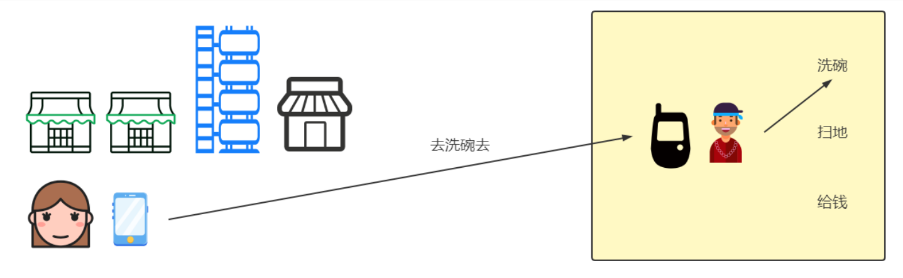
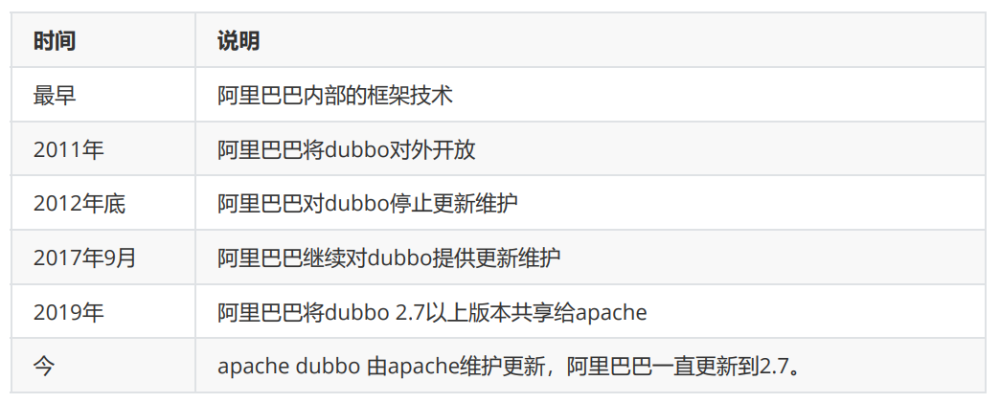

# 创建csmall-cart子项目

## 创建项目

创建csmall-cart子项目

父子相认

子项目pom文件为:

```xml
<?xml version="1.0" encoding="UTF-8"?>
<project xmlns="http://maven.apache.org/POM/4.0.0" xmlns:xsi="http://www.w3.org/2001/XMLSchema-instance"
         xsi:schemaLocation="http://maven.apache.org/POM/4.0.0 https://maven.apache.org/xsd/maven-4.0.0.xsd">
    <modelVersion>4.0.0</modelVersion>
    <parent>
        <groupId>cn.tedu</groupId>
        <artifactId>csmall</artifactId>
        <version>0.0.1-SNAPSHOT</version>
        <relativePath/> <!-- lookup parent from repository -->
    </parent>
    <groupId>cn.tedu</groupId>
    <artifactId>csmall-cart</artifactId>
    <version>0.0.1-SNAPSHOT</version>
    <name>csmall-cart</name>
    <description>Demo project for Spring Boot</description>
    <dependencies>
        <!--web实例-->
        <dependency>
            <groupId>org.springframework.boot</groupId>
            <artifactId>spring-boot-starter-web</artifactId>
        </dependency>
        <!--mybatis整合springboot-->
        <dependency>
            <groupId>org.mybatis.spring.boot</groupId>
            <artifactId>mybatis-spring-boot-starter</artifactId>
        </dependency>
        <!--alibaba 数据源德鲁伊-->
        <dependency>
            <groupId>com.alibaba</groupId>
            <artifactId>druid</artifactId>
        </dependency>
        <!--mysql驱动-->
        <dependency>
            <groupId>mysql</groupId>
            <artifactId>mysql-connector-java</artifactId>
        </dependency>
        <!--all-common依赖-->
        <dependency>
            <groupId>cn.tedu</groupId>
            <artifactId>csmall-commons</artifactId>
            <version>0.0.1-SNAPSHOT</version>
        </dependency>
        <!--在线api文档-->
        <dependency>
            <groupId>com.github.xiaoymin</groupId>
            <artifactId>knife4j-spring-boot-starter</artifactId>
        </dependency>
        <!--  Nacos注册依赖 -->
        <dependency>
            <groupId>com.alibaba.cloud</groupId>
            <artifactId>spring-cloud-starter-alibaba-nacos-discovery</artifactId>
        </dependency>
    </dependencies>

</project>
```

删除test文件夹

删除application.properties配置文件

创建application.yml文件,内容如下

```yml
server:
  port: 20001
#公共配置
mybatis:
  configuration:
    cache-enabled: false
    map-underscore-to-camel-case: true
    log-impl: org.apache.ibatis.logging.stdout.StdOutImpl
knife4j:
  # 开启增强配置
  enable: true
  # 生产环境屏蔽，开启将禁止访问在线API文档
  production: false
  # Basic认证功能，即是否需要通过用户名、密码验证后才可以访问在线API文档
  basic:
    # 是否开启Basic认证
    enable: false
    # 用户名，如果开启Basic认证却未配置用户名与密码，默认是：admin/123321
    username: root
    # 密码
    password: root
spring:
  profiles:
    active: dev
```

## 准备数据

我们cart模块需要连接数据库操作,

所以我们要创建需要的表和添加表中的数据

sql代码已经发送在csmall-finish项目的node文件夹中:csmall_db.sql

运行其中的sql代码即可

推荐大家学习使用数据库的专用可视化工具来操作数据库

heidiSQL(安装MariaDB自带的)免费的

SqlYog Navicat是收费的

```sql
CREATE DATABASE  IF NOT EXISTS `csmall_db` DEFAULT CHARACTER SET utf8mb4;
USE `csmall_db`;

DROP TABLE IF EXISTS `cart_tbl`;

CREATE TABLE `cart_tbl` (
                            `id` int NOT NULL AUTO_INCREMENT COMMENT '购物车id',
                            `commodity_code` varchar(255) DEFAULT NULL COMMENT '商品编码',
                            `price` int DEFAULT '0' COMMENT '商品单价',
                            `count` int DEFAULT '0' COMMENT '购买数量',
                            `user_id` varchar(255) DEFAULT NULL COMMENT '用户id',
                            PRIMARY KEY (`id`),
                            UNIQUE KEY `commodity_code` (`commodity_code`)
) ENGINE=InnoDB AUTO_INCREMENT=3 DEFAULT CHARSET=utf8mb3;


insert  into `cart_tbl`(`id`,`commodity_code`,`price`,`count`,`user_id`) values
(1,'PU201',500,10,'UU100');


DROP TABLE IF EXISTS `order_tbl`;

CREATE TABLE `order_tbl` (
                             `id` int NOT NULL AUTO_INCREMENT COMMENT '订单id',
                             `user_id` varchar(255) DEFAULT NULL COMMENT '用户id',
                             `commodity_code` varchar(255) DEFAULT NULL COMMENT '商品编码,也可以是商品id',
                             `count` int DEFAULT '0' COMMENT '购买这个商品的数量',
                             `money` int DEFAULT '0' COMMENT '订单金额',
                             PRIMARY KEY (`id`)
) ENGINE=InnoDB AUTO_INCREMENT=27 DEFAULT CHARSET=utf8mb3;

insert  into `order_tbl`(`id`,`user_id`,`commodity_code`,`count`,`money`) values
(22,'UU100','PU201',10,200),
(23,'UU100','PU201',10,200),
(24,'UU100','PU201',10,200),
(25,'UU100','PU201',10,200);


DROP TABLE IF EXISTS `stock_tbl`;

CREATE TABLE `stock_tbl` (
                             `id` int NOT NULL AUTO_INCREMENT COMMENT '商品id',
                             `commodity_code` varchar(255) DEFAULT NULL COMMENT '商品编码',
                             `count` int DEFAULT '0' COMMENT '商品库存',
                             PRIMARY KEY (`id`),
                             UNIQUE KEY `commodity_code` (`commodity_code`)
) ENGINE=InnoDB AUTO_INCREMENT=3 DEFAULT CHARSET=utf8mb3;

insert  into `stock_tbl`(`id`,`commodity_code`,`count`) values
(1,'PU201',990);

DROP TABLE IF EXISTS `undo_log`;

CREATE TABLE `undo_log` (
                            `id` bigint NOT NULL AUTO_INCREMENT,
                            `branch_id` bigint NOT NULL,
                            `xid` varchar(100) NOT NULL,
                            `context` varchar(128) NOT NULL,
                            `rollback_info` longblob NOT NULL,
                            `log_status` int NOT NULL,
                            `log_created` datetime NOT NULL,
                            `log_modified` datetime NOT NULL,
                            PRIMARY KEY (`id`),
                            UNIQUE KEY `ux_undo_log` (`xid`,`branch_id`)
) ENGINE=InnoDB AUTO_INCREMENT=68 DEFAULT CHARSET=utf8mb3;

```

## 配置yml文件

我们要配置数据源,项目名称和nacos的位置

创建application-dev.yml

```yml
spring:
  application:
    name: nacos-cart # 定义当前服务名称
  cloud:
    nacos:
      discovery:
        server-addr: localhost:8848 # 指定正在运行的Nacos服务器的位置
  datasource:
    url: jdbc:mysql://localhost:3306/csmall_db?useSSL=false&useUnicode=true&characterEncoding=utf-8&serverTimezone=Asia/Shanghai&allowMultiQueries=true
    username: root
    password: root
```

## Spring相关配置类

和business项目一样

我们需要创建config包,包中创建相关配置类

```java
@Configuration // 所有配置Spring的配置类必须添加这个注解
@ComponentScan(basePackages = "cn.tedu.csmall.commons.exception")
public class CommonsConfiguration {
}
```

knife4j配置

```java
@Configuration
@EnableSwagger2WebMvc
public class Knife4jConfiguration {

    /**
     * 【重要】指定Controller包路径
     */
    private String basePackage = "cn.tedu.csmall.cart.controller";
    /**
     * 分组名称
     */
    private String groupName = "base-cart";
    /**
     * 主机名
     */
    private String host = "http://java.tedu.cn";
    /**
     * 标题
     */
    private String title = "酷鲨商城项目案例在线API文档--基础cart-web实例";
    /**
     * 简介
     */
    private String description = "构建基础cart-web项目,实现购物车管理";
 	//  略....   
}
```

当前cart模块除了上述配置之外,还需要添加Mybatis扫描mapper包的配置

config包中再创建一个MyBatisConfiguration类,代码如下

```java
@Configuration
// Mybatis框架要求扫描指定的包,才能使框架生效
@MapperScan("cn.tedu.csmall.cart.mapper")
public class MyBatisConfiguration {
}
```

我们尝试启动Nacos后

启动cart模块

观察nacos服务列表中是否包含当前服务名称

# 编写cart项目业务

cart模块能够正常启动,但是还没有任何业务

结合我们最终生成订单的业务

当前cart模块需要开发如下两个功能

1.新增购物车中商品

2.删除购物车中商品

## 开发持久层

创建mapper包

创建CartMapper接口,中编写两个方法

一个新增购物车,一个删除购物车

```java
@Repository
public interface CartMapper {

    // 新增购物车商品的方法
    @Insert("insert into cart_tbl(commodity_code,price,count,user_id)" +
            " values(#{commodityCode},#{price},#{count},#{userId})")
    int insertCart(Cart cart);

    // 删除购物车
    @Delete("delete from cart_tbl where user_id=#{userId} and " +
            " commodity_code=#{commodityCode}")
    int deleteCartByUserIdAndCommodityCode(
                                @Param("userId") String userId,
                                @Param("commodityCode") String commodityCode);
}
```

## 开发业务逻辑层

创建service包

包中创建ICartService

接口中编写新增和删除购物车的两个业务逻辑层方法声明

```java
public interface ICartService {

    // 新增购物车商品的业务逻辑层方法
    void cartAdd(CartAddDTO cartAddDTO);

    // 删除购物车中商品的业务逻辑层方法
    void deleteUserCart(String userId,String commodityCode);


}
```

创建impl包创建CartServiceImpl类

编写业务实现类

```java
@Service
@Slf4j
public class CartServiceImpl implements ICartService {
    // 装配CartMapper对象
    @Autowired
    private CartMapper cartMapper;

    @Override
    public void cartAdd(CartAddDTO cartAddDTO) {
        // 方法参数CartAddDTO,但是要执行mapper中给定的新增方法需要实体类Cart
        // 所以我们要将cartAddDTO对象中的属性值赋值为Cart实体类对象
        // 先实例化一个Cart实体类对象
        Cart cart=new Cart();
        // 使用BeanUtils类中给定的方法,将同名属性赋值
        BeanUtils.copyProperties(cartAddDTO,cart);
        // cart被赋值之后,就具备了调用mapper实现新增的条件了
        cartMapper.insertCart(cart);
        // 运行完成,输出日志信息
        log.info("新增购物车商品完成!:{}",cart);
    }

    @Override
    public void deleteUserCart(String userId, String commodityCode) {
        // 删除方法的参数是直接可以使用的,无需转换
        cartMapper.deleteCartByUserIdAndCommodityCode(userId,commodityCode);
        // 日志输出信息
        log.info("购物车删除完成");
    }
}
```

> 如果需要设置日志输出级别
>
> dev的yml文件中添加
>
> ```
> logging:
>   level:
>     cn.tedu.csmall.cart: debug
> ```

## 开发控制层

创建controller包

包中创建CartController类

代码如下

```java
@RestController
@RequestMapping("/base/cart")
@Api(tags = "购物车管理模块")
public class CartController {
    // 控制层中装配业务逻辑层对象
    @Autowired
    private ICartService cartService;

    @PostMapping("/add")
    @ApiOperation("新增购物车中商品")
    public JsonResult cartAdd(CartAddDTO cartAddDTO){
        cartService.cartAdd(cartAddDTO);
        return JsonResult.ok("新增购物车商品完成!");
    }

    @PostMapping("/delete")
    @ApiOperation("删除购物车中商品")
    @ApiImplicitParams({
      @ApiImplicitParam(value = "用户ID",name="userId",example = "UU100"),
      @ApiImplicitParam(value = "商品编号",name="commodityCode",example = "PC100")
    })
    public JsonResult deleteUserCart(String userId,String commodityCode){
        cartService.deleteUserCart(userId,commodityCode);
        return JsonResult.ok("删除购物车完成!");
    }

}
```

重启cart模块

测试   

localhost:20001/doc.html

发送新增购物车的请求测试

然后测试删除购物车的功能

## 创建Order模块

## 创建项目

父子相认

order模块pom文件直接参考cart模块即可

```xml
<?xml version="1.0" encoding="UTF-8"?>
<project xmlns="http://maven.apache.org/POM/4.0.0" xmlns:xsi="http://www.w3.org/2001/XMLSchema-instance"
         xsi:schemaLocation="http://maven.apache.org/POM/4.0.0 https://maven.apache.org/xsd/maven-4.0.0.xsd">
    <modelVersion>4.0.0</modelVersion>
    <parent>
        <groupId>cn.tedu</groupId>
        <artifactId>csmall</artifactId>
        <version>0.0.1-SNAPSHOT</version>
        <relativePath/> <!-- lookup parent from repository -->
    </parent>
    <groupId>cn.tedu</groupId>
    <artifactId>csmall-order</artifactId>
    <version>0.0.1-SNAPSHOT</version>
    <name>csmall-order</name>
    <description>Demo project for Spring Boot</description>
    <dependencies>
        <!--web实例-->
        <dependency>
            <groupId>org.springframework.boot</groupId>
            <artifactId>spring-boot-starter-web</artifactId>
        </dependency>
        <!--mybatis整合springboot-->
        <dependency>
            <groupId>org.mybatis.spring.boot</groupId>
            <artifactId>mybatis-spring-boot-starter</artifactId>
        </dependency>
        <!--alibaba 数据源德鲁伊-->
        <dependency>
            <groupId>com.alibaba</groupId>
            <artifactId>druid</artifactId>
        </dependency>
        <!--mysql驱动-->
        <dependency>
            <groupId>mysql</groupId>
            <artifactId>mysql-connector-java</artifactId>
        </dependency>
        <!--all-common依赖-->
        <dependency>
            <groupId>cn.tedu</groupId>
            <artifactId>csmall-commons</artifactId>
            <version>0.0.1-SNAPSHOT</version>
        </dependency>
        <!--在线api文档-->
        <dependency>
            <groupId>com.github.xiaoymin</groupId>
            <artifactId>knife4j-spring-boot-starter</artifactId>
        </dependency>
        <!--  Nacos注册依赖 -->
        <dependency>
            <groupId>com.alibaba.cloud</groupId>
            <artifactId>spring-cloud-starter-alibaba-nacos-discovery</artifactId>
        </dependency>
    </dependencies>
</project>
```

删除test文件夹

删除application.properties文件

可以将cart模块的application.yml文件和application-dev.yml复制过来

但是要修改需要变化的属性

application.yml端口号修改

```yaml
server:
  port: 20002
```

application-dev.yml修改项目名称

```yaml
application:
  name: nacos-order
```

## config配置

直接复制cart模块的config包到当前order模块即可

修改内容如下

knife4j配置主要修改:

```java
    /**
     * 【重要】指定Controller包路径
     */
    private String basePackage = "cn.tedu.csmall.order.controller";
    /**
     * 分组名称
     */
    private String groupName = "base-order";
    /**
     * 主机名
     */
    private String host = "http://java.tedu.cn";
    /**
     * 标题
     */
    private String title = "酷鲨商城项目案例在线API文档--基础order-web实例";
    /**
     * 简介
     */
    private String description = "构建基础order-web项目,实现订单管理";
```

Mybatis配置修改如下

```java
@Configuration
// Mybatis框架扫描mapper包接口的注解
@MapperScan("cn.tedu.csmall.order.mapper")
public class MybatisConfiguration {
}
```

## 编写新增订单功能

### 开发持久层

创建mapper包

创建OrderMapper接口

添加新增订单方法

```java
@Repository
public interface OrderMapper {

    // 新增订单的方法
    @Insert("insert into order_tbl(user_id,commodity_code,count,money) " +
            " values(#{userId},#{commodityCode},#{count},#{money})")
    int insertOrder(Order order);

}
```

### 开发业务逻辑层

创建service包

包中创建IOrderService

```java
public interface IOrderService {

    // 声明新增订单的业务逻辑层方法
    void orderAdd(OrderAddDTO orderAddDTO);
}
```

创建service.impl包

包中创建OrderServiceImpl

```java
@Service
@Slf4j
public class OrderServiceImpl implements IOrderService {
    @Autowired
    private OrderMapper orderMapper;

    @Override
    public void orderAdd(OrderAddDTO orderAddDTO) {
        // 1.减少订单中商品的库存数(要调用stock模块的功能)

        // 2.从购物车中删除用户勾选的商品(要调用cart模块的功能)

        // 3.将orderAddDTO中的信息转换为Order实体类,然后新增到数据库中
        Order order=new Order();
        BeanUtils.copyProperties(orderAddDTO,order);
        // 执行新增
        orderMapper.insertOrder(order);
        log.info("新增订单信息为:{}",order);
    }
}
```

### 开发控制层

创建controller包

创建OrderController类

```java
@RestController
@RequestMapping("/base/order")
@Api(tags = "订单管理模块")
public class OrderController {
    @Autowired
    private IOrderService orderService;

    @PostMapping("/add")
    @ApiOperation("新增订单功能")
    public JsonResult orderAdd(OrderAddDTO orderAddDTO){
        orderService.orderAdd(orderAddDTO);
        return JsonResult.ok("新增订单完成");
    }

}
```

启动order项目

localhost:20002/doc.html

检查nacos注册状态和knife4j测试新增订单效果

**先启动nacos**再启动order

# 创建stock模块

## 项目搭建

创建csmall-stock(之前已经创建好了)

修改父项目pom文件,父子相认(也已经完成)

子项目pom文件也是可以赋值cart\order模块

```xml
<?xml version="1.0" encoding="UTF-8"?>
<project xmlns="http://maven.apache.org/POM/4.0.0" xmlns:xsi="http://www.w3.org/2001/XMLSchema-instance"
         xsi:schemaLocation="http://maven.apache.org/POM/4.0.0 https://maven.apache.org/xsd/maven-4.0.0.xsd">
    <modelVersion>4.0.0</modelVersion>
    <parent>
        <groupId>cn.tedu</groupId>
        <artifactId>csmall</artifactId>
        <version>0.0.1-SNAPSHOT</version>
        <relativePath/> <!-- lookup parent from repository -->
    </parent>
    <groupId>cn.tedu</groupId>
    <artifactId>csmall-stock</artifactId>
    <version>0.0.1-SNAPSHOT</version>
    <name>csmall-stock</name>
    <description>Demo project for Spring Boot</description>
    <dependencies>
        <!--web实例-->
        <dependency>
            <groupId>org.springframework.boot</groupId>
            <artifactId>spring-boot-starter-web</artifactId>
        </dependency>
        <!--mybatis整合springboot-->
        <dependency>
            <groupId>org.mybatis.spring.boot</groupId>
            <artifactId>mybatis-spring-boot-starter</artifactId>
        </dependency>
        <!--alibaba 数据源德鲁伊-->
        <dependency>
            <groupId>com.alibaba</groupId>
            <artifactId>druid</artifactId>
        </dependency>
        <!--mysql驱动-->
        <dependency>
            <groupId>mysql</groupId>
            <artifactId>mysql-connector-java</artifactId>
        </dependency>
        <!--all-common依赖-->
        <dependency>
            <groupId>cn.tedu</groupId>
            <artifactId>csmall-commons</artifactId>
            <version>0.0.1-SNAPSHOT</version>
        </dependency>
        <!--在线api文档-->
        <dependency>
            <groupId>com.github.xiaoymin</groupId>
            <artifactId>knife4j-spring-boot-starter</artifactId>
        </dependency>
        <!--  Nacos注册依赖 -->
        <dependency>
            <groupId>com.alibaba.cloud</groupId>
            <artifactId>spring-cloud-starter-alibaba-nacos-discovery</artifactId>
        </dependency>
    </dependencies>
</project>
```

删除test测试文件夹

删除application.properties文件

复制order\cart模块的application.yml和application-dev.yml文件

修改端口号和项目名称

## config配置

从order\cart模块复制config包

修改MybatisConfiguration\Knife4jConfiguration对应的包名

## 编写减少库存功能

### 开发持久层

首先确定修改库存业务的sql语句:

```sql
UPDATE
	stock_tbl
SET
	COUNT=COUNT-2
WHERE
	commodity_code='PC100'
AND
	COUNT>=2
```

上面的sql语句能够保证在库存足够时才会减少库存,库存不够时就不运行修改了

创建mapper包,包中创建StockMapper接口

```java
@Repository
public interface StockMapper {

    // 修改(减少)指定商品编号的库存数的方法
    @Update("update stock_tbl set count=count-#{reduceCount} " +
            " where commodity_code=#{commodityCode} and count>=#{reduceCount}")
    int updateStockCount(@Param("commodityCode") String commodityCode,
                         @Param("reduceCount") Integer reduceCount);
}
```

### 开发业务层

在service包下创建IStockService

```java
public interface IStockService {
    
    // 减少库存的业务逻辑层
    void reduceCommodityCount(StockReduceCountDTO stockReduceCountDTO);
}
```

service.impl包下创建StockServiceImpl

```java
@Service
@Slf4j
public class StockServiceImpl implements IStockService {
    @Autowired
    private StockMapper stockMapper;
    @Override
    public void reduceCommodityCount(StockReduceCountDTO stockReduceCountDTO) {
        // 调用减少库存的业务逻辑层方法
        //  updateStockCount([商品编号],[减少的库存数])
        int row=stockMapper.updateStockCount(
                stockReduceCountDTO.getCommodityCode(),
                stockReduceCountDTO.getReduceCount());
        // 可以判断row是否为0\1输出库存修改成功或失败的信息
        log.info("库存减少完成");
    }
}
```

### 开发控制层

controller包

StockController类

```java
@RestController
@RequestMapping("/base/stock")
@Api(tags = "库存管理模块")
public class StockController {

    @Autowired
    private IStockService stockService;

    @PostMapping("/reduce/count")
    @ApiOperation("减少商品库存数")
    public JsonResult reduceCommodityCount(
                        StockReduceCountDTO stockReduceCountDTO){
        // 调用业务逻辑层
        stockService.reduceCommodityCount(stockReduceCountDTO);
        return JsonResult.ok("库存减少完成!");
    }
    
}
```

启动服务测试成功即可

localhost:20003/doc.html

# Dubbo概述

## 什么是RPC

RPC是Remote Procedure Call的缩写 翻译为:远程过程调用

目标是为了实现两台(多台)计算机\服务器,相互调用方法\通信的解决方案

RPC只是实现远程调用的一套标准

该标准主要规定了两部分内容

1.通信协议

2.序列化协议

为了方便大家理解RPC,下面的图片帮助理解


上面图是老婆和老公在家的时,老婆让老公洗碗的调用流程

这个流程可以理解为项目内的功能的调用,类似面向对象编程实例化对象,调用方法的过程

但是这个调用关系如果是远程的,意思是老婆和老公现在是两个不同的项目



我们看到上图中,远程调用必须借助一个通信设备,图片中是手机

**通信协议**

通信协议指的就是远程调用的通信方式

实际上这个通知的方式可以有多种

例如:写信,飞鸽传书,发电报

在程序中,通信方法实际上也是有多种的,每种通信方式会有不同的优缺点

**序列化协议**

序列化协议指通信内容的格式,双方都要理解这个格式

上面的图片中,老婆给老公发信息,一定是双方都能理解的信息

发送信息是序列化过程,接收信息需要反序列化

程序中,序列化的方式也是多种的,每种序列化方式也会有不同的优缺点

## 什么是Dubbo

上面对RPC有基本认识之后,再学习Dubbo就简单了

Dubbo是一套RPC框架。既然是框架，我们可以在框架结构高度，定义Dubbo中使用的通信协议，使用的序列化框架技术，而数据格式由Dubbo定义，我们负责配置之后直接通过客户端调用服务端代码。

可以说Dubbo就是RPC概念的实现

Dubbo是SpringCloudAlibaba提供的框架

能够实现微服务相互调用的功能!

## Dubbo的发展历程



> Dubbo历程

在dubbo2012年底停止更新后

国内很多公司在Dubbo的基础上进行修改,继续更新

比较知名的修改版本就是当当网的DubboX

2012年底dubbo停止更新后到2017年dubbo继续更新之前

2015SpringCloud开始兴起,当时没有阿里的框架

国内公司要从SpringCloud和Dubbo中抉择使用哪个微服务方案

**我们学习的Dubbo指的都是2.7之后的版本**

是能够和SpringCloudAlibaba配合使用的

## Dubbo对协议的支持

RPC框架分通信协议和序列化协议

Dubbo框架支持多种通信协议和序列化协议,可以通过配置文件进行修改

Dubbo支持的通信协议

* dubbo协议(默认)
* rmi协议
* hessian协议
* http协议
* webservice
* .....

支持的序列化协议

* hessian2(默认)
* java序列化
* compactedjava
* nativejava
* fastjson
* dubbo
* fst
* kryo

Dubbo默认情况下,支持的协议有如下特征

* 采用NIO单一长链接
* 优秀的并发性能,但是处理大型文件的能力差

Dubbo方便支持高并发和高性能

## Dubbo服务的注册与发现

在Dubbo的调用过程中,必须包含注册中心的支持

项目调用服务的模块必须在同一个注册中心中

注册中心推荐阿里自己的Nacos,兼容性好,能够发挥最大性能

但是Dubbo也支持其它软件作为注册中心(例如Redis,zookeeper等)

服务发现，即消费端自动发现服务地址列表的能力，是微服务框架需要具备的关键能力，借助于自动化的服务发现，微服务之间可以在无需感知对端部署位置与 IP 地址的情况下实现通信。

上面RPC的示例中,老婆就是服务的消费端,她能发现老公具备的服务

如果老婆调用了老公的服务,就是完成了Dubbo调用


consumer服务的消费者,指服务的调用者(使用者)也就是老婆的位置

provider服务的提供者,指服务的拥有者(生产者)也就是老公的位置

在Dubbo中,远程调用依据是服务的提供者在Nacos中注册的服务名称

一个服务名称,可能有多个运行的实例,任何一个空闲的实例都可以提供服务

> 常见面试题:Dubbo的注册发现流程

1.首先服务的提供者启动服务时,将自己的具备的服务注册到注册中心,其中包括当前提供者的ip地址和端口号等信息,Dubbo会同时注册该项目提供的远程调用的方法

2.消费者(使用者)启动项目,也注册到注册中心,同时从注册中心中获得当前项目具备的所有服务列表

3.当注册中心中有新的服务出现时,(在心跳时)会通知已经订阅发现的消费者,消费者会更新所有服务列表

4.RPC调用,消费者需要调用远程方法时,根据注册中心服务列表的信息,只需服务名称,不需要ip地址和端口号等信息,就可以利用Dubbo调用远程方法了

我们当前csmall项目的远程调用关系如下


# 负载均衡

## 什么是负载均衡

在实际项目中,一个服务基本都是集群模式的,也就是多个功能相同的项目在运行,这样才能承受更高的并发

这时一个请求到这个服务,就需要确定访问哪一个服务器


Dubbo框架内部支持负载均衡算法,能够尽可能的让请求在相对空闲的服务器上运行

在不同的项目中,可能选用不同的负载均衡策略,以达到最好效果

Loadbalance:就是负载均衡的意思

## Dubbo内置负载均衡策略算法

- **random loadbalance:随机分配策略(默认)**
- round Robin Loadbalance:权重平均分配
- leastactive Loadbalance:活跃度自动感知分配
- consistanthash Loadbalance:一致性hash算法分配

实际运行过程中,每个服务器性能不同

在负载均衡时,都会有性能权重,这些策略算法都考虑权重问题

### 随机分配策略

假设我们当前3台服务器,经过测试它们的性能权重比值为5:3:1

下面可以生成一个权重模型

5:3:1


随机生成随机数

在哪个范围内让哪个服务器运行

优点:

算法简单,效率高,长时间运行下,任务分配比例准确

缺点:

偶然性高,如果连续的几个随机请求发送到性能弱的服务器,会导致异常甚至宕机


