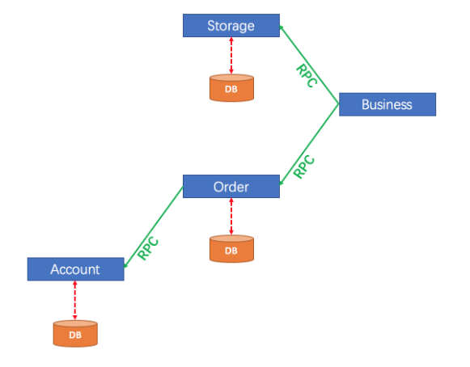
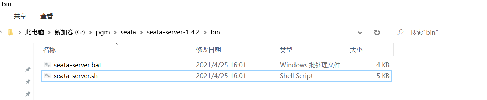

# 负载均衡

## 什么是负载均衡

在实际项目中,一个服务基本都是集群模式的,也就是多个功能相同的项目在运行,这样才能承受更高的并发

这时一个请求到这个服务,就需要确定访问哪一个服务器


Dubbo框架内部支持负载均衡算法,能够尽可能的让请求在相对空闲的服务器上运行

在不同的项目中,可能选用不同的负载均衡策略,以达到最好效果

Loadbalance:就是负载均衡的意思

## Dubbo内置负载均衡策略算法

- **random loadbalance:随机分配策略(默认)**
- round Robin Loadbalance:权重平均分配
- leastactive Loadbalance:活跃度自动感知分配
- consistanthash Loadbalance:一致性hash算法分配

实际运行过程中,每个服务器性能不同

在负载均衡时,都会有性能权重,这些策略算法都考虑权重问题

### 随机分配策略

假设我们当前3台服务器,经过测试它们的性能权重比值为5:3:1

下面可以生成一个权重模型

5:3:1


随机生成随机数

在哪个范围内让哪个服务器运行

优点:

算法简单,效率高,长时间运行下,任务分配比例准确

缺点:

偶然性高,如果连续的几个随机请求发送到性能弱的服务器,会导致异常甚至宕机

### 权重平滑分配

如果几个服务器权重一致,那么就是依次运行

但是服务器的性能权重一致的可能性很小

所以我们需要权重平滑分配

一个优秀的权重分配算法,应该是让每个服务器都有机会运行的

如果一个集群服务器性能比为5:3:1服务为A,B,C

1>A   2>A   3>A   4>A   5>A

6>B   7>B   8>B

9>C

上面的安排中,连续请求一个服务器肯定是不好的,我们希望所有的服务器都能够穿插在一起运行

Dubbo2.7之后更新了这个算法使用"**平滑加权算法**"优化权重平均分配策略


优点:

能够尽可能的在权重要求的情况下,实现请求的穿插运行(交替运行),不会发生随机策略中的偶发情况

缺点

服务器较多时,可能需要减权和复权的计算,需要消耗系统资源

### 活跃度自动感知

记录每个服务器处理一次请求的时间

按照时间比例来分配任务数,运行一次需要时间多的分配的请求数较少

### 一致性Hash算法

根据请求的参数进行hash运算

以后每次相同参数的请求都会访问固定服务器

因为根据参数选择服务器,不能平均分配到每台服务器上

使用的也不多

# Dubbo实现微服务调用

## 确定调用结构


* order模块调用stock模块的减少库存的功能
* order模块调用cart模块的删除购物车的功能
* business模块调用order新增订单的功能

要想实现Dubbo调用

必须按照Dubbo规定的配置和行业标准的结构来实现

Dubbo调用的好处是直接将要消费的目标（例如order模块中消费stock的方法）编写在当前消费者的业务逻辑层中，无需编写新的代码结构，开发流程不会因为Dubbo而变化

## 修改stock模块

### 创建csmall-stock-service项目

因为当前stock模块减少库存数业务是典型的生产者方法,需要被别的模块调用

那么其它模块就必须添加当前库存数减少的业务接口支持

为了减少添加这个给当前项目带来的负担

业界通用做法,是将生产者项目拆分为两个,

其中一个项目只有业务逻辑层接口

另一个项目包含正常的配置和所有业务代码

当消费者需要时只需要添加包含业务逻辑层接口的项目的依赖即可

创建csmall-stock-service项目

删除test\删除resources\删除SpringBoot启动类

csmall-stock升格为父项目，所以也要修改它的pom文件

```xml
<description>Demo project for Spring Boot</description>
<packaging>pom</packaging>
<modules>
    <module>csmall-stock-service</module>
</modules>
```

csmall-stock-service项目的pom文件添加最低要求的依赖

```xml
<?xml version="1.0" encoding="UTF-8"?>
<project xmlns="http://maven.apache.org/POM/4.0.0" xmlns:xsi="http://www.w3.org/2001/XMLSchema-instance"
         xsi:schemaLocation="http://maven.apache.org/POM/4.0.0 https://maven.apache.org/xsd/maven-4.0.0.xsd">
    <modelVersion>4.0.0</modelVersion>
    <parent>
        <groupId>cn.tedu</groupId>
        <artifactId>csmall-stock</artifactId>
        <version>0.0.1-SNAPSHOT</version>
        <relativePath/> <!-- lookup parent from repository -->
    </parent>
    <groupId>cn.tedu</groupId>
    <artifactId>csmall-stock-service</artifactId>
    <version>0.0.1-SNAPSHOT</version>
    <name>csmall-stock-service</name>
    <description>Demo project for Spring Boot</description>
    <dependencies>
        <dependency>
            <groupId>cn.tedu</groupId>
            <artifactId>csmall-commons</artifactId>
            <version>0.0.1-SNAPSHOT</version>
        </dependency>
    </dependencies>

</project>
```

然后将原有的业务逻辑层接口IStockService复制到这个项目中即可

```java
public interface IStockService {

    // 减少库存的业务逻辑层方法
    void reduceCommodityCount(StockReduceCountDTO stockReduceCountDTO);
}
```

### 创建csmall-stock-webapi项目

webapi项目包含stock项目原有的所有配置和业务代码

创建好项目之后删除test文件夹、删除application.properties文件

然后父子相认

最终csmall-stock项目的pom文件为

```xml
<?xml version="1.0" encoding="UTF-8"?>
<project xmlns="http://maven.apache.org/POM/4.0.0" xmlns:xsi="http://www.w3.org/2001/XMLSchema-instance"
         xsi:schemaLocation="http://maven.apache.org/POM/4.0.0 https://maven.apache.org/xsd/maven-4.0.0.xsd">
    <modelVersion>4.0.0</modelVersion>
    <parent>
        <groupId>cn.tedu</groupId>
        <artifactId>csmall</artifactId>
        <version>0.0.1-SNAPSHOT</version>
        <relativePath/> <!-- lookup parent from repository -->
    </parent>
    <groupId>cn.tedu</groupId>
    <artifactId>csmall-stock</artifactId>
    <version>0.0.1-SNAPSHOT</version>
    <name>csmall-stock</name>
    <description>Demo project for Spring Boot</description>
    <packaging>pom</packaging>
    <modules>
        <module>csmall-stock-service</module>
        <module>csmall-stock-webapi</module>
    </modules>
</project>
```

csmall-stock-webapi项目的pom文件为

```xml
<?xml version="1.0" encoding="UTF-8"?>
<project xmlns="http://maven.apache.org/POM/4.0.0" xmlns:xsi="http://www.w3.org/2001/XMLSchema-instance"
         xsi:schemaLocation="http://maven.apache.org/POM/4.0.0 https://maven.apache.org/xsd/maven-4.0.0.xsd">
    <modelVersion>4.0.0</modelVersion>
    <parent>
        <groupId>cn.tedu</groupId>
        <artifactId>csmall-stock</artifactId>
        <version>0.0.1-SNAPSHOT</version>
        <relativePath/> <!-- lookup parent from repository -->
    </parent>
    <groupId>cn.tedu</groupId>
    <artifactId>csmall-stock-webapi</artifactId>
    <version>0.0.1-SNAPSHOT</version>
    <name>csmall-stock-webapi</name>
    <description>Demo project for Spring Boot</description>
    <dependencies>
        <!--web实例-->
        <dependency>
            <groupId>org.springframework.boot</groupId>
            <artifactId>spring-boot-starter-web</artifactId>
        </dependency>
        <!--mybatis整合springboot-->
        <dependency>
            <groupId>org.mybatis.spring.boot</groupId>
            <artifactId>mybatis-spring-boot-starter</artifactId>
        </dependency>
        <!--alibaba 数据源德鲁伊-->
        <dependency>
            <groupId>com.alibaba</groupId>
            <artifactId>druid</artifactId>
        </dependency>
        <!--mysql驱动-->
        <dependency>
            <groupId>mysql</groupId>
            <artifactId>mysql-connector-java</artifactId>
        </dependency>
        <!--all-common依赖-->
        <dependency>
            <groupId>cn.tedu</groupId>
            <artifactId>csmall-commons</artifactId>
            <version>0.0.1-SNAPSHOT</version>
        </dependency>
        <!--在线api文档-->
        <dependency>
            <groupId>com.github.xiaoymin</groupId>
            <artifactId>knife4j-spring-boot-starter</artifactId>
        </dependency>
        <!--  Nacos注册依赖 -->
        <dependency>
            <groupId>com.alibaba.cloud</groupId>
            <artifactId>spring-cloud-starter-alibaba-nacos-discovery</artifactId>
        </dependency>
        <!--   Dubbo 在SpringCloud中使用的依赖   -->
        <dependency>
            <groupId>com.alibaba.cloud</groupId>
            <artifactId>spring-cloud-starter-dubbo</artifactId>
        </dependency>
        <!--  当前项目为了能够在业务逻辑层中正常实现业务逻辑层接口
          需要添加业务逻辑层接口所在的csmall-stock-service项目的依赖
          -->
        <dependency>
            <groupId>cn.tedu</groupId>
            <artifactId>csmall-stock-service</artifactId>
            <version>0.0.1-SNAPSHOT</version>
        </dependency>
    </dependencies>
</project>
```

**上面的pom文件不只是将原有的stock的pom文件依赖复制,而且添加了Dubbo和业务逻辑层接口的依赖**

将csmall-stock项目的application.yml和application-dev.yml复制到csmall-stock-webapi项目的resources文件夹下

yml文件其它的不动,但是在dev.yml文件中要添加dubbo的配置信息

```yaml
spring:
  application:
    name: nacos-stock # 定义当前服务名称
  cloud:
    nacos:
      discovery:
        server-addr: localhost:8848 # 指定正在运行的Nacos服务器的位置
  datasource:
    url: jdbc:mysql://localhost:3306/csmall_db?useSSL=false&useUnicode=true&characterEncoding=utf-8&serverTimezone=Asia/Shanghai&allowMultiQueries=true
    username: root
    password: root
dubbo:
  protocol:
    # port设置为-1 表示当前dubbo框架使用的端口自动寻找
    # 使用端口的规则是从20880开始寻找可用端口,如果当前端口号占用,就继续加1来使用,直到找到可用的为止
    port: -1
    # 设置连接的名称,一般固定为dubbo即可
    name: dubbo
  registry:
    # 指定当前Dubbo服务注册中心的类型和位置
    address: nacos://localhost:8848
  consumer:
    # 当前项目启动时,是否检查当前项目需要的所有Dubbo服务是否可用
    # 我们设置它为false,表示不检查,以减少启动时出错的情况
    check: false
```

开始复制代码

我们先将csmall-stock模块中config\controller\mapper\service直接复制

粘贴到webapi项目cn.tedu.csmall.stock.webapi包下

删除IStockService接口

业务逻辑层实现类需要重新导入Mapper的包来实现正确编译

修改config包中

Knife4jConfiguration:

```java
/**
 * 【重要】指定Controller包路径
 */
private String basePackage = "cn.tedu.csmall.stock.webapi.controller";
```

MyBatisConfiguration

```java
@Configuration
// MyBatis框架扫描mapper接口包的注解
@MapperScan("cn.tedu.csmall.stock.webapi.mapper")
public class MyBatisConfiguration {
}
```

然后就可以删除原csmall-stock模块的src文件夹了

下面就可以配置实现Dubbo方法提供的步骤了

**将业务逻辑层实现类方法声明为Dubbo可调用的方法**

当前stock模块是单纯的生产者

StockServiceImpl修改代码

```java
// @DubboService注解,标记的业务逻辑层实现类,其中所有的方法都会注册到Nacos
// 在其他服务启动并"订阅"后,就会"发现"当前类中的所有服务,随时可以调用
@DubboService
@Service
@Slf4j
public class StockServiceImpl implements IStockService {
    // ....  内容略
}
```

如果当前项目是服务的提供者(生产者)

还需要在SpringBoot启动类上添加@EnableDubbo的注解,才能真正让Dubbo功能生效

```java
@SpringBootApplication
// 如果当前项目是Dubbo中的生产者,必须添加@EnableDubbo注解
// 添加之后,在服务启动时,当前项目的所有服务才能正确注册到Nacos中
@EnableDubbo
public class CsmallStockWebapiApplication {

    public static void main(String[] args) {
        SpringApplication.run(CsmallStockWebapiApplication.class, args);
    }

}
```

先启动nacos在启动

再启动stockWebapi项目

作业:

按上面stock模块的操作

改写cart模块的结构,以实现Dubbo生产者功能

## 修改cart模块

操作步骤和stock完全一致,参考stock模块即可

## 修改order模块支持Dubbo

因为order模块在Dubbo的调用关系中

既是生产者又是消费者

它消费cart和stock的服务

同时又为business模块提供服务

重构的过程和stock\cart有很多相似,但是也要注意不同

### 创建csmall-order-service项目

这个项目创建的过程和stock\cart模块service项目的步骤和注意事项完全一致

### 创建csmall-order-webapi项目

创建项目后父子相认正常

子项目的pom文件依赖需要额外添加下面内容

```xml
<dependency>
    <groupId>com.alibaba.cloud</groupId>
    <artifactId>spring-cloud-starter-dubbo</artifactId>
</dependency>
<dependency>
    <groupId>cn.tedu</groupId>
    <artifactId>csmall-order-service</artifactId>
    <version>0.0.1-SNAPSHOT</version>
</dependency>
<!--   Dubbo调用过程中,消费者一份添加依赖的特征:
    添加要消费的模块的业务逻辑层接口项目的依赖
   -->
<dependency>
    <groupId>cn.tedu</groupId>
    <artifactId>csmall-stock-service</artifactId>
    <version>0.0.1-SNAPSHOT</version>
</dependency>
<dependency>
    <groupId>cn.tedu</groupId>
    <artifactId>csmall-cart-service</artifactId>
    <version>0.0.1-SNAPSHOT</version>
</dependency>
```

yml文件配置也和cart\stock模块一致

代码也都正常从csmall-order复制到csmall-order-webapi中

删除csmall-order的src目录

config包中的配置,修改为正确包名

在OrderServiceImpl业务逻辑层实现类中

添加生产者的注解,同时利用Dubbo消费stock和cart模块的方法

Reference:引用

```java
// order模块的方法会被business模块调用,所以也是生产者要加@DubboService注解
@DubboService
@Service
@Slf4j
public class OrderServiceImpl implements IOrderService {
    @Autowired
    private OrderMapper orderMapper;

    // 添加@DubboReference注解,表示当前业务逻辑层中需要消费其他模块的服务
    // 声明的接口应该是其他服务提供的业务逻辑层接口
    // 因为Nacos中注册了业务的实现类,所以声明的接口会自动匹配到实现类对象
    // 我们需要两个模块的实现类,stock和cart
    @DubboReference
    private IStockService stockService;
    @DubboReference
    private ICartService cartService;

    @Override
    public void orderAdd(OrderAddDTO orderAddDTO) {
        // 1.减少订单中商品的库存数(要调用stock模块的功能)
        // 先实例化业务逻辑层需要的指定类型DTO才能调用
        StockReduceCountDTO countDTO=new StockReduceCountDTO();
        countDTO.setCommodityCode(orderAddDTO.getCommodityCode());
        countDTO.setReduceCount(orderAddDTO.getCount());
        // dubbo调用stock执行减少库存的方法
        stockService.reduceCommodityCount(countDTO);
        // 2.从购物车中删除用户勾选的商品(要调用cart模块的功能)
        cartService.deleteUserCart(orderAddDTO.getUserId(),
                                    orderAddDTO.getCommodityCode());

        // 3.将orderAddDTO中的信息转换为Order实体类,然后新增到数据库中
        Order order=new Order();
        BeanUtils.copyProperties(orderAddDTO,order);
        // 执行新增
        orderMapper.insertOrder(order);
        log.info("新增订单信息为:{}",order);
    }
}
```

因为order模块也是生产者@EnableDubbo注解仍然要写

```java
@SpringBootApplication
@EnableDubbo
public class CsmallOrderWebapiApplication {

    public static void main(String[] args) {
        SpringApplication.run(CsmallOrderWebapiApplication.class, args);
    }

}
```

我们可以测试这个Dubbo的功能

首先保证Nacos启动

我们项目的启动顺序,尽量保证生产者先启动

启动消费者

stock\cart最后启动order

访问

http://localhost:20002/doc.html运行测试

注意运行前,数据库的数据状态和运行后的比较一下

> 启动服务时,可能发生RpcException或RemotingException异常,如果不影响运行,是可以无视掉的,出现的原因可能是电脑的防火墙\杀毒软件不让Dubbo访问某些网络资源导致的
>
> 也有和无线wifi网卡驱动冲突造成的

Dubbo调用常见错误

```
No provider available from registry localhost:8848 for service cn.tedu.csmall.stock.service.IStockService on consumer 192.168.126.1 use dubbo version 2.7.8, please check status of providers(disabled, not registered or in blacklist).
```

(disabled, not registered or in blacklist)是这个错误信息的特征

发生这个错误原因是消费者无法在指定的位置找到需要的服务

* 检查调用目标的服务是否启动(上面示例中可能是因为stock模块没有启动导致的)
* 检查被调用的目标服务SpringBoot启动类是否编写的@EnableDubbo注解
* 检查被调用的模块的业务逻辑层实现类是否编写了@DubboService注解

## 修改business模块

business模块是我们设计的新增订单业务的触发者,是起点

它是单纯的消费者

我们不需要像生产者一样去创建两个子项目

直接在现有项目上进行修改即可

pom文件直接添加dubbo和order业务逻辑接口的依赖

```xml
<!--   dubbo依赖   -->
<dependency>
    <groupId>com.alibaba.cloud</groupId>
    <artifactId>spring-cloud-starter-dubbo</artifactId>
</dependency>
<!--  business消费order模块的服务,需要添加order模块业务逻辑层接口的依赖-->
<dependency>
    <groupId>cn.tedu</groupId>
    <artifactId>csmall-order-service</artifactId>
    <version>0.0.1-SNAPSHOT</version>
</dependency>
```

application-dev.yml添加Dubbo的配置

```yaml
spring:
  application:
    # 为当前项目起名,这个名字会被Nacos获取并记录,由于之后的微服务调用
    name: nacos-business
  cloud:
    nacos:
      discovery:
        # 配置Nacos的位置,用于提交当前项目的信息
        server-addr: localhost:8848
        # ephemeral设置当前项目启动时注册到nacos的类型 true(默认):临时实例 false:永久实例
        ephemeral: false
dubbo:
  protocol:
    # port设置为-1 表示当前dubbo框架使用的端口自动寻找
    # 使用端口的规则是从20880开始寻找可用端口,如果当前端口号占用,就继续加1来使用,直到找到可用的为止
    port: -1
    # 设置连接的名称,一般固定为dubbo即可
    name: dubbo
  registry:
    # 指定当前Dubbo服务注册中心的类型和位置
    address: nacos://localhost:8848
  consumer:
    # 当前项目启动时,是否检查当前项目需要的所有Dubbo服务是否可用
    # 我们设置它为false,表示不检查,以减少启动时出错的情况
    check: false
```

我们要在当前business模块的业务逻辑层实现类中

实现Dubbo调用order模块的生成订单方法

BusinessServiceImpl类中

```java
@Service
@Slf4j
public class BusinessServiceImpl implements IBusinessService {

    // Dubbo调用order模块的新增订单功能
    // 当前business是单纯的消费者,不需要在类上编写@DubboService
    @DubboReference
    private IOrderService dubboOrderService;


    @Override
    public void buy() {
        // 模拟购买业务
        // 实例化一个用于新增订单的DTO对象
        OrderAddDTO orderAddDTO=new OrderAddDTO();
        // 为属性赋值
        orderAddDTO.setUserId("UU100");
        orderAddDTO.setCommodityCode("PC100");
        orderAddDTO.setCount(3);
        orderAddDTO.setMoney(500);
        // 因为是模拟购买,还没有操作数据库的条件,所以要输出即可
        log.info("新增订单信息为:{}",orderAddDTO);
        // dubbo调用,将上面实例化的订单信息,生成为订单,影响数据库信息
        dubboOrderService.orderAdd(orderAddDTO);
    }
}
```

Springboot启动类不必要写@EnableDubbo因为business是单纯的消费者

启动business项目(前提是cart\stock\order正在运行)

http://localhost:20000/doc.html运行测试

## Dubbo生产者消费者配置小结

Dubbo生产者消费者相同的配置

pom文件添加dubbo依赖,yml文件配置dubbo信息

**生产者**

* 要有service接口项目

* 提供服务的业务逻辑层实现类要添加@DubboService注解
* SpringBoot启动类要添加@EnableDubbo注解

**消费者**

* pom文件添加消费模块的service依赖
* 业务逻辑层远程调用前,模块使用@DubboReference注解获取业务逻辑层实现类对象

# Seata概述

## 下载Seata

https://github.com/seata/seata/releases

https://github.com/seata/seata/releases/download/v1.4.2/seata-server-1.4.2.zip

我们可以直接从第五阶段资料压缩包中获取

## 什么是Seata

Seata 是一款开源的分布式事务解决方案，致力于在微服务架构下提供高性能和简单易用的分布式事务服务

也是Spring Cloud Alibaba提供的组件

Seata官方文档

https://seata.io/zh-cn/

更多信息可以通过官方文档获取

## 为什么需要Seata

我们之前学习了单体项目中的事务

使用的技术叫Spring声明式事务

能够保证一个业务中所有对数据库的操作要么都成功,要么都失败,来保证数据库的数据完整性

但是在微服务的项目中,业务逻辑层涉及远程调用,当前模块发生异常,无法操作远程服务器回滚

这时要想让远程调用也支持事务功能,就需要使用分布式事务组件Seata

Seata保证微服务远程调用业务的原子性

**Seata将为用户提供了 AT、TCC、SAGA 和 XA 事务模式,为用户打造一站式的分布式解决方案。**

## Seata的运行原理

观察下面事务模型



上面结构是比较典型的远程调用结构

如果account操作数据库失败需要让order模块和storage模块撤销(回滚)操作

声明式事务不能完成这个操作

需要使用Seata来解决


Seata构成部分包含

* 事务协调器TC
* 事务管理器TM
* 资源管理器RM

我们项目使用AT(自动)模式完成分布式事务的解决

AT模式运行过程

1.事务的发起方(TM)会向事务协调器(TC)申请一个全局事务id,并保存

2.Seata会管理事务中所有相关的参与方的数据源,将数据操作之前和之后的镜像都保存在undo_log表中,这个表是seata组件规定的表,没有它就不能实现效果,依靠它来实现提交(commit)或回滚(roll back)的操作

3.事务的发起方(TM)会连同全局id一起通过远程调用,运行资源管理器(RM)中的方法

4.RM接收到全局id,去运行指定方法,并将运行结果的状态发送给TC

5.如果所有分支运行都正常,TC会通知所有分支进行提交,真正的影响数据库内容,

反之如果所有分支中有任何一个分支发生异常,TC会通知所有分支进行回滚,数据库数据恢复为运行之前的内容

## seata的启动

seata也是java开发的,启动方式和nacos很像

只是启动命令不同

>它要求配置环境变量中Path属性值有java的bin目录路径

解压后路径不要用中文,不要用空格

也是解压之后的bin目录下



在路径上输入cmd进入dos窗口

mac系统同学直接参考启动nacos的命令

```
D:\tools\seata\seata-server-1.4.2\bin>seata-server.bat -h 127.0.0.1 -m file
```

输入后,最后出现8091端口的提示即可!

> 如果想使用idea启动seata,和之前nacos启动相似


# 随笔

事务

> 事务的4个特性:ACID特性

- 原子性
- 一致性
- 隔离性
- 永久性


