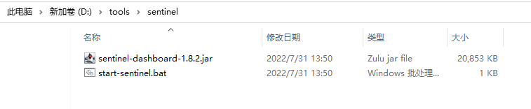
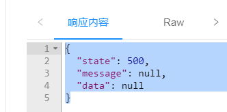

# 使用Seata

## 配置Seata

cart\stock\order三个模块时需要Seata支持进行事务管理的模块


这三个模块都需要添加下面pom依赖和配置

```xml
<!--   Seata和SpringBoot整合依赖     -->
<dependency>
    <groupId>io.seata</groupId>
    <artifactId>seata-spring-boot-starter</artifactId>
</dependency>
<!--  Seata 完成分布式事务的两个相关依赖(Seata会自动使用其中的资源)  -->
<dependency>
    <groupId>com.github.pagehelper</groupId>
    <artifactId>pagehelper-spring-boot-starter</artifactId>
</dependency>
<dependency>
    <groupId>com.alibaba</groupId>
    <artifactId>fastjson</artifactId>
</dependency>
```

下面修改cart\stock\order模块的application-dev.yml

代码如下

```yaml
seata:
  tx-service-group: csmall_group  # 定义事务的分组,一般是以项目为单位的,方便与其它项目区分
  service:
    vgroup-mapping:
      csmall_group: default     # csmall_group分组的配置,default会默认配置Seata
    grouplist:
      default: localhost:8091   # 配置Seata服务器的地址和端口号
```

注意同一个事务必须在同一个tx-service-group中

同时指定相同的seata地址和端口

**business模块的配置**

business模块作为当前分布式事务模型的触发者

它应该是事务的起点,但是它不连接数据库,所以配置稍有不同

pom文件seata依赖仍然需要,但是只需要seata依赖

```xml
<dependency>
    <groupId>io.seata</groupId>
    <artifactId>seata-spring-boot-starter</artifactId>
</dependency>
```

application-dev.yml是一样的

```yaml
seata:
  tx-service-group: csmall_group  # 定义事务的分组,一般是以项目为单位的,方便与其它项目区分
  service:
    vgroup-mapping:
      csmall_group: default     # csmall_group分组的配置,default会默认配置Seata
    grouplist:
      default: localhost:8091   # 配置Seata服务器的地址和端口号
```

添加完必要的配置之后

要想激活Seata功能非常简单,只要在起点业务的业务逻辑方法上添加专用的注解即可

添加这个注解的模块就是模型中的TM

他调用的所有远程模块都是RM

business模块添加订单的业务逻辑层开始的方法

```java
@Service
@Slf4j
public class BusinessServiceImpl implements IBusinessService {

    // Dubbo调用order模块的新增订单功能
    // 当前business是单纯的消费者,不需要在类上编写@DubboService
    @DubboReference
    private IOrderService dubboOrderService;

    // Global:全局 , Transactional事务
    // 一旦这个方法标记为@GlobalTransactional
    // 就相当于设置了分布式事务的起点,当前模块在事务模型中就是TM事务管理器
    // 最终效果就是当前方法开始之后,所有的远程调用操作数据库的功能都在同一个事务中
    // 体现出事务原子性的特征,要么都运行,要么都不运行
    @GlobalTransactional
    @Override
    public void buy() {
     	//  代码略...
    }
}
```

先启动nacos,再启动seata

然后按顺序启动四个服务  cart\stock\order\business

利用knife4j进行访问,

business模块 localhost:20000/doc.html

> 当前测试常见错误

如果seata启动时发送内存不足的错误,可以参考下面的文章解决

https://blog.csdn.net/he_lei/article/details/116229467

保证当前seata的环境变量是java1.8

在windows系统中运行seata可能出现不稳定的情况,重启seata即可解决

## Seata效果

要想seata出现效果,我们要有一个发生异常的情况

当发生异常时,去观察是否会回滚

我们可以编写代码随机的抛出异常,来根据是否有异常,是否回滚,判断seata是否有效

OrderServiceImpl在新增订单方法前添加随机发送异常的方法

```java
@Override
public void orderAdd(OrderAddDTO orderAddDTO) {
    // 1.减少订单中商品的库存数(要调用stock模块的功能)
    // 先实例化业务逻辑层需要的指定类型DTO才能调用
    StockReduceCountDTO countDTO=new StockReduceCountDTO();
    countDTO.setCommodityCode(orderAddDTO.getCommodityCode());
    countDTO.setReduceCount(orderAddDTO.getCount());
    // dubbo调用stock执行减少库存的方法
    stockService.reduceCommodityCount(countDTO);
    // 2.从购物车中删除用户勾选的商品(要调用cart模块的功能)
    cartService.deleteUserCart(orderAddDTO.getUserId(),
                                orderAddDTO.getCommodityCode());
    // ↓↓↓↓↓↓↓↓↓↓↓↓↓↓↓↓↓↓↓↓↓↓↓↓↓↓↓↓↓↓↓↓↓↓↓↓↓↓↓↓↓
    if(Math.random()<0.5){
        throw new CoolSharkServiceException(
                ResponseCode.INTERNAL_SERVER_ERROR,"发送随机异常!");
    }

    // 3.将orderAddDTO中的信息转换为Order实体类,然后新增到数据库中
    Order order=new Order();
    BeanUtils.copyProperties(orderAddDTO,order);
    // 执行新增
    orderMapper.insertOrder(order);
    log.info("新增订单信息为:{}",order);

}
```

再次测试localhost:20000/doc.html

点击触发购买业务的功能,观察是否发生异常

以及发生异常时数据库是否没有变化

正常运行时,数据库数据是否正常变化

## Seata其他模式介绍

上次课我们讲解了Seata软件AT模式的运行流程

AT模式的运行有一个非常明显的前提条件,这个条件不满足,就无法使用AT模式

这个条件就是事务分支都必须是操作关系型数据库(Mysql\MariaDB\Oracle)

因为关系型数据库才支持提交和回滚,其它非关系型数据库都是直接影响数据(例如Redis)

所以如果我们在业务过程中有一个节点操作的是Redis或其它非关系型数据库时,就无法使用AT模式

**除了AT模式之外还有TCC、SAGA 和 XA 事务模式**

### TCC模式

简单来说,TCC模式就是自己编写代码完成事务的提交和回滚

在TCC模式下,我们需要为参与事务的业务逻辑编写一组共3个方法

(prepare\commit\rollback)

prepare:准备

commit:提交

rollback:回滚

* prepare方法是每个模块都会运行的方法
* 当所有模块的prepare方法运行都正常时,运行commit
* 当任意模块运行的prepare方法有异常时,运行rollback

这样的话所有提交或回滚代码都由自己编写

优点:虽然代码是自己写的,但是事务整体提交或回滚的机制仍然可用(仍然由TC来调度)

缺点:每个业务都要编写3个方法来对应,代码冗余,而且业务入侵量大

### SAGA模式

SAGA模式的思想是对应每个业务逻辑层编写一个新的类,可以设置指定的业务逻辑层方法发生异常时,运行当新编写的类中的代码

相当于将TCC模式中的rollback方法定义在了一个新的类中

这样编写代码不影响已经编写好的业务逻辑代码

一般用于修改已经编写完成的老代码

缺点是每个事务分支都要编写一个类来回滚业务,

会造成类的数量较多,开发量比较大

### XA模式

支持XA协议的数据库分布式事务,使用比较少

# Sentinel

官网地址

https://sentinelguard.io/zh-cn/

下载地址

https://github.com/alibaba/Sentinel/releases

文件在第五阶段资料中,jsd2203项目解压后的doc目录下

## 什么是Sentinel

Sentinel英文翻译"哨兵\门卫"

Sentinel也是Spring Cloud Alibaba的组件

随着微服务的流行，服务和服务之间的稳定性变得越来越重要。Sentinel 以流量为切入点，从流量控制、熔断降级、系统负载保护等多个维度保护服务的稳定性。

## 为什么需要Sentinel

为了保证服务器运行的稳定性,在请求数到达设计最高值时,将过剩的请求限流,保证在设计的请求数内的请求能够稳定完成处理

- 丰富的应用场景

  双11,秒杀,12306抢火车票

- 完备的实时状态监控

  可以支持显示当前项目各个服务的运行和压力状态,分析出每台服务器处理的秒级别的数据

- 广泛的开源生态

  很多技术可以和Sentinel进行整合,SpringCloud,Dubbo,而且依赖少配置简单

- 完善的SPI扩展

  Sentinel支持程序设置各种自定义的规则

## 基本配置

我们的限流针对的是控制器方法

我们找一个简单的模块来测试和观察限流效果

在csmall-stock-webapi模块中

添加sentinel的依赖

```xml
<!--  sentinel依赖  -->
<dependency>
    <groupId>com.alibaba.cloud</groupId>
    <artifactId>spring-cloud-starter-alibaba-sentinel</artifactId>
</dependency>
```

application-dev.yml文件添加配置

```yaml
spring:
  application:
    #  为当前项目起名,这个名字会被Nacos记录并使用
    name: nacos-stock
  cloud:
    sentinel:
      transport:
        dashboard: localhost:8080 # 配置Sentinel提供的运行状态仪表台的位置
        # 执行限流的端口号,每个项目需要设置不同的端口号,例如cart模块可以设置为8722
        port: 8721
    nacos:
      discovery:
        # 配置Nacos所在的位置,用于注册时提交信息
        server-addr: localhost:8848
```

## Sentinel启动

windows同学直接双击start-sentinel.bat文件

mac同学使用下面命令执行jar包

```
java -jar sentinel-dashboard-1.8.2.jar
```

启动之后

打开浏览器http://localhost:8080/

会看到下面的界面


用户名和密码都是

sentinel

刚开始什么都没有,是空界面

后面我们有控制器的配置就会出现信息了

## 限流方法

我们以stock模块为例

演示限流的效果

StockController在减少库存的方法上添加限流的注解

```java
@PostMapping("/reduce/count")
@ApiOperation("减少商品库存数")
// @SentinelResource注解需要标记为控制层方法上,在该方法运行后,会被Sentinel监测
// 该方法运行前,Sentinel监测不到,必须至少运行一次后才可以开始监测信息
// "减少商品库存数"这个名称就是显示在Sentinel上该方法的名称
@SentinelResource("减少商品库存数")
public JsonResult reduceCommodityCount(
                    StockReduceCountDTO stockReduceCountDTO){
    // 调用业务逻辑层
    stockService.reduceCommodityCount(stockReduceCountDTO);
    return JsonResult.ok("库存减少完成!");
}
```

nacos\seata\sentinel要启动

重启stock服务(其它服务都可以停掉)

如果不运行knife4j测试,sentinel的仪表盘不会有任何信息

在第一次运行了减少库存方法之后,sentinel的仪表盘才会出现nacos-stock的信息

选中这个信息点击"簇点链路"

找到我们编写的"减少商品库存数"方法,点  "＋流控"

设置流控规则

我们先设置QPS为1也就是每秒请求数超过1时,进行限流

然后我们可以快速双击knife4j减少库存的方法,触发它的流控效果



这样的流控没有正确的消息提示

我们需要自定义方法进行正确的提示给用户看到

## 自定义限流方法

对于被限流的请求,我们可以自定义限流的处理方法

默认情况下可能不能正确给用户提示,一般情况下,对被限流的请求也要有"服务器忙请重试"或类似的提示

StockController类中@SentinelResource注解中,可以自定义处理限流情况的方法

```java
@PostMapping("/reduce/count")
@ApiOperation("减少商品库存数")
// @SentinelResource注解需要标记为控制层方法上,在该方法运行后,会被Sentinel监测
// 该方法运行前,Sentinel监测不到,必须至少运行一次后才可以开始监测信息
// "减少商品库存数"这个名称就是显示在Sentinel上该方法的名称
// blockHandler就是指定被限流时,要运行自定义方法的属性,"blockError"就是方法名
@SentinelResource(value = "减少商品库存数",blockHandler = "blockError")
public JsonResult reduceCommodityCount(
                    StockReduceCountDTO stockReduceCountDTO){
    // 调用业务逻辑层
    stockService.reduceCommodityCount(stockReduceCountDTO);
    return JsonResult.ok("库存减少完成!");
}
// Sentinel自定义限流方法定义规则如下
// 1.访问修饰符必须是public
// 2.返回值类型必须和控制器方法一致
// 3.方法名必须是控制器方法注解中blockHandler定义的名称
// 4.方法参数必须包含控制器的所有参数,而且可以额外添加BlockException的异常类型参数
public JsonResult blockError(StockReduceCountDTO stockReduceCountDTO,
                             BlockException e){
    // 运行这个方法表示当前请求被Sentinel限流了,需要给出被限流的提示
    return JsonResult.failed(ResponseCode.INTERNAL_SERVER_ERROR,
            "服务器忙,请稍后再试");
}
```

重启stock-webapi模块

再次尝试被限流,观察被限流的提示

## QPS与并发线程数

* QPS:是每秒请求数

  单纯的限制在一秒内有多少个请求访问控制器方法

* 并发线程数:是当前正在使用服务器资源请求线程的数量

  限制的是使用当前服务器的线程数

​		并发线程数测试可能需要阻塞当前控制器方法一段时间,方便测试

```java
stockService.reduceCommodityCount(stockReduceCountDTO);
try {
    Thread.sleep(5000);
} catch (InterruptedException e) {
    e.printStackTrace();
}
return JsonResult.ok("库存减少完成!");
```

## 自定义降级方法

所谓降级就是正常运行控制器方法的过程中

控制器方法发生了异常,Sentinel支持我们运行别的方法来处理异常,或运行别的业务流程处理

我们也学习过处理控制器异常的统一异常处理类,和我们的降级处理有类似的地方

但是Sentinel降级方法优先级高,而且针对单一控制器方法编写

StockController类中@SentinelResource注解中,可以定义处理降级情况的方法

```java
@PostMapping("/reduce/count")
@ApiOperation("减少商品库存数")
// @SentinelResource注解需要标记为控制层方法上,在该方法运行后,会被Sentinel监测
// 该方法运行前,Sentinel监测不到,必须至少运行一次后才可以开始监测信息
// "减少商品库存数"这个名称就是显示在Sentinel上该方法的名称
// blockHandler就是指定被限流时,要运行自定义方法的属性,"blockError"就是方法名
@SentinelResource(  value = "减少商品库存数",
                    blockHandler = "blockError",
                    fallback = "fallbackError")
public JsonResult reduceCommodityCount(
                    StockReduceCountDTO stockReduceCountDTO){
    // 调用业务逻辑层
    stockService.reduceCommodityCount(stockReduceCountDTO);
    // 随机发生异常,测试服务降级效果
    if(Math.random()<0.5){
        // 如果发生这个异常,就会运行降级方法
        throw new CoolSharkServiceException(
                ResponseCode.INTERNAL_SERVER_ERROR, "随机异常");
    }
    return JsonResult.ok("库存减少完成!");
}
// 限流方法略.....

// 降级方法: 由@SentinelResource注解fallback属性指定的方法
// 方法定义规则和限流方法基本一致,方法的参数中,最后的参数可以额外添加Throwable类型
// 当控制器方法发生异常时,Sentinel会调用这个方法,优先级比统一异常处理类高
// 实际开发中,可能包含一些业务例如:运行老版本代码,或使用户获得一些补偿
public JsonResult fallbackError(StockReduceCountDTO stockReduceCountDTO,
                                Throwable throwable){
    // 我们的业务仅仅是输出异常提示
    return JsonResult.failed(ResponseCode.INTERNAL_SERVER_ERROR,
            "运行发生异常,服务降级!");
}
```

重启csmall-stock-webapi模块测试

当发生随机异常时,就运行降级方法

当没有发生随机异常时,就正常运行!

**课堂作业**

为business模块控制器的buy方法添加Sentinel流控和降级的功能

流控时输出"服务器忙",降级时输出"服务降级"

1.pom文件

2.yml(port属性不能和stock模块的相同8722)

3.修改控制器代码(注解,流控和降级方法)

# SpringGateway网关

## 奈非框架简介

早期(2020年前)奈非提供的微服务组件和框架受到了很多开发者的欢迎

这些框架和SpringCloud Alibaba的对应关系我们要了解

现在还有很多旧项目维护是使用奈非框架完成的微服务架构

Nacos对应Eureka都是注册中心

Dubbo对应Ribbon+feign都是实现微服务远程RPC调用的组件

Sentinel对应Hystrix都是做项目限流熔断降级的组件

Gateway对应Zuul都是网关组件

Gateway框架不是阿里写的,是Spring提供的

## 什么是网关

"网"指网络,"关"指关口或关卡

网关:就是指网络中的关口\关卡

网关就是当前微服务项目的"**统一入口**"

程序中的网关就是当前微服务项目对外界开放的统一入口

所有外界的请求都需要先经过网关才能访问到我们的程序

提供了统一入口之后,方便对所有请求进行统一的检查和管理


网关项目git地址

https://gitee.com/jtzhanghl/gateway-demo.git

网关的主要功能有

* 将所有请求统一经过网关
* 网关可以对这些请求进行检查
* 网关方便记录所有请求的日志
* 网关可以统一将所有请求路由到正确的模块\服务上

路由的近义词就是"分配"

## Spring Gateway简介

我们使用Spring Gateway作为当前项目的网关框架

Spring Gateway是Spring自己编写的,也是SpringCloud中的组件

SpringGateway官网

https://docs.spring.io/spring-cloud-gateway/docs/current/reference/html/

网关项目git地址

https://gitee.com/jtzhanghl/gateway-demo.git

## 简单网关演示

SpringGateway网关是一个依赖,不是一个软件

所以我们要使用它的话,必须先创建一个SpringBoot项目

这个项目也要注册到Nacos注册中心,因为网关项目也是微服务项目的一个组成部分

beijing和shanghai是编写好的两个项目

gateway项目就是网关项目,需要添加相关配置

```xml
<!--   SpringGateway的依赖   -->
<dependency>
    <groupId>org.springframework.cloud</groupId>
    <artifactId>spring-cloud-starter-gateway</artifactId>
</dependency>
<!--   Nacos依赖   -->
<dependency>
    <groupId>com.alibaba.cloud</groupId>
    <artifactId>spring-cloud-starter-alibaba-nacos-discovery</artifactId>
</dependency>
<!--   网关负载均衡依赖    -->
<dependency>
    <groupId>org.springframework.cloud</groupId>
    <artifactId>spring-cloud-starter-loadbalancer</artifactId>
</dependency>
```

我们从yml文件配置开始添加

```yaml
server:
  port: 9000
spring:
  application:
    name: gateway
  cloud:
    nacos:
      discovery:
        # 网关也是微服务项目的一部分,所以也要注册到Nacos
        server-addr: localhost:8848
    gateway:
      # routes就是路由的意思,这是属性是一个数组类型,其中的值都是数组元素
      routes:
          # 数组元素配置中,-开头表示一个数组元素的开始,后面所有内容都是这个元素的内容
          # id表示当前路由的名称,和任何之前出现过的名字没有任何关联,唯一的要求就是不要后之后的id重复
        - id: gateway-beijing
          # 下面的配置是路由的目标,也就是目标的服务器名称
          # lb是LoadBalance的缩写,beijing是服务器名称
          uri: lb://beijing
          # predicates是断言的意思,就是满足某个条件时,去执行某些操作的设置
          predicates:
            # predicates也是一个数组,配置断言的内容
            # 这个断言的意思就是如果访问的路径是/bj/开头(**表示任何路径),
            # 就去访问上面定好的beijing服务器
            # ↓   P一定要大写!!!!!!!
            - Path=/bj/**
# spring.cloud.gateway.routes[0].uri
# spring.cloud.gateway.routes[0].predicates[0]
```

下面启动服务测试访问网关,使用路由功能到beijing服务器

保证beijing和gateway启动


## 关于路由的配置目标

路由规则解释

路由规则一定是在开发之前就设计好的

一般可以使用约定好的路径开头来实现的

例如

gateway项目

如果路径以 /bj开头,就是要访问beijing项目

如果路径以 /sh开头.就是养访问shanghai项目

具体实现来讲

所有的外界请求都要统一访问往网关

例如

localhost:9000/bj/show   9000后面的路径提取出来是/bj/show根据上面设计访问beijing模块

localhost:9000/sh/show  9000后面的路径提取出来是/sh/show根据上面设计访问shanghai模块


csmall项目

如果路径是 /base/business开头的,	    就去找nacos-business服务器

如果路径是 /base/cart开头的,				 就去找nacos-cart服务器

如果路径是 /base/order开头的,		      就去找nacos-order服务器

如果路径是 /base/stock开头的,		       就去找nacos-stock服务器


# 分布式

有多台服务器负责相同的业务

例如stock模块有3台服务器,这3台服务器就是分布式部署的

我们的微服务一个项目有多个模块,每个模块都可以单独运行

当他们都启动时,也是分布式部署的特征


# 随笔

routes:

{

{"id":"gateway-beijing","uri":"lb://beijing","predicates":{"Path=/bj/**"}},

{"id":"gateway-beijing"},

{"id":"gateway-beijing"}

.....

}


predicates:

{"Path=/bj/**","xxx=yyy",""}


