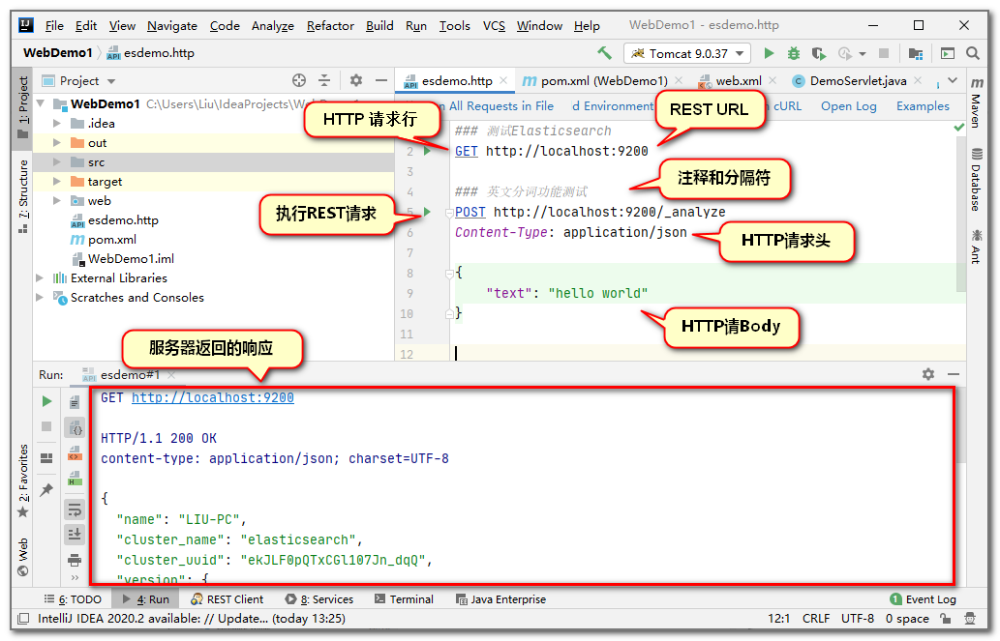

# 续SpringGateway网关

## 网关路由配置

上次课完成了路由的基本配置

下面对当前项目所有服务器添加路由配置信息(主要是添加sh对应的shanghai服务器)

```yaml
server:
  port: 9000
spring:
  application:
    name: gateway
  cloud:
    nacos:
      discovery:
        # 网关也是微服务项目的一部分,所以也要注册到Nacos
        server-addr: localhost:8848
    gateway:
      # routes就是路由的意思,这是属性是一个数组类型,其中的值都是数组元素
      routes:
        - id: gateway-shanghai
          uri: lb://shanghai
          predicates:
            - Path=/sh/**
          # 数组元素配置中,-开头表示一个数组元素的开始,后面所有内容都是这个元素的内容
          # id表示当前路由的名称,和任何之前出现过的名字没有任何关联,唯一的要求就是不要后之后的id重复
        - id: gateway-beijing
          # 下面的配置是路由的目标,也就是目标的服务器名称
          # lb是LoadBalance的缩写,beijing是服务器名称
          uri: lb://beijing
          # predicates是断言的意思,就是满足某个条件时,去执行某些操作的设置
          predicates:
            # predicates也是一个数组,配置断言的内容
            # 这个断言的意思就是如果访问的路径是/bj/开头(**表示任何路径),
            # 就去访问上面定好的beijing服务器
            # ↓   P一定要大写!!!!!!!
            - Path=/bj/**
# spring.cloud.gateway.routes[0].uri
# spring.cloud.gateway.routes[0].predicates[0]
```

这样上面的yml配置了bejing和shanghai项目的路由信息

**先启动Nacos**

然后启动每个模块(beijing/shanghai/gateway)

网关最后启动

http://localhost:9000/bj/show可以访问beijing服务器的资源

http://localhost:9000/sh/show可以访问shanghai服务器的资源

以此类推,再有很多服务器时,我们都可以仅使用9000端口号来将请求路由到正确的服务器

就实现了gateway成为项目的统一入口的效果

## 动态路由

网关项目的配置会随着微服务模块数量增多而变得复杂,维护的工作量也会越来越大

所以我们希望gateway能够设计一套默认情况下自动路由到每个模块的路由规则

这样的话,不管当前项目有多少个路由目标,都不需要维护yml文件了

这就是我们SpringGateway的动态路由功能

配置文件中开启即可

```yaml
server:
  port: 9000
spring:
  application:
    name: gateway
  cloud:
    nacos:
      discovery:
        # 网关也是微服务项目的一部分,所以也要注册到Nacos
        server-addr: localhost:8848
    gateway:
      discovery:
        locator:
          # 开启网关动态路由配置
          # 默认的路由规则:在网关端口号后先编写要路由到的目标服务器注册在Nacos的名称
          # 再编写具体路径
          # 例如 localhost:9001/bj/show -> localhost:9000/beijing/bj/show
          enabled: true
```

按上面修改完配置之后

我们可以重启gateway来测试动态路由路径是否生效

动态路由生成规则为:在网关端口号后先写要路由到的目标服务器在nacos注册的名称,再编写具体路径

## 内置断言

我们上次课在网关配置中使用了predicates(断言)的配置

断言的意思就是判断某个条件是否满足

我们之前使用了Path断言,判断请求的路径是不是满足条件,例如是不是/sh/**   /bj/**

如果路径满足这个条件,就路由到指定的服务器

但是Path实际上只是SpringGateway提供的多种内置断言中的一种

还有很多其它断言

- after
- before
- between
- cookie
- header
- host
- method
- path
- query
- remoteaddr

**时间相关**

after,before,between

判断当前时间在指定时间之前,之后或之间的操作

如果条件满足可以执行路由操作,否则拒绝访问

表示时间的格式比较特殊,先使用下面代码获得时间

```
ZonedDateTime.now()
```

运行程序输出,可获得当前时间,这个时间的格式可能是

```
2022-10-27T09:37:26.712+08:00[Asia/Shanghai]
```

下面在yml配置中添加新的断言配置

使用After设置必须在指定时间之后访问

```yaml
routes:
  - id: gateway-shanghai
    uri: lb://shanghai
    predicates:
      - Path=/sh/**
      # After时间断言,判断当前时间是否晚于after指定的时间
      # 如果不晚于,则不允许访问,如果晚于才允许访问,它和上面的Path是"与"的关系
      - After=2022-10-27T09:37:26.712+08:00[Asia/Shanghai]
```

必须在指定时间之后才能访问服务

否则发生404错误拒绝访问

需要注意测试时,先启动Nacos,再启动shanghai之后启动gateway

测试时必须通过9000端口访问才能有效果

使用Before设置必须在指定时间之前访问

```yaml
routes:
  - id: gateway-shanghai
    uri: lb://shanghai
    predicates:
      - Path=/sh/**
      - Before=2022-10-27T10:29:20.712+08:00[Asia/Shanghai]
```

使用Between设置必须在指定时间之间访问

```yaml
routes:
  - id: gateway-shanghai
    uri: lb://shanghai
    predicates:
      - Path=/sh/**
      - Between=2022-10-27T10:31:40.712+08:00[Asia/Shanghai],2022-10-27T10:32:10.712+08:00[Asia/Shanghai]
      
```

**要求指定参数的请求**

Query断言,判断是否包含指定的参数名称,包含参数名称才能通过路由

```yaml
routes:
  - id: gateway-shanghai
    uri: lb://shanghai
    predicates:
      - Path=/sh/**
      # Query断言判断请求中是否包含指定参数名称(username)的参数,如果不包含就不能访问
      - Query=username
```

重启gateway测试

必须是包含username参数的请求才能访问到指定的页面

例如:http://localhost:9000/sh/show?username=tom

## 内置过滤器

Gateway还提供的内置过滤器

不要和我们学习的filter混淆

内置过滤器允许我们在路由请求到目标资源的同时,对这个请求进行一些加工或处理

常见过滤器也有一些

我们给大家演示一下AddRequestParameter过滤器

它的作用是在请求中添加参数和它对应的值

```yaml
routes:
  - id: gateway-shanghai
    uri: lb://shanghai
    filters:
      - AddRequestParameter=age,18
    predicates:
      - Path=/sh/**
      # Query断言判断请求中是否包含指定参数名称(username)的参数,如果不包含就不能访问
      - Query=username
```

在shanghai的控制器方法中添加代码接收name,age的值

```java
@GetMapping("/show")
public String show(String username,Integer age){
    System.out.println(ZonedDateTime.now());
    return "这里是上海！"+username+","+age;
}
```

重启shanghai和gateway进行测试

http://localhost:9000/sh/show?username=tom

因为过滤器的存在,控制器可以获取网关过滤器添加的参数值


其他内置过滤器和自定义过滤器的使用,同学们可以查阅相关文档自己了解

# csmall项目网关

## 创建gateway网关子项目

创建网关项目,然后父子相认

修改子项目pom文件和依赖

```xml
<?xml version="1.0" encoding="UTF-8"?>
<project xmlns="http://maven.apache.org/POM/4.0.0" xmlns:xsi="http://www.w3.org/2001/XMLSchema-instance"
         xsi:schemaLocation="http://maven.apache.org/POM/4.0.0 https://maven.apache.org/xsd/maven-4.0.0.xsd">
    <modelVersion>4.0.0</modelVersion>
    <parent>
        <groupId>cn.tedu</groupId>
        <artifactId>csmall</artifactId>
        <version>0.0.1-SNAPSHOT</version>
        <relativePath/> <!-- lookup parent from repository -->
    </parent>
    <groupId>cn.tedu</groupId>
    <artifactId>gateway</artifactId>
    <version>0.0.1-SNAPSHOT</version>
    <name>gateway</name>
    <description>Demo project for Spring Boot</description>
    <dependencies>
        <!-- web实例 -->
        <dependency>
            <groupId>org.springframework.boot</groupId>
            <artifactId>spring-boot-starter-web</artifactId>
        </dependency>
        <!--  Nacos注册依赖 -->
        <dependency>
            <groupId>com.alibaba.cloud</groupId>
            <artifactId>spring-cloud-starter-alibaba-nacos-discovery</artifactId>
        </dependency>
        <dependency>
            <groupId>org.springframework.cloud</groupId>
            <artifactId>spring-cloud-starter-gateway</artifactId>
        </dependency>
        <dependency>
            <groupId>org.springframework.cloud</groupId>
            <artifactId>spring-cloud-starter-loadbalancer</artifactId>
        </dependency>
        <dependency>
            <groupId>com.github.xiaoymin</groupId>
            <artifactId>knife4j-spring-boot-starter</artifactId>
        </dependency>
    </dependencies>
</project>
```

也删除test测试文件夹

application.properties换为yml

配置如下

```yaml
server:
  port: 19000
spring:
  application:
    name: gateway-server
  cloud:
    nacos:
      discovery:
        server-addr: localhost:8848
    gateway:
      discovery:
        locator:
          # 开启动态路由效果
          enabled: true
  main:
    # 防止SpringMVC和SpringGateway冲突的配置
    web-application-type: reactive
```

## 网关项目的knife4j配置

我们希望配置网关之后,在使用knife4j测试时

就不来回切换端口号了

我们需要在网关项目中配置Knife4j才能实现

而这个配置是固定的,

只要是网关项目配置各个子模块的knife4j功能,就直接复制这几个类即可

csmall-finish中直接复制config\controller\filter

cn.tedu.gateway.config

SwaggerProvider

```java
@Component
public class SwaggerProvider implements SwaggerResourcesProvider {
    /**
     * 接口地址
     */
    public static final String API_URI = "/v2/api-docs";
    /**
     * 路由加载器
     */
    @Autowired
    private RouteLocator routeLocator;
    /**
     * 网关应用名称
     */
    @Value("${spring.application.name}")
    private String applicationName;

    @Override
    public List<SwaggerResource> get() {
        //接口资源列表
        List<SwaggerResource> resources = new ArrayList<>();
        //服务名称列表
        List<String> routeHosts = new ArrayList<>();
        // 获取所有可用的应用名称
        routeLocator.getRoutes().filter(route -> route.getUri().getHost() != null)
                .filter(route -> !applicationName.equals(route.getUri().getHost()))
                .subscribe(route -> routeHosts.add(route.getUri().getHost()));
        // 去重，多负载服务只添加一次
        Set<String> existsServer = new HashSet<>();
        routeHosts.forEach(host -> {
            // 拼接url
            String url = "/" + host + API_URI;
            //不存在则添加
            if (!existsServer.contains(url)) {
                existsServer.add(url);
                SwaggerResource swaggerResource = new SwaggerResource();
                swaggerResource.setUrl(url);
                swaggerResource.setName(host);
                resources.add(swaggerResource);
            }
        });
        return resources;
    }
}
```

cn.tedu.gateway.controller

SwaggerController类

```java
@RestController
@RequestMapping("/swagger-resources")
public class SwaggerController {
    @Autowired(required = false)
    private SecurityConfiguration securityConfiguration;
    @Autowired(required = false)
    private UiConfiguration uiConfiguration;
    private final SwaggerResourcesProvider swaggerResources;
    @Autowired
    public SwaggerController(SwaggerResourcesProvider swaggerResources) {
        this.swaggerResources = swaggerResources;
    }
    @GetMapping("/configuration/security")
    public Mono<ResponseEntity<SecurityConfiguration>> securityConfiguration() {
        return Mono.just(new ResponseEntity<>(
                Optional.ofNullable(securityConfiguration).orElse(SecurityConfigurationBuilder.builder().build()), HttpStatus.OK));
    }
    @GetMapping("/configuration/ui")
    public Mono<ResponseEntity<UiConfiguration>> uiConfiguration() {
        return Mono.just(new ResponseEntity<>(
                Optional.ofNullable(uiConfiguration).orElse(UiConfigurationBuilder.builder().build()), HttpStatus.OK));
    }
    @GetMapping("")
    public Mono<ResponseEntity> swaggerResources() {
        return Mono.just((new ResponseEntity<>(swaggerResources.get(), HttpStatus.OK)));
    }
}
```

cn.tedu.gateway.filter

SwaggerHeaderFilter类

```java
@Component
public class SwaggerHeaderFilter extends AbstractGatewayFilterFactory {
    private static final String HEADER_NAME = "X-Forwarded-Prefix";

    private static final String URI = "/v2/api-docs";

    @Override
    public GatewayFilter apply(Object config) {
        return (exchange, chain) -> {
            ServerHttpRequest request = exchange.getRequest();
            String path = request.getURI().getPath();
            if (!StringUtils.endsWithIgnoreCase(path,URI )) {
                return chain.filter(exchange);
            }
            String basePath = path.substring(0, path.lastIndexOf(URI));
            ServerHttpRequest newRequest = request.mutate().header(HEADER_NAME, basePath).build();
            ServerWebExchange newExchange = exchange.mutate().request(newRequest).build();
            return chain.filter(newExchange);
        };
    }
}
```

测试网关路由效果,和knife4j效果

启动Nacos\Seata\Sentinel

启动cart\stock\order\business

**最后启动gateway**

可以通过19000端口测试各个业务模块的功能

http://localhost:19000/nacos-stock/doc.html

http://localhost:19000/nacos-cart/doc.html

http://localhost:19000/nacos-order/doc.html

http://localhost:19000/nacos-business/doc.html

如果不使用网关一切正常,但是启动网关访问失败的话,就是gateway项目配置问题 

## Gateway和SpringMvc依赖冲突问题和解决

之前网关的演示项目我们添加的网关依赖

```xml
<!-- Spring Gateway 网关依赖 -->
<dependency>
    <groupId>org.springframework.cloud</groupId>
    <artifactId>spring-cloud-starter-gateway</artifactId>
</dependency>
```

当前csmall项目需要配置knife4j的路由配置,需要编写一个控制器

所以我们添加了SpringMvc的依赖

```xml
<dependency>
    <groupId>org.springframework.boot</groupId>
    <artifactId>spring-boot-starter-web</artifactId>
</dependency>
```

这两个依赖在同一个项目中时,默认情况下启动会报错

SpringMvc框架中自带一个Tomcat服务器

而SpringGateway框架中自带一个Netty的服务器

在启动项目时,两个框架中包含的服务器都想占用相同端口,因为争夺端口号的主动权而发生冲突

导致启动服务时报错

要想能够正常启动必须在yml文件配置

```yaml
spring:
  main:
    web-application-type: reactive
```

reactive:反应的

添加这个配置之后,会Tomcat服务器会变成非阻塞的运行

# Elasticsearch 概述

## Elasticsearch下载

苍老师网站


官方下载链接

https://www.elastic.co/cn/downloads/past-releases#elasticsearch

## 什么是Elasticsearch

elastic:富有弹性的

search:搜索

我们可以把它简称为ES,但是搜索它的资料时(例如百度)还是使用Elasticsearch进行搜索更准确

**这个软件不再是SpringCloud提供的,它也不针对微服务环境的项目来开发**

Elasticsearch和redis\mysql一样,不仅服务于java语言,其它语言也可以使用

它的功能也类似一个数据库,能高效的从大量数据中搜索匹配指定关键字的内容

它也将数据保存在硬盘中

这样的软件有一个名称**全文搜索引擎**

它本质就是一个java项目,使用它进行数据的增删改查就是访问这个项目的控制器方法(url路径)

> ES的底层技术

ES使用了java的一套名为Lucene的API

这个API提供了全文搜索引擎核心操作的接口,相当于搜索引擎的核心支持,ES是在Lucene的基础上进行了完善,实现了开箱即用的搜索引擎软件

市面上和ES功能类似的软件有

Solr/MongoDB

## 为什么需要Elasticsearch

数据库进行模糊查询效率严重低下

所有关系型数据库都有这个缺点(mysql\mariaDB\oracle\DB2等)

在执行类似下面模糊查询时

```sql
select * from spu where spu_name like '%鼠标%'
```

测试证明**一张千万级别的数据表进行模糊查询需要20秒以上**

当前互联网项目要求"三高"的需求下,这样的效率肯定不能接受

Elasticsearch主要是为了解决数据库模糊查询性能低下问题的

ES进行优化之后,从同样数据量的ES中查询相同条件数据,效率能够提高100倍以上

## 数据库索引简介

所谓的索引(index)其实就是数据目录

通常情况下,索引是为了提高查询效率的

数据库索引分两大类

* 聚集索引
* 非聚集索引

**聚集索引**就是数据库保存数据的物理顺序依据,默认情况下就是主键id,所以按id查询数据库中的数据效率非常高

**非聚集索引**:如果想在非主键列上添加索引,就是非聚集索引了

例如我们在数据库表中存在一个姓名列,我们为姓名列创建索引

在创建索引时,会根据姓名内容来创建索引

例如"张三丰" 这个姓名,创建索引后查询效率就会明显提升

如果没有索引,这样的查询就会引起效率最低的"逐行搜索",就是一行一行的查这个数据的姓名是不是张三丰,效率就会非常低

模糊查询时因为'%鼠标%',使用的是前模糊条件,使用索引必须明确前面的内容是什么,前模糊查询是不能使用索引的,只能是全表的逐行搜索,所以效率非常低

所以当我们项目中设计了根据用户输入关键字进行模糊查询时,需要使用**全文搜索引擎**来优化

> 索引面试题
>
> 1.创建的索引会占用硬盘空间
>
> 2.创建索引之后,对该表进行增删改操作时,会引起索引的更新,所以效率会降低
>
> 3.对数据库进行批量新增时,先删除索引,增加完毕之后再创建
>
> 4.不要对数据样本少的列添加索引
>
> 5.模糊查询时,查询条件前模糊的情况,是无法启用索引的
>
> 6.每次从数据表中查询的数据的比例越高,索引的效果越低
>
> 7.当我们执行查询时,where条件后应该先查询有索引的列

## Elasticsearch运行原理

要想使用ES提高模糊查询效率

首先要将数据库中的数据复制到ES中

在新增数据到ES的过程中,ES可以对指定的列进行**分词**索引保存在索引库中

形成倒排索引结构


## Elasticsearch的启动

课程中使用7.6.2的版本

压缩包280M左右,复制到没有中文,没有空格的目录下解压

双击bin\elasticsearch.bat运行


双击之后可能会看到下面的dos界面


这个界面不能关闭,一旦关闭ES就停止了

验证ES的运行状态

浏览器输入地址:localhost:9200看到如下内容即可


mac系统启动

```
tar -xvf elasticsearch-7.6.2-darwin-x86_64.tar.gz 
cd elasticsearch-7.6.2/bin 
./elasticsearch
```

linux:

```
tar -xvf elasticsearch-7.6.2-linux-x86_64.tar.gz
cd elasticsearch-7.6.2/bin
./elasticsearch
```

## ES基本使用

ES启动完成后,我们要学习如何操作它

我们已经讲过,操作ES是对ES发送请求

我们创建一个子项目search,在这个子项目中创建一个专门发送各种类型请求的文件来操作ES

创建search项目也要父子相认

然后子项目pom文件如下

```xml
<?xml version="1.0" encoding="UTF-8"?>
<project xmlns="http://maven.apache.org/POM/4.0.0" xmlns:xsi="http://www.w3.org/2001/XMLSchema-instance"
         xsi:schemaLocation="http://maven.apache.org/POM/4.0.0 https://maven.apache.org/xsd/maven-4.0.0.xsd">
    <modelVersion>4.0.0</modelVersion>
    <parent>
        <groupId>cn.tedu</groupId>
        <artifactId>csmall</artifactId>
        <version>0.0.1-SNAPSHOT</version>
        <relativePath/> <!-- lookup parent from repository -->
    </parent>
    <groupId>cn.tedu</groupId>
    <artifactId>search</artifactId>
    <version>0.0.1-SNAPSHOT</version>
    <name>search</name>
    <description>Demo project for Spring Boot</description>

    <dependencies>
        <dependency>
            <groupId>org.springframework.boot</groupId>
            <artifactId>spring-boot-starter</artifactId>
        </dependency>

        <dependency>
            <groupId>org.springframework.boot</groupId>
            <artifactId>spring-boot-starter-test</artifactId>
            <scope>test</scope>
        </dependency>
    </dependencies>
    
</project>
```

下面创建一个能够向ES发送请求的文件

这种能够向指定url发送请求的文件格式称之为http client(http 客户端)


文件类型叫HTTP Request文件

我们可以起名为elasticsearch

我们先从最简单的请求开始

向es发送指令

```json
### 三个#是注释,也是分隔符,每个发送指令的请求必须使用分隔符分隔
GET http://localhost:9200

### 测试ES的分词功能,运行分词,查看分词结果
POST http://localhost:9200/_analyze
Content-Type: application/json

{
  "text": "my name is hanmeimei",
  "analyzer": "standard"

}
```

analyze:分析

analyzer:分析者(分词器)

standard是ES默认的分词器,"analyzer": "standard"是可以省略的

standard这个分词器只能对英文等西文字符(有空格的),进行正确分词

但是中文分词不能按空格分,按这个分词器分词,每个字都会形成分词,这样的结果不能满足我们日常的搜索需要



我们解决中文不能正确分词的问题

实际上要引入一个中文常见词语的词库,分词时按照词库中的词语分词即可

我们可以使用免费的中文分词器词库插件IK来实现中文分词效果


安装插件之后要重启ES才能生效

关闭Es窗口之后再双击elasticsearch.bat文件运行即可

ES启动之后,将中文分词器设置完成,在运行分词

```json
{
  "text": "罗技激光鼠标",
  "analyzer": "ik_smart"
}
```

再次运行分词测试,应该看到正常的中文分词效果

但是词库的容量有限,比较新的网络名词和较新出现的人名是不在词库中的

## ik分词插件的使用

我们安装的ik实际上不只一个分词器

实际上除了ik_smart之外还有ik_max_word

```json
POST http://localhost:9200/_analyze
Content-Type: application/json

{
  "text": "北京冬季奥林匹克运动会顺利闭幕",
  "analyzer": "ik_smart"
}
```

```json
POST http://localhost:9200/_analyze
Content-Type: application/json

{
  "text": "北京冬季奥林匹克运动会顺利闭幕",
  "analyzer": "ik_max_word"
}
```

上面的两个分词器运行分词,结果会有非常明显的区别

总结区别如下

**ik_smart**

* 优点:特征是粗略快速的将文字进行分词,占用空间小,查询速度快

* 缺点:分词的颗粒度大,可能跳过一些重要分词,导致查询结果不全面,查全率低

**ik_max_word**

* 优点:特征是详细的文字片段进行分词,查询时查全率高,不容易遗漏数据
* 缺点:因为分词太过详细,导致有一些无用分词,占用空间较大,查询速度慢

## 使用ES操作数据

ES是一个数据库性质的软件

可以执行增删改查操作,只是他操作数据不使用sql,数据的结构和关系型数据库也不同

我们先了解一下ES保存数据的结构


* ES启动后,ES服务可以创建多个index(索引),index可以理解为数据库中表的概念

* 一个index可以创建多个保存数据的document(文档),一个document理解为数据库中的一行数据
* 一个document中可以保存多个属性和属性值,对应数据库中的字段(列)和字段值

项目csmall-finish项目中

node文件夹下共享了ES文档,命令都在里面,可以测试


# 随笔

火字旁  

爆    73

炉   421

烧   637

炜   711

炎   873

燚   892

炸   911


暴爆瀑


姓张的

张三     150

张四     170

张飞      222

张三丰  277

张三丰   369

.....

姓名中包含"三"的


姓王的

....

姓李的

.....


