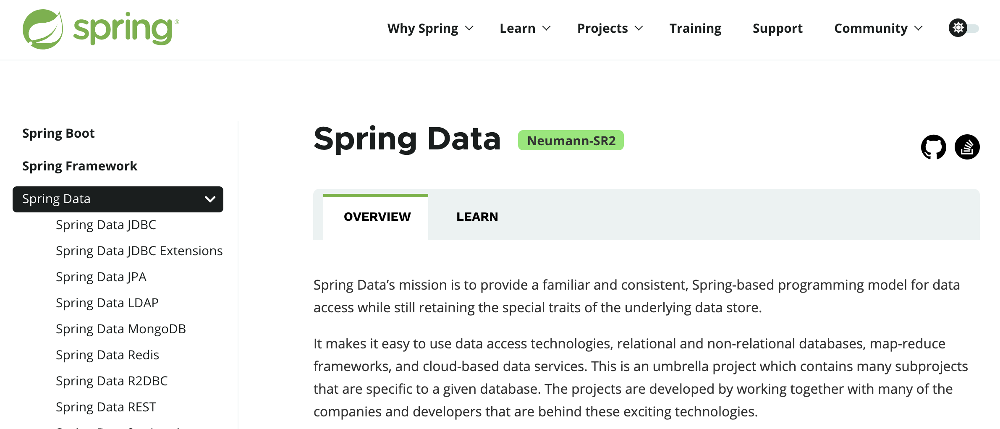

# 使用ES文档操作

项目csmall-finish项目中

node文件夹下共享了ES文档,命令都在里面,可以测试

所有的代码都在"ES文档"中, 笔记略

下面我们要学习使用java代码来操作ES

# SpringBoot 操作 Elasticsearch

## Spring Data简介

原生状态下,我们使用JDBC连接数据库,因为代码过于繁琐,所以改为使用Mybatis框架

在ES的原生状态下,我们java代码需要使用socket访问ES,但是也是过于繁琐,我们可以使用SpringData框架简化

Spring Data是Spring提供的一套连接各种第三方数据源的框架集

我们需要使用的是其中连接ES的Spring Data Elasticseatrch

官方网站:https://spring.io/projects/spring-data



官网中列出了SpringData支持连接操作的数据源列表

下面我们就按照SpringDataElasticsearch的步骤对ES进行操作

## 添加依赖和配置

就使用我们之前创建的search模块来操作ES

pom文件添加依赖

```xml
<?xml version="1.0" encoding="UTF-8"?>
<project xmlns="http://maven.apache.org/POM/4.0.0" xmlns:xsi="http://www.w3.org/2001/XMLSchema-instance"
         xsi:schemaLocation="http://maven.apache.org/POM/4.0.0 https://maven.apache.org/xsd/maven-4.0.0.xsd">
    <modelVersion>4.0.0</modelVersion>
    <parent>
        <groupId>cn.tedu</groupId>
        <artifactId>csmall</artifactId>
        <version>0.0.1-SNAPSHOT</version>
        <relativePath/> <!-- lookup parent from repository -->
    </parent>
    <groupId>cn.tedu</groupId>
    <artifactId>search</artifactId>
    <version>0.0.1-SNAPSHOT</version>
    <name>search</name>
    <description>Demo project for Spring Boot</description>

    <dependencies>
        <dependency>
            <groupId>org.springframework.boot</groupId>
            <artifactId>spring-boot-starter</artifactId>
        </dependency>

        <dependency>
            <groupId>org.springframework.boot</groupId>
            <artifactId>spring-boot-starter-test</artifactId>
            <scope>test</scope>
        </dependency>
        <!--  Spring Data Elasticsearch 整合依赖 -->
        <dependency>
            <groupId>org.springframework.boot</groupId>
            <artifactId>spring-boot-starter-data-elasticsearch</artifactId>
        </dependency>

    </dependencies>

</project>
```

application.properties添加配置

```properties
# 配置ES所在的ip地址和端口号信息
spring.elasticsearch.rest.uris=http://localhost:9200

# 设置日志门槛
logging.level.cn.tedu.search=debug
# SpringDataElasticsearch框架中有一个转换输出信息的类,它也需要设置为debug
logging.level.org.elasticsearch.client.RestClient=debug
```

## 创建和ES关联的实体类

和数据库一样

我们操作ES时也需要一个类似实体类的数据类,作为操作ES的数据载体

search项目创建entity包

在包中创建Item(商品)类

```java
@Data
@Accessors(chain = true)    // 支持链式Set赋值
@AllArgsConstructor         // 自动生成当前类的全参构造方法
@NoArgsConstructor          // 自动生成当前类的无参构造方法
// @Document注解标记表示当前类是对应ES框架的一个实体类
// 属性indexName指定ES中的索引名称,运行时,如果这个索引不存在SpringData会自动创建这个索引
@Document(indexName = "items")
public class Item implements Serializable {

    // SpringData通过@Id注解标记当前实体类主键
    @Id
    private Long id;
    // SpringData 标记title字段需要支持分词,并定义分词器
    @Field(type = FieldType.Text,
            analyzer = "ik_max_word",
            searchAnalyzer = "ik_max_word")
    private String title;
    // Keyword类型是不分词的字符串类型
    @Field(type = FieldType.Keyword)
    private String category;
    @Field(type = FieldType.Keyword)
    private String brand;
    @Field(type = FieldType.Double)
    private Double price;
    // imgPath是图片路径,他不会称之为搜索条件,所以可以不创建索引,节省空间
    // 设置index = false,就是不创建索引
    // 但是需要注意,不创建索引并不是不保存这个数据,ES会保存这个数据
    @Field(type = FieldType.Keyword,index = false)
    private String imgPath;

    // images/2022/10/28/a0cf86-70adcc12-712918-ac878323.jpg

}
```

## 创建操作ES的持久层

我们使用SpringData连接ES

需要知道SpringData框架对持久层的命名规则

持久层规范名称为repository(仓库),创建这个包,包中创建接口ItemRepository

```java
// Repository是spring家族对框架持久层的规范命名
@Repository
public interface ItemRepository extends ElasticsearchRepository<Item,Long> {
    // ItemRepository接口要继承SpringData框架提供的父接口ElasticsearchRepository
    // 一旦继承,当前接口就可以编写连接ES操作数据的代码了,
    // 继承了父接口后,SpringData会根据我们泛型中编写的Item找到对应的索引
    // 会对这个索引自动生成基本的增删改查方法,我们自己无需再编写
    // ElasticsearchRepository<[要操作的\关联的实体类名称],[实体类主键的类型]>
}
```

## 测试ES

如果没有测试包,创建test测试包

如果没有测试类,创建测试类

编写测试

```java
// 注意必须有@SpringBootTest注解才能顺利测试!
@SpringBootTest
@Slf4j
class SearchApplicationTests {

    @Autowired
    private ItemRepository itemRepository;

    // 执行单增
    @Test
    void addOne() {
        // 实例化Item对象
        Item item=new Item()
                .setId(1L)
                .setTitle("罗技激光无线游戏鼠标")
                .setCategory("鼠标")
                .setBrand("罗技")
                .setPrice(188.0)
                .setImgPath("/1.jpg");
        // 利用SpringDataElasticsearch提供的新增方法,完成Item新增到ES
        itemRepository.save(item);
        System.out.println("ok");
    }

    // 单查
    @Test
    void getOne(){
        // SpringDataElasticsearch提供了按id查询数据的方法
        // 返回值是一个Optional类型的对象,理解为只能保存一个元素的集合
        // 需要内容时直接调用get方法即可获取其中对象
        Optional<Item> optional=itemRepository.findById(1L);
        Item item=optional.get();
        System.out.println(item);

    }

    // 批量增
    @Test
    void addList(){
        // 实例化一个List对象,用户添加要保存到ES的Item对象
        List<Item> list=new ArrayList<>();
        list.add(new Item(2L,"罗技激光有线办公鼠标","鼠标",
                            "罗技",9.9,"/2.jpg"));
        list.add(new Item(3L,"雷蛇机械无线游戏键盘","键盘",
                            "雷蛇",262.0,"/3.jpg"));
        list.add(new Item(4L,"微软有线静音办公鼠标","鼠标",
                            "微软",190.0,"/4.jpg"));
        list.add(new Item(5L,"罗技机械有线背光键盘","键盘",
                            "罗技",236.0,"/5.jpg"));
        itemRepository.saveAll(list);
        System.out.println("ok");

    }

    // 全查
    @Test
    void getAll(){
        // SpringData框架提供的全查ES中对应实体类的所有数据的方法
        Iterable<Item> items=itemRepository.findAll();
        for(Item item : items){
            System.out.println(item);
        }
        System.out.println("------------------------------------");
        items.forEach(item -> System.out.println(item));

    }


}
```

## SpringData自定义查询

SpringData框架提供的基本增删改查方法并不能完全满足我们的业务需要

如果是针对当前Es数据,进行个性化的自定义查询,那还是需要自己编写查询代码

就像我们要实现根据关键词查询商品信息一样,完成类似数据库中的模糊查询.

### 单条件查询

我们查询需求为输出所有数据中title属性包含"游戏"这个分词的商品信息

> 参考数据库中模糊查询
>
> ```sql
> select * from item where title like '%游戏%'
> ```

我们使用SpringDataES进行查询,本质上还是相当于ES文档中执行的查询语句

在SpringData框架下,ItemRepository接口中实现更加简单

```java
// SpringData实现自定义查询
// 我们要编写遵循SpringData给定格式的方法名
// SpringData会根据方法名称自动推断出查询目的,生成查询语句完成操作
// query(查询):表达当前方法是一个查询方法,等价于sql中的select
// Item/Items:确定要查询的实体类(对应的索引),不带s是查询单个对象的,带s的查集合
// By(通过/根据):标识开始设置查询条件的单词,等价于sql中的where
// Title:要查询的字段,可以是Item实体类中声明的任何字段
// Matches(匹配):执行查询条件的操作,Matches是匹配字符串类型的关键字,支持分词等价sql中的like

Iterable<Item> queryItemsByTitleMatches(String title);
```

下面可以开始在测试类中进行测试查询

```java
// 单条件自定义查询
@Test
void queryOne(){
    // 查询ES中items索引数据,title字段包含"游戏"分词的数据
    Iterable<Item> items=itemRepository.queryItemsByTitleMatches("游戏");
    items.forEach(item -> System.out.println(item));
}
```

上面代码运行时底层运行的查询语句为:

```json
### 单条件搜索
POST http://localhost:9200/items/_search
Content-Type: application/json

{
  "query": {"match": { "title":  "游戏" }}
}
```

### 多条件查询

在相对复杂的查询逻辑下

经常使用多个条件来定位查询需要的数据

这样就需要逻辑运算符"and"/"or"

ItemRepository接口中添加多条件的查询方法

```java
// 多条件查询
// 多个条件之间要使用and或or来分隔,表示多个条件间的逻辑关系
// 如果我们想按照Title和Brand进行多条件查询
// 多个条件时,方法名就要按规则编写多个条件,参数也要对应条件的个数来变化
// 声明的参数会按照顺序赋值给方法名中的条件,和参数名称无关
Iterable<Item> queryItemsByTitleMatchesAndBrandMatches(
                                    String title,String brand);
```

测试代码如下

```java
// 多条件自定义查询
@Test
void queryTwo(){
    // 查询ES中,items索引里,title字段包含"游戏",并且品牌是"罗技"的数据
    Iterable<Item> items=itemRepository
            .queryItemsByTitleMatchesAndBrandMatches("游戏","罗技");
    items.forEach(item -> System.out.println(item));

}
```

底层运行的请求

```json
### 多字段搜索
POST http://localhost:9200/items/_search
Content-Type: application/json

{
  "query": {
    "bool": {
      "must": [
        { "match": { "title": "游戏"}},
        { "match": { "brand": "罗技"}}
      ]
    }
  }
}
```

当查询条件关系为And时,查询语句关键字为must

当查询条件关系为Or时,查询语句关键字为should

### 排序查询

默认情况下从ES中查询获得的数据排序依据是ES查询得出的相关性分数(score)

但是如果想改变这个排序就需要在查询方法上添加新的关键字

在ItemRepository接口添加具备排序功能的查询方法

```java
// 排序查询
Iterable<Item> queryItemsByTitleMatchesOrBrandMatchesOrderByPriceDesc(
        String title,String brand);
```

测试代码如下

```java
// 自定义排序查询
@Test
void queryOrder(){
    Iterable<Item> items=itemRepository
            .queryItemsByTitleMatchesOrBrandMatchesOrderByPriceDesc(
                                               "游戏","罗技");
    items.forEach(item -> System.out.println(item));
}
```

底层运行的代码

```json
### 多字段搜索
POST http://localhost:9200/items/_search
Content-Type: application/json

{
  "query": {
    "bool": {
      "should": [
        { "match": { "title": "游戏"}},
        { "match": { "brand": "罗技"}}
      ]
    }
  },"sort":[{"price":"desc"}]
}
```

### 分页查询

SpringData框架支持完成分页查询

需要在ItemRepository接口中修改方法的参数和返回值就可以实现

```java
// 分页查询
// 返回值类型需要修改为Page类型,这个类型既可以保存从ES中查询到的数据又可以保存
// 当前分页查询的分页信息:当前页,总页数,总条数,每页条数,有没有上一页,有没有下一页等
// 分页查询方法参数要添加一个Pageable,必须放在现有所有参数的后面
// 它可以设置要查询的页码和每页的条数

Page<Item> queryItemsByTitleMatchesOrBrandMatchesOrderByPriceDesc(
        String title, String brand, Pageable pageable);
```

测试代码

```java
// 自定义分页查询
@Test
void queryPage(){
    int page=2;             // 要查询的页码,写1表示查询第一页
    int pageSize=2;         // 每页条数的设置
    Page<Item> pages=itemRepository
            .queryItemsByTitleMatchesOrBrandMatchesOrderByPriceDesc(
                 "游戏","罗技", PageRequest.of(page-1,pageSize));
    pages.forEach(item -> System.out.println(item));
    // pages对象包含的分页信息输出
    System.out.println("总页数:"+pages.getTotalPages());
    System.out.println("总条数:"+pages.getTotalElements());
    System.out.println("当前页:"+(pages.getNumber()+1));
    System.out.println("每页条数:"+pages.getSize());
    System.out.println("是否是首页:"+pages.isFirst());
    System.out.println("是否是末页:"+pages.isLast());

}
```

# 酷鲨商城概述

## 一般项目开发流程

运营部分发起项目策划

提出项目的功能或特色,交由产品经理

产品经理细化功能,提出需求交给开发部门

**以下是开发部分的操作**

需求分析(需求分析文档)

根据需求分析结果,做数据库设计

针对业务做概要设计

找前端开发人员做一个页面原型

详细设计(可选)

开发阶段

测试

部署上线

## 酷鲨项目进程

三阶段:酷鲨商城引流平台

SSM基本增删改查,完成的一个广告性质的展示页面

四阶段:酷鲨商城后台管理系统

单体管理项目的经典实现,完成商城的后台管理系统

五阶段:酷鲨商城前台访问页面(移动端)

微服务架构的项目,完成支持"高并发,高可用,高性能"的前台访问

## 开发计划

1.分类搜索

2.商品列表

3.商品详情

4.购物车管理

5.新增订单和订单列表

6.搜索商品

7.高并发秒杀商品

## 开发组结构

java有比较长时间的演化和积淀

形成了Spring庞大的生态体系,在Spring中几乎可以找到所有业务的支持

java开发的项目一般都是中大型以上的项目

开发周期长,开发人数多,java开发的项目能够有最好的稳定性和安全性,也能够在微服务的支持下有更好的性能


一般java项目组人员组成 6~8人

一个项目经理(leader)  25K

一个技术总监                25K

两三个中坚力量            15-20K

两个初级程序员             8K

15

开发周期

6~8月

1.设计  1月

2.开发  2月

3.测试  3月

4.上线调试 1到2个月

105

一线城市报价160万左右

二线                120~130之间

三线				100~110之间

## 酷鲨商城需求文档

<<酷鲨商城数据库设计需求文档>>

里面主要是项目中数据库的设计解释和业务的解释

在csmall-finish的node文件夹下有压缩包

# 加载酷鲨商城前台数据


# 随笔

C# sharp

ASP.NET

84

4


6.7 1米1天

40200

3.

2000


