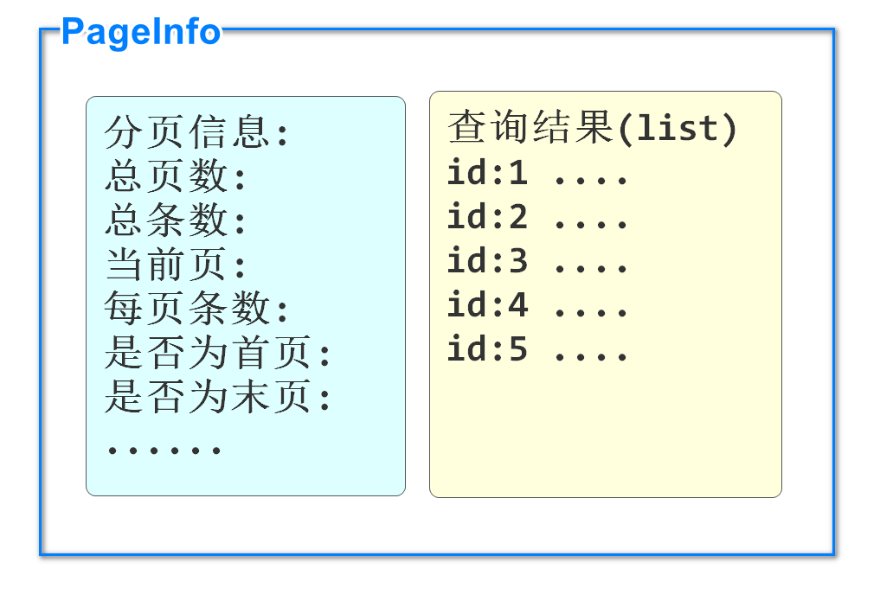

# 加载酷鲨商城前台数据

## 数据导入

在给大家提供的csmall-jsd2203项目的doc文件夹下的sql文件夹中

有多个sql语句文件

分别去运行它们,我们可以获得酷鲨商城前台的数据库信息了

我们每个微服务项目原则上只操作少于一个数据库

随堂更新git地址:

https://gitee.com/jtzhanghl/csmall-repo-class.git

# 开发分类功能

## 分类功能实现逻辑

我们数据库mall_pms的category表使用自关联实现了三级分类

当前酷鲨商城项目使用固定的三级分类

1.从数据库中查询出所有分类信息,一次性全查

2.构建分类信息的父子结构,实现查询返回父子结构的分类信息

3.将查询到的结果保存在Redis中,以备后续用户直接获取

> 代码中要判断Redis中是否包含全部分类数据,不包含的话做上面操作
>
> 包含分类数据的话直接获得之后返回

## 业务分析

查询全部分类的业务重点在**构建三级分类树结构**

我们需要将从数据库中查询出的分类对象构成下面的结构

```json
[
    {id:1,name:"手机/运行商/数码",parentId:0,depth:1,children:[
        {id:2,name:"手机通讯",parentId:1,depth:2,children:[
            {id:3,name:"智能手机",parentId:2,depth:3,children:null},
            {id:4,name:"非智能手机",parentId:2,depth:3,children:null}
        ]},
    ]},
    {id:5,name:"电脑/办公",parentId:0,depth:1,children:[....]}
]
```

上面是我们需要获得的对象的结构

可以理解为下图


在数据库mall_pms中

有pms_category表,这个表就是保存全部分类信息的表格

id:主键

name:显示在页面上的分类名称

parentId:父分类的id   如果是一级分类父分类id为0

depth:分类深度,当前项目就是3级分类,1\2\3 分别代表它的等级

keyword:搜索关键字

sort:排序依据 正常查询时,根据此列进行排序,数字越小越出现在前面(升序)

icon:图标地址

enable:是否可用

isparent:是否为父分类  0 假  1真

isdisplay:是否显示在导航栏  0不显示  1显示

## 实施开发

front:前台

在csmall-front-webapi项目中开发

创建service.impl包

包中编写业务逻辑层实现类 实现IFrontCategoryService

```java
@DubboService
@Service
@Slf4j
public class FrontCategoryServiceImpl implements IFrontCategoryService {

    // 装配Dubbo业务逻辑层对象,完成Product模块查询全部分类对象集合的方法
    // front模块不连数据,是消费者
    @DubboReference
    private IForFrontCategoryService dubboCategoryService;
    // 装配操作Redis的对象
    @Autowired
    private RedisTemplate redisTemplate;

    // 开发过程中,使用Redis的规范要求所有代码中使用的Redis的Key,都要定义为常量避免拼写错误
    public static final String CATEGORY_TREE_KEY="category_tree";

    @Override
    public FrontCategoryTreeVO categoryTree() {
        // 方法中先检查Redis中是否保存了三级分类树对象
        if(redisTemplate.hasKey(CATEGORY_TREE_KEY)){
            // redis中如果已经保存了这个key,直接获取
            FrontCategoryTreeVO<FrontCategoryEntity> treeVO=
                    (FrontCategoryTreeVO<FrontCategoryEntity>)
                    redisTemplate.boundValueOps(CATEGORY_TREE_KEY).get();
            // 将从redis中获取的treeVO返回
            return treeVO;
        }
        // Redis中没有三级分类树信息,表示本次访问可以是首次访问
        // 就要进行连接数据库查询数据后,构建三级分类树结构,再保存到Redis的业务流程
        // dubbo调用查询所有分类对象的方法
        List<CategoryStandardVO> categoryStandardVOs=
                            dubboCategoryService.getCategoryList();
        // 请记住CategoryStandardVO是没有children属性的,FrontCategoryEntity是有的!
        // 下面就是要编写一个方法,将子分类对象保存到对应的父分类对象的children属性中
        // 所有大概思路就是将CategoryStandardVO转换为FrontCategoryEntity
        // 转换和构建过程比较复杂,我们专门编写一个方法来完成
        FrontCategoryTreeVO<FrontCategoryEntity> treeVO=
                                            initTree(categoryStandardVOs);
        // 上面方法,完成了三级分类树的构建,下面要将treeVO保存到Redis
        redisTemplate.boundValueOps(CATEGORY_TREE_KEY)
                .set(treeVO,1, TimeUnit.MINUTES);
        // 上面时间定义了1分钟,是学习测试比较适合的,实际开发中可能会保存较长时间例如24小时
        // 最后别忘了返回!!!!
        return treeVO;
    }

    private FrontCategoryTreeVO<FrontCategoryEntity> initTree(
                            List<CategoryStandardVO> categoryStandardVOs) {
        // 第一步:
        // 确定所有分类的父分类id
        // 以父分类id为Key,以子分类对象为value保存在一个Map中
        // 一个父分类可以包含多个子分类对象,所以这个Map的value是个List
        Map<Long,List<FrontCategoryEntity>> map=new HashMap<>();
        log.info("当前分类对象总数量:{}",categoryStandardVOs.size());
        // 遍历数据库查询出来的所有分类对象集合
        for(CategoryStandardVO categoryStandardVO : categoryStandardVOs){
            // 因为CategoryStandardVO没有children属性不能保存子分类对象
            // 所以要将CategoryStandardVO对象转换为能够保存children属性的FrontCategoryEntity
            FrontCategoryEntity frontCategoryEntity=new FrontCategoryEntity();
            // 同名属性赋值
            BeanUtils.copyProperties(categoryStandardVO,frontCategoryEntity);
            // 获取当前分类对象的父分类id,用作Map中的Key(如果父分类id为0,表示一级分类)
            // 将父分类id取出,以便后续使用
            Long parentId=frontCategoryEntity.getParentId();
            // 要判断这个父分类id作为Key是否已经在map中出现
            if(map.containsKey(parentId)){
                // 如果当前map已经存在这个key,直接将当前分类对象添加到value的集合中即可
                map.get(parentId).add(frontCategoryEntity);
            }else{
                // 如果当前map没有这个key,那么我们就要创建这个key-value
                // 要先实例化一个List对象,作为value
                List<FrontCategoryEntity> value=new ArrayList<>();
                value.add(frontCategoryEntity);
                // 最后再将这个包含分类对象的list添加到value中
                map.put(parentId,value);
            }
        }
        // 第二步:
        // 将子分类对象关联到对应的父分类对象的children属性中
        // 先获的所有一级分类对象, 也就是父分类id为0的对象
        List<FrontCategoryEntity> firstLevels=map.get(0L);
        // 判断一级分类集合如果为null,直接抛出异常,终止程序
        if(firstLevels==null || firstLevels.isEmpty()){
            throw new CoolSharkServiceException(
                    ResponseCode.INTERNAL_SERVER_ERROR,"缺失一级分类对象!");
        }
        // 遍历一级分类集合
        for(FrontCategoryEntity oneLevel : firstLevels){
            // 获取当前一级分类对象的id
            Long secondLevelParentId=oneLevel.getId(); // getId!!!!!!!!!!
            // 根据上面一级分类的id,获得对应的二级分类集合
            List<FrontCategoryEntity> secondLevels=map.get(secondLevelParentId);
            if(secondLevels==null || secondLevels.isEmpty()){
                // 二级分类缺失不用抛异常,报出警告即可
                log.warn("当前分类没有二级分类内容:{}",secondLevelParentId);
                // 跳过本次循环,继续下次循环
                continue;
            }
            // 确定二级分类对象后,遍历二级分类对象集合
            for(FrontCategoryEntity twoLevel : secondLevels){
                // 获取当前二级分类的id(三级分类的父id)
                Long thirdLevelParentId=twoLevel.getId();  //getId!!!!!!!!
                // 根据二级分类的id获取对应的三级分类对象集合
                List<FrontCategoryEntity> thirdLevels=map.get(thirdLevelParentId);
                // 判断三级分类对象集合是否为null
                if(thirdLevels==null || thirdLevels.isEmpty()){
                    log.warn("当前二级分类对象没有三级分类内容:{}",thirdLevelParentId);
                    continue;
                }
                // 将三级分类对象集合,添加到当前二级分类对象的children属性中
                twoLevel.setChildrens(thirdLevels);
            }
            // 将二级分类对象集合(已经赋好值的对象集合),添加到一级分类对象的children属性中
            oneLevel.setChildrens(secondLevels);
        }
        // 到此为止,所有的分类对象,都应该正确保存到了自己对应的父分类对象的children属性中
        // 但是最后要将一级分类的集合firstLevels,赋值给FrontCategoryTreeVO<FrontCategoryEntity>
        // 所以要先实例化它,再给它赋值,返回
        FrontCategoryTreeVO<FrontCategoryEntity> treeVO=
                new FrontCategoryTreeVO<>();
        treeVO.setCategories(firstLevels);
        // 最后千万别忘了返回!!!!
        return treeVO;
    }
}
```


创建控制层

controller包

CategoryController类

代码如下

```java
@RestController
@RequestMapping("/front/category")
@Api(tags = "前台分类查询")
public class CategoryController {
    @Autowired
    private IFrontCategoryService categoryService;

    @GetMapping("/all")
    @ApiOperation("查询获得三级分类树对象")
    public JsonResult<FrontCategoryTreeVO<FrontCategoryEntity>> getTreeVO(){
        FrontCategoryTreeVO<FrontCategoryEntity> treeVO=
                categoryService.categoryTree();
        return JsonResult.ok(treeVO);
    }


}
```

启动nacos\seata\redis

先启动生产者product\后启动消费者front

访问

localhost:10004/doc.html

# 分页查询

## 分页查询的优点

所谓分页,就是查询结果数据较多时,采用按页显示的方法,而不是一次性全部显示

分页的优点:

1. 服务器:一次性查询所有信息,服务器压力大,分页查询服务器压力小
2. 客户端:一次性显示所有信息,需要更多流量,加载时间也会更长,分页显示没有这个问题
3. 用户体验上:一般最有价值的信息都会在前几页显示,也方便用户记忆,多查询出来的数据使用几率很低

实现分页查询需要我们开发过程中多几个步骤

## PageHelper实现分页查询

我们可以使用sql语句中添加limit关键字的方法实现分页查询

但是查询分页内容时,我们要自己计算相关的分页信息和参数

limit 0,10      limit  10,10

分页逻辑无论什么业务都是类似的,所以有框架帮助我们高效实现分页功能

PageHelper框架可以实现我们提供页码和每页条数,自动实现分页效果,收集分页信息

PageHelper的分页原理就是在程序运行时,在sql语句尾部添加limit关键字,并按照分页信息向limit后追加分页数据

要想使用,首先还是添加依赖

我们在之前搭建的微服务项目中先编写学习,建议使用csmall-order模块

```xml
<dependency>
    <groupId>com.github.pagehelper</groupId>
    <artifactId>pagehelper-spring-boot-starter</artifactId>
</dependency>
```

在添加seata支持时已经添加了pagehepler依赖

## PageHelper的基本使用

### 先编写持久层

我们使用csmall-order-webapi模块来完成分页的测试

首先编写分页的持久层mapper,持久层功能是全查所有订单信息

OrderMapper添加方法

```java
// Pagehelper框架完成分页功能的原理是sql语句后自动添加limit
// 所以我们在编写查询方法时,无需关注分页操作,和普通查询没有区别
@Select("select id,user_id,commodity_code,count,money from order_tbl")
List<Order> findAllOrders();
```

注意这个方法并不需要任何分页的参数或返回值,sql也不需要编写limit

都是在业务逻辑层中由PageHelper框架处理的

### 编写业务逻辑层

下面就转到业务逻辑层实现类,先编写一个方法使用PageHelper的功能

先不用写接口,直接在业务逻辑层中写方法

OrderServiceImpl添加方法

```java
// 分页查询所有订单信息的方法
// 参数page是页码,pageSize是每页条数
public PageInfo<Order> getAllOrdersByPage(Integer page,Integer pageSize){
    // Pagehepler框架实现分页功能最核心的代码,是要编写在执行查询数据库代码之前的
    // PageHelper.startPage方法就是在设置分页的查询条件
    // page是查询的页码(从1开始),pageSize是每页条数
    PageHelper.startPage(page,pageSize);
    // 上面设置好分页查询条件,下面的查询在执行时,sql语句会自动被追加limit关键字
    List<Order>  list= orderMapper.findAllOrders();

    // list变量并不是全查结果,而是只包含指定页码内容的数据
    // 我们分页业务功能不能只返回分页查询结果,还需要提供分页信息
    // PageHelper框架提供了PageInfo类,既能保存分页结果,也能保存分页信息
    // 分页信息无需我们计算,直接实例化PageInfo对象,它会自动根据上面的查询生成
    return new PageInfo<>(list);


}
```

PageInfo对象既包含查询数据结果,又包含分页信息

数据结构如下图



**附:PageInfo全部分页信息属性**

```java
//当前页
private int pageNum;
//每页的数量
private int pageSize;
//当前页的行数量
private int size;
//当前页面第一个元素在数据库中的行号
private int startRow;
//当前页面最后一个元素在数据库中的行号
private int endRow;
//总页数
private int pages;
//前一页页号
private int prePage;
//下一页页号
private int nextPage;
//是否为第一页
private boolean isFirstPage;
//是否为最后一页
private boolean isLastPage;
//是否有前一页
private boolean hasPreviousPage;
//是否有下一页
private boolean hasNextPage;
//导航条中页码个数
private int navigatePages;
//所有导航条中显示的页号
private int[] navigatepageNums;
//导航条上的第一页页号
private int navigateFirstPage;
//导航条上的最后一页号
private int navigateLastPage;
```

### 编写控制层

```java
@Autowired
private OrderServiceImpl orderService;

//......

@GetMapping("/page")
@ApiOperation("分页查询所有订单")
@ApiImplicitParams({
        @ApiImplicitParam(value = "页码",name="page",example = "1"),
        @ApiImplicitParam(value = "每页条数",name="pageSize",example = "10")
})
public JsonResult<PageInfo<Order>> pageOrders(
                        Integer page,Integer pageSize){
    PageInfo<Order> pageInfo=
            orderService.getAllOrdersByPage(page,pageSize);
    return JsonResult.ok("查询完成",pageInfo);

}
```

启动Nacos\Seata

启动order

进行knife4j测试http://localhost:20002/doc.html#/home

可以观察控制台输出的运行的sql语句(会自动添加limit关键字)

## 使用JsonPage返回结果

当前我们分页查询返回的类型是PageInfo

如果用这个类型来做业务逻辑层的返回值,当当前方法作为dubbo生产者对外提供服务时

消费者调用该服务需要使用PageInfo类型对象来接收,这样要求消费者也添加PageHepler依赖,这是不合理的

所以我们设计在commons模块中,添加一个专门用于返回分页结果的类JsonPage,代替PageInfo

这样当前微服务项目中,所有分页或类似的操作,就都可以使用这个类了

例如之前SpringDataElasticsearch框架也支持分页,返回类型为Page,它也可以替换为JsonPage

因为需要在commons模块中使用PageInfo类型,所以commons模块要添加pageHelper的依赖

```xml
<!--  为了将PageHepler框架中分页查询结果返回值PageInfo转换为JsonPage类型
   我们需要在commons模块中添加PageHelper的依赖
   -->
<dependency>
    <groupId>com.github.pagehelper</groupId>
    <artifactId>pagehelper</artifactId>
    <version>5.2.0</version>
</dependency>
```

在restful包中新建一个JsonPage类

代码如下


# 随笔

数据库中:1,2,3,4,5,6,7

正常情况下:redis最多存1,2,3,4,5,6,7

但是如果存集合的操作泛滥,redis中可以出现下面的情况

{1,3,5,7}

{2,4,6}

{1,2,3}

{3,4,5}

{1,2,3,6,7}

{2,5,6}


