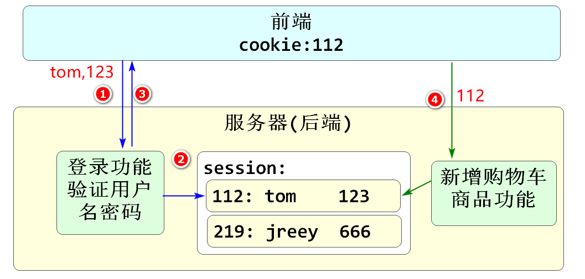
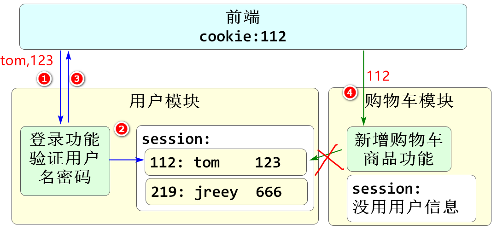
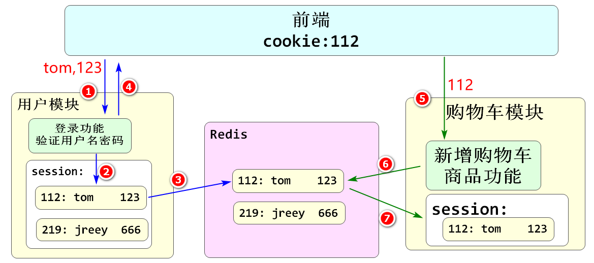
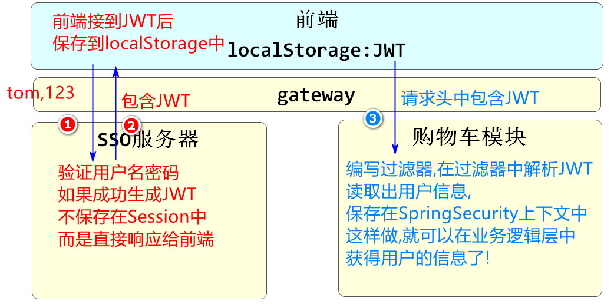

# 续 分页查询

## 使用JsonPage返回结果

在restful包中新建一个JsonPage类

代码如下

```java
@Data
public class JsonPage<T> implements Serializable {

    // 当前类应该和Page\PageInfo一样,既能包含分页查询结果,又包含分页信息
    // 分页信息方面,我们可以根据项目需求来声明
    // 当前只声明最基本的四个分页信息即可,今后可以随需求变化增加
    @ApiModelProperty(value = "总页数",name="totalPages")
    private Integer totalPages;
    @ApiModelProperty(value = "总条数",name="totalCount")
    private Long totalCount;
    @ApiModelProperty(value = "页码",name="page")
    private Integer page;
    @ApiModelProperty(value = "每页条数",name="pageSize")
    private Integer pageSize;

    // JsonPage还要包含分页查询结果
    @ApiModelProperty(value = "分页数据",name="list")
    private List<T> list;

    // 下面要编写一个能够将PageInfo类型对象转换为JsonPage类型对象的方法
    // 如果需要将其他类型对象转换为JsonPage(例如SpringData的Page类型),另外编写方法即可
    public static <T> JsonPage<T> restPage(PageInfo<T> pageInfo){
        // 所谓转换的意思就是将pageInfo对象中的信息,赋值给JsonPage类型
        JsonPage<T> result=new JsonPage<>();
        // 因为PageInfo和JsonPage同名属性较少,所以手动赋值
        result.setTotalCount(pageInfo.getTotal());
        result.setTotalPages(pageInfo.getPages());
        result.setPage(pageInfo.getPageNum());
        result.setPageSize(pageInfo.getPageSize());
        // 别忘了最后的分页数据
        result.setList(pageInfo.getList());
        // 最后返回JsonPage类型对象result
        return  result;
    }
}
```

下面去使用这个类

csmall-order-service项目的IOrderService业务逻辑层接口添加方法

返回值使用JsonPage

```java
// 返回JsonPage类型的分页查询订单的方法
JsonPage<Order> getAllOrdersByPage(Integer page,Integer pageSize);
```

csmall-order-webapi项目OrderServiceImpl实现类中进行修改

```java
//     ↓↓↓↓↓↓↓↓
public JsonPage<OrderTb> getAllOrdersByPage(Integer pageNum, Integer pageSize){

    PageHelper.startPage(pageNum,pageSize);

    List<OrderTb> list= orderMapper.findAllOrders();

    //     ↓↓↓↓↓↓↓↓↓↓↓↓↓↓↓↓↓↓↓↓↓↓↓↓↓↓↓↓↓↓↓↓↓↓↓↓↓↓
    return JsonPage.restPage(new PageInfo<>(list));
}
```

业务逻辑层返回值的修改影响控制器方法的调用

再去修改OrderController中方法调用的位置

```java
@Autowired
//      ↓↓↓↓↓↓↓↓↓↓↓↓
private IOrderService orderService;

//...
//                ↓↓↓↓↓↓↓↓
public JsonResult<JsonPage<Order>> pageOrders(Integer pageNum, Integer pageSize){
      // 分页调用
      //↓↓↓↓↓↓        ↓↓↓↓↓↓↓↓↓  
      JsonPage<Order> jsonPage=orderService.getAllOrdersByPage(
          pageNum,pageSize);
      //                            ↓↓↓↓↓↓↓↓↓↓
      return JsonResult.ok("查询完成",jsonPage);
}
```

保证启动Nacos\Seata

启动order测试

能出现查询结果即可

# 开发酷鲨前台商品列表

## 按分类id分页查询spu列表

**转回到酷鲨商城大项目**

用户会根据分类树中的分类的名称,查询它需要的商品类别

点击商品分类名称时,实际上我们获得了它的分类id(categoryId)

我们可以根据这个id到pms_spu表中查询商品信息

并进行分页显示


这个查询目标仍然为mall-pms数据库,是product模块管理的范围

所以我们继续在Front模块业务逻辑层中编写利用dubbo调用即可,还是不需要写mapper

下面就在业务逻辑层中创建FrontProductServiceImpl

```java
@Service
@Slf4j
public class FrontProductServiceImpl implements IFrontProductService {

    @DubboReference
    private IForFrontSpuService dubboSpuService;

    // 根据分类id分页查询spu列表
    @Override
    public JsonPage<SpuListItemVO> listSpuByCategoryId(Long categoryId, Integer page, Integer pageSize) {
        // dubbo调用的方法是完成了分页查询的方法,这里只是调用然后返回即可
        JsonPage<SpuListItemVO> jsonPage=
                dubboSpuService.listSpuByCategoryId(categoryId, page, pageSize);
        // 返回jsonPage!!!
        return jsonPage;
    }

    @Override
    public SpuStandardVO getFrontSpuById(Long id) {
        return null;
    }

    @Override
    public List<SkuStandardVO> getFrontSkusBySpuId(Long spuId) {
        return null;
    }

    @Override
    public SpuDetailStandardVO getSpuDetail(Long spuId) {
        return null;
    }

    @Override
    public List<AttributeStandardVO> getSpuAttributesBySpuId(Long spuId) {
        return null;
    }
}
```

业务逻辑层实现类先只实现按分类id分页查询的功能即可

创建FrontSpuController编写调用代码如下

```java
@RestController
@RequestMapping("/front/spu")
@Api(tags = "前台商品spu模块")
public class FrontSpuController {
    @Autowired
    private IFrontProductService frontProductService;

    // localhost:10004/front/spu/list/3
    @GetMapping("/list/{categoryId}")
    @ApiOperation("根据分类id分页查询Spu列表")
    @ApiImplicitParams({
        @ApiImplicitParam(value = "分类id",name="categoryId",example = "3"),
        @ApiImplicitParam(value = "页码",name="page",example = "1"),
        @ApiImplicitParam(value = "每页条数",name="pageSize",example = "2")
    })
    public JsonResult<JsonPage<SpuListItemVO>> listSpuByPage(
            @PathVariable Long categoryId, Integer page,Integer pageSize){
        JsonPage<SpuListItemVO> jsonPage= frontProductService
                .listSpuByCategoryId(categoryId, page, pageSize);
        return JsonResult.ok(jsonPage);
    }
}
```

然后在Nacos\Seata启动的前提下

顺序启动Product\Front

进行测试

http://localhost:10004/doc.html

## 查询商品详情页信息

上面章节完成了查询spu列表

在商品列表中选中商品后,会显示这个商品的详情信息

**商品详情页**我们需要显示的信息包括

* 根据spuId查询spu信息
* 根据spuId查询spuDetail详情
* 根据spuId查询当前Spu包含的所有属性
* 根据spuId查询对应的sku列表

其中根据spuId查询当前Spu包含的所有属性功能涉及了一个比较复杂的连表查询

根据spuId查询参数选项的思路

1.根据spu_id去pms_spu表查询category_id

2.根据category_id去pms_category表查询分类对象

3.根据category_id去pms_category_attribute_template表查询attribute_template_id

4.根据attribute_template_id去pms_attribute_template表查询attribute_template数据行

5.根据attribute_template_id去pms_attribute表查询对应所有属性信息行

> 实际上,上面的联表查询可以简化为3表联查,结果相同

运行参考sql语句如下

```sql
SELECT 
	pa.id , pa.template_id , pa.name,
	pa.description , pa.type,
	pa.value_list , pa.unit
FROM pms_spu ps
JOIN pms_category pc ON ps.category_id=pc.id
JOIN pms_category_attribute_template pcat ON
								pc.id=pcat.category_id
JOIN pms_attribute_template pat ON
			pcat.attribute_template_id=pat.id
JOIN pms_attribute pa ON pa.template_id=pat.id
WHERE ps.id=4
```

继续编写FrontProductServiceImpl其他没有实现的方法

```java
@Service
@Slf4j
public class FrontProductServiceImpl implements IFrontProductService {

    @DubboReference
    private IForFrontSpuService dubboSpuService;
    // 根据spuId查询sku信息用的对象
    @DubboReference
    private IForFrontSkuService dubboSkuService;
    // 根据spuId查询查询当前商品的所有属性/规格用的对象
    @DubboReference
    private IForFrontAttributeService dubboAttributeService;


    // 根据分类id分页查询spu列表
    @Override
    public JsonPage<SpuListItemVO> listSpuByCategoryId(Long categoryId, Integer page, Integer pageSize) {
        // dubbo调用的方法是完成了分页查询的方法,这里只是调用然后返回即可
        JsonPage<SpuListItemVO> jsonPage=
                dubboSpuService.listSpuByCategoryId(categoryId, page, pageSize);
        // 返回jsonPage!!!
        return jsonPage;
    }

    // 根据spuId查询spu信息
    @Override
    public SpuStandardVO getFrontSpuById(Long id) {
        SpuStandardVO spuStandardVO=dubboSpuService.getSpuById(id);
        return spuStandardVO;
    }
    // 根据spuId查询对应的sku列表
    @Override
    public List<SkuStandardVO> getFrontSkusBySpuId(Long spuId) {
        List<SkuStandardVO> list=dubboSkuService.getSkusBySpuId(spuId);
        return list;
    }

    // 根据spuId查询spuDetail信息
    @Override
    public SpuDetailStandardVO getSpuDetail(Long spuId) {
        SpuDetailStandardVO spuDetailStandardVO=
                dubboSpuService.getSpuDetailById(spuId);
        return spuDetailStandardVO;
    }

    // 根据spuId查询对应的所有属性\规格列表
    @Override
    public List<AttributeStandardVO> getSpuAttributesBySpuId(Long spuId) {
        List<AttributeStandardVO> list=dubboAttributeService
                .getSpuAttributesBySpuId(spuId);
        return list;
    }
}
```

上面的实现类其实就是业务逻辑层正常调用dubbo方法即可

**开始编写控制层**

FrontSpuController添加两个方法

* 根据spuId查询spu信息
* 根据spuId查询参数列表的

```java
@RestController
@RequestMapping("/front/spu")
@Api(tags = "前台商品spu模块")
public class FrontSpuController {
    @Autowired
    private IFrontProductService frontProductService;

    // localhost:10004/front/spu/list/3
    @GetMapping("/list/{categoryId}")
    @ApiOperation("根据分类id分页查询Spu列表")
    @ApiImplicitParams({
        @ApiImplicitParam(value = "分类id",name="categoryId",example = "3"),
        @ApiImplicitParam(value = "页码",name="page",example = "1"),
        @ApiImplicitParam(value = "每页条数",name="pageSize",example = "2")
    })
    public JsonResult<JsonPage<SpuListItemVO>> listSpuByPage(
            @PathVariable Long categoryId, Integer page,Integer pageSize){
        JsonPage<SpuListItemVO> jsonPage= frontProductService
                .listSpuByCategoryId(categoryId, page, pageSize);
        return JsonResult.ok(jsonPage);
    }

    // 根据spuId查询spu信息
    // localhost:10004/front/spu/1
    @GetMapping("/{spuId}")
    @ApiOperation("根据spuId查询spu信息")
    @ApiImplicitParam(value = "spuId" ,name="spuId",example="1")
    public JsonResult<SpuStandardVO> getFrontSpuById(@PathVariable Long spuId){
        SpuStandardVO spuStandardVO=frontProductService.getFrontSpuById(spuId);
        return JsonResult.ok(spuStandardVO);
    }

    // 根据spuId查询所有属性\规格
    @GetMapping("/template/{id}")
    @ApiOperation("根据spuId查询所有属性\\规格")
    @ApiImplicitParam(value = "spuId",name = "id",example = "1")
    public JsonResult<List<AttributeStandardVO>> getAttributesBySpuId(
            @PathVariable Long id){
        List<AttributeStandardVO> list=frontProductService
                .getSpuAttributesBySpuId(id);
        return JsonResult.ok(list);
    }
}
```

创建FrontSkuController添加一个方法

* 根据spuId查询sku列表

```java
@RestController
@RequestMapping("/front/sku")
@Api(tags = "商品前台sku模块")
public class FrontSkuController {

    @Autowired
    private IFrontProductService frontProductService;

    // localhost:10004/front/sku/1
    @GetMapping("/{spuId}")
    @ApiOperation("根据spuId查询sku列表")
    @ApiImplicitParam(value = "spuId",name = "spuId",example = "1")
    public JsonResult<List<SkuStandardVO>> getSkuListBySpuId(
                                        @PathVariable Long spuId){
        List<SkuStandardVO> list=frontProductService.getFrontSkusBySpuId(spuId);
        return JsonResult.ok(list);
    }
}
```

FrontSpuDetailController添加一个方法

* 根据spuId查询spuDetail

```java
@RestController
@RequestMapping("/front/spu/detail")
@Api(tags = "前台spuDetail模块")
public class FrontSpuDetailController {

    @Autowired
    private IFrontProductService frontProductService;

    @GetMapping("/{spuId}")
    @ApiOperation("根据SpuId查询spuDetail对象")
    @ApiImplicitParam(value = "spuId",name = "spuId",example = "1")
    public JsonResult<SpuDetailStandardVO> getSpuDetailBySpuId(
            @PathVariable Long spuId){
        SpuDetailStandardVO spuDetailStandardVO=
                frontProductService.getSpuDetail(spuId);
        return JsonResult.ok(spuDetailStandardVO);

    }
}
```

nacos\seata\redis保持启动

启动product 重起front

访问10004测试,测试上面四个控制器模块的方法

# 登录流程回顾

## 用户\角色\权限

用户是一个基本的单位

我们登录时都是在登录用户的

我们再登录后需要明确这个用户具有哪些角色

用户和角色的关系是多对多

用户是一张表,角色也是一张表,因为它们是多对多的关系所以要有一张保存用户和角色关系的中间表

角色也不能直接决定这个用户能做什么操作,有哪些权限

需要再关联权限表决定

角色和权限也是多对多的关系,也要有中间表

如果项目开发的权限比较全面,可能会出现临时用户权限关系表

## Spring Security

Spring Security框架用于实现登录,内置加密,验证,放行等各种功能,可靠性强

同时还可以将当前登录用户的信息保存

特别的,对于用户具备的权限,有特殊的管理

在控制器运行前,可以使用注解来判断当前登录用户是否具备某个权限

@PreAuthorize("[权限名称]")

SpringSecurity在运行该方法之前进行核查

如果不具备这个权限会返回403状态码

## 关于单点登录

### 普通登录的问题

SSO是单点登录的缩写

微服务架构下,要解决单点登录实现会话保持的问题

首先我们分析一下普通登录和微服务登录的区别

先是单体项目登录之后的操作流程

主要依靠服务器的session保存用户信息

客户端发请求时,将sessionid同时发往服务器,根据sessionid就能确认用户身份



分布式或微服务项目中,服务器不再只有一个

那么就会出现下面的问题



上面的图片,表示我们在微服务系统中登录时遇到的问题

我们在用户模块中登录,只是将用户信息保存在用户模块的session中

而这个session不会和其他模块共享

所以在我们访问购物车模块或其他模块时,通过sessionid并不能获得在用户模块中登录成功的信息

这样就丢失的用户信息,不能完成业务,会话保持就失败了

市面上现在大多使用JWT来实现微服务架构下的会话保持

也就是在一个服务器上登录成功后,微服务的其他模块也能识别用户的登录信息

这个技术就是单点登录

### 单点登录解决方案

**Session共享**

Session共享是能够实现单点登录效果的

这种方式的核心思想是将用户的登录信息共享给其他模块

适用于小型的,用户量不大的微服务项目



将登录成功的用户信息共享给Redis

其他模块根据sessionId获得Redis中保存的用户信息即可

* 这样做最大的缺点就是内存严重冗余,不适合大量用户的微服务项目

**JWT**单点登录

Json Web Token(令牌)

这种登录方式,最大的优点就是不占用内存



生成的JWT由客户端自己保存,不占用服务器内存

在需要表明自己用户身份\信息时,将JWT信息保存到请求头中发送请求即可

### Jwt登录流程图


SSO(Single Sign On):单点登录

# 开发购物车功能

## 新增sku到购物车

我们开发完成了显示商品详情的功能

可以通过选中具体规格之后确定要购买的sku信息

再点击"添加到购物车"按钮

就应该将选中的sku的信息保存在购物车中

打开mall-order-webapi模块

创建mapper\service.impl\controller包

当前mall-order模块,管理的数据库是mall-oms数据库

业务逻辑分析

* 判断用户是否登录,只有登录后才能将商品新增到购物车
* 验证购物车信息的完整性(SpringValidation)
* 业务逻辑层要判断新增的sku是否在当前用户的购物车表中已经存在
  * 如果不存在是新增sku流程
  * 如果已经存在,是修改数量的流程

## 开发持久层

持久层要按上面分析的业务逻辑,开发多个方法

1.判断当前登录用户购物车中是否包含指定skuId商品的方法

2.新增sku到购物车表中

3.修改购物车指定sku数量的方法

在mapper包中创建OmsCartMapper接口,编写代码如下

```java
@Repository
public interface OmsCartMapper {
    // 判断当前用户购物车中是否已经包含指定的商品
    OmsCart selectExistsCart(@Param("userId") Long userId,
                             @Param("skuId") Long skuId);
    // 新增sku信息到购物车
    int saveCart(OmsCart omsCart);

    // 修改购物车中sku商品的数量
    int updateQuantityById(OmsCart omsCart);

}
```

对应的OmsCartMapper.xml文件

```xml
<?xml version="1.0" encoding="UTF-8"?>
<!DOCTYPE mapper PUBLIC "-//mybatis.org//DTD Mapper 3.0//EN" "http://mybatis.org/dtd/mybatis-3-mapper.dtd">
<mapper namespace="cn.tedu.mall.order.mapper.OmsCartMapper">

    <!-- 通用查询映射结果 -->
    <resultMap id="BaseResultMap" type="cn.tedu.mall.pojo.order.model.OmsCart">
        <id column="id" property="id" />
        <result column="user_id" property="userId" />
        <result column="sku_id" property="skuId" />
        <result column="title" property="title" />
        <result column="main_picture" property="mainPicture" />
        <result column="price" property="price" />
        <result column="quantity" property="quantity" />
        <result column="gmt_create" property="gmtCreate" />
        <result column="gmt_modified" property="gmtModified" />
        <result column="bar_code" property="barCode"/>
        <result column="data" property="data"/>
    </resultMap>

    <!--    定义查询omsCart表时使用的列名sql片段    -->
    <sql id="SimpleQueryFields">
        <if test="true">
            id,
            user_id,
            sku_id,
            title,
            main_picture,
            price,
            quantity,
            gmt_create,
            gmt_modified
        </if>
    </sql>
    <!--  判断当前用户购物车中是否已经包含指定的商品  -->
    <select id="selectExistsCart" resultMap="BaseResultMap">
        select
            <include refid="SimpleQueryFields" />
        from
            oms_cart
        where
            user_id=#{userId}
        and
            sku_id=#{skuId}
    </select>
    <!--  新增sku信息到购物车  -->
    <insert id="saveCart" useGeneratedKeys="true" keyProperty="id">
        insert into oms_cart(
            user_id,
            sku_id,
            title,
            main_picture,
            price,
            quantity
        ) values(
            #{userId},
            #{skuId},
            #{title},
            #{mainPicture},
            #{price},
            #{quantity}
        )
    </insert>
    <!--  修改购物车中sku商品的数量   -->
    <update id="updateQuantityById" >
        update
            oms_cart
        set
            quantity=#{quantity}
        where
            id=#{id}
    </update>
</mapper>
```


# 随笔

用户								角色									权限

杨过								学生									签到

小龙女							班主任								学生管理

尹志平							授课老师							课程管理

张三丰							年级组长							考试管理

张无忌							教导主任							课表管理

谢逊								校长									教师管理


