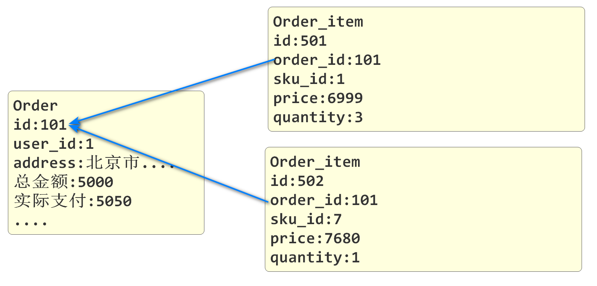
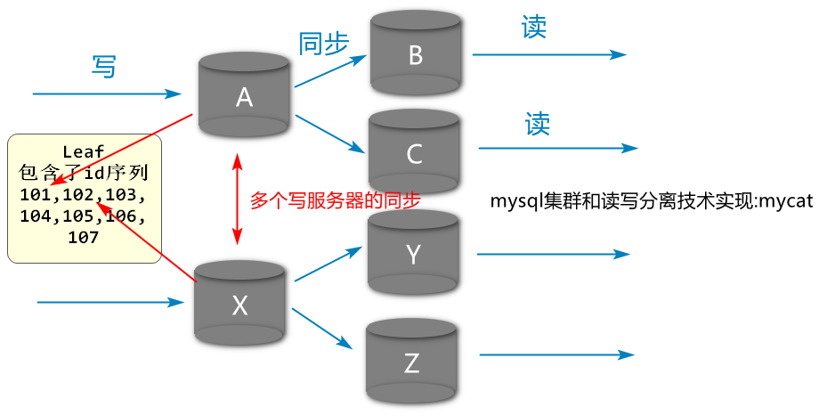

# 续 开发购物车功能

## 续 新增sku到购物车

### 开发业务逻辑层

上次课完成了持久层的代码

下面开发业务逻辑层

创建OmsCartServiceImpl类实现IOmsCartService接口

实现其中方法,先实现新增购物车的方法即可

在编写业务逻辑层具体代码前,先在该类中编写一个从SpringSecurity上下文中获取用户信息的方法

```java
@Service
@Slf4j
public class OmsCartServiceImpl implements IOmsCartService {

    @Autowired
    private OmsCartMapper omsCartMapper;

    @Override
    public void addCart(CartAddDTO cartDTO) {
        // 要查询购物车中是否有指定商品之前,必须确定用户的Id
        Long userId= getUserId();
        // 根据用户Id和商品skuId,查询商品信息
        OmsCart omsCart=omsCartMapper.selectExistsCart(
                                    userId,cartDTO.getSkuId());
        // 判断该商品是否存在
        if (omsCart == null){
            // 如果omsCart为null,表示当前用户没有将这个商品新增到购物车
            // 所以执行新增操作,新增操作需要一个OmsCart对象
            OmsCart newCart=new OmsCart();
            // 将参数CartAddDTO对象中的同名属性赋值给newCart
            BeanUtils.copyProperties(cartDTO,newCart);
            // CartAddDTO中没有userId属性,需要单独赋值
            newCart.setUserId(userId);
            // 执行新增操作
            omsCartMapper.saveCart(newCart);
        }else{
            // 如果omsCart不是null,表示当前用户已经将这个商品新增到购物车中了
            // 我们需要做的就是将这次新增的数量和原有的数量相加,保存到数据库中
            // 我们写的mapper方法是直接修改商品数量的值
            // 所以要在java代码层面完成本次业务数量的相加操作
            omsCart.setQuantity(omsCart.getQuantity()+cartDTO.getQuantity());
            // 确定了数量之后,直接调用修改购物车数量方法即可
            omsCartMapper.updateQuantityById(omsCart);
        }

    }

    @Override
    public JsonPage<CartStandardVO> listCarts(Integer page, Integer pageSize) {
        return null;
    }

    @Override
    public void removeCart(Long[] ids) {

    }

    @Override
    public void removeAllCarts() {

    }

    @Override
    public void removeUserCarts(OmsCart omsCart) {

    }

    @Override
    public void updateQuantity(CartUpdateDTO cartUpdateDTO) {

    }

    // 业务逻辑层中有获得当前登录用户信息的需求
    // 我们的项目会在控制器方法运行前运行的过滤器中,解析前端传入的JWT
    // 将解析获得的用户信息保存在SpringSecurity上下文中
    // 这里可以编写方法从SpringSecurity上下文中获得用户信息
    public CsmallAuthenticationInfo getUserInfo(){
        // 编写SpringSecurity上下文中获得用户信息的代码
        UsernamePasswordAuthenticationToken authenticationToken=
                (UsernamePasswordAuthenticationToken)
                        SecurityContextHolder.getContext().getAuthentication();
        // 为了逻辑严谨性,判断一下SpringSecurity上下文中的信息是不是null
        if(authenticationToken == null){
            throw new CoolSharkServiceException(
                    ResponseCode.UNAUTHORIZED,"您没有登录!");
        }
        // 确定authenticationToken不为null
        // 就可以从中获得用户信息了
        CsmallAuthenticationInfo csmallAuthenticationInfo=
                (CsmallAuthenticationInfo) authenticationToken.getCredentials();
        // 别忘了返回
        return csmallAuthenticationInfo;
    }
    // 业务逻辑层中的方法实际上都只需要用户的id即可
    // 我们可以再编写一个方法,从用户对象中获得id
    public Long getUserId(){
        return getUserInfo().getId();
    }

}
```

### 开发控制层

创建OmsCartController

```java
@RestController
@RequestMapping("/oms/cart")
@Api(tags = "购物车管理模块")
public class OmsCartController {

    @Autowired
    private IOmsCartService omsCartService;

    @PostMapping("/add")
    @ApiOperation("新增购物车信息")
    // 在程序运行控制方法前,已经运行了过滤器中解析JWT的代码,
    // 解析正确的话,用户信息已经保存在了SpringSecurity上下文中
    // 酷鲨商城前台用户登录时,我们编写的代码会向用户信息中固定设置一个ROLE_user的角色
    // 下面的注解,主要目的是判断用户是否登录,权限统一都是ROLE_user
    // 如果用户没有登录,是无法运行控制方法的!401错误
    @PreAuthorize("hasAuthority('ROLE_user')")
    // @Validated注解是激活SpringValidation框架用的
    // 参数CartAddDTO中,各个属性设置了验证规则,如果有参数值不符合规则
    // 会抛出BindException异常,之后会运行统一异常处理类中专门的方法,控制器方法终止
    public JsonResult addCart(@Validated CartAddDTO cartAddDTO){
        omsCartService.addCart(cartAddDTO);
        return JsonResult.ok("新增sku到购物车完成!");
    }
}
```

先注意sso模块application-test.yml的地址和端口号和密码(密码有两个)

也要注意order模块application-test.yml的地址和端口号和密码

都保证正确的前提下

先启动Nacos/Seata

启动   passport/order

sso:10002

order:10005


先访问10002**前台用户登录**获得JWT 用户名jackson密码123456

先登录看到JWT   然后复制JWT

转到10005 order模块 文档管理->全局参数设置->添加参数

参数名:Authorization

参数值:Bearer     [粘贴JWT] 

然后刷新当前10005的界面

然后进行发送请求即可成功! 

如果测试结果中包含一个错误

错误信息里有"xml/bind"的错误信息

order/sso模块需要添加下面依赖即可解决

```xml
<dependency>
    <groupId>javax.xml.bind</groupId>
    <artifactId>jaxb-api</artifactId>
    <version>2.3.0</version>
</dependency>
```

## 开发查询购物车功能

### 开发持久层

OmsCartMapper添加方法如下

```java
// 根据用户id查询购物车中sku信息
List<CartStandardVO> selectCartsByUserId(Long userId);
```

OmsCartMapper.xml添加对应内容

```xml
<!-- 根据用户id查询购物车中sku信息  -->
<!--
    我们使用resultType声明返回类型时
    Mybatis内置按驼峰命名法自动生成列名对属性名的映射
    列名              属性名
    id                 id
    user_id            userId
    main_picture       mainPicture
    title              title
-->
<select id="selectCartsByUserId"
        resultType="cn.tedu.mall.pojo.order.vo.CartStandardVO">
    select
        <include refid="SimpleQueryFields" />
    from
        oms_cart
    where
        user_id=#{id}
</select>
```

### 开发业务逻辑层

OmsCartServiceImpl业务实现

返回值支持分页结果,按分页条件查询

```java
@Override
public JsonPage<CartStandardVO> listCarts(Integer page, Integer pageSize) {
    // 从SpringSecurity上下文中获得用户id
    Long userId=getUserId();
    // 要想执行分页查询,先设置分页条件
    PageHelper.startPage(page, pageSize);
    // 设置完分页条件执行的查询,会自动在sql语句后添加limit关键字
    List<CartStandardVO> list=omsCartMapper.selectCartsByUserId(userId);
    // list是分页数据,实例化PageInfo对象将分页数据传入,转成JsonPage返回
    return JsonPage.restPage(new PageInfo<>(list));
}
```

### 开发控制层

下面开发控制层,调用方法进行测试

OmsCartController添加方法如下

```java
@GetMapping("/list")
@ApiOperation("根据用户Id分页查询购物车sku列表")
@ApiImplicitParams({
        @ApiImplicitParam(value = "页码", name = "page", example = "1"),
        @ApiImplicitParam(value = "每页条数", name = "pageSize", example = "10")
})
@PreAuthorize("hasAuthority('ROLE_user')")
public JsonResult<JsonPage<CartStandardVO>> listCartsByPage(
   // 控制器方法中的参数可以使用@RequestParam注解来赋默认值
   // WebConsts是我们自己编写的常量类,DEFAULT_PAGE:1 DEFAULT_PAGE_SIZE:20
   @RequestParam(required = false,defaultValue = WebConsts.DEFAULT_PAGE)
   Integer page,
   @RequestParam(required = false,defaultValue = WebConsts.DEFAULT_PAGE_SIZE)
   Integer pageSize){
    JsonPage<CartStandardVO> jsonPage=
            omsCartService.listCarts(page, pageSize);
    return JsonResult.ok(jsonPage);

}
```

在上面测试了新增购物车环境的基础上

重启order模块

再次测试http://localhost:10005/doc.html

## 删除\清空购物车

### 删除购物车的持久层

我们删除购物车的功能支持同时删除一个或多个购物车中的商品

基本思路就是将要删除的购物车商品的id数组传入到Mapper中进行删除

在OmsCartMapper中添加方法

```java
// 根据用户选中的一个或多个id,删除购物车中的商品(批量删除操作)
int deleteCartsByIds(Long[] ids);
```

OmsCartMapper.xml新增代码

```xml
<!-- 根据用户选中的一个或多个id,删除购物车中的商品(批量删除操作)  -->
<!--  collection属性,编写的值是数组时,可以写array或ids  -->
<delete id="deleteCartsByIds" >
    delete from
        oms_cart
    where 
        id in
    <foreach collection="array" item="id" separator=","
                        open="(" close=")">
        #{id}
    </foreach>
            
</delete>
```

### 删除购物车的业务逻辑层

OmsCartServiceImpl添加方法

```java
// 支持批量删除购物车中sku商品的方法
@Override
public void removeCart(Long[] ids) {
    // 调用mapper中批量删除的方法即可
    int rows=omsCartMapper.deleteCartsByIds(ids);
    if(rows==0){
        throw new CoolSharkServiceException(ResponseCode.NOT_FOUND,
                "您要删除的商品已经删除了!");
    }
}
```

### 删除购物车的控制层

OmsCartController

```java
@PostMapping("/delete")
@ApiOperation("根据id数组删除购物车中的sku信息")
@ApiImplicitParam(value = "包含要删除id的数组",name = "ids",
                            required = true, dataType = "array")
// 当@PreAuthorize注解后面要判断的权限内容以ROLE_开头时
// 表示我们判断的内容是SpringSecurity框架约定的角色
// 我们可以在@PreAuthorize注解()里使用hasRole来简化对角色的判断
// hasRole('user')这样的判断会检查当前登录用户是否有ROLE_user这个角色
// 也就是会自动在user前加ROLE_来判断
// @PreAuthorize("hasAuthority('ROLE_user')")
@PreAuthorize("hasRole('user')")
public JsonResult removeCartsByIds(Long[] ids){
    omsCartService.removeCart(ids);
    return JsonResult.ok("删除完成!");
}
```

重启Order模块,测试删除功能

**课上作业:  **            

开发清空当前登录用户购物车的功能 

```xml
<delete id="deleteCartsByUserId">
    delete from
        oms_cart
    where
        user_id=#{userId}
</delete>
```

```java
@Override
public void removeAllCarts() {

}
```

### 清空购物车的功能

OmsCartMapper

```java
// 清空指定用户购物车中所有sku商品
int deleteCartsByUserId(Long userId);
```

OmsCartMapper.xml

```xml
<!--  清空指定用户购物车中所有sku商品  -->
<delete id="deleteCartsByUserId">
    delete from
        oms_cart
    where
        user_id=#{userId}
</delete>
```

OmsCartServiceImpl

```java
@Override
public void removeAllCarts() {
    Long userId=getUserId();
    int rows=omsCartMapper.deleteCartsByUserId(userId);
    if(rows==0){
        throw new CoolSharkServiceException(ResponseCode.NOT_FOUND,
                "您的购物车已经是空的了!");
    }
}
```

OmsCartController

```java
@PostMapping("/delete/all")
@ApiOperation("清空当前登录用户的购物车")
@PreAuthorize("hasRole('user')")
public JsonResult removeCartsByUserId(){
    omsCartService.removeAllCarts();
    return JsonResult.ok("购物车已清空");
}
```

测试略

### 修改购物车的商品数量

开发修改购物车数量的业务逻辑层

因为之前开发新增购物车功能时,我们已经完成了修改购物车数量的持久层,所以不需要再编写了,直接从业务层开始

OmsCartServiceImpl

```java
//  修改购物车中商品数量的业务逻辑层方法
@Override
public void updateQuantity(CartUpdateDTO cartUpdateDTO) {
    // 因为执行修改mapper方法要求的参数是OmsCart
    // 所以要先实例化OmsCart类型对象
    OmsCart omsCart=new OmsCart();
    // 然后将参数cartUpdateDTO的同名属性赋值到omsCart中
    BeanUtils.copyProperties(cartUpdateDTO,omsCart);
    // omsCart被赋必要值之后,直接调用mapper方法即可
    omsCartMapper.updateQuantityById(omsCart);
}
```

控制层OmsCartController

```java
@PostMapping("/update/quantity")
@ApiOperation("修改购物车中sku数量")
@PreAuthorize("hasRole('user')")
public JsonResult updateQuantity(@Validated CartUpdateDTO cartUpdateDTO){
    omsCartService.updateQuantity(cartUpdateDTO);
    return JsonResult.ok("修改完成!");
}
```

重启order测试清空和修改购物车数量的功能

# 新增订单

## 新增订单业务逻辑分析

用户选中购物车中的商品后,点击添加订单

我们要收集订单信息(sku商品信息,价格信息,优惠和运费信息等)然后才能执行生成订单操作

具体步骤如下

1.首先将用户选中的sku库存减少相应的数量

2.用户购物车要删除对应的商品

3.对应oms_order表执行新增,也就是创建一个订单

4.在新增订单成功后,我们还要将订单中的每种商品和订单关系添加在oms_order_item表中



除了理解业务之外我们还要确定要使用的技术

除了之前一直使用的Nacos\Dubbo之外,创建订单的业务在减少库存时,是Dubbo调用的pms中的sku表,这就涉及了分布式事务seata,删除购物车,新增订单和新增订单项是order模块的功能

**减少库存的功能是product模块写好的**

## 开发删除选中的购物车商品的功能

本次删除我们使用用户id和skuId来指定要删除的购物车商品

之前没有写过,在OmsCartMapper编写

```java
// 根据用户id和SkuId删除商品
int deleteCartByUserIdAndSkuId(OmsCart omsCart);
```

OmsCartMapper.xml

```xml
<!--  根据用户id和SkuId删除商品 -->
<delete id="deleteCartByUserIdAndSkuId">
    delete from
        oms_cart
    where
        user_id=#{userId}
    and
        sku_id=#{skuId}
</delete>
```

当前删除购物车商品的功能是为生成订单准备的

所以只需要开发出业务逻辑层即可,不需要控制层的代码

OmsCartServiceImpl实现方法

```java
@Override
public void removeUserCarts(OmsCart omsCart) {
    // 直接调用删除购物车的方法即可
    // 即使删除失败也不抛出异常因为用户在使用"立即购买"功能时,购物车里是没有这个商品的
    omsCartMapper.deleteCartByUserIdAndSkuId(omsCart);
}
```

## 开始编写新增订单功能

### 编写新增order_item的持久层

order_item表中保存每张订单包含什么商品的信息

我们新增这个表,要包含订单号,商品id和相关信息

mapper下创建OmsOrderItemMapper

```java
@Repository
public interface OmsOrderItemMapper {

    // 新增订单项(order_item)的方法
    // 一个订单可能包含多件商品,如果每件商品都单独新增到数据库,会造成连库次数多,效率低
    // 我们采用一次连库增加多条订单项的方式,提升连接\操作数据库的效率
    // 所以参数就是一个List<OmsOrderItem>类型了
    int insertOrderItemList(List<OmsOrderItem> omsOrderItems);
}
```

OmsOrderItemMapper.xml文件添加内容

```xml
<!--  新增订单项(order_item)的方法  -->
<insert id="insertOrderItemList">
    insert into oms_order_item(
        id,
        order_id,
        sku_id,
        title,
        bar_code,
        data,
        main_picture,
        price,
        quantity
    ) values
    <foreach collection="list" item="orderItem" separator=",">
    (
        #{orderItem.id},
        #{orderItem.orderId},
        #{orderItem.skuId},
        #{orderItem.title},
        #{orderItem.barCode},
        #{orderItem.data},
        #{orderItem.mainPicture},
        #{orderItem.price},
        #{orderItem.quantity}
    )
    </foreach>
</insert>
```

### 编写新增order的持久层

mapper包下再创建OmsOrderMapper

添加新增Order的方法

```java
@Repository
public interface OmsOrderMapper {

    // 新增订单的方法
    int insertOrder(OmsOrder omsOrder);

}
```

OmsOrderMapper.xml中添加方法

```xml
<!--  新增订单的mapper   -->
<insert id="insertOrder" >
    insert into oms_order(
        id,
        sn,
        user_id,
        contact_name,
        mobile_phone,
        telephone,
        province_code,
        province_name,
        city_code,
        city_name,
        district_code,
        district_name,
        street_code,
        street_name,
        detailed_address,
        tag,
        payment_type,
        state,
        reward_point,
        amount_of_original_price,
        amount_of_freight,
        amount_of_discount,
        amount_of_actual_pay,
        gmt_pay,
        gmt_order,
        gmt_create,
        gmt_modified
    ) values (
         #{id},
         #{sn},
         #{userId},
         #{contactName},
         #{mobilePhone},
         #{telephone},
         #{provinceCode},
         #{provinceName},
         #{cityCode},
         #{cityName},
         #{districtCode},
         #{districtName},
         #{streetCode},
         #{streetName},
         #{detailedAddress},
         #{tag},
         #{paymentType},
         #{state},
         #{rewardPoint},
         #{amountOfOriginalPrice},
         #{amountOfFreight},
         #{amountOfDiscount},
         #{amountOfActualPay},
         #{gmtPay},
         #{gmtOrder},
         #{gmtCreate},
         #{gmtModified}
     )
</insert>
```

# Leaf

## 什么是Leaf

leaf是叶子的意思

我们使用的Leaf是美团公司开源的一个分布式序列号(id)生成系统

我们可以在Github网站上下载项目直接使用

## 为什么需要Leaf



上面的图片中

是一个实际开发中常见的读写分离的数据库部署格式

专门进行数据更新(写)的有两个数据库节点

它们同时新增数据可能产生相同的自增列id

一旦生成相同的id,数据同步就会有问题

会产生id冲突,甚至引发异常

我们为了在这种多数据库节点的环境下能够产生唯一id

可以使用Leaf来生成