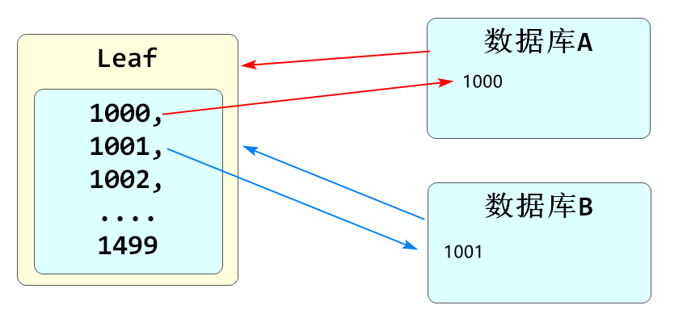
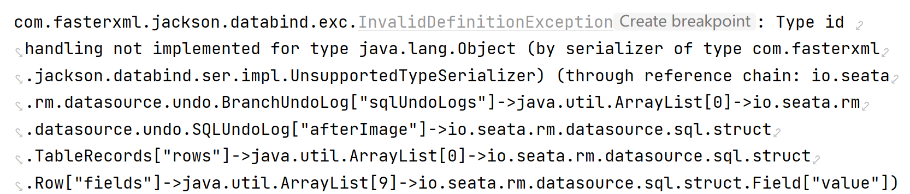
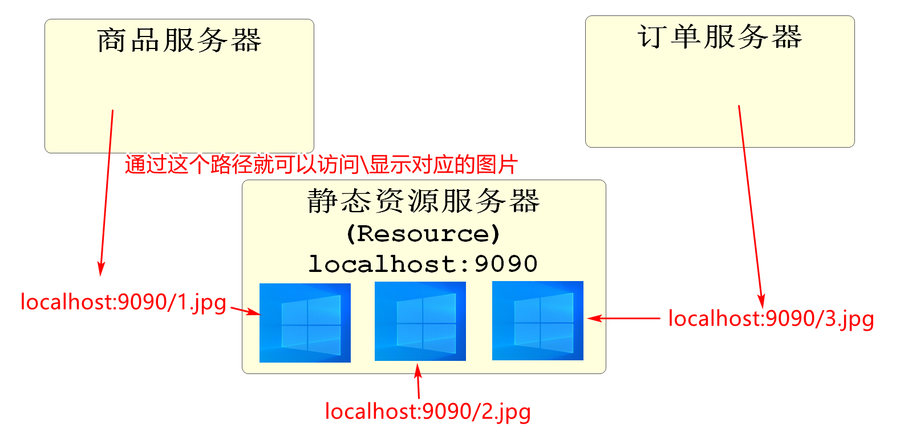

# 续 Leaf

## Leaf的工作原理

Leaf底层支持通过"雪花算法"生成不同id

我们使用的是单纯的序列

要想使用,需要事先设置好leaf的起始值和缓存id数

举例,从1000开始缓存500

也就是从id1000~1499这些值,都会保存在Leaf的内存中,当有服务需要时,直接取出下一个值

取出过的值不会再次生成



leaf要想设置起始值和缓存数

需要给leaf创建一个指定格式的数据库表

运行过程中会从数据库表获取信息

我们当前的信息保存在leafdb.leaf_alloc表中

# 续 开发新增订单功能

## 开发新增订单的业务逻辑层

我们完成订单的新增业务是比较复杂的

可以将整个业务分成三大部分

第一部分是信息的收集

主要是参数类型数据的完整性验证,计算以及转换

第二部分是数据库操作

减少库存,删除购物车,新增订单,和新增订单项

第三部分是收集需要的返回值

我们新增订单成功后,要返回给前端一些信息,例如订单号,实际支付金额等

创建OmsOrderServiceImpl类,代码如下

```java
// 后面的秒杀业务需要调用这个生成订单的方法,所以需要支持dubbo调用
@DubboService
@Service
@Slf4j
public class OmsOrderServiceImpl implements IOmsOrderService {

    @DubboReference
    private IForOrderSkuService dubboSkuService;
    @Autowired
    private IOmsCartService omsCartService;
    @Autowired
    private OmsOrderMapper omsOrderMapper;
    @Autowired
    private OmsOrderItemMapper omsOrderItemMapper;

    // 新增订单的方法
    // 这个方法dubbo调用了Product模块的方法,操作了数据库,有分布式的事务需求
    // 所以要使用注解激活Seata分布式事务的功能
    @GlobalTransactional
    @Override
    public OrderAddVO addOrder(OrderAddDTO orderAddDTO) {
        // 第一部分:收集信息,准备数据
        // 先实例化OmsOrder对象
        OmsOrder order=new OmsOrder();
        // 当前方法参数orderAddDTO有很多order需要的同名属性,直接赋值接口
        BeanUtils.copyProperties(orderAddDTO,order);
        // orderAddDTO中属性比OmsOrder要少,缺少的属性要我们自己赋值或生成
        // 可以编写一个专门的方法,来进行数据的收集
        loadOrder(order);
        // 到此为止,order的普通属性全部赋值完毕
        // 下面要将参数orderAddDTO中包含的订单项(orderItem集合)信息赋值
        // 首先取出这个集合,也就是当前订单中包含的所有商品的集合
        List<OrderItemAddDTO> itemAddDTOs=orderAddDTO.getOrderItems();
        if(itemAddDTOs==null || itemAddDTOs.isEmpty()){
            // 如果当前订单中没有商品,就无法继续生成订单了
            throw new CoolSharkServiceException(ResponseCode.BAD_REQUEST,
                    "订单中必须至少包含一件商品");
        }
        // 我们最终的目标是将当前订单中包含的订单项新增到数据库
        // 当前集合泛型是OrderItemAddDTO,我们编写的新增到数据库的方法泛型是OmsOrderItem
        // 所以我们要编写代码将上集合转换为List<OmsOrderItem>集合
        List<OmsOrderItem> omsOrderItems=new ArrayList<>();
        // 遍历OrderItemAddDTO集合
        for(OrderItemAddDTO addDTO : itemAddDTOs ){
            // 先实例化一个OmsOrderItem对象,以备赋值使用
            OmsOrderItem orderItem=new OmsOrderItem();
            // 将同名属性赋值到orderItem对象中
            BeanUtils.copyProperties(addDTO,orderItem);
            // 将addDTO对象中没有的id和orderId属性赋值
            // 赋值Id
            Long itemId=IdGeneratorUtils.getDistributeId("order_item");
            orderItem.setId(itemId);
            // 赋值orderId
            orderItem.setOrderId(order.getId());
            // 将赋好值的对象添加到omsOrderItems集合中
            omsOrderItems.add(orderItem);
            // 第二部分:执行操作数据库的指令
            // 1.减少库存
            // 当前循环是订单中的一件商品,我们可以在此处对这个商品进行库存的减少
            // 当前对象属性中是包含skuId和要购买的商品数量的,所以可以执行库存的修改
            // 先获取skuId
            Long skuId=orderItem.getSkuId();
            // 修改库存是Dubbo调用的
            int rows=dubboSkuService.reduceStockNum(
                                        skuId,orderItem.getQuantity());
            // 判断rows(数据库受影响的行数)的值
            if(rows==0){
                log.warn("商品库存不足,skuId:{}",skuId);
                // 库存不足不能继续生成订单,抛出异常,终止事务进行回滚
                throw new CoolSharkServiceException(ResponseCode.BAD_REQUEST,
                        "库存不足!");
            }
            // 2.删除勾选的购物车商品
            OmsCart omsCart=new OmsCart();
            omsCart.setUserId(order.getUserId());
            omsCart.setSkuId(skuId);
            // 执行删除的方法
            omsCartService.removeUserCarts(omsCart);
        }
        // 3.执行新增订单
        // omsOrderMapper直接调用新增订单的方法即可
        omsOrderMapper.insertOrder(order);
        // 4.新增订单中所有商品的订单项信息
        // omsOrderItemMapper中编写了批量新增订单项的功能
        omsOrderItemMapper.insertOrderItemList(omsOrderItems);
        // 第三部分:准备返回值,返回给前端
        // 当前业务逻辑层方法返回值为OrderAddVO
        // 我们需要做的就是实例化这个对象,给它赋值并返回
        OrderAddVO addVO=new OrderAddVO();
        // 给addVO各属性赋值
        addVO.setId(order.getId());
        addVO.setSn(order.getSn());
        addVO.setCreateTime(order.getGmtOrder());
        addVO.setPayAmount(order.getAmountOfActualPay());
        // 最后千万别忘了返回addVO!!!!!
        return addVO;
    }

    // 为Order对象补全属性值的方法
    private void loadOrder(OmsOrder order) {
        // 本方法针对order对象没有被赋值的属性,进行生成或手动赋值
        // 给id赋值,订单业务不使用数据库自增列做id,而使用Leaf分布式序列生成系统
        Long id = IdGeneratorUtils.getDistributeId("order");
        order.setId(id);

        // 生成订单号,直接使用UUID即可
        order.setSn(UUID.randomUUID().toString());
        // 赋值UserId
        // 以后秒杀业务调用这个方法时,userId属性是会被赋值的
        // 所以这里要判断一下userId是否已经有值,没有值再赋值
        if (order.getUserId() == null) {
            // 从SpringSecurity上下文中获得当前登录用户id
            order.setUserId(getUserId());
        }

        // 为订单状态赋值
        // 订单状态如果为null ,将其设默认值0,表示未支付
        if (order.getState() == null){
            order.setState(0);
        }

        // 为了保证下单时间和数据创建时间和最后修改时间一致
        // 我们给他们赋相同的值
        LocalDateTime now=LocalDateTime.now();
        order.setGmtOrder(now);
        order.setGmtCreate(now);
        order.setGmtModified(now);

        // 验算实际支付金额
        // 计算公式:   实际支付金额=原价-优惠+运费
        // 数据类型使用BigDecimal,防止浮点偏移,还有更大的取值范围
        BigDecimal price=order.getAmountOfOriginalPrice();
        BigDecimal freight=order.getAmountOfFreight();
        BigDecimal discount=order.getAmountOfDiscount();
        BigDecimal actualPay=price.subtract(discount).add(freight);
        // 最后将计算完成的实际支付金额赋值给order
        order.setAmountOfActualPay(actualPay);

    }

    @Override
    public void updateOrderState(OrderStateUpdateDTO orderStateUpdateDTO) {

    }

    @Override
    public JsonPage<OrderListVO> listOrdersBetweenTimes(OrderListTimeDTO orderListTimeDTO) {
        return null;
    }

    @Override
    public OrderDetailVO getOrderDetail(Long id) {
        return null;
    }


    public CsmallAuthenticationInfo getUserInfo(){
        // 编写SpringSecurity上下文中获得用户信息的代码
        UsernamePasswordAuthenticationToken authenticationToken=
                (UsernamePasswordAuthenticationToken)
                        SecurityContextHolder.getContext().getAuthentication();
        // 为了逻辑严谨性,判断一下SpringSecurity上下文中的信息是不是null
        if(authenticationToken == null){
            throw new CoolSharkServiceException(
                    ResponseCode.UNAUTHORIZED,"您没有登录!");
        }
        // 确定authenticationToken不为null
        // 就可以从中获得用户信息了
        CsmallAuthenticationInfo csmallAuthenticationInfo=
                (CsmallAuthenticationInfo) authenticationToken.getCredentials();
        // 别忘了返回
        return csmallAuthenticationInfo;
    }
    // 业务逻辑层中的方法实际上都只需要用户的id即可
    // 我们可以再编写一个方法,从用户对象中获得id
    public Long getUserId(){
        return getUserInfo().getId();
    }
}
```

## 开发新增订单的控制层

下面开始编写控制层

新建OmsOrderController

```java
@RestController
@RequestMapping("/oms/order")
@Api(tags = "订单管理模块")
public class OmsOrderController {

    @Autowired
    private IOmsOrderService omsOrderService;

    @PostMapping("/add")
    @ApiOperation("执行新增订单的方法")
    @PreAuthorize("hasRole('user')")
    public JsonResult<OrderAddVO> addOrder(@Validated OrderAddDTO orderAddDTO){
        OrderAddVO orderAddVO=omsOrderService.addOrder(orderAddDTO);
        return JsonResult.ok(orderAddVO);

    }

}
```

启动Nacos\seata

依次启动服务Leaf\product\\[passport]\order

访问10005执行新增

## Seata使用常见错误

Seata在开始工作时,会将方法相关对象序列化后保存在对应数据库的undo_log表中

但是Seata我们序列化的方式支持很多中,常见的jackson格式序列化的情况下,不支持java对象LocalDataTime类型的序列化,序列化运行时会发送错误:



如果见到这样的错误, 就是因为jackson不能序列化LocalDataTime导致的

要想解决,两方面思路,

1.将序列化过程中LocalDataTime类型转换为Date

2.将Seata序列化转换为kryo类型,但是需要在pom文件中添加依赖(我们的项目中有)

```xml
<!--解决seata序列化问题-->
<dependency>
    <groupId>io.seata</groupId>
    <artifactId>seata-serializer-kryo</artifactId>
</dependency>
```

yml文件使用kryo序列化对象的配置

```yaml
#seata服务端
seata:
  tx-service-group: csmall_group
  service:
    vgroup-mapping:
      csmall_group: default
    grouplist:
      default: ${my.server.addr}:8091
  client:
    undo:
      log-serialization: kryo
```

# 静态资源服务器

## 什么是静态资源服务器

我们无论做什么项目,都会有一些页面中需要显示的静态资源,例如图片,视频文档等

我们一般会创建一个单独的项目,这个项目中保存静态资源

其他项目可以通过我们保存资源的路径访问



使用静态资源服务器的原因是静态资源服务器可以将项目需要的所有图片统一管理起来

当其他模块需要图片时,可以从数据库中直接获得访问静态资源的路径即可

方便管理所有静态资源

# 前端项目部署

在提供给大家"第五阶段软件和项目.zip"的压缩包中

有csmall-mobile-repo.zip

解压这个压缩包到硬盘

用idea软件open这个解压后文件夹的位置

打开之后要运行这个前端项目

运行前可以参考项目的README.md文件

要运行项目首先需要在Idea的Terminal中输入

```shell
npm install
```

```
C:\Users\TEDU\IdeaProjects\csmall-mobile-repo>npm install
```

运行过程中有警告无视掉

运行完毕之后启动项目

```
npm run serve
```

```
C:\Users\TEDU\IdeaProjects\csmall-mobile-repo>npm run serve
```

之后就可以使用localhost:8080访问了

启动Nacos\Seata\Redis

启动leaf\product\passport\front\order\resource

登录页面:http://localhost:8080/user/login

用户名:jackson

密码:123456

# 订单查询功能

在新增订单成功之后,用户会看到订单列表

可以按时间查询一段时间范围内的订单列表

我们默认查询当前时间一个月以内的所有订单信息

订单信息要包括oms_order和oms_order_item两个表的信息

所以是一个连表查询

## 确定关联查询语句

```sql
SELECT 
	oo.id,
	oo.sn,
	oo.user_id,
	oo.contact_name,
	oo.state,
	oo.amount_of_actual_pay,
	oo.gmt_order,
	oo.gmt_pay,
	oo.gmt_create,
	oo.gmt_modified,
	ooi.id ooi_id,
	ooi.order_id,
	ooi.sku_id,
	ooi.title,
	ooi.price,
	ooi.quantity
FROM oms_order oo
JOIN oms_order_item ooi ON oo.id=ooi.order_id
WHERE
	oo.user_id=1
AND 
	oo.gmt_create > '2022-10-3'
AND
	oo.gmt_create < NOW()	
ORDER BY oo.gmt_modified DESC 
```

## 开发查询订单的持久层

确定了sql语句之后,要在xml文件中使用

OmsOrderMapper添加方法

```java
// 查询当前用户指定时间范围内的所有订单信息(包含订单项)
List<OrderListVO> selectOrdersBetweenTimes(OrderListTimeDTO orderListTimeDTO);
```

OmsOrderMapper.xml文件添加对应的内容

```xml
<!--   声明订单和订单项的关联关系映射   -->
<resultMap id="OrderListMap" type="cn.tedu.mall.pojo.order.vo.OrderListVO">
    <id column="id" property="id" />
    <result column="sn" property="sn" />
    <result column="user_id" property="userId" />
    <result column="contact_name" property="contactName" />
    <result column="state" property="state" />
    <result column="amount_of_actual_pay" property="amountOfActualPay" />
    <result column="gmt_order" property="gmtOrder" />
    <result column="gmt_pay" property="gmtPay" />
    <result column="gmt_create" property="gmtCreate" />
    <result column="gmt_modified" property="gmtModified" />
    <!--  当前实体类中有集合类型属性,要使用collection标签进行映射 -->
    <!--
        property: 指定实体类中映射为集合类型的属性名
        javaType: 指定当前映射集合的类型,默认就是List类型,所以当前实体类映射无需编写
        ofType:   指定当前集合泛型的类型
    -->
    <collection property="orderItems"
                ofType="cn.tedu.mall.pojo.order.vo.OrderItemListVO">
        <id column="ooi_id" property="id" />
        <result column="order_id" property="orderId" />
        <result column="sku_id" property="skuId" />
        <result column="title" property="title" />
        <result column="price" property="price" />
        <result column="quantity" property="quantity" />
    </collection>
</resultMap>

<!--  查询当前用户指定时间范围内的所有订单信息(包含订单项)   -->
<select id="selectOrdersBetweenTimes" resultMap="OrderListMap" >
    SELECT
        oo.id,
        oo.sn,
        oo.user_id,
        oo.contact_name,
        oo.state,
        oo.amount_of_actual_pay,
        oo.gmt_order,
        oo.gmt_pay,
        oo.gmt_create,
        oo.gmt_modified,
        ooi.id ooi_id,
        ooi.order_id,
        ooi.sku_id,
        ooi.title,
        ooi.price,
        ooi.quantity
    FROM oms_order oo
    JOIN oms_order_item ooi ON oo.id=ooi.order_id
    WHERE
        oo.user_id=#{userId}
    AND
        oo.gmt_create &gt; #{startTime}
    AND
        oo.gmt_create &lt; #{endTime}
    ORDER BY
        oo.gmt_modified DESC

</select>
```


# 随笔

序列的产生

事先确定起始值和缓存数

例如起始值1000  缓存10

1000,1001,1002.....1009

上面缓存使用完毕,再继续缓存

1010,1011,1012,.....   1019

..


常见的关系运算符英文缩写

lt < (less than)

gt >(great than)

le <= (less equals)

ge >= (great equals)

eq ==

ne !=(not equals)


