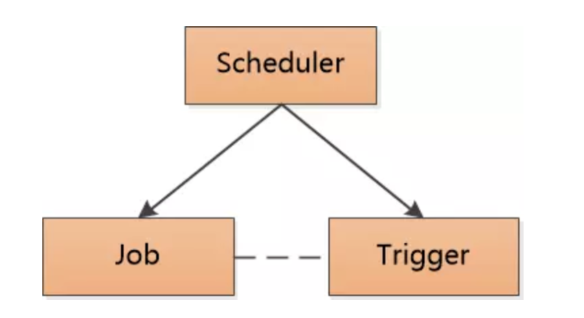

# 续 开发查询订单的功能

## 开发查询订单业务逻辑层

OmsOrderServiceImpl实现类添加实现方法

```java
// 分页和查询当前登录用户,指定时间范围内所有订单
// 默认查询最近一个月的订单信息,查询的返回值OrderListVO,是包含订单信息和订单中商品信息的对象
// 查询依赖了持久层编写好的映射关系,xml文件编写的关联查询!
@Override
public JsonPage<OrderListVO> listOrdersBetweenTimes(
                            OrderListTimeDTO orderListTimeDTO) {
    // 业务逻辑层首先要判断给定的时间范围,如果为空默认最近一个月
    // 如果不为空要保证结束时间大于开始时间,可以编写一个方法专门判断
    validateTimeAndLoadTime(orderListTimeDTO);
    // 将userId赋值到参数中
    orderListTimeDTO.setUserId(getUserId());
    // 分页查询要设置分页条件
    PageHelper.startPage(orderListTimeDTO.getPage(),
                            orderListTimeDTO.getPageSize());
    // 调用关联查询的方法,获得包含订单中商品信息的订单集合
    List<OrderListVO> list=omsOrderMapper
                    .selectOrdersBetweenTimes(orderListTimeDTO);
    // 别忘了返回
    return JsonPage.restPage(new PageInfo<>(list));
}

private void validateTimeAndLoadTime(OrderListTimeDTO orderListTimeDTO) {
    // 获取开始时间和结束时间
    LocalDateTime start=orderListTimeDTO.getStartTime();
    LocalDateTime end=orderListTimeDTO.getEndTime();
    // 为了让我们的业务更加简单明了,我们设计start和end任意一个为空就查询最近一个月的订单
    if(start==null || end==null){
        // start设置为一个月之前的时间
        start= LocalDateTime.now().minusMonths(1);
        end=LocalDateTime.now();
        // 将属性赋值到对象中
        orderListTimeDTO.setStartTime(start);
        orderListTimeDTO.setEndTime(end);
    }else{
        // 如果start和end都非null
        // 就要判断start是否小于end,否则要抛出异常
        if(end.toInstant(ZoneOffset.of("+8")).toEpochMilli()<
                start.toInstant(ZoneOffset.of("+8")).toEpochMilli()){
            // 如果判断表示结束时间小于开始时间,抛出异常
            throw new CoolSharkServiceException(ResponseCode.BAD_REQUEST,
                    "结束时间应大于起始时间!");
        }
    }
}
```

## 开发查询订单的控制层代码

OmsOrderController

```java
@GetMapping("/list")
@ApiOperation("分页查询当前用户指定时间内的订单")
@PreAuthorize("hasRole('user')")
public JsonResult<JsonPage<OrderListVO>> listUserOrders(
        OrderListTimeDTO orderListTimeDTO){
    JsonPage<OrderListVO> jsonPage=
            omsOrderService.listOrdersBetweenTimes(orderListTimeDTO);
    return JsonResult.ok(jsonPage);
}
```

启动Nacos\Seata

如果没有登录的话启动sso做jwt复制

如果有可用的jwt

直接启动order即可

**订单的新增和订单的查询一定要多练习几次**

**面试时一定要会讲述业务流程**

# 开发更新订单状态的功能

## 订单的状态码

我们电商上面订单的状态修改是非常普通的业务

随着商品的购买流程,订单的状态有

状态:

0=未支付

1=已关闭（超时未支付）

2=已取消

3=已支付

4=已签收

5=已拒收

6=退款处理中

7=已退款

## 开发更新订单状态的持久层

修改订单状态就是根据订单id修改订单的state

我们随着业务的发展,订单可能需要更多修改的需求

订单的列(字段)比较多,如果每个字段修改,都需要编写一个方法的话,那么方法的数量会非常多

如果我们编写一个方法,能够接收订单对象的实体类参数(OmsOrder)

我们要实现可以根据OmsOrder对象的实际数据来实现动态的修改要修改的字段

Mybatis中可以通过编写动态修改sql语句完成这个需求

OmsOrderMapper接口添加方法

```java
// 利用动态sql,实现对订单内容的修改
// 参数是OmsOrder类型,且必须包含id值,id不可修改,其他属性如果不为空,就修改为当前值
int updateOrderById(OmsOrder order);
```

OmsOrderMapper.xml编写sql

```xml
<!--
利用动态sql,实现对订单内容的修改
参数是OmsOrder类型,且必须包含id值,id不可修改,其他属性如果不为空,就修改为当前值
-->
<!--
    OmsOrder对象动态修改数据库中数据的sql语句
    Mybatis框架动态生成修改的Sql语句,需要<set>标签
    1. 在<set>标签的位置生成一个set关键字
    2. 在<set></set>标签之间,根据判断动态生成的sql语句,
        如果生成的内容最后一个字符是","就会将它删除!
-->
<update id="updateOrderById">
    update  oms_order
    <set>
        <if test="contactName!=null">
            contact_name=#{contactName},
        </if>
        <if test="mobilePhone!=null">
            mobile_phone=#{mobilePhone},
        </if>
        <if test="telephone!=null">
            telephone=#{telephone},
        </if>
        <if test="streetCode!=null">
            street_code=#{streetCode},
        </if>
        <if test="streetName!=null">
            street_name=#{streetName},
        </if>
        <if test="detailedAddress!=null">
            detailed_address=#{detailedAddress},
        </if>
        <if test="tag!=null">
            tag=#{tag},
        </if>
        <if test="paymentType!=null">
            payment_type=#{paymentType},
        </if>
        <if test="state!=null">
            state=#{state},
        </if>
        <if test="rewardPoint!=null">
            reward_point=#{rewardPoint},
        </if>
        <if test="amountOfOriginalPrice!=null">
            amount_of_original_price=#{amountOfOriginalPrice},
        </if>
        <if test="amountOfFreight!=null">
            amount_of_freight=#{amountOfFreight},
        </if>
        <if test="amountOfDiscount!=null">
            amount_of_discount=#{amountOfDiscount},
        </if>
        <if test="amountOfActualPay!=null">
            amount_of_actual_pay=#{amountOfActualPay},
        </if>
        <if test="gmtPay!=null">
            gmt_pay=#{gmtPay},
        </if>
    </set>
    where
        id=#{id}
</update>
```

## 开发修改订单状态的业务逻辑层

OmsOrderServiceImpl

```java
// 根据订单id,修改订单的状态
@Override
public void updateOrderState(OrderStateUpdateDTO orderStateUpdateDTO) {
    // 参数类型是OrderStateUpdateDTO
    // 修改方法参数类型是OmsOrder,所以要先实例化OmsOrder对象
    OmsOrder order=new OmsOrder();
    // 将参数中的属性值赋值到order对象
    BeanUtils.copyProperties(orderStateUpdateDTO,order);
    // 调用持续层动态修改order的方法即可
    omsOrderMapper.updateOrderById(order);

}
```

## 开发修改订单状态的控制层

OmsOrderController

```java
@PostMapping("/update/state")
@ApiOperation("修改订单状态的方法")
@PreAuthorize("hasRole('user')")
public JsonResult updateOrderState(
        @Validated OrderStateUpdateDTO orderStateUpdateDTO){
    omsOrderService.updateOrderState(orderStateUpdateDTO);
    return JsonResult.ok("修改完成!");
}
```

重启order模块

测试时根据实际数据库订单id,修改knife4j的数据然后再运行

运行后查看数据库中订单状态列是否修改

# 搜索功能

## Elasticsearch加载数据

我们要想完成高效的搜索任务,需要ES的支持

因为数据库的模糊查询效率太低了

我们在前端页面中完成的搜索是从ES中搜索数据

这样就要求,我们在查询之前,需要先将商品信息(spu)保存到ES中

一开始我们使用最原始的办法:从数据库查询出数据之后新增到ES中

## 确认实体类

搜索功能编写在mall-search模块中

它使用的实体类在cn.tedu.mall.pojo.search.eneity包下SpuForElastic

这个类有四个字段是具备分词功能的

所以支持我们使用这4个字段进行查询

```java
/**
 * SPU名称
 */
@Field(name = "name",type = FieldType.Text,
        analyzer = "ik_max_word",searchAnalyzer = "ik_max_word")
@ApiModelProperty(value="SPU名称")
private String name;

//.....

/**
     * 标题
     */
@Field(name="title",type = FieldType.Text,
       analyzer = "ik_max_word",searchAnalyzer = "ik_max_word")
@ApiModelProperty(value="标题")
private String title;

/**
     * 简介
     */
@Field(name="description",type = FieldType.Text,
       analyzer = "ik_max_word",searchAnalyzer = "ik_max_word")
@ApiModelProperty(value="简介")
private String description;

//.....

/**
 * 类别名称（冗余）
 */
@Field(name="category_name",type = FieldType.Text,
       analyzer = "ik_max_word",searchAnalyzer = "ik_max_word")
@ApiModelProperty(value="类别名称（冗余）")
private String categoryName;

//.....
```

## 开发ES的持久层

我们仍然使用SpringDataElasticsearch框架来操作ES

按照SpringData的规范,我们创建包repository

在这个包中创建SpuForElasticRepository接口,代码如下

```java
// SpuForElastic实体类操作ES的持久层接口
// 需要继承SpringData给定的父接口,继承之后可以直接使用提供的基本增删改查方法
@Repository
public interface SpuForElasticRepository extends
                            ElasticsearchRepository<SpuForElastic,Long> {
}
```

这个接口提供了批量新增到ES数据的方法

但是要想获得数据库中的所有pms_spu表的数据,必须连接数据库查询这些数据

但是search模块是负责管理ES的,所以需要Dubbo调用Product模块获取所有数据

## product模块提供的查询功能

我们需要使用Dubbo调用product的业务逻辑层获得数据库pms_spu表的数据

经过观察发现业务逻辑逻辑层调用ForFrontSpuServiceImpl类中

具有一个getSpuByPage的方法

他分页查询所有spu信息

```java
@Override
public JsonPage<Spu> getSpuByPage(Integer pageNum, Integer pageSize) {
    PageHelper.startPage(pageNum,pageSize);
    List<Spu> list=spuMapper.findAllList();
    return JsonPage.restPage(new PageInfo<>(list));
}
```

分页的原因是因为一般加载到ES中的数据量非常大(几十万上百万条),

我们不可能一次性将所有数据查询出来,增到ES中,必须分批分次

分页查询就是典型的分批查询,每次查询一部分数据,通过循环遍历,将每页数据都新增到ES中

## Search模块执行加载

mall-search-webapi模块创建service.impl包

包中创建SearchServiceImpl类,用于将数据库中的数据加载到ES中

代码如下

```java
@Service
@Slf4j
public class SearchServiceImpl implements ISearchService {

    // dubbo调用Product模块分页查询所有spu
    @DubboReference
    private IForFrontSpuService dubboSpuService;
    @Autowired
    private SpuForElasticRepository spuRepository;

    @Override
    public void loadSpuByPage() {
        // 循环完成分页查询所有数据,
        // 每循环一次,将查询到的当页数据新增到ES,直到最后一页
        // 因为是需要运行一次之后,才知道总页数,所以这里采用do-while循环结构
        int i=1;     // 循环变量i,从1开始,因为可以同时用作页码值
        int pages;   // 总页数,在循环进行一次之后,才能被赋值,这里可以只声明或赋默认值

        do{
            // dubbo调用查询当前也的spu数据
            JsonPage<Spu> spus=dubboSpuService.getSpuByPage(i,2);
            // 我们从数据查询出来的类型Spu不能直接向ES中执行新增
            // 需要转换为SpuForElastic类型,所以我们先声明这样类型的集合
            List<SpuForElastic> esSpus=new ArrayList<>();
            // 遍历数据库中查询出的当页数据
            for(Spu spu : spus.getList()){
                // 下面开始转换,实例化新实体类,并将同名属性赋值给它
                SpuForElastic esSpu=new SpuForElastic();
                BeanUtils.copyProperties(spu,esSpu);
                // 赋值完成后,添加到上面的集合中!
                esSpus.add(esSpu);
            }
            // esSpus集合中已经包含了本次查询的所有数据,下面执行批量新增到ES的操作
            spuRepository.saveAll(esSpus);
            log.info("成功加载了第{}页数据",i);
            // 下次循环i值自增
            i++;
            // 给pages赋值总页数
            pages=spus.getTotalPage();
        }while(i<=pages);


    }

    @Override
    public JsonPage<SpuForElastic> search(String keyword, Integer page, Integer pageSize) {
        return null;
    }
}
```

创建测试类运行即可

```java
// 下面注解必须加!!!!!!
@SpringBootTest
public class SpuElasticTest {

    @Autowired
    private ISearchService searchService;

    @Test
    void loadData(){
        searchService.loadSpuByPage();
        System.out.println("ok");
    }
}
```

运行测试前保证

Nacos\Seata\\**ES**启动

启动product模块

运行测试,没有报错即可

## 验证ES中的数据

我们再通过连接ES来进行全查

检验上面执行的加载工作是否达到效果

仍然在测试类中,在编写一个方法,使用SpringData提供的全查方法查询后遍历输出

检查输出内容,代码如下

```java
@Autowired
private  SpuForElasticRepository spuRepository;
@Test
void showData(){
    Iterable<SpuForElastic> spus=spuRepository.findAll();
    spus.forEach(spu -> System.out.println(spu));
}
```

## 搜索功能的实现

电商网站一定会有按用户输入的关键字进行搜索的功能

这样的搜索都是搜索ES查询到的结果

上面章节中,我们已经将所有spu信息保存到了ES中

下面通过查询逻辑将搜索结果显示出来

### 编写SpringData自定义查询

如果我们按照关键字"手机"进行搜索

可以在Repository接口中编写自定义方法

```java
@Repository
public interface SpuForElasticRepository extends
                            ElasticsearchRepository<SpuForElastic,Long> {
    // 查询title字段包含指定关键字(分词)的spu数据
    Iterable<SpuForElastic> querySpuForElasticsByTitleMatches(String title);

}
```

上面的查询可以通过测试类测试

```java
@Test
void getSpuByTitle(){
    // 根据title指定的分词查询数据
    Iterable<SpuForElastic> spus=
            spuRepository.querySpuForElasticsByTitleMatches("手机");
    spus.forEach(spu -> System.out.println(spu));
}
```

尤其需要关注ES是否已经启动

不需要其它项目的支持,直接运行测试即可

我们业务中需要4个字段的条件查询,是可以通过方法名称的编写实现的

SpringData也支持我们在代码中编写查询语句,以避免过长的方法名

```java
@Query("{\n" +
        "    \"bool\": {\n" +
        "      \"should\": [\n" +
        "        { \"match\": { \"name\": \"?0\"}},\n" +
        "        { \"match\": { \"title\": \"?0\"}},\n" +
        "        { \"match\": { \"description\": \"?0\"}},\n" +
        "        { \"match\": { \"category_name\": \"?0\"}}\n" +
        "        ]\n" +
        "     }\n" +
        "}")
// 上面指定查询语句的情况下,方法的方法名就可以随意起名了,参数对应查询语句中的"?0"
Iterable<SpuForElastic> querySearch(String keyword);
```

测试代码

```java
@Test
void getSpuByQuery(){
    // 调用查询四个字段包含指定关键字数据的方法
    Iterable<SpuForElastic> spus=
            spuRepository.querySearch("华为手机");
    spus.forEach(spu -> System.out.println(spu));
}
```

在实际开发中

我们数据库中的数据和Elasticsearch中的数据还存在同步问题

为了保持数据库中的数据和Elasticsearch中的数据一致

我们可以使用下面的办法

1.在所有对spu表进行增删改的操作代码运行后,也对ES中的数据进行相同的操作

​	但是会有比较多的代码要编写,而且有比较明显的事务处理问题

2.实际上业界使用Elasticsearch有一个组合叫ELK,其中L(logstash)可以实现自动同步数据库和ES的信息

后面学习过程中,我们会在Linux虚拟机的学习中使用它

实际运行查询的逻辑是需要分页的

所以要按照SpringData支持的分页查询格式修改上面的查询代码

```java
@Query("{\n" +
        "    \"bool\": {\n" +
        "      \"should\": [\n" +
        "        { \"match\": { \"name\": \"?0\"}},\n" +
        "        { \"match\": { \"title\": \"?0\"}},\n" +
        "        { \"match\": { \"description\": \"?0\"}},\n" +
        "        { \"match\": { \"category_name\": \"?0\"}}\n" +
        "        ]\n" +
        "     }\n" +
        "}")
// 上面指定查询语句的情况下,方法的方法名就可以随意起名了,参数对应查询语句中的"?0"
//↓↓↓↓                                          ↓↓↓↓↓↓↓↓↓↓↓↓↓↓↓
Page<SpuForElastic> querySearch(String keyword, Pageable pageable);
```

修改了方法的定义,原有的调用会报错,注释掉测试中的调用代码即可!

### 开发搜索功能的业务逻辑层

SearchServiceImpl类添加实现方法如下

```java
// 根据指定关键字分页查询ES中商品信息的方法
@Override
public JsonPage<SpuForElastic> search(
        String keyword, Integer page, Integer pageSize) {
    // 根据参数中的分页数据,执行分页查询,注意SpringData分页页码从0开始
    Page<SpuForElastic> spus=spuRepository.querySearch(
                          keyword, PageRequest.of(page-1,pageSize));
    // 当前业务逻辑层返回值是JsonPage类型,但是我们SpringData查询返回Page类型
    // 我们需要将Page类型对象转换为JsonPage返回
    // 可以在JsonPage类中编写一个专门转换的方法,也可以直接在当前方法中转换
    JsonPage<SpuForElastic> jsonPage=new JsonPage<>();
    // 分页信息
    jsonPage.setPage(page);
    jsonPage.setPageSize(pageSize);
    jsonPage.setTotal(spus.getTotalElements());
    jsonPage.setTotalPage(spus.getTotalPages());
    // 分页数据
    jsonPage.setList(spus.getContent());
    // 别忘了返回!!!
    return jsonPage;
}
```

### 开发控制层代码

创建controller包

包中创建SearchController编写搜索方法,代码如下

```java
@RestController
@RequestMapping("/search")
@Api(tags = "搜索模块")
public class SearchController {
    @Autowired
    private ISearchService searchService;

    // 搜索功能设计的路径为: localhost:10008/search
    // 因为搜索模块功能少,路径可以尽量简练
    // @GetMapping后面什么都不写,就表示采用类上声明的/search路径即可
    @GetMapping
    @ApiOperation("根据用户输入的关键字分页查询商品信息")
    @ApiImplicitParams({
          @ApiImplicitParam(value = "搜索关键字",name = "keyword",example = "手机"),
          @ApiImplicitParam(value = "页码",name = "page",example = "1"),
          @ApiImplicitParam(value = "每页条数",name = "pageSize",example = "2"),
    })
    public JsonResult<JsonPage<SpuForElastic>> searchByKeyword(
            String keyword,Integer page,Integer pageSize){
        JsonPage<SpuForElastic> jsonPage=
                searchService.search(keyword, page, pageSize);
        return JsonResult.ok(jsonPage);
    }

}
```

保证Nacos\seata\ES启动

因为当前search项目过滤器解析JWT所以需要登录才能访问

启动search模块

建议启动passport模块去进行登录获得jwt

复制JWT后,粘贴到10008模块的全局参数,再测试运行search模块

测试路径http://localhost:10008/doc.html

# Quartz

## 什么是Quartz

quartz:石英钟的意思

是一个当今市面上流行的高效的任务调度管理工具

所谓"调度"就是制定好的什么时间做什么事情的计划

由OpenSymphony开源组织开发

Symphony:交响乐

是java编写的,我们使用时需要导入依赖即可

## 为什么需要Quartz

所谓"调度"就是制定好的什么时间做什么事情的计划

我们使用过的最简单的调度方法就是Timer

但是Timer的调度功能过于单一,只能是指定时间的延时调用和周期运行

而Quartz可以更详细的指定时间,进行计划调用

## Quartz核心组件



调度器:Scheduler       

任务:job

触发器:Trigger

调度器来配置\计划什么时间触发什么任务

简单来说就是调度器规定什么时间做什么事情

- job(工作\任务):Quartz 实现过程中是一个接口,接口中有一个方法execute(执行的意思)

​	  我们创建一个类,实现这个接口,在方法中编写要进行的操作(执行具体任务)

​      我们还需要一个JobDetail的类型的对象,Quartz每次执行job时

​	  会实例化job类型对象,去调用这个方法,JobDetail是用来描述Job实现类的静态信息,	

​      比如任务运行时在Quartz中的名称

- Trigger(触发器):能够描述触发指定job的规则,分为简单触发和复杂触发

  简单触发可以使用SimplTrigger实现类.功能类似timer

  复杂触发可以使用CronTrigger实现类,内部利用cron表达式描述各种复杂的时间调度计划

- Scheduler(调度器):一个可以规定哪个触发器绑定哪个job的容器

  在调度器中保存全部的Quartz 保存的任务

  SpringBoot框架下,添加Quartz依赖后,调度器由SpringBoot管理,我们不需要编写

## Cron表达式

Cron表达式是能够制定触发时间的一个格式


表示2022年11月5日凌晨4点触发的cron表达式

> 0 0 4 5 11 ? 2022

- \* 表示任何值,如果在分的字段上编写*,表示每分钟都会触发

- , 是个分割符如果秒字段我想20秒和40秒时触发两次就写  20,40

- \- 表示一个区间 秒字段5-10 表示 5,6,7,8,9,10

- / 表示递增触发 秒字段 5/10表示5秒开始每隔10秒触发一次

  日字段编写1/3表示从每月1日起每隔3天触发一次


- ? 表示不确定值, 因为我们在定日期时,一般确定日期就不确定是周几,相反确定周几时就不确定日期

- L 表示last最后的意思,我们可以设置当月的最后一天,就会在日字段用L表示,

  周字段使用L表示本月的最后一个周几,一般会和1-7的数字组合

  例如6L表示本月的最后一个周五
  
- W (work)表示最近的工作日(单纯的周一到周五) 如果日字段编写15W表示

  每月15日最近的工作日触发,如果15日是周六就14日触发,如果15日是周日就16日触发

  LW通常一起使用,表示本月的最后一个工作日

- \# 表示第几个,只能使用在周字段上 6#3表示每月的第三个周五

  如果#后面数字写大了,是一个不存在的日期,那就不运行了

  适合设计在母亲节或父亲节这样的日期运行

  

每年的母亲节(5月份第三个周日)早上9点触发

```
0 0 4 ? 5 1#3
```

每个月10日发工资如果10日是休息日,就在最近的工作日发

```
0 0 9 10W * ?
```

每年双11运行

```
0 0 0 11 11 ? 
```

网络上可用的Cron表达式生成器很多

推荐一个http://cron.ciding.cc/


