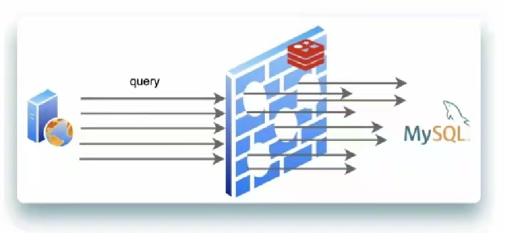
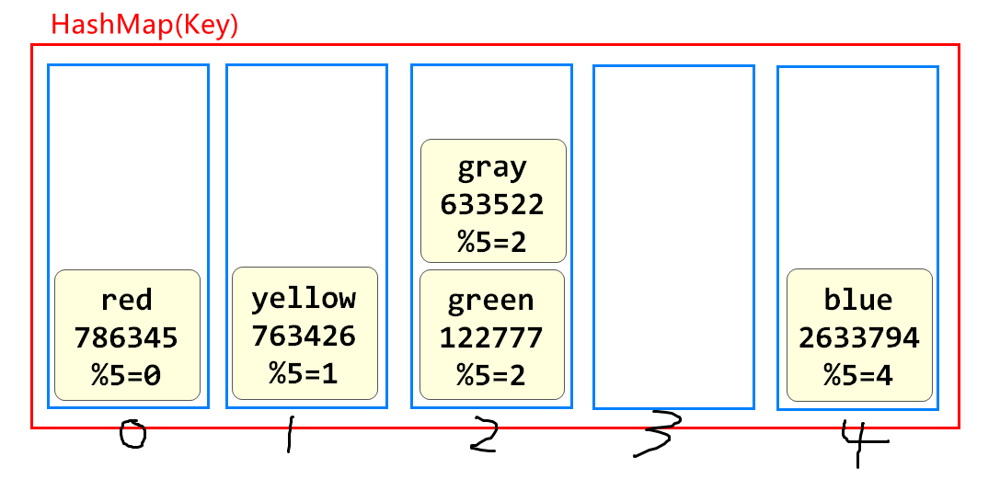
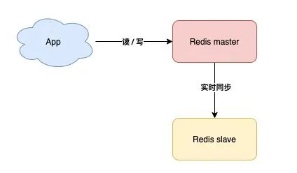
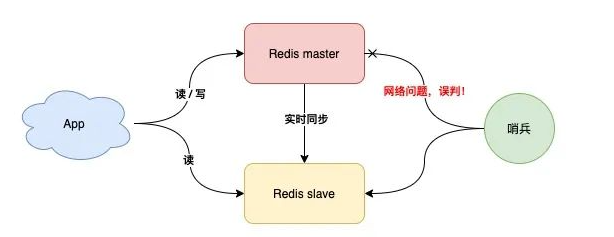
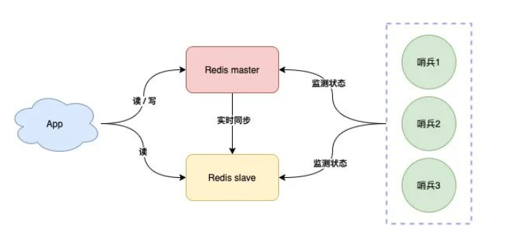

# 续 Quartz

## SpringBoot使用Quartz

SpringBoot框架下使用Quartz格式还是非常固定的

我们选用之前学习微服务的项目csmall减少对大项目的影响

首先添加依赖

我们选择csmall-stock-webapi模块pom文件

```xml
<!--   SpringBoot 整合 Quartz依赖   -->
<dependency>
    <groupId>org.springframework.boot</groupId>
    <artifactId>spring-boot-starter-quartz</artifactId>
</dependency>
```

先编写要执行的任务

当前项目模块中创建quartz包

包中创建一个QuartzJob的类,实现Job接口

代码如下

```java
@Slf4j
public class QuartzJob implements Job {
    @Override
    public void execute(JobExecutionContext jobExecutionContext) throws JobExecutionException {
        // 一个简单的任务演示
        // 输出当前系统时间,使用sout或log皆可
        log.info("---------------"+ LocalDateTime.now() +"-----------------");
    }
}
```

上面编写的是Job接口的实现类,要想运行还需要将它封装为JobDetail对象保存在Spring容器中

还有要创建一个Trigger设置要运行的时机,也保存到Spring容器中

在quartz包下,再创建一个QuartzConfig类,其中编写它们的调度绑定关系

这个格式是固定的,后面再需要绑定,直接套用即可

```java
// QuartzConfig类来绑定调用方法和触发的关系
// 这个触发实际上由被Spring管理的Scheduler对下调度的
// 配置Spring容器,所以要添加@Configuration注解
@Configuration
public class QuartzConfig {
    // 配置的核心是一个JobDetail和一个Trigger对象
    // JobDetail是任务内容,Trigger表示触发时机

    // 利用@Bean注解,将这个两个对象分别保存到Spring容器中
    @Bean
    public JobDetail showTime(){
        System.out.println("!!!!!!!!!!!!!!!!!!!!!!!");
        // 利用JobBuilder类的newJob方法指定要运行的Job实现类的反射,我们编写的就是QuartzJob
        return JobBuilder.newJob(QuartzJob.class)
                // 需要为当前任务起个名字,方便Quartz调用
                .withIdentity("dateTime")
                // 默认情况下,JobDetail对象生成后,如果没有触发器绑定会被立即移除
                // 设置storeDurably方法后,当前JobDetail对象生成后,不会被移除了
                .storeDurably()
                .build();
    }

    // 下面开始编写触发器对象的声明
    // 它来设置上面JobDetail指定的任务的运行时机
    @Bean
    public Trigger showTimeTrigger(){
        System.out.println("+++++++++++++++++++");
        // 声明cron表达式,定义触发时间
        CronScheduleBuilder cron=
                CronScheduleBuilder.cronSchedule("0 40 10 * * ?");
        return TriggerBuilder.newTrigger()
                // 设置要绑定的jobDetail对象
                .forJob(showTime())
                // 也要给当前触发器对象起名字
                .withIdentity("dateTrigger")
                // 设置绑定cron表达式
                .withSchedule(cron)
                .bu0ild();
    }

}
```

Nacos\Seata需要启动

其他服务和软件都可以关闭

然后启动csmall-stock-webapi模块

观察控制台输出

## 课后作业

在csmall-stock项目中写

利用Quart实现

每隔2分钟运行一次添加库存的操作,PC100号商品的库存添加10

```java
@Slf4j
public class QuartzAddStock implements Job {

    @Autowired
    private IStockService stockService;

    @Override
    public void execute(JobExecutionContext jobExecutionContext) throws JobExecutionException {
        StockReduceCountDTO countDTO=new StockReduceCountDTO();
        countDTO.setCommodityCode("PC100");
        countDTO.setReduceCount(-10);
        stockService.reduceCommodityCount(countDTO);
        log.info("Quartz修改库存数量完成");
    }
}
```

配置内容如下

```java
@Bean
public JobDetail addStock(){
    return JobBuilder.newJob(QuartzAddStock.class)
            .withIdentity("addStock")
            .storeDurably()
            .build();
}

@Bean
public Trigger addStockTrigger(){
    CronScheduleBuilder cron=
            CronScheduleBuilder.cronSchedule("30 1/2 * * * ?");
    return TriggerBuilder.newTrigger()
            .forJob(addStock())
            .withIdentity("addStockTrigger")
            .withSchedule(cron)
            .build();
}
```

# Redis 强化

## 缓存使用原则

什么时候,什么样的数据能够保存在Redis中?

1.数据量不能太大

2.使用越频繁,Redis保存这个数据越值得

3.保存在Redis中的数据一般不会是数据库中频繁修改的

## 缓存淘汰策略

Redis将数据保存在内存中, 内存的容量是有限的

如果Redis服务器的内存已经全满,现在还需要向Redis中保存新的数据,如何操作,就是缓存淘汰策略

* noeviction：返回错误**(默认)**

如果我们不想让它发生错误,就可以设置它将满足某些条件的信息删除后,再将新的信息保存

* allkeys-random：所有数据中随机删除数据 
* volatile-random：有过期时间的数据中随机删除数据 
* volatile-ttl：删除剩余有效时间最少的数据 
* allkeys-lru：所有数据中删除上次使用时间距离现在最久的数据 
* volatile-lru：有过期时间的数据中删除上次使用时间距离现在最久的数据 
* allkeys-lfu：所有数据中删除使用频率最少的 
* volatile-lfu：有过期时间的数据中删除使用频率最少的

Time To Live   (ttl)

Least Recently Used (lru)

Least Frequently Used  (lfu)

## 缓存穿透

所谓缓存穿透,就是一个业务请求先查询redis,redis没有这个数据,那么就去查询数据库,但是数据库也没有的情况

正常业务下,一个请求查询到数据后,我们可以将这个数据保存在Redis

之后的请求都可以直接从Redis查询,就不需要再连接数据库了

但是一旦发生上面的穿透现象,仍然需要连接数据库,一旦连接数据库,项目的整体效率就会被影响

如果有恶意的请求,高并发的访问数据库中不存在的数据,严重的,当前服务器可能出现宕机的情况

解决方案:业界主流解决方案:布隆过滤器

布隆过滤器的使用步骤

1.针对现有所有数据,生成布隆过滤器,保存在Redis中

2.在业务逻辑层,判断Redis之前先检查这个id是否在布隆过滤器中

3.如果布隆过滤器判断这个id不存在,直接返回

4.如果布隆过滤器判断id存在,在进行后面业务执行

## 缓存击穿

一个计划在Redis保存的数据,业务查询,查询到的数据Redis中没有,但是数据库中有

这种情况要从数据库中查询后再保存到Redis,这就是缓存击穿

但是这个情况也不是异常情况,因为我们大多数数据都需要设置过期时间,而过期时间到时,这个数据就会从Redis中移除,再有请求查询这个数据,就一定会从数据库中再次同步


缓存击穿本身并不是灾难性的问题,也不是不允许发生的现象

## 缓存雪崩

上面讲到击穿现象

同一时间发生少量击穿是正常的

但是如果出现同一时间大量击穿现象就会如下图



所谓缓存雪崩,指的就是Redis中保存的数据,短时间内有大量数据同时到期的情况

如上图所示,本应该由Redis反馈的信息,由于雪崩都去访问了Mysql,mysql承担不了,非常可能导致异常

要想避免这种情况,就需要避免大量缓存同时失效

大量缓存同时失效的原因:**通常是同时加载的数据设置了相同的有效期导致的**

我们可以通过在设置有效期时添加一个随机数,这样就能够防止大量数据同时失效了

## Redis持久化

Redis将信息保存在内存

内存的特征就是一旦断电,所有信息都丢失,对于Redis来讲,所有数据丢失后,再重新加载数据,就需要从数据库重新查询所有数据,这个操作不但耗费时间,而且对数据库的压力也非常大

而且有些业务是先将数据保存在Redis,隔一段时间和数据库同步的

如果Redis断电,这段时间的数据就完全丢失了!

为了防止Redis的重启对数据库带来额外的压力和数据的丢失,Redis支持了持久化的功能

所谓持久化就是将Redis中保存的数据,以指定方式保存在Redis当前服务器的硬盘上

如果存在硬盘上,那么断电数据也不会丢失,再启动Redis时,利用硬盘中的信息来回复数据

Redis实现持久化有两种策略

### RDB:(Redis Database Backup)

RDB本质上就是数据库快照(就是当前Redis中所有数据转换成二进制的对象,保存在硬盘上)

默认情况下,每次备份会生成一个dump.rdb的文件

当Redis断电或宕机后,重新启动时,会从这个文件中恢复数据,获得dump.rdb中所有内容

实现这个效果我们可以在Redis的配置文件中添加如下信息

```
save 60 5
```

上面配置中60表示秒

5表示Redis的key被修改的次数

配置效果:1分钟内如果有5个key以上被修改,就启动rdb数据库快照程序

优点:

* 因为是整体Redis数据的二进制格式,数据恢复是整体恢复的

缺点:

* 生成的rdb文件是一个硬盘上的文件,读写效率是较低的
* 如果突然断电,只能恢复最后一次生成的rdb中的数据

### AOF(Append Only File):

AOF策略是将Redis运行过的所有命令(日志)备份下来,保存在硬盘上

这样即使Redis断电,我们也可以根据运行过的日志,恢复为断电前的样子

我们可以在Redis的配置文件中添加如下配置信息

```
appendonly yes
```

经过这个设置,就能保存运行过的指令的日志了

理论上任何运行过的指令都可以恢复

但是实际情况下,Redis非常繁忙时,我们会将日志命令缓存之后,整体发送给备份,减少io次数以提高备份的性能 和对Redis性能的影响

实际开发中,配置一般会采用每秒将日志文件发送一次的策略,断电最多丢失1秒数据

优点:

​		相对RDB来讲,信息丢失的较少

缺点:

​		因为保存的是运行的日志,所以占用空间较大


实际开发中RDB和AOF是可以同时开启的,也可以选择性开启

> Redis的AOF为减少日志文件的大小,支持AOF rewrite
>
> 简单来说就是将日志中无效的语句删除,能够减少占用的空间

## Redis存储原理

我们在编写java代码业务时,如果需要从多个元素的集合中寻找某个元素取出,或检查某个Key在不在的时候,推荐我们使用HashMap或HashSet,因为这种数据结构的查询效率最高,因为它内部使用了

**"散列表"**

下图就是散列表的存储原理



槽位越多代表元素多的时候,查询性能越高,HashMap默认16个槽

Redis底层保存数据用的也是这样的散列表的结构

Redis将内存划分为16384个区域(类似hash槽)

将数据的key使用CRC16算法计算出一个值,取余16384

得到的结果是0~16383

这样Redis就能非常高效的查找元素了

## Redis集群

Redis最小状态是一台服务器

这个服务器的运行状态,直接决定Redis是否可用

如果它离线了,整个项目就会无Redis可用

系统会面临崩溃

为了防止这种情况的发生,我们可以准备一台备用机

**主从复制**



也就是主机(master)工作时,安排一台备用机(slave)实时同步数据,万一主机宕机,我们可以切换到备机运行

缺点,这样的方案,slave节点没有任何实质作用,只要master不宕机它就和没有一样,没有体现价值

**读写分离**


这样slave在master正常工作时也能分担Master的工作了

但是如果master宕机,实际上主备机的切换,实际上还是需要人工介入的,这还是需要时间的

那么如果想实现发生故障时自动切换,一定是有配置好的固定策略的

**哨兵模式**:故障自动切换


哨兵节点每隔固定时间向所有节点发送请求

如果正常响应认为该节点正常

如果没有响应,认为该节点出现问题,哨兵能自动切换主备机

如果主机master下线,自动切换到备机运行



但是如果哨兵判断节点状态时发生了误判,那么就会错误将master下线,降低整体运行性能

所以要减少哨兵误判的可能性

**哨兵集群**



我们可以将哨兵节点做成集群,由多个哨兵投票决定是否下线某一个节点

哨兵集群中,每个节点都会定时向master和slave发送ping请求

如果ping请求有2个(集群的半数节点)以上的哨兵节点没有收到正常响应,会认为该节点下线

当业务不断扩展,并发不断增高时

**分片集群**

只有一个节点支持写操作无法满足整体性能要求时,系统性能就会到达瓶颈

这时我们就要部署多个支持写操作的节点,进行分片,来提高程序整体性能

分片就是每个节点负责不同的区域

Redis0~16383号槽,

例如

MasterA负责0~5000

MasterB负责5001~10000

MasterC负责10001~16383

一个key根据CRC16算法只能得到固定的结果,一定在指定的服务器上找到数据


有了这个集群结构,我们就能更加稳定和更加高效的处理业务请求了

**为了节省哨兵服务器的成本,有些公司在Redis集群中直接添加哨兵功能,既master/slave节点完成数据读写任务的同时也都互相检测它们的健康状态**

> 有额外精力的同学,可以自己查询Redis分布式锁的解决方案(redission)

# 秒杀业务准备

## 准备工作概述

学习秒杀的目的是让同学们了解高并发在微服务项目中的处理流程

指定一些基本的高并发处理标准动作

酷鲨商城定时秒杀业务就是一个模拟高并发的业务场景

每秒请求数8000并发500~800

网站在线用户20000(到30000)

日活跃用户50000(到80000)

学习完秒杀业务,我们能具备处理一般高并发业务的基本逻辑

## 开发查询秒杀商品列表功能

秒杀模块是mall-seckill,这个模块操作的数据库是mall-seckill

数据库中包含秒杀spu信息(seckill_spu)和秒杀sku信息(seckill_sku)以及秒杀成功记录(success)

首先我们先将秒杀列表的功能开发

### 开发持久层

mall-seckill-webapi项目

创建mapper包,创建SeckillSpuMapper,代码如下

```java
@Repository
public interface SeckillSpuMapper {
    // 查询秒杀商品列表的方法
    List<SeckillSpu> findSeckillSpus();
}
```

SeckillSpuMapper.xml编写对应查询

```xml
<!--   秒杀spu表的sql语句字段的片段   -->
<sql id="SimpleField">
    <if test="true">
        id,
        spu_id,
        list_price,
        start_time,
        end_time,
        gmt_create,
        gmt_modified
    </if>
</sql>
<!--  查询秒杀商品列表的方法  -->
<select id="findSeckillSpus" resultMap="BaseResultMap" >
    select
        <include refid="SimpleField" />
    from
        seckill_spu
</select>
```

### 开发业务逻辑层

创建包service.impl

包中创建SeckillSpuServiceImpl实现ISeckillSpuService

代码如下

```java
@Service
@Slf4j
public class SeckillSpuServiceImpl implements ISeckillSpuService {
    //  装配查询秒杀Spu列表的Mapper
    @Autowired
    private SeckillSpuMapper seckillSpuMapper;

    // 查询方法的返回值泛型为SeckillSpuVO,其中包含很多普通spu表中的信息
    // 所以我们还要在代码中Dubbo调用根据spuId查询普通spu信息的方法,还是product模块
    @DubboReference
    private IForSeckillSpuService dubboSeckillSpuService;

    // 分页查询秒杀商品信息
    // 这个方法的返回值泛型是SeckillSpuVO,其中包含了常规spu信息和秒杀spu信息
    // 所以这个方法中我们要先查询秒杀信息,在查询常规信息,最后将信息整合一起返回
    @Override
    public JsonPage<SeckillSpuVO> listSeckillSpus(Integer page, Integer pageSize) {
        // 设置分页条件,准备分页查询
        PageHelper.startPage(page,pageSize);
        // 然后进行查询,获得分页数据
        List<SeckillSpu> seckillSpus=seckillSpuMapper.findSeckillSpus();
        // 我们要实例化一个SeckillSpuVO泛型的集合,以备赋值和最后的返回
        List<SeckillSpuVO> seckillSpuVOs=new ArrayList<>();
        // 遍历从数据库中查询出的所有秒杀商品列表
        for(SeckillSpu seckillSpu : seckillSpus){
            // 获得秒杀商品的spuId
            Long spuId=seckillSpu.getSpuId();
            // 根据这个SpuId利用dubbo去查询这个spu的常规信息
            SpuStandardVO spuStandardVO=dubboSeckillSpuService.getSpuById(spuId);
            // 秒杀信息在seckillSpu中,常规信息在spuStandardVO中
            // 下面就是要将上面两个对象的属性都赋值到SeckillSpuVO对象中
            SeckillSpuVO seckillSpuVO=new SeckillSpuVO();
            // 常规信息都在spuStandardVO中,所以直接将同名属性赋值
            BeanUtils.copyProperties(spuStandardVO,seckillSpuVO);
            // 秒杀信息要单独赋值,因为不全是同名属性
            seckillSpuVO.setSeckillListPrice(seckillSpu.getListPrice());
            seckillSpuVO.setStartTime(seckillSpu.getStartTime());
            seckillSpuVO.setEndTime(seckillSpu.getEndTime());
            // 到此为止seckillSpuVO包含了常规spu信息和秒杀spu信息
            // 将这个对象保存到集合
            seckillSpuVOs.add(seckillSpuVO);
        }
        // 最后别忘了返回
        return JsonPage.restPage(new PageInfo<>(seckillSpuVOs));
    }

    @Override
    public SeckillSpuVO getSeckillSpu(Long spuId) {
        return null;
    }

    @Override
    public SeckillSpuDetailSimpleVO getSeckillSpuDetail(Long spuId) {
        return null;
    }
}
```

### 开发控制层

创建controller包

创建SeckillSpuController类

代码如下

```java
@RestController
@RequestMapping("/seckill/spu")
@Api(tags = "秒杀spu模块")
public class SeckillSpuController {

    @Autowired
    private ISeckillSpuService seckillSpuService;

    @GetMapping("/list")
    @ApiOperation("分页查询秒杀spu商品列表")
    @ApiImplicitParams({
            @ApiImplicitParam(value = "页码",name = "page",example = "1"),
            @ApiImplicitParam(value = "每页条数",name = "pageSize",example = "10")
    })
    public JsonResult<JsonPage<SeckillSpuVO>> listSeckillSpus(
            Integer page,Integer pageSize){
        JsonPage<SeckillSpuVO> jsonPage=seckillSpuService
                .listSeckillSpus(page,pageSize);
        return JsonResult.ok(jsonPage);

    }


}
```

启动服务

Nacos\Seata\Redis

启动我们的项目

product\passport\seckill

测试端口10007


# 随笔


A   1分钟内使用了35次

B   1分钟内使用了20次

C    1分钟内使用了27次


master主人

slave 随从\奴隶


