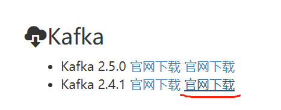

# 续 秒杀业务准备

## 开发根据SpuId查询秒杀Sku列表信息

我们将秒杀的商品Spu列表查询出来

当用户选择一个商品时

我们要将这个商品的sku也查询出来

也就是根据SpuId查询Sku的列表

创建SeckillSkuMapper

```java
@Repository
public interface SeckillSkuMapper {

    // 根据spuId查询sku列表
    List<SeckillSku> findSeckillSkusBySpuId(Long spuId);

}
```

SeckillSkuMapper.xml文件添加内容

```xml
<sql id="SimpleField">
    <if test="true">
        id,
        sku_id,
        spu_id,
        seckill_stock,
        seckill_price,
        gmt_create,
        gmt_modified,
        seckill_limit
    </if>
</sql>
<!--   根据spuId查询sku列表   -->
<select id="findSeckillSkusBySpuId" resultMap="BaseResultMap">
    select
        <include refid="SimpleField" />
    from
        seckill_sku
    where
        spu_id=#{spuId}
</select>
```

## 根据当前时间查询正在进行秒杀的商品

根据给定时间查询出正在进行秒杀的商品列表

在秒杀过程中,一定会将当前时间正在进行秒杀商品查询出来的

首先保证数据库中的seckill_spu表的数据正在秒杀时间段(检查数据,如果不在秒杀时间段,将结束时间后移如2024年)

SeckillSpuMapper添加方法

```java
// 根据指定时间,查询正在进行秒杀的商品列表
List<SeckillSpu> findSeckillSpusByTime(LocalDateTime time);
```

SeckillSpuMapper.xml

```xml
<!--  根据指定时间,查询正在进行秒杀的商品列表 -->
<select id="findSeckillSpusByTime" resultMap="BaseResultMap">
    select
        <include refid="SimpleField" />
    from
        seckill_spu
    where
        start_time &lt; #{time}
    and
        end_time &gt; #{time}
</select>
```

## 根据SpuId查询秒杀商品详情

SeckillSpuMapper接口添加方法

```java
// 根据SpuId查询spu秒杀信息
SeckillSpu findSeckillSpuById(Long spuId);
```

SeckillSpuMapper.xml添加内容

```xml
<!-- 根据SpuId查询spu秒杀信息  -->
<select id="findSeckillSpuById" resultMap="BaseResultMap">
    select
        <include refid="SimpleField" />
    from
        seckill_spu
    where
        spu_id=#{spuId}
</select>
```

## 查询所有秒杀商品的SpuId

这个查询需要是为了后面布隆过滤器加载数据库中包含的所有SpuId时使用

因为布隆过滤器的特性,只需要查询出所有商品的spu_id即可

SeckillSpuMapper接口添加方法

```java
// 布隆过滤器用:查询获得所有秒杀商品的SpuId数组
Long[] findAllSeckillSpuIds();
```

SeckillSpuMapper.xml添加内容

```xml
<!--  布隆过滤器用:查询获得所有秒杀商品的SpuId数组  -->
<select id="findAllSeckillSpuIds" resultType="long">
    select spu_id from seckill_spu
</select>
```

以上几个数据库操作都是为了缓存预热准备的!

## 缓存预热思路

在即将发生高并发业务之前,我们将一些高并发业务中需要的数据保存到Redis中,这种操作,就是"缓存预热",这样发生高并发时,这些数据就可以直接从Redis中获得,无需查询数据库了

我们要利用Quartz周期性的将每个批次的秒杀商品,预热到Redis

例如每天的12:00 14:00 16:00 18:00进行秒杀

那么就在 11:55 13:55 15:55 17:55 进行预热

我们预热的内容有

1. 我们预热的内容是将参与秒杀商品的sku查询出来,根据skuid将该商品的库存保存在Redis中

   还要注意为了预防雪崩,在向Redis保存数据时,都应该添加随机数

2. (待完善).在秒杀开始前,生成布隆过滤器,访问时先判断布隆过滤器,如果判断商品存在,再继续访问

3. 在秒杀开始之前,生成每个商品对应的随机码,保存在Redis中,随机码可以绑定给有Spu,防止有用户知道SpuId暴力访问

## 设置定时任务

### 将库存和随机码保存到Redis

利用Quartz将库存数和随机码保存到Redis

1.创建Job接口实现类

2.创建配置类,配置JobDetail和Trigger

在seckill包下创建timer.job包

在seckill包下创建timer.config包

首先我们编写缓存预热的操作,在job包下创建类SeckillInitialJob

```java
@Slf4j
public class SeckillInitialJob implements Job {

    // 查询sku信息的mapper
    @Autowired
    private SeckillSkuMapper skuMapper;
    // 需要查询秒杀spu相关信息的mapper
    @Autowired
    private SeckillSpuMapper spuMapper;
    // 操作Redis的对象
    @Autowired
    private RedisTemplate redisTemplate;
    /*
        RedisTemplate对象在保存数据到Redis时,实际上会将数据序列化后保存
        这样做,对java对象或类似的数据在Redis中的读写效率较高,缺点是不能在Redis中修改这个数据
        我们现在要预热的是秒杀sku库存数,如果这个库存数也用RedisTemplate保存到Redis
        就容易在高并发情况下,由于线程安全问题导致"超卖"
        解决方法就是我们需要创建一个能够直接在Redis中修改数据的对象,来避免超卖的发生
        SpringDataRedis提供了StringRedisTemplate类型,直接操作Redis中的字符串类型对象
        使用StringRedisTemplate向Redis保存数据,就没有序列化的过程,直接保存字符串值
        Redis支持直接将数值格式的字符串直接进行修改,所以适合保存库存数
        这样就不需要java代码编写库存数的修改了,
        最后结合Redis操作数据的是单线程的特征,避免线程安全问题防止超卖
     */
    @Autowired
    private StringRedisTemplate stringRedisTemplate;

    @Override
    public void execute(JobExecutionContext jobExecutionContext) throws JobExecutionException {
        // 当前方法是执行缓存预热工作的
        // 本方法运行的时机是秒杀开始前5分钟,所以要获取分钟后进行秒杀的所有商品
        LocalDateTime time=LocalDateTime.now().plusMinutes(5);
        // 查询这个时间所有进行秒杀的商品
        List<SeckillSpu> seckillSpus=spuMapper.findSeckillSpusByTime(time);
        // 遍历本批次秒杀的所有spu
        for(SeckillSpu spu : seckillSpus){
            // 我们的目标是缓存本批次所有商品的库存数
            // 那么就需要根据spuId查询到sku列表,sku对象中才有要执行秒杀的库存数
            List<SeckillSku> seckillSkus=skuMapper
                    .findSeckillSkusBySpuId(spu.getSpuId());
            // 再次遍历seckillSkus,这个集合其中的对象里包含库存信息
            for(SeckillSku sku : seckillSkus){
                log.info("开始将{}号sku商品的库存数预热到Redis",sku.getSkuId());
                // 要操作Redis,先确定保存值用的Key
                // SeckillCacheUtils.getStockKey()是获取库存字符串常量的方法
                // 参数会追加在常量最后
                // skuStockKey的实际值为:  mall:seckill:sku:stock:1
                String skuStockKey=SeckillCacheUtils.getStockKey(sku.getSkuId());
                // 检查Redis中是否已经包含了这个key
                if(redisTemplate.hasKey(skuStockKey)){
                    // 如果key已经存在,证明之前已经缓存过了,直接跳过
                    log.info("{}号sku商品已经缓存过了",sku.getSkuId());
                }else{
                    // 如果key不存在,就要将当前sku对象的库存数保存到Redis
                    // 使用StringRedisTemplate类型对象执行保存
                    stringRedisTemplate.boundValueOps(skuStockKey)
                            .set(sku.getSeckillStock()+"",
                                    10*60*1000+ RandomUtils.nextInt(10000),
                                    TimeUnit.MILLISECONDS);
                    log.info("{}号sku商品库存数成功进入缓存!",sku.getSkuId());
                }
            }
            // 上面循环结束,完成了当前正在遍历的spu对应的所有sku库存数的缓存
            // 下面开始缓存预热spu对应的随机码
            // 随机码就是一个随机数,随机的范围可以自己定
            // 随机码会在用户提交订单时,进行验证,不提供正确随机码的用户不能生成订单
            // 我们下面要做的操作就是生成随机码并保存到Redis中
            // 确定key   "mall:seckill:spu:url:rand:code:2"
            String randCodeKey=SeckillCacheUtils.getRandCodeKey(spu.getSpuId());
            // 判断当前随机码key是否已经在redis中
            if(redisTemplate.hasKey(randCodeKey)){
                // 如果已经存在这个key,不需要做任何其它操作
                // 但是为了方便今后的测试,我们将正确的随机码输出到控制台
                int randCode=(int)redisTemplate.boundValueOps(randCodeKey).get();
                log.info("{}号spu商品的随机码已经缓存过了,值为:{}",
                        spu.getSpuId(),randCode);
            }else{
                // 如果这个key没有保存过,就生成随机码保存到Redis
                // 生成随机码的范围自定,这里使用100000-999999
                int randCode=RandomUtils.nextInt(900000)+100000;
                redisTemplate.boundValueOps(randCodeKey)
                        .set(randCode,10*60*1000+RandomUtils.nextInt(10000),
                                TimeUnit.MILLISECONDS);
                log.info("spuId为{}号的随机码生成成功!值为:{}",
                            spu.getSpuId(),randCode);
            }
        }
    }
}
```

RedisTemplate对象在保存数据到Redis时,实际上会将数据序列化后保存
这样做,对java对象或类似的数据在Redis中的读写效率较高,缺点是不能在Redis中修改这个数据
我们现在要预热的是秒杀sku库存数,如果这个库存数也用RedisTemplate保存到Redis
就容易在高并发情况下,由于线程安全问题导致"超卖"
解决方法就是我们需要创建一个能够直接在Redis中修改数据的对象,来避免超卖的发生
SpringDataRedis提供了StringRedisTemplate类型,直接操作Redis中的字符串类型对象
使用StringRedisTemplate向Redis保存数据,就没有序列化的过程,直接保存字符串值
Redis支持直接将数值格式的字符串直接进行修改,所以适合保存库存数
这样就不需要java代码编写库存数的修改了,
最后结合Redis操作数据的是单线程的特征,避免线程安全问题防止超卖

### 配置Quartz触发

上面的类中的代码只是编写了预热操作

我们需要在Quartz中配置才能触发生效

在time.config包中创建QuartzConfig类编写Job的触发

```java
@Configuration
public class QuartzConfig {

    // 向Spring容器中保存JobDetail对象
    @Bean
    public JobDetail initJobDetail(){
        return JobBuilder.newJob(SeckillInitialJob.class)
                .withIdentity("initSeckill")
                .storeDurably()
                .build();
    }
    // 向Spring容器中保存Trigger对象
    @Bean
    public Trigger initSeckillTrigger(){
        // 实际开发要正确的写出所有批次秒杀前5分钟的cron表达式
        // 例如 11:55    13:55     15:55  ......
        // 0 55 11,13,15,17 * * ?
        // 但是学习过程中我们不可能去等这个时间的,所以为了方便测试,我们设置它每分钟都触发一次
        CronScheduleBuilder cron=
                CronScheduleBuilder.cronSchedule("0 0/1 * * * ?");
        return TriggerBuilder.newTrigger()
                .forJob(initJobDetail())
                .withIdentity("initTrigger")
                .withSchedule(cron)
                .build();
    }
}
```

启动Nacos\Redis\Seata

项目启动seckill

每分钟0秒时,观察日志输出状态

**保证数据库中有数据在秒杀时间段内!!!!!!!**

## 开发查询秒杀商品详情的功能

上面章节我们完成了缓存预热

下面要根据SpuId查询正在秒杀的商品

和普通的SpuId查询商品详情相比

它的业务判断更复杂

1.页面上显示秒杀价和剩余秒杀时间等信息

2.判断请求的spuId是否在布隆过滤器中(后续完成)

3.判断Redis 中是否包含商品信息

4.如果一切正常在返回详情信息前,要为url属性赋值,其实就是固定路径+随机码

## 完成根据SpuId查询商品detail详情

业务逻辑层SeckillSpuServiceImpl类中编写新的方法

```java
// 装配操作Redis的对象
@Autowired
private RedisTemplate redisTemplate;

// 当前项目中没有定义spuDetail对应Redis的key的常量
// 要么自己去添加, 要么这里定义一个   PREFIX是"前缀"的意思
public static final String
        SECKILL_SPU_DETAIL_VO_PREFIX="seckill:spu:detail:vo:";

// 查询秒杀spu信息的spuDetail
@Override
public SeckillSpuDetailSimpleVO getSeckillSpuDetail(Long spuId) {
    // 使用常量拼接spuId获得Redis的key
    String seckillSpuDetailKey=SECKILL_SPU_DETAIL_VO_PREFIX+spuId;
    // 先声明一个返回值类型的对象,设值为null即可
    // 因为后面判断无论Redis中有没有这个key,都需要使用这个对象
    SeckillSpuDetailSimpleVO simpleVO=null;
    // 判断Redis中是否有这个Key
    if(redisTemplate.hasKey(seckillSpuDetailKey)){
        // 如果 key已经存在,直接从redis中获取即可
        simpleVO=(SeckillSpuDetailSimpleVO)redisTemplate
                .boundValueOps(seckillSpuDetailKey).get();
    }else{
        // 如果Redis中没有这个key,就要从数据库中查询
        // 使用Dubbo调用product模块的方法查询即可
        SpuDetailStandardVO spuDetailStandardVO =
                dubboSeckillSpuService.getSpuDetailById(spuId);
        // 实例化SeckillSpuDetailSimpleVO对象
        simpleVO=new SeckillSpuDetailSimpleVO();
        BeanUtils.copyProperties(spuDetailStandardVO,simpleVO);
        // simpleVO赋值完成后,将它保存到Redis中,以便后续请求获取
        redisTemplate.boundValueOps(seckillSpuDetailKey)
                .set(simpleVO,10*60*1000+ RandomUtils.nextInt(10000),
                        TimeUnit.MILLISECONDS);
    }
    // 返回simpleVO
    return simpleVO;
}
```

下面开发控制层然后测试

SeckillSpuController添加方法

```java
// localhost:10007/seckill/spu/2/detail
@GetMapping("/{spuId}/detail")
@ApiOperation("根据spuId查询detail详情")
@ApiImplicitParam(value = "spuId",name="spuId",example = "2")
public JsonResult<SeckillSpuDetailSimpleVO> getSeckillDetail(
        @PathVariable Long spuId){
    SeckillSpuDetailSimpleVO simpleVO =
            seckillSpuService.getSeckillSpuDetail(spuId);
    return JsonResult.ok(simpleVO);
}
```

原有已经启动的服务不停止:Nacos\Seata\Redis

启动 product,重启seckill

访问localhost:10007/doc.html测试

### 根据SpuId查询秒杀商品详情

之前的章节已经完成了根据SpuId查询Spu信息的mapper

下面我们直接从业务逻辑层开始编写即可

SeckillSpuServiceImpl业务逻辑层实现类

```java
// 根据spuId查询spu详情(返回值包含常规信息和秒杀信息已经随机码)
@Override
public SeckillSpuVO getSeckillSpu(Long spuId) {
    // 在最终完整版的代码中,要在这里添加布隆过滤器的判断
    // 执行布隆过滤器判断spuId是否存在,如果不存在直接抛出异常
	
    // 检查spu信息是否已经在Redis中,还是先定Redis的key
    String seckillSpuKey= SeckillCacheUtils.getSeckillSpuVOKey(spuId);
    // 先声明一个当前方法的返回值类型对象为null
    SeckillSpuVO seckillSpuVO=null;
    // 判断Redis是否包含key
    if(redisTemplate.hasKey(seckillSpuKey)){
        // 如果包含这个key直接从redis 中获取
        seckillSpuVO=(SeckillSpuVO)redisTemplate
                .boundValueOps(seckillSpuKey).get();
    }else{
        // redis中没有这个key,完成数据库查询
        // 先根据spuId查询秒杀信息
        SeckillSpu seckillSpu=seckillSpuMapper.findSeckillSpuById(spuId);
        // 判断seckillSpu是否为null(因为布隆过滤器可能产生误判)
        if(seckillSpu == null){
            throw new CoolSharkServiceException(ResponseCode.NOT_FOUND,
                    "您访问的商品不存在!");
        }
        // 到此为止,我们已经查询出了spu的秒杀商品信息,下面还要获取常规商品信息
        // dubbo调用product模块的方法获取spu常规信息
        SpuStandardVO spuStandardVO= dubboSeckillSpuService
                                                    .getSpuById(spuId);
        seckillSpuVO=new SeckillSpuVO();
        // 将常规信息中的同名属性赋值到seckillSpuVO对象中
        BeanUtils.copyProperties(spuStandardVO,seckillSpuVO);
        // 将秒杀信息也赋值到seckillSpuVO
        seckillSpuVO.setSeckillListPrice(seckillSpu.getListPrice());
        seckillSpuVO.setStartTime(seckillSpu.getStartTime());
        seckillSpuVO.setEndTime(seckillSpu.getEndTime());
        // seckillSpuVO对象保存到Redis中
        redisTemplate.boundValueOps(seckillSpuKey).set(
                seckillSpuVO,10*60*1000+RandomUtils.nextInt(10000),
                TimeUnit.MILLISECONDS);
    }
    // 我们观察seckillSpuVO对象,除了url属性外,所有属性都会被赋值了
    // 我们一旦给url赋值,就意味着允许用户指定秒杀购买操作了
    // 所以必须判断当前时间是否在秒杀时间范围内
    // 如果不在,就不需要给url赋值,用户就只能看不能买
    // 获取当前时间判断是否在秒杀时间范围内
    LocalDateTime nowTime=LocalDateTime.now();
    // 因为是秒杀高并发状态,所以尽量不连接数据库
    // 可以使用seckillSpuVO中秒杀开始和结束时间的属性来判断
    // 判断的基本原则是开始时间小于当前时间,当前时间要小于结束时间
    if(seckillSpuVO.getStartTime().isBefore(nowTime) &&
                nowTime.isBefore(seckillSpuVO.getEndTime())){
        // 进入if表示当前时间是允许执行秒杀的,可以为url属性赋值
        // 我们从redis中根据当前spuId获取已经预热好的随机码
        String randCodeKey=SeckillCacheUtils.getRandCodeKey(spuId);
        // redis获取随机码
        String randCode=redisTemplate.boundValueOps(randCodeKey).get()+"";
        // 将随机码赋值到url
        seckillSpuVO.setUrl("/seckill/"+randCode);
        log.info("url赋值随机码:{}",randCode);
    }
    // 最后别忘了返回
    // 返回的是seckillSpuVO,实际上它是秒杀spu信息,常规spu信息和url的和
    return seckillSpuVO;
}
```

开发控制层SeckillSpuController

```java
// localhost:10007/seckill/spu/2
@GetMapping("/{spuId}")
@ApiOperation("根据spuId查询spu相关信息")
@ApiImplicitParam(value = "spuId",name="spuId",example = "2")
public JsonResult<SeckillSpuVO> getSeckillSpuVO(
        @PathVariable Long spuId){
    SeckillSpuVO seckillSpuVO=seckillSpuService.getSeckillSpu(spuId);
    return JsonResult.ok(seckillSpuVO);

}
```

重启Seckill模块

测试10007端口功能

# 消息队列

## 软件下载

doc.canglaoshi.org网站中的kafka



虚拟机镜像网盘下载

链接：https://pan.baidu.com/s/1bCePepgJJ-8s9n7sJn_QDg?pwd=egno 
提取码：egno 

