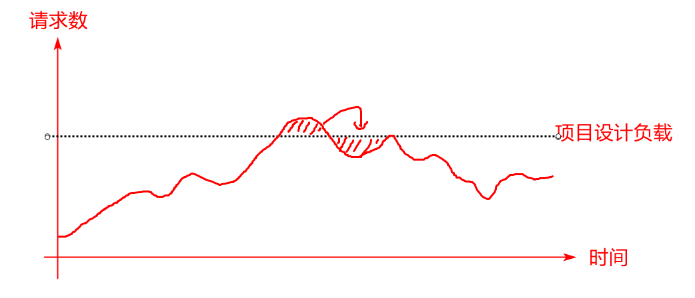
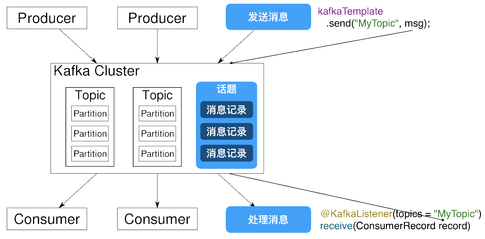
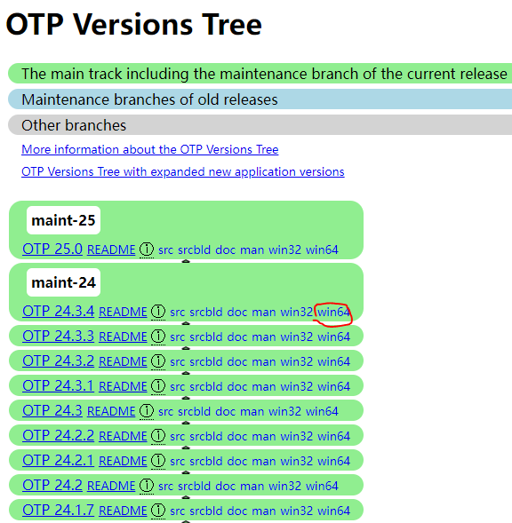
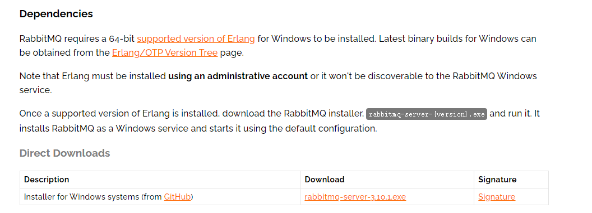
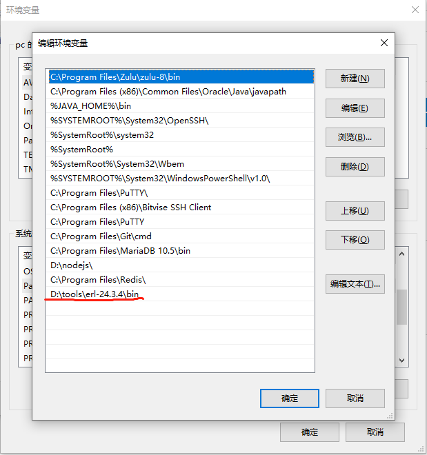
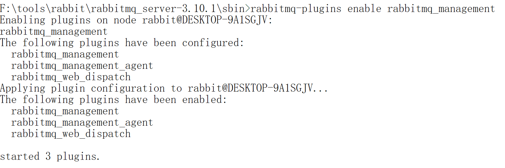
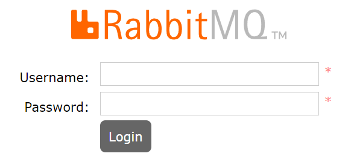
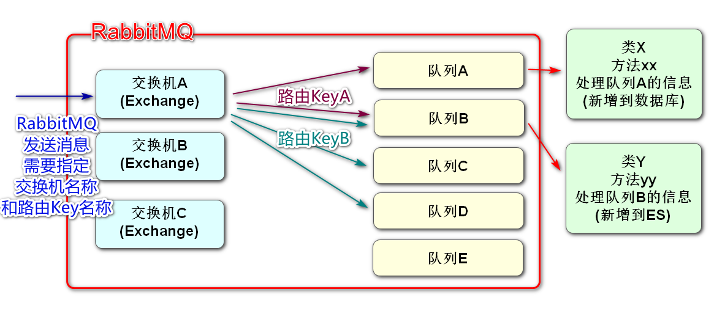

# 续查询秒杀商品详情

## 根据SpuId查询sku列表

之前编写加载数据的Mapper时,完成了根据SpuId查Sku列表的功能

下面我们从业务逻辑层开始编写

### 开发业务逻辑层

我们也需要将SpuId对应的Sku信息保存到Redis

在service.impl包中创建SeckillSkuServiceImpl类中编写代码如下

```java
@Service
@Slf4j
public class SeckillSkuServiceImpl implements ISeckillSkuService {
    @Autowired
    private SeckillSkuMapper skuMapper;
    @Autowired
    private RedisTemplate redisTemplate;

    // Dubbo调用获得sku的常规信息
    @DubboReference
    private IForSeckillSkuService dubboSkuService;

    // 根据秒杀spuId查询秒杀sku列表
    @Override
    public List<SeckillSkuVO> listSeckillSkus(Long spuId) {
        // 执行查询,根据spuId查询秒杀的sku列表
        List<SeckillSku> seckillSkus=skuMapper.findSeckillSkusBySpuId(spuId);
        // 当前方法的返回值List<SeckillSkuVO> 泛型SeckillSkuVO
        // 也是既包含秒杀信息也包含常规信息的sku对象,所以我们先实例化这个集合,
        // 以备下面循环中为它添加元素
        List<SeckillSkuVO> seckillSkuVOs=new ArrayList<>();
        // 遍历从数据库查询出来的所有sku
        for(SeckillSku sku : seckillSkus){
            // 先获取skuId,方便后面代码调用
            Long skuId=sku.getSkuId();
            // 声明sku对象的key
            // mall:seckill:sku:vo:1
            String seckillSkuVOKey= SeckillCacheUtils.getSeckillSkuVOKey(skuId);
            // 声明SeckillSkuVO类型对象,先赋null
            SeckillSkuVO seckillSkuVO=null;
            // 判断Redis中是否包含这个key
            if(redisTemplate.hasKey(seckillSkuVOKey)){
                seckillSkuVO=(SeckillSkuVO)redisTemplate
                        .boundValueOps(seckillSkuVOKey).get();
            }else{
                // Redis中没有这个sku,就要到数据库中去查询了
                // 需要查询常规sku信息
                SkuStandardVO skuStandardVO=dubboSkuService.getById(skuId);
                // 秒杀信息就是当前正在遍历的sku对象
                // 实例化要返回的集合的泛型类型对象SeckillSkuVO
                seckillSkuVO=new SeckillSkuVO();
                // 将常规信息的同名属性赋值到seckillSkuVO对象中
                BeanUtils.copyProperties(skuStandardVO,seckillSkuVO);
                // 秒杀信息手动赋值
                seckillSkuVO.setSeckillPrice(sku.getSeckillPrice());
                seckillSkuVO.setStock(sku.getSeckillStock());
                seckillSkuVO.setSeckillLimit(sku.getSeckillLimit());
                //seckillSkuVO所有属性赋值完毕,保存到Redis中
                redisTemplate.boundValueOps(seckillSkuVOKey)
                        .set(seckillSkuVO,10*60*1000+ RandomUtils.nextInt(10000),
                                TimeUnit.MILLISECONDS);
            }
            // 运行到这里,无论Redis中有没有这个key,seckillSkuVO对象都被赋值了
            // 将seckillSkuVO添加到要返回的集合中
            seckillSkuVOs.add(seckillSkuVO);
        }
        // 返回这个集合!!!
        return seckillSkuVOs;
    }
}
```

### 编写控制层

新建SeckillSkuController添加方法

```java
@RestController
@RequestMapping("/seckill/sku")
@Api(tags = "秒杀sku模块")
public class SeckillSkuController {

    @Autowired
    private ISeckillSkuService seckillSkuService;

    @GetMapping("/list/{spuId}")
    @ApiOperation("根据SpuId查询秒杀Sku列表")
    @ApiImplicitParam(value = "spuId",name="spuId",example = "2")
    public JsonResult<List<SeckillSkuVO>> listSeckillSkus(
            @PathVariable Long spuId){
        List<SeckillSkuVO> list=seckillSkuService.listSeckillSkus(spuId);
        return JsonResult.ok(list);
    }
}
```

启动Nacos\Redis\Seata

项目启动product\seckill

端口10007测试

# 消息队列

## 软件下载

doc.canglaoshi.org网站中的kafka


## Dubbo远程调用的性能问题

Dubbo调用普遍存在于我们的微服务项目中

这些Dubbo调用全部是同步的操作

这里的"同步"指:消费者A调用生产者B之后,A的线程会进入阻塞状态,等待生产者B运行结束返回之后,A才能运行之后的代码


Dubbo消费者发送调用后进入阻塞状态,这个状态表示该线程仍占用内存资源,但是什么动作都不做

如果生产者运行耗时较久,消费者就一直等待,如果消费者利用这个时间,那么可以处理更多请求,业务整体效率会提升

实际情况下,Dubbo有些必要的返回值必须等待,但是不必要等待的服务返回值,我们可以不等待去做别的事情

这种情况下我们就要使用消息队列

## 什么是消息队列

消息队列(Message Queue)简称MQ,也称:"消息中间件"

消息队列是采用"异步(两个微服务项目并不需要同时完成请求)"的方式来传递数据完成业务操作流程的业务处理方式

## 消息队列的特征


> 常见面试题:消息队列的特征(作用)

- 利用异步的特性,提高服务器的运行效率,减少因为远程调用出现的线程等待\阻塞时间

- 削峰填谷:在并发峰值超过当前系统处理能力时,我们将没处理的信息保存在消息队列中,在后面出现的较闲的时间中去处理,直到所有数据依次处理完成,能够防止在并发峰值时短时间大量请求而导致的系统不稳定

- 消息队列的延时:因为是异步执行,请求的发起者并不知道消息何时能处理完,如果业务不能接受这种延迟,就不要使用消息队列



## 常见消息队列软件

- Kafka:性能好\功能弱:适合大数据量,高并发的情况,大数据领域使用较多
- RabbitMQ:功能强\性能一般:适合发送业务需求复杂的消息队列,java业务中使用较多
- RocketMQ:阿里的
- ActiveMQ:前几年流行的,老项目可能用到
- .....

## 消息队列的事务处理

当接收消息队列中信息的模块运行发送异常时,怎么完成事务的回滚?

当消息队列中(stock)发生异常时,在异常处理的代码中,我们可以向消息的发送者(order)发送消息,然后通知发送者(order)处理,消息的发送者(order)接收到消息后,一般要手写代码回滚,如果回滚代码过程中再发生异常,就又要思考回滚方式,如果一直用消息队列传递消息的话,可能发生异常的情况是无止境的

所以我们在处理消息队列异常时,经常会设置一个"死信队列",将无法处理的异常信息发送到这个队列中

死信队列没有任何处理者,通常情况下会有专人周期性的处理死信队列的消息

# Kafka

## 什么是Kafka

Kafka是由Apache软件基金会开发的一个开源流处理平台，由Scala和Java编写。该项目的目标是为处理实时数据提供一个统一、高吞吐、低延迟的平台。Kafka最初是由LinkedIn开发，并随后于2011年初开源。

## kafka软件结构

Kafka是一个结构相对简单的消息队列(MQ)软件

kafka软件结构图



Kafka Cluster(Kafka集群)

Producer:消息的发送方,也就是消息的来源,Kafka中的生产者

> order就是消息的发送方,在Dubbo中order是消费者,这个身份变化了

Consumer:消息的接收方,也是消息的目标,Kafka中的消费者

> stock就是消息的接收方,在Dubbo中stock是生产者,这个身份变化了

Topic:话题或主题的意思,消息的收发双方要依据同一个话题名称,才不会将信息错发给别人

Record:消息记录,就是生产者和消费者传递的信息内容,保存在指定的Topic中

## Kafka的特征与优势

Kafka作为消息队列,它和其他同类产品相比,突出的特点就是性能强大

Kafka将消息队列中的信息保存在硬盘中

Kafka对硬盘的读取规则进行优化后,效率能够接近内存

硬盘的优化规则主要依靠"顺序读写,零拷贝,日志压缩等技术"

Kafka处理队列中数据的默认设置:

- Kafka队列信息能够一直向硬盘中保存(理论上没有大小限制)
- Kafka默认队列中的信息保存7天,可以配置这个时间,缩短这个时间可以减少Kafka的磁盘消耗

## Kafka的安装和配置

必须将我们kafka软件的解压位置设置在一个根目录,文件夹名称尽量短(例如:kafka)

然后路径不要有空格和中文


我们要创建一个空目录用于保存Kafka运行过程中产生的数据

本次创建名称为data的空目录

下面进行Kafka启动前的配置

先到E:\kafka\config下配置有文件zookeeper.properties

找到dataDir属性修改如下

```
dataDir=E:/data
```

修改完毕之后要Ctrl+S进行保存,否则修改无效!!!!

注意E盘和data文件夹名称,匹配自己电脑的真实路径和文件夹名称

还要修改server.properties配置文件

```
log.dirs=E:/data
```

修改注意事项和上面相同

## 启动kafka

要想启动Kafka必须先启动Zookeeper

### Zookeeper介绍

zoo:动物园

keeper:园长

可以引申为管理动物的人

Linux服务器中安装的各种软件,很多都是有动物形象的

如果这些软件在Linux中需要修改配置信息的话,就需要进入这个软件,去修改配置,每个软件都需要单独修改配置的话,工作量很大

我们使用Zookeeper之后,可以创建一个新的管理各种软件配置的文件管理系统

Linux系统中各个软件的配置文件集中到Zookeeper中

实现在Zookeeper中,可以修改服务器系统中的各个软件配置信息

长此以往,很多软件就删除了自己写配置文件的功能,而直接从Zookeeper中获取

Kafka就是需要将配置编写在Zookeeper中的软件之一

所以要先启动zookeeper才能启动kafka

### Zookeeper启动

进入路径E:\kafka\bin\windows

输入cmd进入dos命令行

```
E:\kafka\bin\windows>zookeeper-server-start.bat ..\..\config\zookeeper.properties
```

### kafka启动

总体方式一样,输入不同指令

```
E:\kafka\bin\windows>kafka-server-start.bat ..\..\config\server.properties
```

**附录**

Mac系统启动Kafka服务命令（参考）：

```
# 进入Kafka文件夹
cd Documents/kafka_2.13-2.4.1/bin/
# 动Zookeeper服务
./zookeeper-server-start.sh -daemon ../config/zookeeper.properties 
# 启动Kafka服务
./kafka-server-start.sh -daemon ../config/server.properties 
```

Mac系统关闭Kafka服务命令（参考）：

```
# 关闭Kafka服务
./kafka-server-stop.sh 
# 启动Zookeeper服务
./zookeeper-server-stop.sh
```

在启动kafka时有一个常见错误

```
wmic不是内部或外部命令
```

这样的提示,需要安装wmic命令,安装方式参考

https://zhidao.baidu.com/question/295061710.html

## Kafka使用演示

启动的zookeeper和kafka的窗口不要关闭

我们在csmall项目中编写一个kafka使用的演示

csmall-cart-webapi模块

添加依赖

```xml
<!-- Kafka 整合SpringBoot的依赖 -->
<dependency>
    <groupId>org.springframework.kafka</groupId>
    <artifactId>spring-kafka</artifactId>
</dependency>
<!--   这是google提供的java对象和json格式字符串相互转换的工具类依赖   -->
<dependency>
    <groupId>com.google.code.gson</groupId>
    <artifactId>gson</artifactId>
</dependency>
```

修改yml文件进行配置

```yaml
spring:
  kafka:
    # 定义kafka的位置
    bootstrap-servers: localhost:9092
    # consumer.group-id是kafka框架要求必须配置的内容,不配置启动会报错
    # 意思是话题分组,目的是区分kafka服务器上不通项目消息的
    # 本质上,这个分组名称会在消息发送时,自动前缀在话题名称前
    # 例如当前项目发送了名为一个message的话题,真正发送到kafka的名称可能是csmall.message
    consumer:
      group-id: csmall
```

在SpringBoot启动类中添加启动Kafka的注解

```java
@SpringBootApplication
@EnableDubbo
// 启动SpringBoot对kafka的支持
@EnableKafka
// 为了测试kafka收发消息
// 我们利用SpringBoot自带的定时任务工具,周期性的向kafka发送消息
// 明确下面的注解和kafka没有必然的联系
@EnableScheduling
public class CsmallCartWebapiApplication {

    public static void main(String[] args) {
        SpringApplication.run(CsmallCartWebapiApplication.class, args);
    }

}
```

下面我们就可以实现周期性的向kafka发送消息并接收的操作了

编写消息的发送

cart-webapi包下创建kafka包

包中创建Producer类来发送消息

```java
// 这个类要实现周期运行代码(定时任务),需要保存到Spring管理
@Component
public class Producer {

    // 直接从Spring容器中获取kafkaTemplate对象
    // 这个对象会在SpringBoot启动时,根据配置信息自动生成
    // KafkaTemplate<[话题类型],[消息类型]>
    @Autowired
    private KafkaTemplate<String,String> kafkaTemplate;

    int i=1;
    // 实现每隔15秒(15000毫秒)发送一次消息到Kafka指定话题
    @Scheduled(fixedRate = 15000)
    public void sendMessage(){
        Cart cart=new Cart();
        cart.setId(i++);
        cart.setCommodityCode("PC100");
        cart.setUserId("UU100");
        cart.setPrice(RandomUtils.nextInt(90)+10);
        cart.setCount(RandomUtils.nextInt(10)+1);
        // 将cart对象转换成json格式字符串发送
        // {"id":"1","userId":"UU100","price":"68",....}
        // 利用Google提供的gson工具进行转换
        Gson gson=new Gson();
        String json=gson.toJson(cart);
        System.out.println("要发送的json字符串为:"+json);
        // 执行发送
        kafkaTemplate.send("myCart",json);
    }


}
```

Nacos\Seata启动

然后启动cart每隔15秒会发送一次消息

如果没有报错,能确定功能基本正常

下面开始接收

kafka包中创建一个叫Consumer的类来接收消息

> 接收消息的类可以是本模块的类,也可以是其它模块的类,编写的代码是完全一致

```java
// 要接收kafka消息,需要将当前类对象保存到Spring容器中
// 因为KafkaTemplate是在Spring容器中管理的
@Component
public class Consumer {

    // SpringKafka接收消息,使用了框架中的"监听机制"
    // 框架中有一条线程,一直实时关注kafka中的消息状况
    // 如果我们指定一个话题名称(myCart),这个话题名称接收了消息,这个监听线程就会通知我们
    @KafkaListener(topics = "myCart")
    // 上面是监听器注解,指定了myCart这个话题名称
    // 当kafka的myCart话题出现消息时,监听器会自动调用下面的方法
    // 方法的参数和返回值是指定的,不能修改
    public void  received(ConsumerRecord<String,String> record){
        // 方法参数类型必须是ConsumerRecord
        // 泛型<[话题类型],[消息内容的类型]>
        // 这个record就是消息发给者发来的消息,由监听器自动赋值
        // 从消息对象中获得消息内容
        String json=record.value();
        // json的值可能是:{"id":"1","userId":"UU100","price":"68",....}
        // 下面再用Google工具类将json格式字符串转换成java对象
        Gson gson=new Gson();
        Cart cart=gson.fromJson(json,Cart.class);
        // 输出转换完成后的cart对象即可
        System.out.println("消息的接收者获得:"+cart);

    }


}
```

重新启动cart测试

# RabbitMQ

## 什么是RabbitMQ

RabbitMQ 是一个由 Erlang 语言开发的 AMQP 的开源实现。 AMQP ：Advanced Message Queue，高级消息队列协议。它是应用层协议的一个开放标准，为面向消息的中间件设计，基于此协议的客户端与消息中间件可传递消息，并不受产品、开发语言等条件的限制。 RabbitMQ 最初起源于金融系统，用于在分布式系统中存储转发消息，在易用性、扩展性、高可用性等方面表现不俗。

## RabbitMQ特征

1.可靠性（Reliability） RabbitMQ 使用一些机制来保证可靠性，如持久化、传输确认、发布确认。

2.灵活的路由（Flexible Routing） 在消息进入队列之前，通过 Exchange 来路由消息的。对于典型的路由功能，RabbitMQ已经提供了一些内置的 Exchange 来实现。针对更复杂的路由功能，可以将多个Exchange 绑定在一起，也通过插件机制实现自己的 Exchange 。

3.消息集群（Clustering） 多个 RabbitMQ 服务器可以组成一个集群，形成一个逻辑 Broker

4.高可用（Highly Available Queues） 队列可以在集群中的机器上进行镜像，使得在部分节点出问题的情况下队列仍然可用。

5.多种协议（Multi-protocol） RabbitMQ 支持多种消息队列协议，比如 STOMP、MQTT 等等。

6.多语言客户端（Many Clients） RabbitMQ 几乎支持所有常用语言，比如 Java、.NET、Ruby 等等。

7.管理界面（Management UI） RabbitMQ 提供了一个易用的用户界面，使得用户可以监控和管理消息 Broker 的许多方面。

8.跟踪机制（Tracing） 如果消息异常，RabbitMQ 提供了消息跟踪机制，使用者可以找出发生了什么。

9.插件机制（Plugin System） RabbitMQ 提供了许多插件，来从多方面进行扩展，也可以编写自己的插件。

## 下载软件

> 苹果mac系统的同学直接苍老师网站看MacOS安装RabbitMQ的技术贴

RabbitMQ是Erlang语言开发的,所以要先安装Erlang语言的运行环境

下载Erlang的官方路径

https://erlang.org/download/otp_versions_tree.html



安装的话就是双击

安装过程中都可以使用默认设置,需要注意的是

**不要安装在中文路径和有空格的路径下!!!**

下载RabbitMQ的官方网址

https://www.rabbitmq.com/install-windows.html



安装也是双击即可

**不要安装在中文路径和有空格的路径下!!!**

## 配置Erlang的环境变量

要想运行RabbitMQ必须保证系统有Erlang的环境变量

配置Erlang环境变量

把安装Erlang的bin目录配置在环境变量Path的属性中



**启动RabbitMQ**

找到RabbitMQ的安装目录

可能是:

```
E:\tools\rabbit\rabbitmq_server-3.10.1\sbin
```

具体路径根据自己的情况寻找

地址栏运行cmd

输入启动指令如下

```
E:\tools\rabbit\rabbitmq_server-3.10.1\sbin>rabbitmq-plugins enable rabbitmq_management
```

结果如下



运行完成后,验证启动状态

RabbitMQ自带一个管理的界面,所以我们可以访问这个界面来验证它的运行状态

http://localhost:15672



登录界面用户名密码

guest

guest

登录成功后看到RabbitMQ运行的状态

如果启动失败,可以手动启动RabbitMQ

参考路径如下

https://baijiahao.baidu.com/s?id=1720472084636520996&wfr=spider&for=pc

## RabbitMQ的结构

RabbitMQ软件支持很多种消息队列的发送方式的

使用的比较多的是路由模式




和Kafka不同,Kafka是使用话题名称来收发信息,结构简单

RabbitMQ是使用交换机\路由key指定要发送消息的队列

消息的发送者发送消息时,需要指定交换机和路由key名称

消息的接收方接收消息时,只需要指定队列的名称

在编写代码上,相比于Kafka,每个业务要编写一个配置类

这个配置类中要绑定交换机和路由key的关系,以及路由Key和队列的关系


