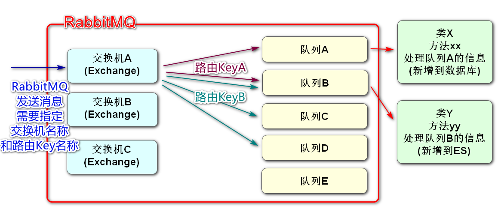
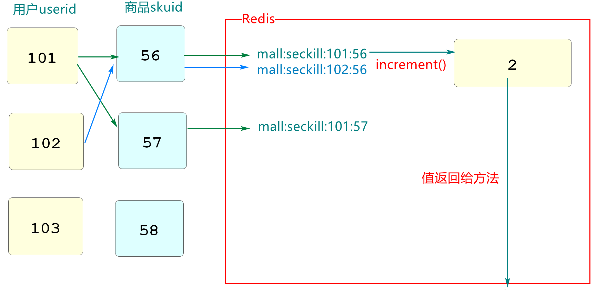
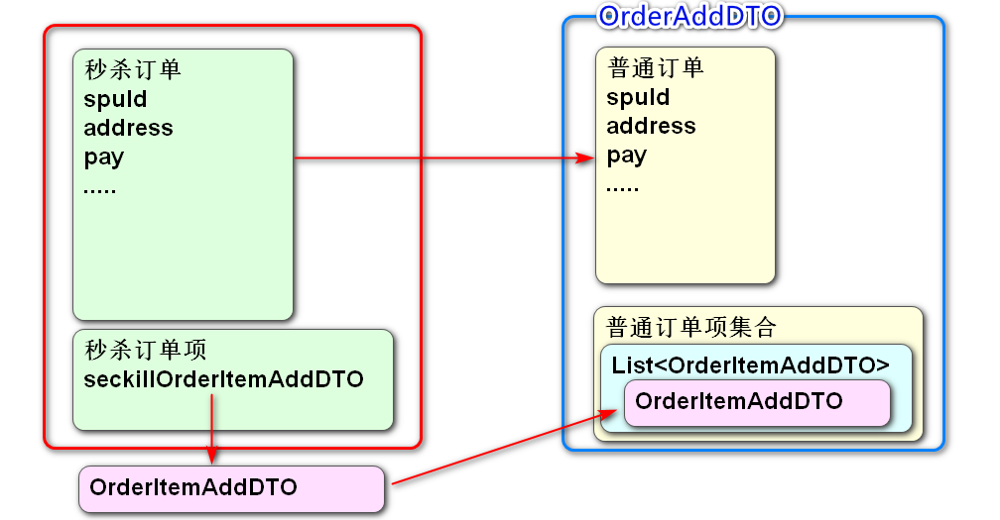
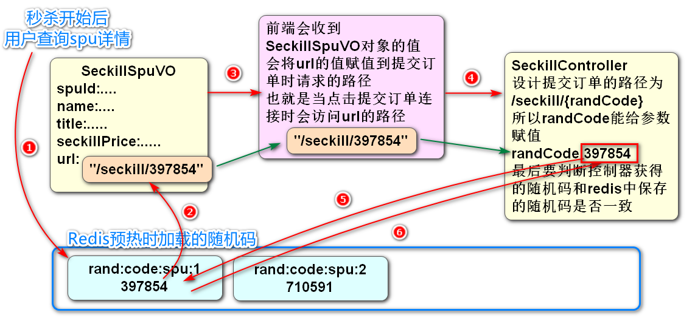

在order模块编写Kafka发送和接收消息的功能

1.pom文件,yml文件,SpringBoot启动类的配置

2.编写一个类,类中每个10秒向Kafka发送一个order对象的Json字符串

​	(代码参照cart模块Producer即可)

3.编写一个类,类中使用kafka监听器接收kafka中信息,转换成Order对象输出

​    (代码参照cart模块Consumer即可)



# 续RabbitMQ

## 利用RabbitMQ完成消息的收发

csmall-stock-webapi项目中测试RabbitMQ

可以利用之前我们使用Quartz实现的每隔一段时间输出当前日期信息的方法改为发送消息

**添加依赖**

```xml
<!--  RabbitMQ的依赖   -->
<dependency>
    <groupId>org.springframework.boot</groupId>
    <artifactId>spring-boot-starter-amqp</artifactId>
</dependency>
```

**yml文件配置**

```yaml
spring:
  rabbitmq:
    host: localhost
    port: 5672
    username: guest
    password: guest
    # 设置虚拟host 单机模式下固定编写"/"即可
    virtual-host: /
```

**交换机\路由Key\队列的配置类**

RabbitMQ要求我们在java代码级别设置交换机\路由Key\队列的关系

我们在quartz包下,创建config包

包中创建配置信息类RabbitMQConfig

```java
// 当前配置RabbitMQ的交换机,路由Key和队列的关系
// 交换机和队列是实际对象,而路由key是绑定它俩关系的对象,他们都需要保存到Spring容器中管理
@Configuration
public class RabbitMQConfig {
    // 一般在使用前,会将所有需要使用到的交换机,路由key和队列的名称声明为常量
    public static final String STOCK_EX="stock_ex";
    public static final String STOCK_ROUT="stock_rout";
    public static final String STOCK_QUEUE="stock_queue";

    // 先声明交换机和队列这两个实际对象,保存到Spring容器
    @Bean
    public DirectExchange stockDirectExchange(){
        return new DirectExchange(STOCK_EX);
    }
    @Bean
    public Queue stockQueue(){
        return new Queue(STOCK_QUEUE);
    }
    // 最后绑定交换机和队列的关系,将路由Key对象保存到Spring容器
    @Bean
    public Binding stockBinding(){
        return BindingBuilder.bind(stockQueue()).
                        to(stockDirectExchange()).with(STOCK_ROUT);
    }
}
```

**RabbitMQ发送消息**

我们在QuartzJob类中输出时间的代码后继续编写代码

实现RabbitMQ消息的发送

```java
@Slf4j
public class QuartzJob implements Job {

    // 向RabbitMQ发送消息
    // 也是从Spring容器中获取SpringBoot启动时,创建好的操作RabbitMQ的对象
    @Autowired
    private RabbitTemplate rabbitTemplate;

    static int i=1;

    @Override
    public void execute(JobExecutionContext jobExecutionContext) throws JobExecutionException {
        // 一个简单的任务演示
        // 输出当前系统时间,使用sout或log皆可
        log.info("---------------"+ LocalDateTime.now() +"-----------------"+i);
        // 实例化Stock对象
        Stock stock=new Stock();
        stock.setId(i++);
        stock.setCommodityCode("PC100");
        stock.setReduceCount(RandomUtils.nextInt(20)+1);
        // 利用RabbitTemplate发送消息
        //convertAndSend([交换机名称],[路由key名称],[要发送的对象])
        rabbitTemplate.convertAndSend(
                RabbitMQConfig.STOCK_EX,
                RabbitMQConfig.STOCK_ROUT,
                stock);
        log.info("发送消息完成:{}",stock);

    }
}
```

**我们可以通过修改QuartzConfig类中的Cron表达式修改调用的周期**

```java
CronScheduleBuilder cron=
        CronScheduleBuilder.cronSchedule("0/10 * * * * ?");
```

按上面的cron修改之后,会每隔10秒运行一次发送消息的操作

启动服务,观察是否每隔10秒发送一条消息

启动Nacos\RabbitMQ\Seata

启动stock-webapi

根据Cron表达式,消息会在0/10/20/30/40/50秒数时运行

## 接收RabbitMQ中的消息

quartz包下再创建一个新的类用于接收信息

RabbitMQConsumer代码如下

```java
// 当前接收消息的类,也要保存到Spring容器中
@Component
// 和Kafka不同,RabbitMQ监听器的注解要写在类上
@RabbitListener(queues = RabbitMQConfig.STOCK_QUEUE)
@Slf4j
public class RabbitMQConsumer {

    // 在类上标记的监听器注解,不能明确接收到消息时运行哪个方法
    // 所以我们要在类中定义一个专门处理消息的方法,并使用@RabbitHandler注解标记
    // 每个类只允许一个方法标记这个注解
    // 方法参数比Kafka更简单,直接声明要接收信息的对象即可
    @RabbitHandler
    public void process(Stock stock){
        
        log.info("消息接收完成!!!:{}",stock);
    }


}
```

其他项目不动,继续保持运行

重启stock-webapi模块

观察消息的接收

**课后作业**

在csmall-business模块中

创建一个rabbit包

包中创建RabbitConfig类配置交换机\路由Key\和队列的配置(允许复制)

创建一个消息的发送者(建议使用Spring任务调度)RabbitProducer

每隔10秒发送一个Order对象到RabbitMQ

最后编写一个类接收RabbitMQ中的信息RabbitConsumer

# 开发酷鲨商城秒杀业务

## 创建流控和降级的处理类

秒杀业务肯定是一个高并发的处理,并发数超过程序设计的限制时,就需要对请求的数量进行限流

Sentinel是阿里提供的SpringCloud组件,主要用于外界访问当前服务器的控制器方法的限流操作

之前的课程中,我们已经比较详细的学习的Sentinel使用的方式

下面我们要先编写Sentinel限流和服务降级时,运行的自定义异常处理类

我们酷鲨前台项目seckill-webapi模块

先来编写限流异常处理类

创建一个exception包,包中新建SeckillBlockHandler代码如下

```java
// 秒杀业务限流异常处理类
@Slf4j
public class SeckillBlockHandler {

    // 声明限流的方法,返回值必须和被限流的控制方法一致
    // 参数要包含所有被限流的控制器方法的参数,还可以额外声明一个BlockException
    // 在其他类中声明的限流方法,在控制器中调用的,要声明为静态,否则无法实现
    public static JsonResult seckillBlock(String randCode,
                                          SeckillOrderAddDTO seckillOrderAddDTO,
                                          BlockException e){
        log.error("一个请求被限流了");
        return JsonResult.failed(ResponseCode.INTERNAL_SERVER_ERROR,
                "服务器忙请稍后再试!");
    }


}
```

再创建降级类SeckillFallBack

```java
// 秒杀业务的降级处理类
@Slf4j
public class SeckillFallBack {

    // 降级方法参数和返回值与限流方法基本一致,只是异常类型是Throwable类型
    public static JsonResult seckillFallback(String randCode,
                                             SeckillOrderAddDTO seckillOrderAddDTO,
                                             Throwable e){
        log.error("一个请求被降级了");
        // 输出异常信息
        e.printStackTrace();
        return JsonResult.failed(ResponseCode.INTERNAL_SERVER_ERROR,
                "发生异常,异常信息为:"+e.getMessage());
    }


}
```

## 开发执行秒杀的业务逻辑层

我们之前完成了秒杀的预热,预热中完成了秒杀商品sku库存数,spu随机码(布隆过滤器)保存在redis中的操作

也完成了查询秒杀商品列表,和显示秒杀商品详情的方法

下面要开始进行秒杀商品生成订单的操作

如果用户选择商品规格(sku)提交订单,那么就要按照提交秒杀订单的业务流程处理

秒杀提交订单和普通订单的区别

1.判断用户是否为重复购买和Redis中该Sku是否有库存

2.秒杀订单转换成普通订单,需要使用dubbo调用order模块的生成订单方法

3.使用消息队列(RabbitMQ)将秒杀成功记录信息保存到success表中

4.秒杀订单信息返回

创建一个SeckillServiceImpl业务逻辑层实现类,完成上面的业务

```java
@Service
@Slf4j
public class SeckillServiceImpl implements ISeckillService {

    // 秒杀业务中,使用Redis的代码都是在判断数值,直接使用字符串类型的Redis对象即可
    @Autowired
    private StringRedisTemplate stringRedisTemplate;
    // 需要dubbo调用mall_order模块的普通订单的生成业务
    @DubboReference
    private IOmsOrderService dubboOrderService;
    // 需要将秒杀成功信息发送给消息队列
    @Autowired
    private RabbitTemplate rabbitTemplate;

    /*
    1.判断用户是否为重复购买和Redis中该Sku是否有库存
    2.秒杀订单转换成普通订单,需要使用dubbo调用order模块的生成订单方法
    3.使用消息队列(RabbitMQ)将秒杀成功记录信息保存到success表中
    4.秒杀订单信息返回
     */
    @Override
    public SeckillCommitVO commitSeckill(SeckillOrderAddDTO seckillOrderAddDTO) {
        // 第一阶段:判断用户是否为重复购买和Redis中该Sku是否有库存
        // 从方法的参数中,获得用户想要购买的skuId
        Long skuId=seckillOrderAddDTO.getSeckillOrderItemAddDTO().getSkuId();
        // 从SpringSecurity上下文中获取登录用户的Id
        Long userId=getUserId();
        // 我们明确了本次请求时哪个用户要购买哪个商品(userId以及skuId的具体值)
        // 根据我们的秒杀业务规定,每个用户只能购买skuId一次
        // 所以可以依据userId和skuId生成检查重复购买的Key
        // mall:seckill:reseckill:2:1
        String reSeckillCheckKey= SeckillCacheUtils.getReseckillCheckKey(skuId,userId);
        // 以上面字符串为key,调用stringRedisTemplate中的increment方法
        // increment是增长的意思
        // 1.如果上面的key从没在Redis中保存过,redis中会创建这个key,并保存它的值为1
        // 2.如果上面的key已经在redis中,那么就会在当前的值基础上加1,再保存,如果当前是1,运行后变为2
        // 3.无论存不存在这个key,运行后都会返回值
        // 所以如果返回的值为1,就证明这个用户之前从未购买过这个商品
        Long seckillTimes=stringRedisTemplate
                .boundValueOps(reSeckillCheckKey).increment();
        // 如果seckillTimes值为1就可以购买,大于1就不能购买
        if(seckillTimes>1){
            // 抛出异常,提示不能重复购买,终止程序
            throw new CoolSharkServiceException(ResponseCode.FORBIDDEN,
                    "您已经购买过这个商品了,谢谢您的支持!");
        }
        // 程序运行到此处,表示用户第一次购买这个商品
        // 然后去检查是否有库存
        // 确定要购买的skuId,生成获得这个skuId已经预热的库存数的key
        // mall:seckill:sku:stock:1
        String skuStockKey=SeckillCacheUtils.getStockKey(skuId);
        // 根据上面的key在redis中调用decrement(减少)的方法,将库存数-1后返回
        Long leftStock=stringRedisTemplate
                .boundValueOps(skuStockKey).decrement();
        // leftStock是decrement方法减1之后返回的
        // 所以我们获得的leftStock是如果当前用户购买成功剩余的库存数
        // 如果leftStock是0,表示当前用户买到最后一个,如果小于0,才是没有库存,表示售罄
        if(leftStock<0){
            // 如果已经没有库存,就要终止本次用户购买
            // 要将当前用户购买此商品的次数恢复为0,下次该用户还能购买
            stringRedisTemplate.boundValueOps(reSeckillCheckKey).decrement();
            // 抛出异常
            throw new CoolSharkServiceException(ResponseCode.BAD_REQUEST,
                    "对不起,您要购买的商品暂时售罄");
        }
        // 到此为止,当前用户经过了重复购买的检查和库存的判断,可以开始生成订单了
        // 第二阶段:秒杀订单转换成普通订单,需要使用dubbo调用order模块的生成订单方法
        // 当前方法参数:SeckillOrderAddDTO,dubbo调用需要的参数:OrderAddDTO
        // 下面开始转换,转换代码较多,单独编写一个方法
        OrderAddDTO orderAddDTO=convertSeckillOrderToOrder(seckillOrderAddDTO);
        // 完成了转换,普通订单信息所有主要属性,都赋值完毕了
        // 在dubbo调用发送之前,最后将用户Id赋值到orderAddDTO
        orderAddDTO.setUserId(userId);
        // 使用dubbo调用生成订单的方法
        OrderAddVO orderAddVO=dubboOrderService.addOrder(orderAddDTO);
        // 第三阶段:使用消息队列(RabbitMQ)将秒杀成功记录信息保存到success表中
        // 业务要求我们记录秒杀成功的信息,但是它不是迫切运行的,所以使用消息队列完成
        // 我们要创建Success秒杀成功记录对象,然后将这个对象发送给RabbitMQ
        // 另寻时机编写处理消息队列的类和方法即可
        Success success=new Success();
        // Success大部分属性和秒杀sku信息重叠,可以使用秒杀订单项对象,给他同名属性赋值
        BeanUtils.copyProperties(seckillOrderAddDTO.getSeckillOrderItemAddDTO(),
                                    success);
        // 把确实的信息补齐
        success.setUserId(userId);
        success.setOrderSn(orderAddVO.getSn());
        success.setSeckillPrice(
                        seckillOrderAddDTO.getSeckillOrderItemAddDTO().getPrice());
        // 将赋值完备的success对象发送给RabbitMQ
        rabbitTemplate.convertAndSend(
                RabbitMqComponentConfiguration.SECKILL_EX,
                RabbitMqComponentConfiguration.SECKILL_RK,
                success);
        // 下面无需关注消息队列的后续处理,直接秒杀订单的后续工作即可
        // 第四阶段:秒杀订单信息返回
        // 当前方法要求返回SeckillCommitVO类型对象
        // 观察这个类中的属性,和OrderAddVO类属性完全一致,所以可以直接赋值之后返回
        SeckillCommitVO commitVO=new SeckillCommitVO();
        BeanUtils.copyProperties(orderAddVO,commitVO);
        // 别忘了返回commitVO
        return commitVO;
    }
    // 秒杀订单,转换为普通定的方法
    private OrderAddDTO convertSeckillOrderToOrder(SeckillOrderAddDTO seckillOrderAddDTO) {
        // 先实例化返回值类型对象
        OrderAddDTO orderAddDTO=new OrderAddDTO();
        // 将同名属性赋值到orderAddDTO对象
        BeanUtils.copyProperties(seckillOrderAddDTO,orderAddDTO);
        // 这两个订单对象基本属性都相同,区别在于
        // orderAddDTO普通订单对象,其中的订单项是一个集合:List<OrderItemAddDTO>
        // seckillOrderAddDTO秒杀订单对象,其中的秒杀订单项是一个对象:SeckillOrderItemAddDTO
        // 我们需要先获得一个普通订单的订单项对象
        OrderItemAddDTO orderItemAddDTO=new OrderItemAddDTO();
        BeanUtils.copyProperties(seckillOrderAddDTO.getSeckillOrderItemAddDTO(),
                                    orderItemAddDTO);
        // 实例化orderAddDTO对象中需要的普通订单项集合
        List<OrderItemAddDTO> list=new ArrayList<>();
        // 将赋值好的普通订单项对象添加到list集合中
        list.add(orderItemAddDTO);
        // 将普通订单项集合,赋值给OrderAddDTO
        orderAddDTO.setOrderItems(list);
        // 别忘了返回正确的对象!
        return orderAddDTO;
    }


    public CsmallAuthenticationInfo getUserInfo(){
        // 编写SpringSecurity上下文中获得用户信息的代码
        UsernamePasswordAuthenticationToken authenticationToken=
                (UsernamePasswordAuthenticationToken)
                        SecurityContextHolder.getContext().getAuthentication();
        // 为了逻辑严谨性,判断一下SpringSecurity上下文中的信息是不是null
        if(authenticationToken == null){
            throw new CoolSharkServiceException(
                    ResponseCode.UNAUTHORIZED,"您没有登录!");
        }
        // 确定authenticationToken不为null
        // 就可以从中获得用户信息了
        CsmallAuthenticationInfo csmallAuthenticationInfo=
                (CsmallAuthenticationInfo) authenticationToken.getCredentials();
        // 别忘了返回
        return csmallAuthenticationInfo;
    }
    // 业务逻辑层中的方法实际上都只需要用户的id即可
    // 我们可以再编写一个方法,从用户对象中获得id
    public Long getUserId(){
        return getUserInfo().getId();
    }
}
```






## 开发控制层

随机码判断流程



controller包下创建SeckillController

代码如下

```java
@RestController
@RequestMapping("/seckill")
@Api(tags = "执行秒杀模块")
public class SeckillController {
    @Autowired
    private ISeckillService seckillService;
    @Autowired
    private RedisTemplate redisTemplate;

    @PostMapping("/{randCode}")
    @ApiOperation("验证随机码并提交秒杀订单")
    @ApiImplicitParam(value = "随机码",name="randCode",required = true)
    @PreAuthorize("hasRole('user')")
    @SentinelResource(value = "seckill",
          blockHandlerClass = SeckillBlockHandler.class,blockHandler = "seckillBlock",
          fallbackClass = SeckillFallBack.class,fallback = "seckillFallback")
    public JsonResult<SeckillCommitVO> commitSeckill(
            @PathVariable String randCode,
            @Validated SeckillOrderAddDTO seckillOrderAddDTO){
        // 获取spuId
        Long spuId=seckillOrderAddDTO.getSpuId();
        // 声明根据spuId获取随机码的Key
        String randCodeKey= SeckillCacheUtils.getRandCodeKey(spuId);
        // 判断Redis中是否有这个key
        if(redisTemplate.hasKey(randCodeKey)){
            // redis中有这个key,将它的value(随机码)取出
            String redisRandCode=redisTemplate.boundValueOps(randCodeKey).get()+"";
            // 判断前端发来的随机码和redis保存的随机码是否一致
            if( ! redisRandCode.equals(randCode)){
                // 随机码不一致,抛出异常,终止业务
                throw new CoolSharkServiceException(ResponseCode.NOT_FOUND,
                        "没有找到指定商品(随机码不正确)");
            }
            // 运行到此处,表示随机码匹配,可以执行购买
            SeckillCommitVO commitVO=
                    seckillService.commitSeckill(seckillOrderAddDTO);
            return JsonResult.ok(commitVO);

        }else{
            // 当redis中没有保存这个商品的SpuId对应的随机码时,抛出异常
            throw new CoolSharkServiceException(ResponseCode.NOT_FOUND,
                    "没有找到指定商品");
        }
    }
}
```

启动Nacos\Seata\RabbitMQ\Redis\Sentinel

项目Leaf\product\passport\order\seckill

注意yml配置文件中的RabbitMQ的用户名和密码

如果说已经购买过,就修改允许购买的数量 >1为 >100

如果说没有库存,检查数据库库存,也可以把判断库存的if注释掉

测试成功即可

还可以测试sentinel的限流


