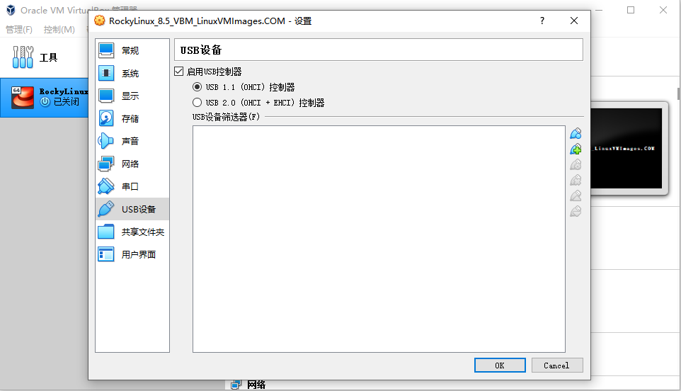

#  续 开发酷鲨商城秒杀业务

## success秒杀成功信息的处理

我们在上面章节提交秒杀信息业务最后

向RabbitMQ队列中,输出了添加秒杀成功信息的消息

但是我们没有任何处理

将秒杀成功信息发送到消息队列的原因:

秒杀成功信息用于统计秒杀数据,是秒杀结束后才需要统计的

所以在秒杀并发高时,消息队列的发送可以延缓,在服务器不忙时,再运行(削峰填谷)

### 开发持久层

秒杀数据库中有success表

其中的信息就是保存秒杀成功的数据(userId,skuId等)

我们要连接数据库,对这个表进行新增

还有对秒杀数据库sku库存的修改

SeckillSkuMapper接口中添加方法来修改指定skuId的库存数

```java
// 根据skuId减少库存的方法
int updateReduceStockBySkuId(@Param("skuId") Long  skuId,
                             @Param("quantity") Integer quantity);
```

SeckillSkuMapper.xml

```xml
<!--  根据skuId减少库存的方法  -->
<update id="updateReduceStockBySkuId" >
    update
        seckill_sku
    set
        seckill_stock=seckill_stock - #{quantity}
    where
        sku_id=#{skuId}
</update>
```

下面再编写新增Success的方法

创建SuccessMapper接口编写方法

```java
@Repository
public interface SuccessMapper {
    
    // 新增Success对象到数据库的方法
    int saveSuccess(Success success);
    
}
```

SuccessMapper.xml

```xml
<!--  新增Success对象到数据库的方法 -->
<insert id="saveSuccess">
    insert into success(
        user_id,
        user_phone,
        sku_id,
        title,
        main_picture,
        seckill_price,
        quantity,
        bar_code,
        data,
        order_sn
    ) values(
        #{userId},
        #{userPhone},
        #{skuId},
        #{title},
        #{mainPicture},
        #{seckillPrice},
        #{quantity},
        #{barCode},
        #{data},
        #{orderSn}

    )
</insert>
```

## 开发消息的接收功能

我们当前触发新增Success的方法并不是常规的业务逻辑层

而是由RabbitMQ消息收发机制中接收消息的对象来调用

所以我们编写一个接收消息的监听器类来完成这个操作

创建consumer包,包中创建类SeckillQueueConsumer代码如下

```java
@Component
@RabbitListener(queues = RabbitMqComponentConfiguration.SECKILL_QUEUE)
public class SeckillQueueConsumer {
    @Autowired
    private SeckillSkuMapper skuMapper;
    @Autowired
    private SuccessMapper successMapper;

    // 下面开始编写接收消息队列中消息的方法
    @RabbitHandler
    public void process(Success success){
        // 先减少库存
        skuMapper.updateReduceStockBySkuId(
                success.getSkuId(),success.getQuantity());
        // 新增success对象到数据库
        successMapper.saveSuccess(success);
        // 如果上面两个数据库操作发生异常
        // 可能会引发事务问题,如果统计的不需要非常精确,不处理也可以
        // 如果需要精确的需求,发生异常时,可以将错误信息发送给死信队列,由人工处理
        // 死信队列是最后的办法,实际开发中慎用
    }
}
```

环境方面

Nacos\Sentinel\Seata\redis\RabbitMQ

服务方面

Leaf\product\order\seckill

如果之前的测试没有关闭环境

只需要重启seckill即可

# 虚拟机使用准备

首先检查自己计算机的虚拟化状态

win10为例


如果虚拟化是已禁用

需要自己上网百度自己的电脑如何开启虚拟化

一般都是在开机时进入BIOS去调试,每个品牌或主板有不同的开启方式,需要自己查询

准备虚拟机的安装软件(发的资料里有)

RockyLinux有一个600M的镜像压缩包,已经发了网盘连接

链接：https://pan.baidu.com/s/1bCePepgJJ-8s9n7sJn_QDg?pwd=egno 
提取码：egno 

VirtualBox清华大学个版本下载路径

https://mirrors.tuna.tsinghua.edu.cn/virtualbox/

安装失败的同学可以尝试下载5.2.38以上的版本

**VirtualBox安装过程正常,各种下一步即可**

# 酷鲨商城前台业务总结

## "我负责的功能"

登录(SSO),注册

显示商品分类(自关联三级分类树)

显示商品列表

显示商品详情

购物车管理(显示购物车列表,添加购物车,删除购物车,修改购物车数量)

生成订单(减少库存,删除购物车,新增订单,新增订单项,修改订单状态等)

搜索商品(使用ES完成根据关键字完成全文搜索)

商品秒杀功能(缓存预热库存\随机码\布隆过滤器,检查重复购买和防止超卖,生成订单,消息队列,流控)

## 项目的模块和我负责的模块

分类信息模块和商品显示模块(front)

购物车和订单(order)

搜索模块(search)

秒杀模块(seckill)

单点登录SSO(passport)

没做的模块(不建议写):

支付模块,

物流模块,

客服模块,

评论模块

## 三级分类树

本项目使用固定的三级分类树

是自关联分类(所有分类信息在一张表中)

实现思路

1.一次性查询出所有分类对象(List集合)

2.遍历集合将当前分类对象以父分类id为Key,以当前对象作为值,保存在一个Map中,这个Map对象的Key(父级分类ID)对应的value,会包含它的所有子分类对象

3.遍历所有分类对象,以当前分类对象id为key,从Map中获取它的子分类,关联到三级分类树对象中,最后返回包含三级分类树结构的集合

4.查询返回之前,将三级分类树保存到Redis,以便以后的请求高效获取

## 如何实现spu列表

可能是通过分类id查询出spu列表

也可能是ES搜索功能搜索出的spu列表

显示它们的注意事项就是分页(JsonPage)

分类id查询数据库,分页是PageHelper

搜索查询是ES,分页SpringData

## 如何显示一个商品的详情

商品详情页面有4个查询

1.SpuId查询spu表中信息显示的内容有默认价格\title\name\默认图片等

2.SpuId查询spu_detail表中信息,内容是商品详情大图片

3.根据SpuId查询商品的所有属性

 是先用spuid关联到分类id,再由分类id关联到属性id,在获得属性id包含的所有属性,是一个关联查询

 如果是一个智能手机分类下的spu,能够查询到例如内存\处理器\颜色等规格属性

4.根据spuId查询Sku列表

 只有查询到Sku列表,才知道具体的真实价格\图片\库存的情况

 当选择对应规格属性时,才能知道有货无货

## 如何实现购物车的管理

用户在商品详情页选择属性之后,能够确定sku

将用户选中的sku保存在购物车中,

需要用户登录,因为所有购物车操作都需要用户身份

在控制器方法前添加@PreAuthorize("hasRole('user')") SpringSecurity单点登录

我们新增到购物车中的商品要检查是否已经在购物车中,如果不在新增到购物车,如果在的话,修改数量即可

删除或清空购物车功能就是按照购物车id进行操作即可

修改购物车中商品数量时,可以判断一下库存是否允许,如果没有库存就修改失败

## 生成订单功能如何实现

用户选好了商品,或勾选了购物车中购买的商品

就可以进行订单的生成了,在用户已经登录的前提下

首先减少库存数,如果用户从购物车勾选,删除用户勾选购物车的商品

然后开始收集各种数据,使用Leaf生成唯一的id,

单价和购买的数量,生成订单对象同时也生成订单项对象

一个订单中可能包含多个商品,计算总价,包含运费和优惠的处理

所有数据收集完毕之后,新增到数据库

我们利用Dubbo去修改sku库存信息,其他修改都是本模块的功能

任何数据库操作失败都要抛出发生异常

我们可以利用分布式事务seata来根据运行状态决定最终要提交还是回滚

保证订单生成之后数据的完整性

## 搜索功能如何实现

我们使用Elasticsearch全文搜索引擎实现搜索功能

先创建\配置关联Es的实体类

我们可以使用logstash实现数据库和Es信息的同步

(也可以编写代码分页查询所有表中信息在分批增到ES中,只是后续同步数据比较麻烦)

搜索功能本身使用SpringDataElasticsearch实现

将用户输入的关键字获取到Es中进行分页查询

将查询到的Spu列表返回给前端即可

## 如何实现秒杀

对于秒杀业务,我们首先要考虑的是怎么能够在有限的设备上达到最高的并发

因为秒杀是典型的高并发高性能的业务需求

所以我们要尽可能的使用能够提升性能和并发的组件或功能

同时保证服务器的稳定运行

例如:Redis,ES,Sentinel,消息队列等

具体实现秒杀分为几个步骤

### 秒杀前准备

我们可以利用任务调度工具Quartz在指定的时间进行缓存预热准备工作

主要两方面

1.在秒杀开始前指定的时间,Redis缓存预热,将每个sku参与秒杀的库存数保存在Redis中

 而且为了避免黄牛通过技术手段频繁访问,可以生成一个随机码,也保存在Redis中,用于验证是否为正常链接购买秒杀商品

2.在每个批次秒杀开始前,将本批次所有秒杀商品的spuid保存在布隆过滤器中,减少缓存穿透的情况

### 秒杀信息的查询

秒杀开始,用户在秒杀商品的规定时间内可以查询秒杀商品详情

所有秒杀商品spu查询时,都先查询布隆过滤器是否包含这个spuId,如果包含允许访问,如果不包含抛出异常,也要考虑布隆过滤器误判的情况,

每当业务中查询spu和sku时,都需要先检查redis中是否包含这个数据,如果包含直接从redis中获得,如果不包含再从数据库中查,但是同时也注意,查询完了要保存到Redis中,以便之后的查询直接从redis中获取,在保存到Redis时,为了减少缓存雪崩的几率,我们为每个Spu和Sku对象都添加了过期时间随机数

查询返回前,可以在判断一下当前时间是否在可秒杀该商品的时间段内,如果不在秒杀时间段内,抛出异常

只有返回了完整信息,前端才可能获得包含随机码的提交路径,否则是无法完成正常连接购买的

### 提交秒杀信息

在用户购买秒杀商品时,保证用户登录的前提下

验证用户是否重复秒杀(业务要求秒杀相同商品只能购买一次),我们使用userId和skuId,向Redis中保存一个key,如果没有这个key就是用户没有秒杀过,否则发生异常提示

我们要保证用户购买时,这个商品有库存,减少库存后,获得剩余库存信息

只要剩余库存不小于0,就可以为当前用户生成订单,否则发生异常

生成订单直接Dubbo调用Order模块编写的生成订单的方法即可

订单提交后,还需要修改秒杀sku库存数和生成秒杀成功记录保存在数据库

但是这个业务非迫切运行,我们可以将信息发送给消息队列,削峰填谷

然后再编写接收消息队列的代码,完成修改秒杀库存和生成秒杀成功记录的操作

在控制层方法上添加注解实现Sentinel的限流,保证这个业务在非常大的并发下,也能稳定运行

控制器方法中还要判断用户请求路径中的随机码,是否和Redis中保存的随机码一致,防止非正常链接购买

# 布隆过滤器

## 什么是布隆过滤器

布隆过滤器能够实现使用较少的空间来判断一个指定的元素是否包含在一个集合中

布隆过滤器并不保存这些数据,所以只能判断是否存在,而并不能取出该元素

使用情景:凡是判断一个元素是否在一个集合中的操作,都可以使用它

布隆过滤器常见使用场景

1. idea中编写代码,一个单词是否包含在正确拼写的词库中(拼写不正确划绿线的提示)

2. 公安系统,根据身份证号\人脸信息,判断该人是否在追逃名单中

3. 爬虫检查一个网址是否被爬取过

   ......

## 为什么使用布隆过滤器

常规的检查一个元素是否在一个集合中的思路是遍历集合,判断元素是否相等

这样的查询效率非常低下

要保证快速确定一个元素是否在一个集合中,我们可以使用HashMap

因为HashMap内部的散列机制,保证更快更高效的找到元素

所以当数据量较小时,用HashMap或HashSet保存对象然后使用它来判定元素是否存在是不错的选择

但是如果数据量太大,每个元素都要生成哈希值来保存,我们也要依靠哈希值来判定是否存在,一般情况下,我们为了保证尽量少的哈希值冲突需要8字节哈希值做保存

long取值范围:-9223372036854775808-----9223372036854775807

5亿条数据 每条8字节计算后结果为需要3.72G内存,随着数据数量增长,占用内存数字可能更大

所以Hash散列或类似算法可以保证高效判断元素是否存在,但是消耗内存较多

所以我们使用布隆过滤器实现,高效判断是否存在的同时,还能节省内存的效果

但是布隆过滤器的算法天生会有误判情况,需要能够容忍,才能使用

## 布隆过滤器原理

- 巴顿.布隆于⼀九七零年提出
- ⼀个很长的⼆进制向量（位数组）
- ⼀系列随机函数 (哈希)
- 空间效率和查询效率⾼(又小又快)
- 有⼀定的误判率（哈希表是精确匹配）


如果我们向布隆过滤器中保存一个单词

semlinker

我们使用3个hash算法,找到布隆过滤器的位置

算法1:semlinker--> 2

算法2:semlinker--> 4

算法3:semlinker--> 6

会在布隆过滤器中产生如下影响


假设要查询 "Good"  这个单词在不在布隆过滤器中 

算法1:Good-->7

算法2:Good-->3

算法3:Good-->6

我们判断Good单词生成的3,6,7三个位置,只要有一个位置是0

就表示当前集合中没有Good这个单词

一个布隆过滤器不可能存一个单词,一般布隆过滤器都是保存大量数据的

如果有新的元素保存在布隆过滤器中

kakuqo

算法1:kakuqo-->3

算法2:kakuqo-->4

算法3:kakuqo-->7


新的单词生成3,4,7三个位置

那么现在这个布隆过滤器中2,3,4,6,7都是1了

假如现在有单词bad,判断是否在布隆过滤器中

算法1:bad-->2

算法2:bad-->3

算法3:bad-->6

判断布隆过滤器2,3,6都是1,所以布隆过滤器会认为bad是存在于这个集合中的

**误判就是这样产生的**

布隆过滤器误判的效果:

- 布隆过滤器判断不存在的,一定不在集合中
- 布隆过滤器判断存在的,有可能不在集合中

过短的布隆过滤器如果保存了很多的数据,可能造成二进制位置值都是1的情况,一旦发送这种情况,布隆过滤器就会判断任何元素都在当前集合中,布隆过滤器也就失效了

所以我们要给布隆过滤器一个合适的大小才能让它更好的为程序服务

- 优点

 空间效率和查询效率⾼

- 缺点
  - 有⼀定误判率即可（可以控制在可接受范围内）。
  - 删除元素困难(不能将该元素hash算法结果位置修改为0,因为可能会影响其他元素)
  - 极端情况下,如果布隆过滤器所有位置都是1,那么任何元素都会被判断为存在于集合中

# 设计布隆过滤器

我们在启动布隆过滤器时,需要给它分配一个合理大小的内存

这个大小应该满足

1.内存占用在一个可接受范围

2.不能有太高的误判率(<1%)

内存约节省,误判率越高

内存越大,误判率越低

数学家已经给我们了公式计算误判率


上面是根据误判率计算布隆过滤器长度的公式

n 是已经添加元素的数量；

k 哈希的次数；

m 布隆过滤器的长度(位数的大小)

Pfp计算结果就是误判率

如果我们已经确定可接受的误判率,想计算需要多少位数布隆过滤器的长度


布隆过滤器计算器

https://hur.st/bloomfilter

windows安装redisbloom布隆过滤器

https://blog.csdn.net/weixin_44770915/article/details/107918770

# 虚拟机的基本使用

安装虚拟机


直接安装即可

**只需要保证安装路径没有中文没有空格**

win11的装不上的去下载VMware

然后需要去搜索下载一个CentOS 7.5以上或RockyLinux的镜像

不会操作的话找项目经理老师

mac系统同学,只需要掌握Homebrew即可

## 什么是虚拟机

所谓的虚拟机,就是在当前计算机系统中,又开启了一个虚拟系统

这个虚拟系统,我们要安装Linux系统

我们开发的java项目最终也都会运行在Linux系统上

开发使用windows是正常的

## 什么是Linux

linux也是一个计算机操作系统

相较于windows系统,Linux系统更加注重系统的权限,安全性和性能

但是windows易用性好,Linux易用性差

因为Linux系统原生状态下,基本没有任何软件,易用性差

因为Linux是开源的,所有很多个人或组织对原生Linux进行了增强,后放出各种Linux的增强版

这些增强版会默认安装好很多常用软件或驱动,让Linux系统变的易用

现在市面上比较多的常见的Linux增强版有

CentOS

Ubantu

RockyLinux

RedHat

....等

## 虚拟机网络配置

配置网络共享连接


**如果共享中出现下拉框,一定要选择Virtualbox的网卡选项**

给大家共享的镜像资源

600多M的资源,纯净版的LockyLinux(Virtualbox专用)

3.5多G的资源,VMware版包含全部软件的镜像

4.1多G的资源,Virtualbox版包含全部软件的镜像

## Virtualbox加载虚拟机镜像

解压RockyLinux_8.5_VBM.7z(600多M的)

获得1.78GB的文件夹

打开这个文件夹


双击蓝色图标

会自动开启virtualbox虚拟机,并加载当前镜像

**必须保证当前镜像文件所在全部路径都没有中文**

建议启动Virtualbox时使用单击右键->管理员方式运行

virtualbox启动有问题解决不了的,可以参考下面文章安装VMware

https://blog.csdn.net/weixin_44175418/article/details/123592684

## 配置镜像参数

选中镜像,点击设置

修改usb设置



修改网络设置


桥接的网卡必须是具备网络连接的网卡

## 启动虚拟机

上面配置完成之后

可以启动虚拟机

启动虚拟机之后,等待出现登录页面

开机后会自动选择第一项,不用修改

开机后如果鼠标被虚拟机捕获,使用右侧Ctrl键解除

用户名密码默认都是rockylinux

**密码输入时没有任何提示,但是可以正常识别**

登录之后,我们的用户是rockylinux用户

我们尝试连接网络

```
ping www.baidu.com
```

如果有周期响应,证明网络畅通,虚拟机可以使用当前计算机的网络功能

Ctrl+C可以随时退出当前运行的程序 返回到命令符

如果没有响应,尝试重新调整网卡网络共享配置和虚拟机的网卡桥接配置

## 切换到root用户

到此为止,我们成功登录了Linux系统,同时正在操作的用户是rockylinux

这个用户并不具备系统所有权限,所有后面的内容可能因为权限不足受阻

需要切换到root系统管理员权限

输入

```
sudo su -
```

就能切换到root用户

然后为root用户设置一个密码,有了密码才能登录root用户

```
passwd
```

可以进入设置密码的流程

建议不要使用数字做密码,推荐学习过程中就使用root做密码

当前虚拟机也是网络中的一台计算机,我们要想访问它,必须有一个可用的ip地址

```
ifconfig
```

或

```
ifconfig | more 
```

逐行显示信息

通过上面的命令可以看到自己虚拟机的ip地址

这个ip地址可能是

```
192.168.56.101
```

记住这个IP

后面使用这个ip来访问它

## 客户端软件连接Linux

下载Bitvise SSH Client软件

安装各种下一步即可

安装后桌面出现下面图标


这个软件是远程链接linux的客户端

双击这个图标进入虚拟机连接界面


我们使用这个软件连接成功后

就可以用这个软件提供的界面来操作Linux了

无论是虚拟机还是实际的物理服务器

我们想远程的控制这个机器的话,都需要使用专门的客户端连接服务器,并向服务器发送指令

这个软件就能完成这个功能

# Docker概述

## 什么是Docker

我们要学习在Linux(RockyLinux)中安装使用Docker来配置软件的功能

Docker是一个用来开发、运输和运行应用程序的开放平台。使用Docker可以将应用程序与基础结构分离，以便快速交付软件。使用Docker，您可以以管理应用程序的方式管理基础架构。通过利用Docker的方法快速传送、测试和部署代码，可以显著减少编写代码和在生产中运行代码之间的延迟。


## 为什么使用Docker

- 更快速的应用交付和部署：

传统的应用开发完成后，需要提供一堆安装程序和配置说明文档，安装部署后需根据配置文档进行繁杂的配置才能正常运行。Docker化之后只需要交付少量容器镜像文件，在正式生产环境加载镜像并运行即可，应用安装配置在镜像里已经内置好，大大节省部署配置和测试验证时间。

- 更便捷的升级和扩缩容：

随着微服务架构和Docker的发展，大量的应用会通过微服务方式架构，应用的开发构建将变成搭乐高积木一样，每个Docker容器将变成一块“积木”，应用的升级将变得非常容易。当现有的容器不足以支撑业务处理时，可通过镜像运行新的容器进行快速扩容，使应用系统的扩容从原先的天级变成分钟级甚至秒级。

- 更简单的系统运维：

应用容器化运行后，生产环境运行的应用可与开发、测试环境的应用高度一致，容器会将应用程序相关的环境和状态完全封装起来，不会因为底层基础架构和操作系统的不一致性给应用带来影响，产生新的BUG。当出现程序异常时，也可以通过测试环境的相同容器进行快速定位和修复。

- 更高效的计算资源利用：

Docker是内核级虚拟化，其不像传统的虚拟化技术一样需要额外的Hypervisor [管理程序] 支持，所以在一台物理机上可以运行很多个容器实例，可大大提升物理服务器的CPU和内存的利用率。

**Docker运行架构图**


## Docker相关资料

Docker官网：http://www.docker.com

Docker Hub官网（镜像仓库）：https://hub.docker.com

所有步骤，均参考官方文档：https://docs.docker.com/engine/install/centos/

# 安装Docker

官方网站提供的3种安装方式

- 设置docker仓库，并且从仓库安装所需内容。
- 下载RPM安装包，手动更新安装。
- 为测试和开发环境使用自定义脚本安装。

三种方式中第一种,从docker仓库中安装是比较简单的

这种方式需要当前虚拟机有网络环境

确定具备网络环境再运行下面命令

RockyLinux支持使用yum命令安装各种程序

> yum命令安装程序类似手机中的应用商店一样

先安装yum-utils包,实现更方便的安装"应用商店"中提供的程序

```
yum install -y yum-utils
```

指定docker仓库路径

```
yum-config-manager \
    --add-repo \
    https://download.docker.com/linux/centos/docker-ce.repo
```

阿里仓库路径

http://mirrors.aliyun.com/docker-ce/linux/centos/docker-ce.repo

```
yum-config-manager \
    --add-repo \
    http://mirrors.aliyun.com/docker-ce/linux/centos/docker-ce.repo
```

执行安装Docker

也是使用yum命令

```
yum -y install docker-ce docker-ce-cli containerd.io
```

下载和安装需要一些时间,如果下载慢,配置上面的阿里Docker仓库地址

运行完成后,当前Linux系统就安装好的Docker

我们需要输入启动Docker的命令,真正让Docker运作起来

```
systemctl start docker
```

## 测试Docker

为了保证我们Docker运行的正常

Docker提供了一个专门测试Docker功能的镜像

```
docker run hello-world
```

运行可能需要较短时间

运行结果中出现如下内容,表示一切正常

> Hello from Docker! 
>
> This message shows that your installation appears to be working correctly.

## docker名词解释

- 容器（container）

首先需要了解什么是容器，容器就是一个进程，内部是独立运行的一个或者是一组应用。它可以被启动、开始、停止、删除。每个容器都是相互隔离的，保证安全的平台。

- 镜像（image）

镜像（Image）就是一个只读的模板文件。镜像可以用来创建 Docker 容器，一个镜像可以创建很多容器。 就好似 Java 中的 类和对象，类就是镜像，对象就是容器！也可以把镜像看成是模具，而镜像创建出来的容器就是通过这个模具创建的一个一个的实际产品。

- 宿主机（host）

宿主机就是我们调用命令使用镜像创建容器的服务器(linux)。

- 镜像仓库（repository）

一个用来容纳多个镜像的仓库，可以链接仓库获取你想要的内部镜像，一般一个镜像仓库中包含多个不同tag的镜像。

- 镜像服务器（registry）

镜像仓库占用的服务器，这里注意一个镜像服务器未必只有一个仓库，可以有很多仓库，每个仓库又保管的是不同镜像。

- 客户端（docker-client）

调用docker命令，操作镜像，容器的进程。只要能链接宿主机，操作docker的进程都是docker-client。

# Docker基础命令

## Docker命令格式

Docker命令的语法结构

```
docker 子命令 [选项]
```

docker都有哪些子命令呢,我们可以使用docker的helper子命令查看

```
docker --help
```

如果想查询具体的子命令的使用方式

```
docker 子命令 --help
```

我们最常用的子命令之一:启动docker容器的run的相关帮助可以

```
docker run --help
```

当然也可以查询官方文档或百度了解更多内容

https://docs.docker.com/reference/

## images命令

docker images命令主要能够完成查看当前本地镜像仓库的功能

```
docker images
```

这个命令的返回结果显示：

- REPOSITORY:镜像仓库名，也叫作镜像名。
- TAG：标签，常用版本号标识仓库，如果是latest就是最新版本。
- IMAGE ID：镜像id。
- CREATED:创建镜像时间。
- SIZE:大小。

docker images命令的常用选项如下

- -a: 显示所有信息
- -q: 只显示镜像id,在镜像较多的时候比较常用

## search命令

在拉取镜像之前,我们要先明确正确的镜像名称

我们可以输入查询关键字,对镜像仓库进行搜索

search命令,可以搜索当前系统绑定的远程镜像服务器中的内容

```
docker search mysql
```

这个命令的返回结果显示：

- NAME:镜像名称。
- DESCRIPTION:镜像描述。
- STARS：镜像星级，越高表示越热，使用人越多。
- OFFICIAL:是否官方镜像。
- AUTOMATED：是否支持自动化部署。

## pull命令

根据我们上面搜索得到的结果

确认关键字之后

我们就可以使用pull命令将我们查询出的软件拉取到本地仓库了

```
docker pull [镜像名称]
```

```
docker pull mysql
```

默认下载最新版本

如果要指定版本号可以在名称后指定

```
docker pull mysql:5.7.35
```

至于要指定的版本号有什么

可以在相关的官方网站查询


# 随笔

布隆过滤器中生成所谓的随机hash

就是生成随机的算法

semlinker(x): 12345678

Good(x):77889900

经过下面的几个随机hash

(x×75169+54791)×341 %10= 0~9 			hash 1

(x×13379+11111)×799 %10= 0~9             hash 2

....


