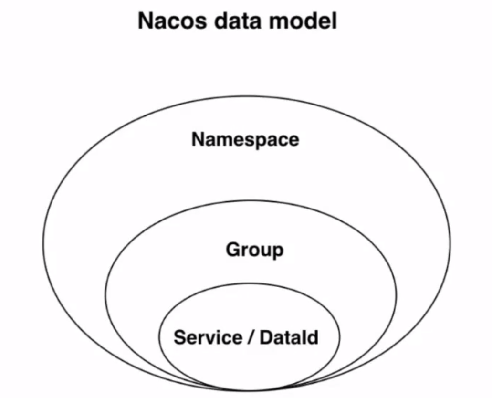

# 续 Docker命令

首先一定要开启docker

```
systemctl start docker
```

## rmi命令

删除本地镜像的命令

一般当本地镜像较多,过多的占用空间时,可以删除一些不会再使用的镜像文件,节省空间

删除镜像需要明确镜像的id,所以一般都会配合docker images使用

rmi: **r**e**m**ove **i**mage

```
docker rmi feb5d9fea6a5
```

如果当前要删除的镜像有实例正在运行,使用上面命令删除会有报错

意思就是正在使用的镜像无法删除

我们如果需要强制将当前镜像删除,并同时停止这个服务的话,就需要加-f选项

```
docker rmi feb5d9fea6a5 -f
```

rmi命令的选项：

- -f:强制删除这个镜像，无论是否正在使用。

## run命令

docker run命令,可以指定当前本地镜像文件启动,

启动镜像文件会在Docker中生成新的容器,容器中来运行镜像中包含的软件

docker run的命令,选项比较多,例如设置端口号,设置运行模式,调整运行参数,运行位置等

最后的mysql是镜像名称默认最新版,如果需要指定版本号可以编写下面代码

```
docker run --name mysql -d -p 3306:3306 -e MYSQL_ROOT_PASSWORD=123456 -v /root/data:/var/lib/mysql mysql:5.7.35
```

1: --name mysql:该容器启动后的名字：（自定义命名）如果没有设置，系统会自动设置一个，毕竟如果开启太多的容器，记不住就很尴尬，建议加上见名知意。

2：-d 代表后台启动该服务

3：-p 3306(这是liunx的端口号，我习惯说成宿主机，如果我们想要远程服务的话，访问的端口就是这个端口):3306（docker容器的端口，每一个容器都是独立的，可理解成操作系统层面的系统），访问这个端口就是先通过远程访问宿主机的端口，再映射到docker容器的端口访问mysql。

4：-e MYSQL_ROOT_PASSWORD=123456 这是说mysql启动需要的开机密码，默认的账号是root ，密码就是上面设置的：123456

5：-v /root/data:/var/lib/mysql /root/data/:这是宿主机的数据存放路径（你也可以自定义）， /var/lib/mysql:这是mysql容器存放数据的地方。也是为了同步数据，防止，容器被删除以后，数据就不存在了。

6：启动成功后就返回一个容器ID

启动之后,我们就可以使用数据库连接工具访问数据库了

## ps命令

```
docker ps
```

可以查看当前docker中运行的所有容器的状态

**ps命令中常见的选项如下：**

- -a：显示所有容器，如果不加只显示正在启动运行的容器，停止的不会显示。
- -l：显示最近的启动创建的容器。
- -n=[数字]：显示最近n个容器。
- -q：只显示容器id。经常和-a一起使用，获得当前宿主机所有容器id参数集合。

**ps命令显示的标题内容如下**

- container id：容器id，很多操作容器命令都需要用到的参数。
- image：容器创建使用的镜像。
- command：容器中在运行的进程或者命令。
- created：创建时间。
- status：容器状态。
- ports：容器的端口映射情况，这里没有用到端口。
- names：容器的名字，启动没有指定--name选项，会默认使用一个名字。

## stop\rm命令

docker stop 可以停止正在运行的容器

stop只是停止容器.并不会删除容器

如果想删除容器需要使用rm命令

注意:**这里rm删除的是容器,不是本地镜像,和rmi命令要区分**

首先使用docker ps命令查询所有正在运行的容器

```
docker stop [容器id]
```

```
docker rm [容器id]
```

rm的选项有：

-f:强制删除容器，无论是否运行都可以删除该容器，如果不加，运行的容器无法删除。

## 启动redis

docker search 搜索"redis"

拉取镜像参考之前的笔记

```
docker pull redis
```

自己搜docker启动Redis的命令

```
docker run -itd --name redis-test -p 6379:6379 redis
```

启动之后可以本地访问客户端

```
docker exec -it redis-test redis-cli
```


## 关闭防火墙

如果当前windows系统要连接Linux中的资源

一般都要关闭Linux的防火墙

实际开发中,不会彻底关闭防火墙,而是开放指定的端口号

```
systemctl stop firewalld
```

system:系统

ctl:control:控制

# 酷鲨商城前台虚拟机

给大家的大压缩包

Virtualbox 4.15G

VMware 3.55G

解压之后启动 

Linux:

用户名:root

密码:12345678(不要用小键盘)

启动后使用

```
ifconfig | more
```

观察ip地址

可以利用HS尝试连接虚拟机的数据库

一般情况下ip地址为:192.168.137.150

数据库密码是:

tarena2017Up;

**注意分号也是密码的一部分,不写连不上**

注意如果需要停止虚拟机,选择快速休眠,不要关机

## 酷鲨商城前台项目配置修改

因为现版本酷鲨商城连接的都是本地软件(mysql\redis\nacos等)

下面我们要连接的是虚拟机软件,所以要修改一下java项目的配置文件

front

```yaml
addr: 192.168.137.150
```

mall-leaf

leaf.properties

```properties
leaf.jdbc.url=jdbc:mysql://192.168.137.150:3306/leafdb?useUnicode=true&characterEncoding=utf8&useSSL=false&allowPublicKeyRetrieval=true

leaf.jdbc.password=tarena2017Up;
```

mall-order

```yaml
addr: 192.168.137.150

password: tarena2017Up;
```

mall-product

```yaml
addr: 192.168.137.150

password: tarena2017Up;
```

mall-search

```yaml
addr: 192.168.137.150
```

mall-seckill

```yaml
addr: 192.168.137.150

password: tarena2017Up;

rabbitmq:
    host: ${my.server.addr}
    port: 5672
    username: user
    password: 123456
    virtual-host: /
```

mall-sso

```yaml
addr: 192.168.137.150
# 有两个密码要改!!!!
    admin
      password: tarena2017Up;
    user
      password: tarena2017Up;
```

设置完毕之后,我们可以尝试测试其中的功能

例如新增订单

无需启动任何windows的软件(nacos\seata都不需要启动)

只需要启动模块内容即可

Leaf\product\passport\order

测试没问题表示虚拟机在正常工作

# 布隆过滤器的测试

因为上面我们启用了虚拟机

我们在虚拟机中安装的redis是一个特殊版本的Redis

这个版本内置了操作布隆过滤器的lua脚本,支持布隆过滤的方法

我们可以直接使用,实现布隆过滤器

csmall-stock-webapi的pom文件 添加依赖

```xml
<!--   redis依赖   -->
<dependency>
    <groupId>org.springframework.boot</groupId>
    <artifactId>spring-boot-starter-data-redis</artifactId>
</dependency>
```

在dev-yml文件中添加redis的配置

```yaml
spring:
  redis:
    host: 192.168.137.150
    port: 6379
    password:
```

操作布隆过滤器有一个专门的类

实现对布隆过滤器的新增元素,检查元素等方法的实现

在酷鲨前台大项目中的seckill-webapi下的utils包里

RedisBloomUtils类复制到需要使用布隆过滤器的项目中

当前Stock模块

有一个周期输出时间的方法

我们可以借助这个运行,测试布隆过滤器的功能(如果这个方法已经编写了别的代码可以先注释掉)

quartz包下QuartzJob

```java
// 装配redis中操作布隆过滤器的对象
@Autowired
private RedisBloomUtils redisBloomUtils;

@Override
public void execute(JobExecutionContext jobExecutionContext) throws JobExecutionException {
    // 一个简单的任务演示
    // 输出当前系统时间,使用sout或log皆可
    log.info("---------------"+ LocalDateTime.now() +"-----------------"+i);

    // 先定义要保存的布隆过滤器的元素数组
    String[] colors={"red","origin","yellow","green","blue","pink","white"};
    // 定义布隆过滤器保存在Redis中的key
    final String COLOR_BLOOM="color_bloom";
    // 布隆过滤器默认100个元素误判率1%
    redisBloomUtils.bfmadd(COLOR_BLOOM,colors);
    // 定义一个要判断的元素
    String el="blue";
    // 判断是否在布隆过滤器中
    System.out.println(el+"是否在定义的数组中:"+
            redisBloomUtils.bfexists(COLOR_BLOOM,el));
}
            
```

# 秒杀业务完善

## 秒杀准备时加载布隆过滤器

我们在开发秒杀业务时,事先进行了准备工作

在秒杀开始前5分钟,预热了sku的库存数和spu的随机码

但是没有将当前批次的spuId保存在布隆过滤器中

导致业务有漏洞(缓存穿透)

现在,我们准备了支持布隆过滤器的Redis

我们可以将允许用户查询到的秒杀商品,保存到布隆过滤器中

这样非当前秒杀商品,用户就不能查询数据库了,防止缓存穿透

布隆过滤器要想使用,需要先经历生成阶段,再经历判断阶段

我们对布隆过滤器的生成也是预热性质的,在秒杀开始之前编写Quartz框架的Job实现类

在seckill-webapi模块中

seckill.timer.job包中,新建SeckillBloomInitialJob

```java
public class SeckillBloomInitialJob implements Job {

    // 装配Redis操作布隆过滤器的对象
    @Autowired
    private RedisBloomUtils redisBloomUtils;
    // 装配连接数据库,查询所有秒杀商品spuId的mapper
    @Autowired
    private SeckillSpuMapper spuMapper;

    @Override
    public void execute(JobExecutionContext jobExecutionContext) throws JobExecutionException {
        // 这是预热的方法,会在秒杀开始前5分钟运行
        // 首先查询下个批次所有的spuId
        // 如果有需求加载更多批次的数据,就应该查询更多批次,都添加到布隆过滤器
        // 我们的设计为假设秒杀一天一个批次,提前加载两个批次的数据
        // 获取今天的日期做布隆过滤器的key就可以
        // spu:bloom:filter:2022-11-14
        String bloomTodayKey=
                SeckillCacheUtils.getBloomFilterKey(LocalDate.now());
        // 获取明天的key
        String bloomTomorrowKey=
                SeckillCacheUtils.getBloomFilterKey(LocalDate.now().plusDays(1));
        // 实际开发时,应该调用两次查询,分别查询今天和明天添加秒杀商品的spuId数组
        // 分别保存在上面声明的不同的key中
        // 但是我们以学习布隆过滤器为目标,数据库中数据又少,所以暂时将数据库中所有数据都查询出来
        Long[] spuIds=spuMapper.findAllSeckillSpuIds();
        // 布隆过滤器的Api只支持保存String数组,而我们现在是Long数组
        // 需要进行转换,下面是转换操作
        String[] spuIdsStr=new String[spuIds.length];
        // 遍历spuIds数组,将其中元素转换为String类型,添加到spuIdsStr中
        for(int i=0;i<spuIds.length;i++){
            spuIdsStr[i]=spuIds[i]+"";
        }
        
        // 需要注意,我们如果查多个批次,每个批次都需要进行上面的转换工作
        // 学习过程中,因为数据都相同,所以与两个批次保存相同的商品
        redisBloomUtils.bfmadd(bloomTodayKey,spuIdsStr);
        redisBloomUtils.bfmadd(bloomTomorrowKey,spuIdsStr);
        System.out.println("两个批次的布隆过滤器加载完毕");

    }
}
```

下面在seckill.timer.config包中添加布隆过滤器相关的调度配置

继续在QuartzConfig类中添加绑定信息

```java
@Bean
//              ↓↓↓↓↓↓
public JobDetail bloomInitJobDetail(){
    //                             ↓↓↓↓↓↓↓
    return JobBuilder.newJob(SeckillBloomInitialJob.class)
            //                ↓↓↓↓↓↓
            .withIdentity("initBloomSeckill")
            .storeDurably()
            .build();
}
@Bean
public Trigger bloomInitJobTrigger(){
    return TriggerBuilder.newTrigger()
            .forJob(bloomInitJobDetail())
            .withIdentity("initBloomTrigger")
            .withSchedule(
                    CronScheduleBuilder.cronSchedule("0/10 * * * * ?"))
            .build();
}
```

下面可以测试布隆过滤器的运行

保证虚拟机启动正常

启动product\seckill

如果没有虚拟机的同学,敲一遍代码熟悉即可

## 布隆过滤器判断spuId是否存在

现在Redis中保存了布隆过滤器

我们需要用户根据SpuId查询商品时,进行判断和过滤

如果spuId不存在,就应该发生异常,给出提示

SeckillSpuServiceImpl类中getSeckillSpu进行修改,添加布隆过滤器的判断

```java
@Autowired
private RedisBloomUtils redisBloomUtils;
// 根据spuId查询spu详情(返回值包含常规信息和秒杀信息已经随机码)
@Override
public SeckillSpuVO getSeckillSpu(Long spuId) {
    // 要在这里添加布隆过滤器的判断
    // 执行布隆过滤器判断spuId是否存在,如果不存在直接抛出异常
    // 获得布隆过滤器的key
    String bloomTodayKey=SeckillCacheUtils
                    .getBloomFilterKey(LocalDate.now());
    log.info("当前批次商品布隆过滤器的key为:{}",bloomTodayKey);
    // 判断要访问的spuId是否在布隆过滤器中
    if(!redisBloomUtils.bfexists(bloomTodayKey,spuId+"")){
        // 进入这个if表示当前spuId不在布隆过滤器中
        // 为防止缓存穿透,直接抛出异常,终止成希
        throw new CoolSharkServiceException(ResponseCode.NOT_FOUND,
                "您访问的商品不存在!(布隆过滤器生效)");
    }
    // 检查spu信息是否已经在Redis中,还是先定Redis的key
    String seckillSpuKey= SeckillCacheUtils.getSeckillSpuVOKey(spuId);
    // 以下其他代码无变化  略....
}
```

重启Seckill模块

访问10007

查询SpuId如果不存在于秒杀表中,是否能被过滤器拦截

# ELK简介

## 什么是ELK

ELK:

E:Elasticsearch 全文搜索引擎

L:logstash 日志采集工具

K:Kibana ES的可视化工具

ELK是当今业界非常流行的日志采集保存和查询的系统

我们编写的程序,会有很多日志信息,但是日志信息的保存和查询是一个问题

idea控制台是临时显示的位置,我们可以将它保存在文件中

但是即使保存在文件中,海量日志信息要想查询需要的条目也是问题

所以我们使用ELK来保存

## 为什么需要ELK

保存并能够快速便捷的查询查看日志信息就是新出现的需求了

ELK这个组合可以完成这个任务

Elasticsearch负责将日志信息保存,查询时可以按关键字快速查询

那么这些日志怎么收集呢?

利用logstash这个软件可以监听一个文件,将这个文件中出现的内容经过处理发送到指定端口

我们就可以监听我们程序输出的日志文件,然后将新增的日志信息保存到ES中

Kibana来负责进行查询和查看结果

> 日志的管理工具还有一套叫链路追踪
>
> 和ELK有类似的效果,感兴趣的同学可以自己搜索

# Logstash

## 什么是logstash

Logstash是一款开源的日志采集,处理,输出的软件,每秒可以处理数以万计条数据,可以同时从多个来源采集数据,转换数据,然后将数据输出至自己喜欢的存储库中(官方推荐的存储库为Elasticsearch)


上面图片数据源可以是任何产生数据的介质,数据库,redis,java的日志文件均可

输出目标一般也是能够保存数据的媒体,数据库,redis,ES等

LogStash内部有3个处理数据的步骤

- input 将数据源的数据采集到Logstash
- filter (非必要)如果需要可以对采集到的数据进行处理
- output 将处理好的数据保存到目标(一般就是ES)

其中采集数据的用法比较多样,还支持各种插件

## logstash实现数据库和ES数据的同步

logstash还有一个非常常见的用法

就是能够自动完成数据库数据和ES中数据的同步问题

实现原理

我们可以配置logstash监听数据库中的某个表

一般设计为监听表中数据的变化,在规范的数据表结构中,logstash可能监听gmt_modified列

只要gmt_modified列数据有变化,就收集变化的数据行,将这行数据的信息更新到ES

下面我们就在虚拟机环境下实现搜索操作

## 实现虚拟机ES搜索功能

之前我们已经修改了yml文件,将搜索的目标更换为虚拟机中的ES

在虚拟机的连接环境中,我们使用SpuEntity来实现ES的连接

我们可以看到SpuEntity类中没有任何编写分词的属性

原因是为了更高效的实现分词,logstash将所有需要分词的列拼接组合成了一个新列search_text


当需要查询时只需要查询search_text字段即可

## 添加新的持久层

在search-webapi模块中的repository包下,创建新的持久层接口SpuEntityRepository

```java
@Repository
public interface SpuEntityRepository extends
                                ElasticsearchRepository<SpuEntity,Long> {
    // 根据用户输入的关键字,查询ES中匹配的商品
    // Logstash将所有商品spu的信息中需要分词的字段,拼接成了一个search_text字段
    // 因为SpuEntity实体类中没有创建searchText字段,所有只能通过查询语句完成
    @Query("{\"match\":{\"search_text\":{\"query\":\"?0\"}}}")
    Page<SpuEntity> querySearchByText(String keyword, Pageable pageable);

}
```

## 业务逻辑层接口

因为实体类泛型类型的变化

ISearchService接口中的返回值泛型也要修改一下

```java
public interface ISearchService {

    // ES分页查询spu的方法
    //       ↓↓↓↓↓↓↓↓↓
    JsonPage<SpuEntity> search(String keyword, Integer page, Integer pageSize);

    // 向ES中加载数据的方法
    void loadSpuByPage();
}
```

## 实现业务逻辑层代码

原来的业务逻辑层实现类,要废弃,可以删除

如果不想删除也要把之前代码注释,还有必须删除@Service注解

原有SearchServiceImpl修改为

```java
//@Service
//@Slf4j
@Deprecated
public class SearchServiceImpl {
    // 其中所有代码均可注释
}
```

新建SearchRemoteServiceImpl实现ISearchService接口,代码如下

```java
// 实现查询远程服务器(虚拟机Linux)ELK系统中的信息(模糊查询spu商品)
@Service
@Slf4j
public class SearchRemoteServiceImpl implements ISearchService {

    // 装配新创建的持久层接口,对应spuEntity实体类
    @Autowired
    private SpuEntityRepository spuEntityRepository;

    @Override
    public JsonPage<SpuEntity> search(String keyword, Integer page, Integer pageSize) {
        // 调用查询es中根据关键字获取匹配商品spu信息的方法
        Page<SpuEntity> spus=spuEntityRepository.querySearchByText(
                            keyword, PageRequest.of(page-1,pageSize));

        JsonPage<SpuEntity> jsonPage=new JsonPage<>();
        // 分页信息
        jsonPage.setPage(page);
        jsonPage.setPageSize(pageSize);
        jsonPage.setTotal(spus.getTotalElements());
        jsonPage.setTotalPage(spus.getTotalPages());
        // 分页数据
        jsonPage.setList(spus.getContent());
        // 别忘了返回!!!
        return jsonPage;
    }

    // logStash自动同步,无需编写下面方法
    @Override
    public void loadSpuByPage() { }
}
```

### 修改控制层代码

修改SearchController中的代码

```java
//                        ↓↓↓↓↓↓↓↓↓↓↓
public JsonResult<JsonPage<SpuEntity>> searchByKeyword(
        String keyword,Integer page, Integer pageSize){
    //      ↓↓↓↓↓↓↓↓↓↓↓
    JsonPage<SpuEntity> jsonPage=
            searchService.search(keyword,page,pageSize);
    return JsonResult.ok(jsonPage);
}
```

启动product/passport/search

先进行jwt登录的复制,复制到search模块的全局参数中

可以搜索手机查询效果

启动虚拟机

如果不能查询出数据库中正确的对应的信息

需要在数据库工具软件中运行下面代码

```sql
USE mall_pms;
UPDATE pms_spu SET gmt_modified=NOW() WHERE 1=1;
```

以激活logstash对spu表的监听,并向ES中保存数据

这个操作可能有些延迟,稍等即可

再次查询,就有能够正确搜索信息了!

## Logstash下ES的运行流程

安装配置好相关软件后

logstash会自动监听指定的表(一般指定监听gmt_modified列)

当gmt_modified列值变化时,logstash就会收集变化的行的信息

周期性的向ES进行提交

数据库中变化的数据就会自动同步到ES中了

这样,我们在程序中,就无需编写任何同步ES和数据库的代码

# 配置中心

## 什么是配置中心

所谓配置中心:在微服务的环境下,将项目需要的配置信息保存在配置中心,需要读取时直接从配置中心读取,方便配置管理的微服务工具

我们可以将部分yml文件的内容保存在配置中心

一个微服务项目有很多子模块,这些子模块可能在不同的服务器上,如果有一些统一的修改,我们要逐一修改这些子模块的配置,由于它们是不同的服务器,所以修改起来很麻烦

如果将这些子模块的配置集中在一个服务器上,我们修改这个服务器的配置信息,就相当于修改了所有子模块的信息,这个服务器就是配置中心

**使用配置中心的原因就是能够达到高效的修改各模块配置的目的**

## 配置中心的使用

Nacos既可以做注册中心,也可以做配置中心

Nacos做配置中心,支持各种格式\类型的配置文件

properties\yaml(yml)\txt\json\xml等

## Nacos数据结构



namespace:命名空间

group:分组

Service/DataId:具体数据

**命名空间**

namespace是Nacos提供的最大的数据结构

一个Nacos可以创建多个命名空间

一个命名空间能够包含多个group

每一个group中又可以包含多条配置信息

在nacos中新建命名空间


在上图连接的位置可以新增命名空间,填写命名空间名称和描述即可

Nacos有默认的命名空间public不能删除和修改

添加命名空间后,我们在Nacos中注册的服务或添加的配置就可以指定命名空间了

因为多个命名空间可以隔离项目,每个项目使用自己的命名空间,互不干扰


**分组**

一个命名空间中可以有多个分组,进行进一步分离

我们使用时,如果不需要进一步分组,推荐使用group名称:DEFAULT_GROUP

**服务或配置**

确定了命名空间和分组之后

我们就可以添加服务或配置了

之前我们启动的各种模块都是服务,这些服务都是默认保存在public命名空间中

下面我们主要使用配置中心的功能,在命名空间中添加配置

添加配置就是设置DataId

实际在Nacos中定位一个配置的结构为

Namespace>Group>DataId

## Nacos添加配置

Nacos首页->配置管理->配置列表->添加配置(右侧的大"＋"号)


添加cart模块数据库连接配置


