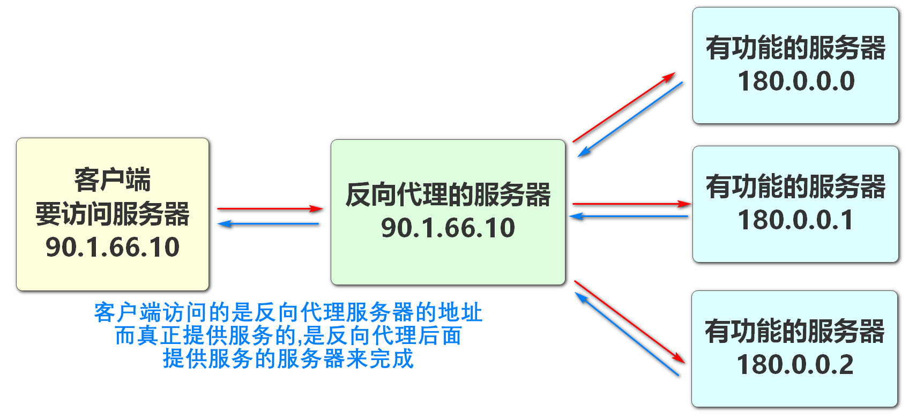

# 续 配置中心

上次课我们完成了cart模块的数据库配置信息添加到nacos的操作

我们也删除了cart模块原有的连接数据库信息的配置

下面开始,我们尝试连接nacos配置中心,读取数据库配置信息,令cart模块仍然能够正常连接数据库

## 项目读取配置

csmall-cart-webapi模块要读取连接数据库的配置

如果要读取配置中心的信息,首先要添加依赖

```xml
<!--   Nacos配置中心依赖   -->
<dependency>
    <groupId>com.alibaba.cloud</groupId>
    <artifactId>spring-cloud-starter-alibaba-nacos-config</artifactId>
</dependency>
<!--     支持SpringCloud项目加载\读取系统配置的依赖     -->
<dependency>
    <groupId>org.springframework.cloud</groupId>
    <artifactId>spring-cloud-starter-bootstrap</artifactId>
</dependency>
```

如果当前我们使用的SpringCloud版本不是2020.x以后的版本

那么上面添加的依赖会有不一样的情况,要想去了解就要查阅相关资料

像其他程序一样,在添加完依赖之后,还需要添加yml文件的配置

借此机会讲解一下SpringCloud项目的配置文件加载顺序

我们学习过的配置文件大体有application.properties和application.yml两种配置文件添加配置

这两个文件如果同时存在,他们的配置都可以同时生效

但是如果两个文件配置有冲突(对同一个属性配置两次)

那么就要看加载顺序了

* 先加载application.yml

* 后加载application.properties

如果两个配置文件同时设置了同一个属性,后加载的覆盖掉先加载的

在添加上面的pom文件依赖之后,SpringCloud项目就又多了一组配置文件

它们是bootstrap.yml和bootstrap.properties

这组配置文件是SpringCloud项目才能使用的

它的作用是实际开发时,主要配置系统内容,一般都是不轻易修改的

所以这组配置文件的加载时机,整体早于application这一组

一个SpringCloud项目加载配置文件的顺序最终可能如下图


因为配置文件的特性,bootstrap这一组是加载系统配置的

所以我们读取配置中心的配置信息,最好添加在bootstrap.yml\properties中

下面我们就在cart-webapi项目中resources文件夹中添加bootstarp.yml文件

```yml
spring:
  cloud:
    nacos:
      config:
        # 设置配置中心的ip和端口
        server-addr: localhost:8848
        # namespace默认public可以省略
        # group默认DEFAULT_GROUP也可以省略的
        group: DEFAULT_GROUP
        # 指定要读取配置文件的后缀名
        file-extension: yaml
        # 配置中心约定,当确定命名空间,分组名称和后缀名称后
        # 配置中心会自动读取当前文件名为[服务器名称].[后缀名称]的配置信息
        # 具体到本项目 服务器名称为 nacos-cart,后缀名为yaml
        # 所以会读取配置文件名为"nacos-cart.yaml"的信息
```

如果一切顺利,那么cart模块是可以通过knife4j测试操作连接数据库的

我们可以新增购物车信息,或删除购物车信息后检查数据库是否有对应操作

因为我们已经删除了本地yml文件中数据库的配置,所以,它能连接操作数据库一定是配置中心生效了!

# RestTemplate远程调用

我们现在项目中使用的RPC远程调用技术是Dubbo

实际上除了Dubbo技术之外,还有很多远程调用的方法

它们有些调用的思想都和Dubbo完全不同

Dubbo是SpringCloudAlibaba提供的功能强大的RPC框架

但是Dubbo功能也有限制,如果我们想调用的方法不是我们当前项目的组件或功能,甚至想调用的方法不是java编写的,那么Dubbo就无能为力了

我们可以使用RestTemplate来调用任何语言编写的公开的Rest路径

也就是只要能够使用浏览器访问的路径,我们都可以使用RestTemplate发送请求,接收响应

使用步骤如下

步骤1:

无需添加任何pom依赖和yml文件配置

只需在调用的发起方,也就是使用RestTemplate发起请求的项目配置文件中(指支持@Configuration注解的类或SpringBoot启动类),向Spring容器注入一个该类型对象

所有SpringBoot配置类都可以添加下面代码,我们选择SpringBoot启动类添加如下代码

在CartWebapi启动类中修改

```java
@SpringBootApplication
//  略....
public class CsmallCartWebapiApplication {

    public static void main(String[] args) {
        SpringApplication.run(CsmallCartWebapiApplication.class, args);
    }

    @Bean
    // 启动负载均衡的注解,因为Dubbo自带负载均衡,但是RestTemplate是代替Dubbo的,需要单独设置
    @LoadBalanced
    public RestTemplate restTemplate(){
        return new RestTemplate();
    }

}
```

步骤2:

RestTemplate是一个能够发送请求到指定url路径的工具

我们项目中有若干控制器方法,都可以作为它调用的目标

我们可以实现在cart模块运行删除购物车商品的同时减少库存

这样就要求我们stock模块具备一个能够减少库存的控制器方法,

现在这个方法是有的,url为:/base/stock/reduce/count

但是RestTemplate调用时请求以get方法居多,post方法调用代码比较繁琐,所以将现在stock模块减少库存的方法由之前的@PostMapping修改为@GetMapping

```java
@GetMapping("/reduce/count")
```

步骤3:

回到cart-webapi模块

开始调用

我们可以在当前CartController控制器方法deleteUserCart中

添加RestTemplate的调用,实现库存的减少

```java
// 装配能执行RestTemplate方法调用的对象
@Autowired
private RestTemplate restTemplate;

@PostMapping("/delete")
@ApiOperation("删除购物车中商品")
@ApiImplicitParams({
  @ApiImplicitParam(value = "用户ID",name="userId",example = "UU100"),
  @ApiImplicitParam(value = "商品编号",name="commodityCode",example = "PC100")
})
public JsonResult deleteUserCart(String userId,String commodityCode){
    cartService.deleteUserCart(userId,commodityCode);
    // RestTemplate调用减少库存的方法
    // 我们设计删除购物车后减少库存,要调用RestTemplate首先确定url
    String url="http://localhost:20003/base/stock/reduce/count?"+
            "commodityCode={1}&reduceCount={2}";
    // 执行发起调用
    // getForObject方法参数和返回值的解释
    // 返回值:根据调用的控制器方法的实际返回值给定返回类型即可
    // 参数分为3部分
    // 1.第一个参数:就是请求的url,指定路径即可
    // 2.第二个参数:就是返回值类型的反射,根据要求编写在参数位置即可
    // 3.从第三个参数开始:往后的每个参数都是在给url路径中的{x}占位符赋值
    //   第三个参数赋值给{1} 第四个参数赋值给{2},....以此类推
    JsonResult jsonResult = restTemplate.getForObject(
            url, JsonResult.class, commodityCode, 5);
    System.out.println(jsonResult);
    return JsonResult.ok("删除购物车完成!");
}
```

步骤4:

发送测试

将相关的模块都启动

Nacos\Seata

cart\stock

调用cart模块删除购物车中的方法

运行后检查对应商品减少库存和购物车中数据的删除效果

如果一切正常证明调用成功了

> SpringCloudNetflix系统下,RestTemplate实现有一个别名叫Ribbon
>
> 如果说"Ribbon"调用,指的就是RestTemplate对象的调用过程

课上作业

按刚刚购物车模块调用库存模块的功能

编写order订单模块调用删除购物车的功能

# 什么是web服务器

简单来说

Web服务器就是一个能够接收http请求并作出响应的程序

webServer项目(二阶段项目)就是一个我们手写的Web服务器

我们现在开发的标准SpringBoot项目启动时内置的Web服务器叫Tomcat

实际上我们业界中还有很多Web服务器,它们具备很多不同的特征

网关Gateway项目使用Netty服务器,Netty服务器内部是NIO的所以性能更好

下图以Tomcat为例,解释请求响应流程


大多数情况我们会使用Tomcat作为Web服务器

它是我们请求\响应流程中的核心组件

Tomcat是也有缺点

常规情况下,一个tomcat并发数在100多一点

一般情况下,一个网站要1000人在线,并发数是2%~5% 也就是20~50并发

如果需要一个支持更高并发的服务器,就是需要使用Nginx

# Nginx

Nginx ("engine x") 是一个高性能的 HTTP 和 [反向代理](https://so.csdn.net/so/search?q=反向代理&spm=1001.2101.3001.7020) 服务器，也是一个IMAP/POP3/SMTP 代理服务器。 Nginx 是由 Igor Sysoev 为俄罗斯访问量第二的Rambler.ru 站点开发的，第一个公开版本 0.1.0 发布于 2004 年 10 月 4 日。其将源代码以类 BSD 许可证的形式发布，因它的稳定性、丰富的功能集、示例配置文件和低系统资源的消耗而闻名。

## Nginx的优势

1. 高并发响应性能非常好，官方 Nginx 处理静态文件 5万/秒
2. 反向代理性能非常强。（可用于负载均衡）
3. 内存和 cpu 占用率低。（为 Apache(也是一个服务器) 的 1/5-1/10）

又小又快

Nginx快速的原因

> 常见面试题:Nginx为什么快

Nginx使用NIO来实现,是它能快速的主要原因之一

从Nginx内部的结构上和运行流程上,它内部是一个主进程(Master)多个工作进程(Worker)

Master负责统筹管理配置和Worker的分工

Worker来负责处理请求,作出响应

而且使用NIO既非阻塞式的,异步的来完成工作

简单来说,就是一个Worker接到从Master分配来的一个请求后,会立即对请求进行处理,但是在请求发送完成后,还没有返回响应前,Worker会继续处理别的请求,直到返回响应时,这个Worker才会去处理响应,最终每条Worker进程全程无阻塞

## 正向代理

要想了解反向代理,首先了解正向代理


正向代理,当我们访问的目标服务器无法连通时,可以借助代理服务器,间接访问该目标服务器

关系类似于生活中的介绍人

## 反向代理

而反向代理的模式为下图



请求反向代理服务器的特点是,我们请求的是代理服务器的地址,真正提供服务的服务器地址我们不需要知道,这样做的好处是反向代理服务器后可能是一个服务器集群,方便负载均衡

有点类似于生活中的代理人(中介),有什么事情直接找这个人就能完成需求,它怎么完成的我们不用管

## Nginx的使用

实际开发中,Nginx可以用于反向代理服务器,

实际处理请求的是Tomcat服务器


因为Nginx优秀的静态内容并发性能

我们常常使用它做静态资源服务器

在Nginx中保存图片,文件视频等静态资源

经常和FastDFS组合使用

> *FastDFS*是一个开源的轻量级分布式文件系统，它对文件进行管理，功能包括：文件存储、文件同步、文件访问（文件上传、文件下载）等，解决了大容量存储和负载均衡的问题。特别适合以文件为载体的在线服务，如相册网站、视频网站等等。

## Nginx和Gateway的区别

首先明确Nginx和Gateway并不冲突

他们都是统一入口的概念,它们可以同时开启

也可以开启其中一个

只不过Nginx不属于java程序(不属于微服务模块),而Gateway是java程序,而且是微服务的一部分

Nginx是服务器程序我们不可编辑,

Gateway是我们自己创建的项目,依赖和配置都由我们自己完成

最终如果想做反向代理服务器,就使用Nginx

如果是微服务项目的网关就是Gateway

# Linux部署java项目

## 启动虚拟机

这部分的操作之前学习虚拟机时已经做过,可以参照之前的笔记即可

推荐大家重新解压纯净版的RockyLinux来实现

启动后登录rockylinux

```
sudo su -
```

修改root用户密码

```
passwd
```

下面就切换到客户端软件连接虚拟机

```
ifconfig
```

```
ifconfig | more
```

查看ip地址使用Bvssh软件连接

## 安装java环境

连接成功后,打开命令行界执行安装java的命令

```
yum install java
```

运行过程中出现了y/N的选择,要输入y之后按回车

安装需要时间,等待即可

yum安装好的java会自动配置环境变量

验证安装

```
java -version
```

## 创建java项目

按照创建普通SpringBoot项目的流程创建即可

注意需要勾选 Spring Web依赖


项目创建好之后,在项目的resources目录下static下创建html文件或复制需要的资源


内容编写完毕

在侧边栏选中maven运行package打包命令


打包成功后找到jar包生成的位置


进入这个位置,找到生成的jar包

将生成的jar包拖入Bvssh软件提供的复制文件的工具中


转到linux命令行

输入ll(两个小写的L)  或者是ls

```
ll
```

观察当前目录是否有我们拖入的jar文件

如果存在执行运行jar文件的命令

```
java -jar [jar包名称]
```

[jar包名称]可以敲前面几个字母,按Tab自动补全

如果顺利启动,会看到Spring的图形Logo

下面关闭防火墙(启动Springboot项目的界面不能关,可以新开一个界面输入命令)

```
systemctl stop firewalld
```

然后可以在windows中打开浏览器访问项目


如果你愿意购买云服务器

就可以将当前项目用同样的办法,部署到云服务器中,可以让全世界人访问了

# 建议自学内容

* SpringCloud Netflix 提供的组件
* 除了Redis 最好对memcache也有些了解
* SpringSecurity实现权限管理也有一个类似的框架Shiro
* 数据结构,二叉树,红黑树,B树,B+树
* k8s(偏运维)Kubernetes


运维工程师->开发工程师


部署工程师->开发工程师


# 学习的网站

初级入门教程:可以百度

项目中遇到了具体问题,可以问CSDN

视频教程找B站

疑难杂症国际技术社区:https://stackoverflow.com/


# 简历技术点

```
项目名称

恋佳社区平台

语丰物业平台

电商项目命名

星尘摄影交流平台
..高渊篮球社区
是一个摄影爱好者的社区平台,可以交流互动,问答等社交活动

其中包含了一个电商模块,我负责编写电商模块的部分功能

使用的技术:

SpringCloud微服务分布式项目

Nacos\Dubbo\Seata\Sentinel\Gateway\Elasticsearch\Redis\RabbitMQ

我负责的模块

* 登录注册及鉴权
* 商品分类
* 商品详情
* 购物车管理
* 新增订单,修改订单状态
* Elasticsearch搜索功能
* 秒杀
```


# 随笔

springCloud在2020年之前使用的版本号都是伦敦地铁站的站名

2020年以后才开始使用2020.0.1   2021.0.1这样的版本号


